# Table of Contents

1.  [About the benchmark](#org311b411)
2.  [Expectations](#org2168314)
3.  [Analysed parameters](#orgdafd21d)
4.  [Test variants](#orged5c273)
5.  [Lambda functions names](#org4734706)
6.  [Results](#org07fde87)

# About the benchmark

Following synthetic benchmark aggregates the results of running sample &ldquo;Hello World&rdquo; program on curated list of AWS Lambda runtimes:

1.  Official AWS Node.js runtime (Nodejs v10, Nodejs v12, Nodejs v14)
2.  Official AWS Ruby runtime (ruby2.5, ruby2.7)
3.  Official AWS Python runtime (python2.7, python3.8)
4.  Official AWS Rust runtime (runtime v0.3.0)
5.  Official AWS Java runtime (Java8, Java11)
6.  Official AWS DotnetCore runtime (dotnetcore2.1)
7.  Community Haskell runtime (aws-lambda-haskell-runtime 1.1.1)
8.  Official AWS Golang runtime (golang1.x)
9.  Custom Clojure on Babashka Runtime (Babashka 0.4.6) (HL)
10. Clojure on Official AWS Java runtime (Java8, Java11)
11. Clojure on Custom Clojure runtime (Java8, Java11) (HL)
12. Official AWS Java Main Function adapter. Native compiled with GraalVM (Java8 GraalVM CE 21.1.0, Java11 GraalVM CE 21.1.0)
13. Clojure on Custom Clojure runtime. Native compiled with GraalVM (Java8 GraalVM CE 21.1.0, Java11 GraalVM CE 21.1.0) (HL)

Benchmark has been crafted to compare the results of the already established AWS Lambda runtimes with the ones proposed by the `Holy Lambda` microframework. In order to make the comparision fair, we limited the scope of the test to return the &ldquo;Hello world!&rdquo; text from each Lambda. Although the test might seem to simple and naive it&rsquo;s truly not.

Architecture of every runtime more or less follows the official AWS recommendations for creating a Custom Runtime. This means each of the presented runtime:

1.  Fetches the new event from the API gateway
2.  Decodes JSON event to a structure which might be read by the user handler
3.  Handler returns a structure `{"body": "Hello world!", "Content-Type": "plain/text"}` which is then encoded to valid json string and POST to an API Gateway.

The test is both minimal enough, complete and fair, because we compare only the runtimes work.

# Expectations

1.  Holy Lambda runtimes should be as fast as the others.
2.  Holy Lambda runtimes should be statistically stable.
3.  Holy Lambda runtimes should work without the errors under the same load as other runtimes.
4.  Holy Lambda runtimes should have approximetely same memory usage characteristics as other runtimes.

# Analysed parameters

In the test the following parameters are closely studied:

-   memory usage of each runtime (mean, max, min, std)
-   percentage of successful responses of each runtime
-   cold start time, processing, and response (mean, max, min, std, 25%, 50%, 75%)
-   warm start time, processing, and response (mean, max, min, std, 25%, 50%, 75%)
-   cold start time, and processing (without response)
-   warm start time, and processing (without response)

# Test variants

1.  Thousand full curl GET requests to each Lambda representing the runtime with cold start simulation:
    1.  Lambda with 128 MB of memory
    2.  Lambda with 512 MB of memory
    3.  Lambda with 1024 MB of memory
    4.  Lambda with 2048 MB of memory
2.  Thousand full curl GET requests to each Lambda representing the runtime. Warm Lambda execution only:
    1.  Lambda with 128 MB of memory
    2.  Lambda with 512 MB of memory
    3.  Lambda with 1024 MB of memory
    4.  Lambda with 2048 MB of memory

# Lambda functions names

1.  *ClojureClojureJava8Runtime-{MemorySize}* - HL Custom Clojure runtime on Java8
2.  *ClojureClojureJava11Runtime-{MemorySize}* - HL Custom Clojure runtime on Java11
3.  *ClojureJava8Runtime-{MemorySize}* - Clojure on official Java runtime. Java8
4.  *ClojureJava11Runtime-{MemorySize}* - Clojure on official Java runtime. Java11
5.  *ClojureGraalVM211CE8-{MemorySize}* - HL Custom Clojure runtime native compiled with GraalVM 21.1 on Java8
6.  *ClojureGraalVM211CE11-{MemorySize}* - HL Custom Clojure runtime native compiled with GraalVM 21.1 on Java11
7.  *Java8Runtime-{MemorySize}* - Official AWS Lambda Java runtime. Java8
8.  *Java11Runtime-{MemorySize}* - Official AWS Lambda Java runtime. Java11
9.  *JavaGraalVM211CE8-{MemorySize}* - Custom Java runtime native compiled with GraalVM 21.1 on Java8
10. *JavaGraalVM211CE11-{MemorySize}* - Custom Java runtime native compiled with GraalVM 21.1 on Java11
11. *ClojureOnBabashkaRuntime-{MemorySize}* - Custom Clojure runtime running on Babashka (0.4.6)
12. *Nodejs14Runtime-{MemorySize}* - Official Node.js runtime (v14)
13. *Nodejs12Runtime-{MemorySize}* - Official Node.js runtime (v12)
14. *Nodejs10Runtime-{MemorySize}* - Official Node.js runtime (v10)
15. *PythonRuntime38-{MemorySize}* - Official Python runtime (Python3.8)
16. *PythonRuntime27-{MemorySize}* - Official Python runtime (Python2.7)
17. *RubyRuntime25-{MemorySize}* - Official Ruby runtime (ruby2.5)
18. *RubyRuntime27-{MemorySize}* - Official Ruby runtime (ruby2.7)
19. *GolangRuntime-{MemorySize}* - Official Golang runtime (go1.x)
20. *RustRuntime-{MemorySize}* - Official Rust runtime (v0.3.0)
21. *HaskellRuntime-{MemorySize}* - Community Haskell runtime (v1.1.1)
22. *CsharpRuntime-{MemorySize}* - Official DotnetCore runtime (v2.1)

Function name changes according to dynamic MemorySize parameter, where MemorySize is one of {128, 512, 1024, 2048}.

# Results

1.  Variant 1
    1.  Lambda with 128 MB of memory
        In the test two Clojure runtimes has been ignored: ClojureJava8Runtime, ClojureJava11Runtime.
        Runtimes has been ignored, because the memory size usage exceeds 128MB.
        1.  Basic statistics
            
            <table border="2" cellspacing="0" cellpadding="6" rules="groups" frame="hsides">
            
            
            <colgroup>
            <col  class="org-left" />
            
            <col  class="org-right" />
            
            <col  class="org-right" />
            
            <col  class="org-right" />
            
            <col  class="org-right" />
            
            <col  class="org-right" />
            
            <col  class="org-right" />
            
            <col  class="org-right" />
            
            <col  class="org-right" />
            </colgroup>
            <thead>
            <tr>
            <th scope="col" class="org-left">&#xa0;</th>
            <th scope="col" class="org-right">mean</th>
            <th scope="col" class="org-right">std</th>
            <th scope="col" class="org-right">min</th>
            <th scope="col" class="org-right">max</th>
            <th scope="col" class="org-right">25%</th>
            <th scope="col" class="org-right">50%</th>
            <th scope="col" class="org-right">75%</th>
            <th scope="col" class="org-right">status 200 in %</th>
            </tr>
            </thead>
            
            <tbody>
            <tr>
            <td class="org-left">ClojureClojureJava11Runtime-128</td>
            <td class="org-right">6.08033</td>
            <td class="org-right">0.688073</td>
            <td class="org-right">4.33111</td>
            <td class="org-right">8.30531</td>
            <td class="org-right">5.60007</td>
            <td class="org-right">6.05196</td>
            <td class="org-right">6.50949</td>
            <td class="org-right">100.0%</td>
            </tr>
            
            
            <tr>
            <td class="org-left">ClojureClojureJava8Runtime-128</td>
            <td class="org-right">6.65703</td>
            <td class="org-right">0.647986</td>
            <td class="org-right">4.79712</td>
            <td class="org-right">8.62666</td>
            <td class="org-right">6.19783</td>
            <td class="org-right">6.65984</td>
            <td class="org-right">7.06694</td>
            <td class="org-right">100.0%</td>
            </tr>
            
            
            <tr>
            <td class="org-left">ClojureGraalVM211CE11-128</td>
            <td class="org-right">0.822261</td>
            <td class="org-right">0.102023</td>
            <td class="org-right">0.652419</td>
            <td class="org-right">1.17815</td>
            <td class="org-right">0.747719</td>
            <td class="org-right">0.79251</td>
            <td class="org-right">0.876715</td>
            <td class="org-right">100.0%</td>
            </tr>
            
            
            <tr>
            <td class="org-left">ClojureGraalVM211CE8-128</td>
            <td class="org-right">0.76397</td>
            <td class="org-right">0.0958432</td>
            <td class="org-right">0.614926</td>
            <td class="org-right">1.11587</td>
            <td class="org-right">0.69102</td>
            <td class="org-right">0.740418</td>
            <td class="org-right">0.819861</td>
            <td class="org-right">100.0%</td>
            </tr>
            
            
            <tr>
            <td class="org-left">ClojureOnBabashkaRuntime-128</td>
            <td class="org-right">1.14391</td>
            <td class="org-right">0.1207</td>
            <td class="org-right">0.865743</td>
            <td class="org-right">1.65514</td>
            <td class="org-right">1.05339</td>
            <td class="org-right">1.13814</td>
            <td class="org-right">1.23277</td>
            <td class="org-right">100.0%</td>
            </tr>
            
            
            <tr>
            <td class="org-left">CsharpRuntime-128</td>
            <td class="org-right">5.09039</td>
            <td class="org-right">0.25658</td>
            <td class="org-right">4.37908</td>
            <td class="org-right">5.84659</td>
            <td class="org-right">4.89589</td>
            <td class="org-right">5.07588</td>
            <td class="org-right">5.26497</td>
            <td class="org-right">100.0%</td>
            </tr>
            
            
            <tr>
            <td class="org-left">GolangRuntime-128</td>
            <td class="org-right">5.65364</td>
            <td class="org-right">0.147264</td>
            <td class="org-right">5.31004</td>
            <td class="org-right">6.27052</td>
            <td class="org-right">5.54654</td>
            <td class="org-right">5.64458</td>
            <td class="org-right">5.74874</td>
            <td class="org-right">100.0%</td>
            </tr>
            
            
            <tr>
            <td class="org-left">HaskellRuntime-128</td>
            <td class="org-right">0.471598</td>
            <td class="org-right">0.0790614</td>
            <td class="org-right">0.370303</td>
            <td class="org-right">0.785054</td>
            <td class="org-right">0.420373</td>
            <td class="org-right">0.445882</td>
            <td class="org-right">0.49036</td>
            <td class="org-right">100.0%</td>
            </tr>
            
            
            <tr>
            <td class="org-left">Java11Runtime-128</td>
            <td class="org-right">0.776975</td>
            <td class="org-right">0.0964103</td>
            <td class="org-right">0.622361</td>
            <td class="org-right">1.10893</td>
            <td class="org-right">0.703415</td>
            <td class="org-right">0.748999</td>
            <td class="org-right">0.834207</td>
            <td class="org-right">100.0%</td>
            </tr>
            
            
            <tr>
            <td class="org-left">Java8Runtime-128</td>
            <td class="org-right">0.615771</td>
            <td class="org-right">0.0940473</td>
            <td class="org-right">0.460173</td>
            <td class="org-right">0.947351</td>
            <td class="org-right">0.547524</td>
            <td class="org-right">0.585598</td>
            <td class="org-right">0.666399</td>
            <td class="org-right">100.0%</td>
            </tr>
            
            
            <tr>
            <td class="org-left">JavaGraalVM211CE11-128</td>
            <td class="org-right">0.914957</td>
            <td class="org-right">0.103577</td>
            <td class="org-right">0.735816</td>
            <td class="org-right">1.27869</td>
            <td class="org-right">0.834168</td>
            <td class="org-right">0.88974</td>
            <td class="org-right">0.981053</td>
            <td class="org-right">100.0%</td>
            </tr>
            
            
            <tr>
            <td class="org-left">JavaGraalVM211CE8-128</td>
            <td class="org-right">0.773728</td>
            <td class="org-right">0.100565</td>
            <td class="org-right">0.617164</td>
            <td class="org-right">1.34377</td>
            <td class="org-right">0.700935</td>
            <td class="org-right">0.745571</td>
            <td class="org-right">0.818833</td>
            <td class="org-right">100.0%</td>
            </tr>
            
            
            <tr>
            <td class="org-left">Nodejs10Runtime-128</td>
            <td class="org-right">0.519626</td>
            <td class="org-right">0.0833043</td>
            <td class="org-right">0.396876</td>
            <td class="org-right">0.834703</td>
            <td class="org-right">0.463673</td>
            <td class="org-right">0.495566</td>
            <td class="org-right">0.538751</td>
            <td class="org-right">100.0%</td>
            </tr>
            
            
            <tr>
            <td class="org-left">Nodejs12Runtime-128</td>
            <td class="org-right">0.488996</td>
            <td class="org-right">0.084223</td>
            <td class="org-right">0.373778</td>
            <td class="org-right">0.813549</td>
            <td class="org-right">0.433727</td>
            <td class="org-right">0.459893</td>
            <td class="org-right">0.513536</td>
            <td class="org-right">100.0%</td>
            </tr>
            
            
            <tr>
            <td class="org-left">Nodejs14Runtime-128</td>
            <td class="org-right">0.490449</td>
            <td class="org-right">0.0777493</td>
            <td class="org-right">0.377916</td>
            <td class="org-right">0.774314</td>
            <td class="org-right">0.438377</td>
            <td class="org-right">0.465836</td>
            <td class="org-right">0.518114</td>
            <td class="org-right">100.0%</td>
            </tr>
            
            
            <tr>
            <td class="org-left">PythonRuntime27-128</td>
            <td class="org-right">0.386554</td>
            <td class="org-right">0.0720075</td>
            <td class="org-right">0.287905</td>
            <td class="org-right">0.670136</td>
            <td class="org-right">0.339665</td>
            <td class="org-right">0.3625</td>
            <td class="org-right">0.404009</td>
            <td class="org-right">100.0%</td>
            </tr>
            
            
            <tr>
            <td class="org-left">PythonRuntime38-128</td>
            <td class="org-right">0.483458</td>
            <td class="org-right">0.0875117</td>
            <td class="org-right">0.366226</td>
            <td class="org-right">0.783741</td>
            <td class="org-right">0.424566</td>
            <td class="org-right">0.454517</td>
            <td class="org-right">0.514283</td>
            <td class="org-right">100.0%</td>
            </tr>
            
            
            <tr>
            <td class="org-left">RubyRuntime25-128</td>
            <td class="org-right">0.466774</td>
            <td class="org-right">0.0767119</td>
            <td class="org-right">0.351247</td>
            <td class="org-right">0.757731</td>
            <td class="org-right">0.415099</td>
            <td class="org-right">0.442414</td>
            <td class="org-right">0.492397</td>
            <td class="org-right">100.0%</td>
            </tr>
            
            
            <tr>
            <td class="org-left">RubyRuntime27-128</td>
            <td class="org-right">0.493061</td>
            <td class="org-right">0.07753</td>
            <td class="org-right">0.389072</td>
            <td class="org-right">0.802655</td>
            <td class="org-right">0.444218</td>
            <td class="org-right">0.468494</td>
            <td class="org-right">0.51203</td>
            <td class="org-right">100.0%</td>
            </tr>
            
            
            <tr>
            <td class="org-left">RustRuntime-128</td>
            <td class="org-right">0.417926</td>
            <td class="org-right">0.0728299</td>
            <td class="org-right">0.307065</td>
            <td class="org-right">0.68922</td>
            <td class="org-right">0.36864</td>
            <td class="org-right">0.394043</td>
            <td class="org-right">0.437532</td>
            <td class="org-right">100.0%</td>
            </tr>
            </tbody>
            </table>
        
        2.  Box plot
             **Boxplot all functions**
             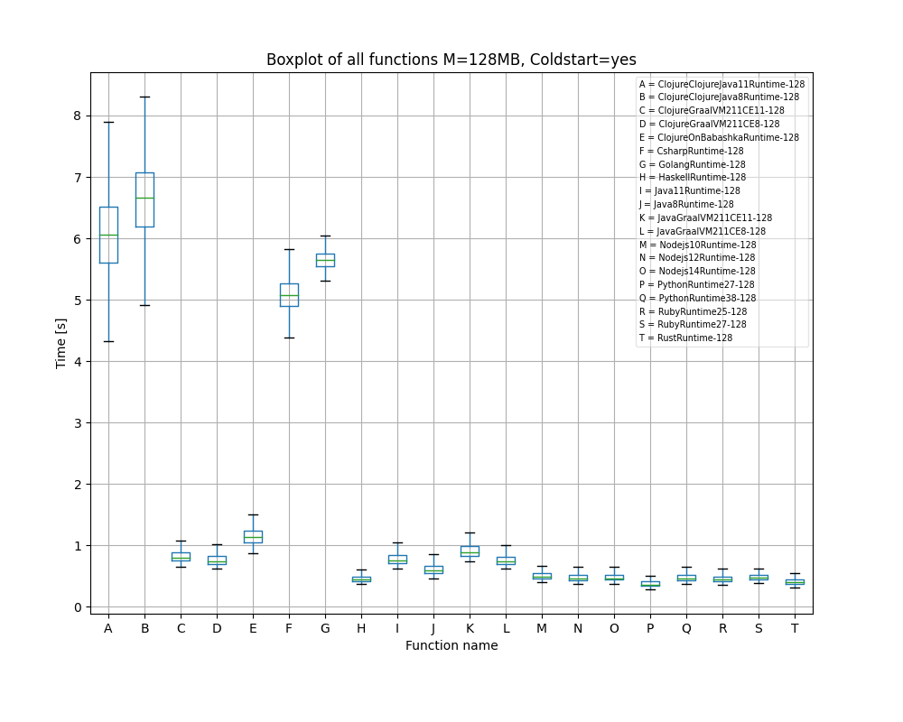
             **Individual boxplots**
            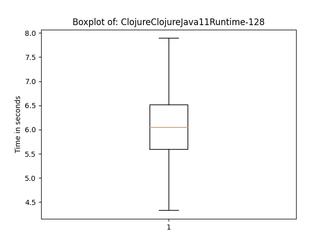
            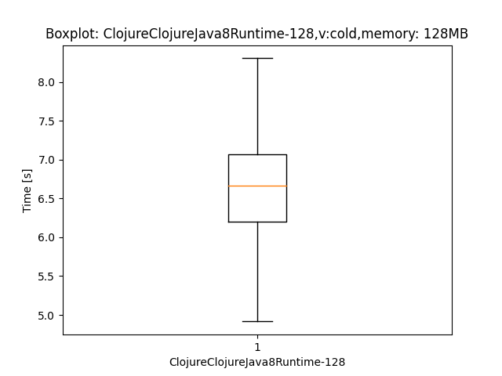
            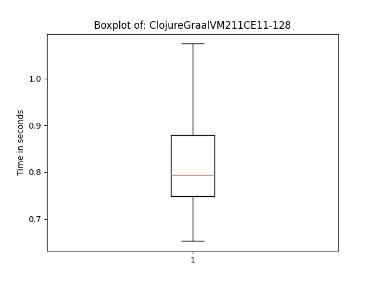
            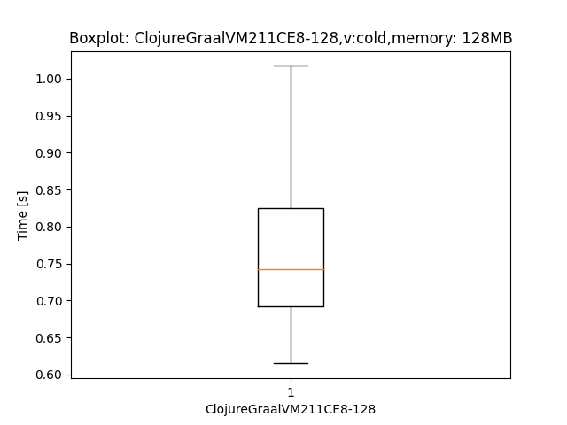
            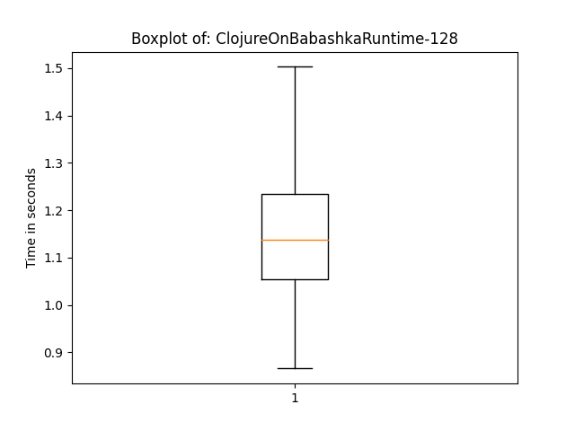
            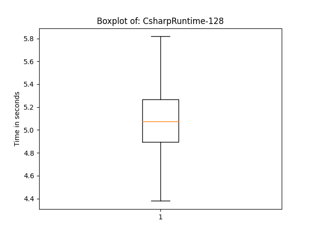
            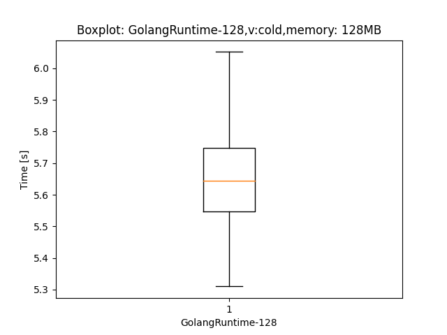
            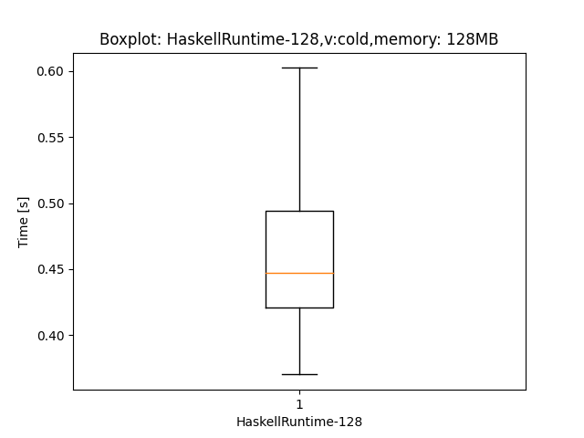
            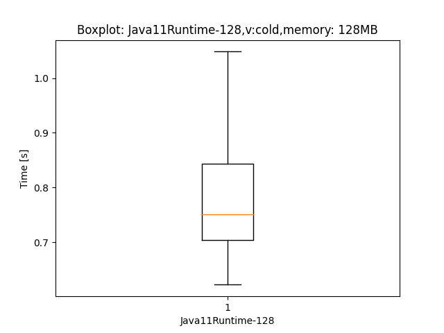
            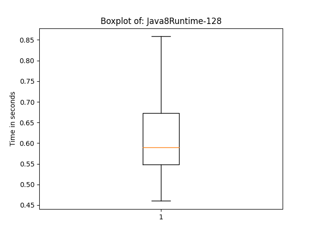
            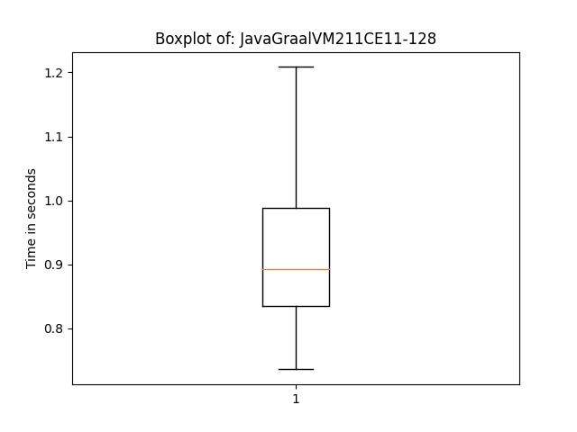
            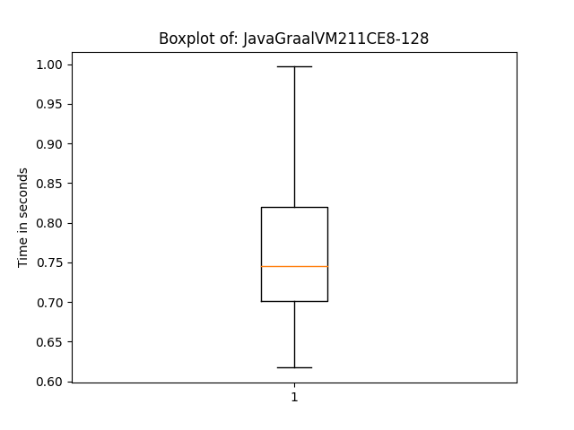
            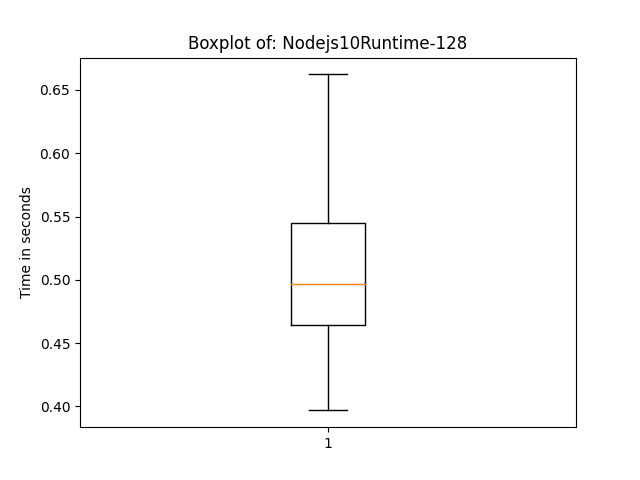
            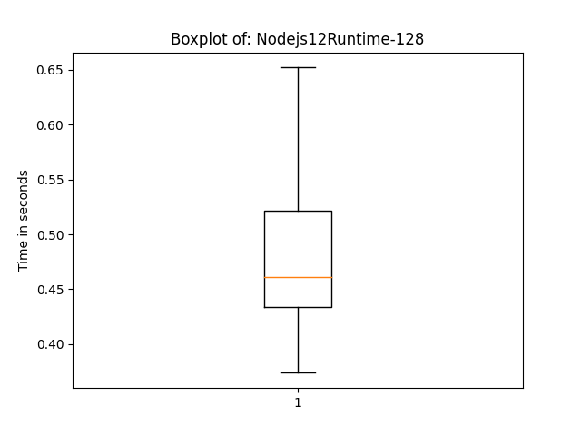
            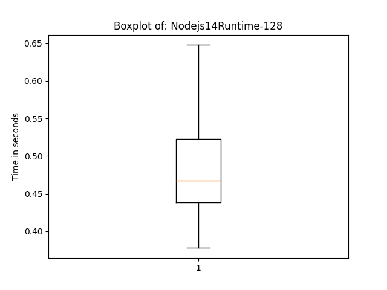
            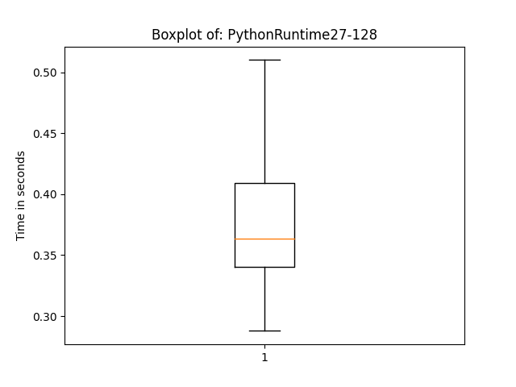
            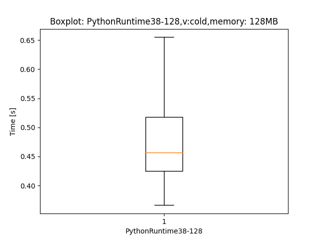
            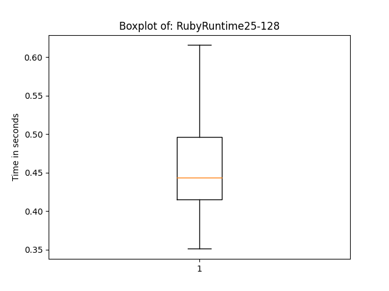
            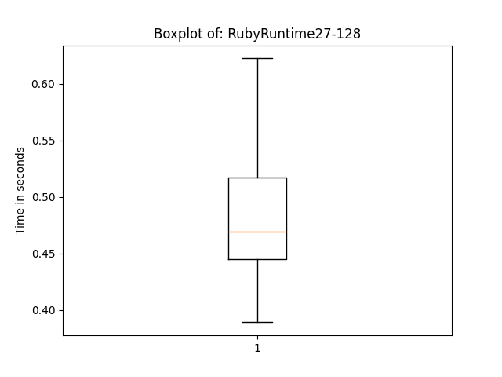
            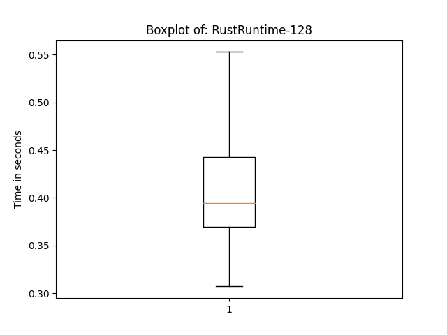
    2.  Lambda with 512 MB of memory
        In the test two Clojure runtimes has been ignored: ClojureJava8Runtime, ClojureJava11Runtime. Runtimes has been ignored, because the memory size usage exceeds 128MB.
        1.  Basic statistics
            
            <table border="2" cellspacing="0" cellpadding="6" rules="groups" frame="hsides">
            
            
            <colgroup>
            <col  class="org-left" />
            
            <col  class="org-right" />
            
            <col  class="org-right" />
            
            <col  class="org-right" />
            
            <col  class="org-right" />
            
            <col  class="org-right" />
            
            <col  class="org-right" />
            
            <col  class="org-right" />
            
            <col  class="org-right" />
            </colgroup>
            <thead>
            <tr>
            <th scope="col" class="org-left">&#xa0;</th>
            <th scope="col" class="org-right">mean</th>
            <th scope="col" class="org-right">std</th>
            <th scope="col" class="org-right">min</th>
            <th scope="col" class="org-right">max</th>
            <th scope="col" class="org-right">25%</th>
            <th scope="col" class="org-right">50%</th>
            <th scope="col" class="org-right">75%</th>
            <th scope="col" class="org-right">status 200 in %</th>
            </tr>
            </thead>
            
            <tbody>
            <tr>
            <td class="org-left">ClojureClojureJava11Runtime-512</td>
            <td class="org-right">3.56312</td>
            <td class="org-right">0.326665</td>
            <td class="org-right">2.95072</td>
            <td class="org-right">4.94755</td>
            <td class="org-right">3.30697</td>
            <td class="org-right">3.50517</td>
            <td class="org-right">3.81774</td>
            <td class="org-right">100.0%</td>
            </tr>
            
            
            <tr>
            <td class="org-left">ClojureClojureJava8Runtime-512</td>
            <td class="org-right">3.65212</td>
            <td class="org-right">0.360775</td>
            <td class="org-right">2.97839</td>
            <td class="org-right">6.48438</td>
            <td class="org-right">3.37076</td>
            <td class="org-right">3.56543</td>
            <td class="org-right">3.90394</td>
            <td class="org-right">100.0%</td>
            </tr>
            
            
            <tr>
            <td class="org-left">ClojureGraalVM211CE11-512</td>
            <td class="org-right">0.802015</td>
            <td class="org-right">0.122457</td>
            <td class="org-right">0.632224</td>
            <td class="org-right">1.55671</td>
            <td class="org-right">0.716621</td>
            <td class="org-right">0.762494</td>
            <td class="org-right">0.856796</td>
            <td class="org-right">100.0%</td>
            </tr>
            
            
            <tr>
            <td class="org-left">ClojureGraalVM211CE8-512</td>
            <td class="org-right">0.746143</td>
            <td class="org-right">0.119515</td>
            <td class="org-right">0.592789</td>
            <td class="org-right">1.31326</td>
            <td class="org-right">0.664177</td>
            <td class="org-right">0.704419</td>
            <td class="org-right">0.796183</td>
            <td class="org-right">100.0%</td>
            </tr>
            
            
            <tr>
            <td class="org-left">ClojureOnBabashkaRuntime-512</td>
            <td class="org-right">1.05925</td>
            <td class="org-right">0.123206</td>
            <td class="org-right">0.792032</td>
            <td class="org-right">1.57932</td>
            <td class="org-right">0.969186</td>
            <td class="org-right">1.0622</td>
            <td class="org-right">1.13719</td>
            <td class="org-right">100.0%</td>
            </tr>
            
            
            <tr>
            <td class="org-left">CsharpRuntime-512</td>
            <td class="org-right">1.50559</td>
            <td class="org-right">0.137707</td>
            <td class="org-right">1.23253</td>
            <td class="org-right">2.05366</td>
            <td class="org-right">1.39306</td>
            <td class="org-right">1.49164</td>
            <td class="org-right">1.59488</td>
            <td class="org-right">100.0%</td>
            </tr>
            
            
            <tr>
            <td class="org-left">GolangRuntime-512</td>
            <td class="org-right">5.61778</td>
            <td class="org-right">0.142129</td>
            <td class="org-right">5.26822</td>
            <td class="org-right">6.28987</td>
            <td class="org-right">5.52354</td>
            <td class="org-right">5.60603</td>
            <td class="org-right">5.68203</td>
            <td class="org-right">100.0%</td>
            </tr>
            
            
            <tr>
            <td class="org-left">HaskellRuntime-512</td>
            <td class="org-right">0.481667</td>
            <td class="org-right">0.111685</td>
            <td class="org-right">0.362144</td>
            <td class="org-right">1.1981</td>
            <td class="org-right">0.414668</td>
            <td class="org-right">0.439051</td>
            <td class="org-right">0.505354</td>
            <td class="org-right">100.0%</td>
            </tr>
            
            
            <tr>
            <td class="org-left">Java11Runtime-512</td>
            <td class="org-right">0.772083</td>
            <td class="org-right">0.123186</td>
            <td class="org-right">0.600335</td>
            <td class="org-right">1.37585</td>
            <td class="org-right">0.685407</td>
            <td class="org-right">0.730091</td>
            <td class="org-right">0.827395</td>
            <td class="org-right">100.0%</td>
            </tr>
            
            
            <tr>
            <td class="org-left">Java8Runtime-512</td>
            <td class="org-right">0.600331</td>
            <td class="org-right">0.114201</td>
            <td class="org-right">0.4552</td>
            <td class="org-right">1.22431</td>
            <td class="org-right">0.523764</td>
            <td class="org-right">0.557859</td>
            <td class="org-right">0.652838</td>
            <td class="org-right">100.0%</td>
            </tr>
            
            
            <tr>
            <td class="org-left">JavaGraalVM211CE11-512</td>
            <td class="org-right">0.889963</td>
            <td class="org-right">0.113951</td>
            <td class="org-right">0.730355</td>
            <td class="org-right">1.56742</td>
            <td class="org-right">0.809575</td>
            <td class="org-right">0.857611</td>
            <td class="org-right">0.944919</td>
            <td class="org-right">100.0%</td>
            </tr>
            
            
            <tr>
            <td class="org-left">JavaGraalVM211CE8-512</td>
            <td class="org-right">0.772357</td>
            <td class="org-right">0.123599</td>
            <td class="org-right">0.61833</td>
            <td class="org-right">1.48924</td>
            <td class="org-right">0.687282</td>
            <td class="org-right">0.73164</td>
            <td class="org-right">0.828463</td>
            <td class="org-right">100.0%</td>
            </tr>
            
            
            <tr>
            <td class="org-left">Nodejs10Runtime-512</td>
            <td class="org-right">0.525893</td>
            <td class="org-right">0.103414</td>
            <td class="org-right">0.396392</td>
            <td class="org-right">1.00589</td>
            <td class="org-right">0.457495</td>
            <td class="org-right">0.487825</td>
            <td class="org-right">0.56038</td>
            <td class="org-right">100.0%</td>
            </tr>
            
            
            <tr>
            <td class="org-left">Nodejs12Runtime-512</td>
            <td class="org-right">0.483178</td>
            <td class="org-right">0.101139</td>
            <td class="org-right">0.358538</td>
            <td class="org-right">1.03742</td>
            <td class="org-right">0.420183</td>
            <td class="org-right">0.447169</td>
            <td class="org-right">0.503185</td>
            <td class="org-right">100.0%</td>
            </tr>
            
            
            <tr>
            <td class="org-left">Nodejs14Runtime-512</td>
            <td class="org-right">0.489519</td>
            <td class="org-right">0.103726</td>
            <td class="org-right">0.366926</td>
            <td class="org-right">1.10079</td>
            <td class="org-right">0.42606</td>
            <td class="org-right">0.451866</td>
            <td class="org-right">0.509001</td>
            <td class="org-right">100.0%</td>
            </tr>
            
            
            <tr>
            <td class="org-left">PythonRuntime27-512</td>
            <td class="org-right">0.395011</td>
            <td class="org-right">0.101769</td>
            <td class="org-right">0.274017</td>
            <td class="org-right">0.988364</td>
            <td class="org-right">0.335701</td>
            <td class="org-right">0.356047</td>
            <td class="org-right">0.411183</td>
            <td class="org-right">100.0%</td>
            </tr>
            
            
            <tr>
            <td class="org-left">PythonRuntime38-512</td>
            <td class="org-right">0.48001</td>
            <td class="org-right">0.101996</td>
            <td class="org-right">0.357242</td>
            <td class="org-right">1.06366</td>
            <td class="org-right">0.413972</td>
            <td class="org-right">0.443028</td>
            <td class="org-right">0.5105</td>
            <td class="org-right">100.0%</td>
            </tr>
            
            
            <tr>
            <td class="org-left">RubyRuntime25-512</td>
            <td class="org-right">0.464914</td>
            <td class="org-right">0.102498</td>
            <td class="org-right">0.342065</td>
            <td class="org-right">1.06081</td>
            <td class="org-right">0.402809</td>
            <td class="org-right">0.427066</td>
            <td class="org-right">0.486209</td>
            <td class="org-right">100.0%</td>
            </tr>
            
            
            <tr>
            <td class="org-left">RubyRuntime27-512</td>
            <td class="org-right">0.489463</td>
            <td class="org-right">0.0983069</td>
            <td class="org-right">0.365415</td>
            <td class="org-right">0.995128</td>
            <td class="org-right">0.426528</td>
            <td class="org-right">0.453523</td>
            <td class="org-right">0.514234</td>
            <td class="org-right">100.0%</td>
            </tr>
            
            
            <tr>
            <td class="org-left">RustRuntime-512</td>
            <td class="org-right">0.424694</td>
            <td class="org-right">0.0977936</td>
            <td class="org-right">0.303959</td>
            <td class="org-right">1.06127</td>
            <td class="org-right">0.36283</td>
            <td class="org-right">0.388134</td>
            <td class="org-right">0.449551</td>
            <td class="org-right">100.0%</td>
            </tr>
            </tbody>
            </table>
        
        2.  Box plot
              **Boxplot all functions**
              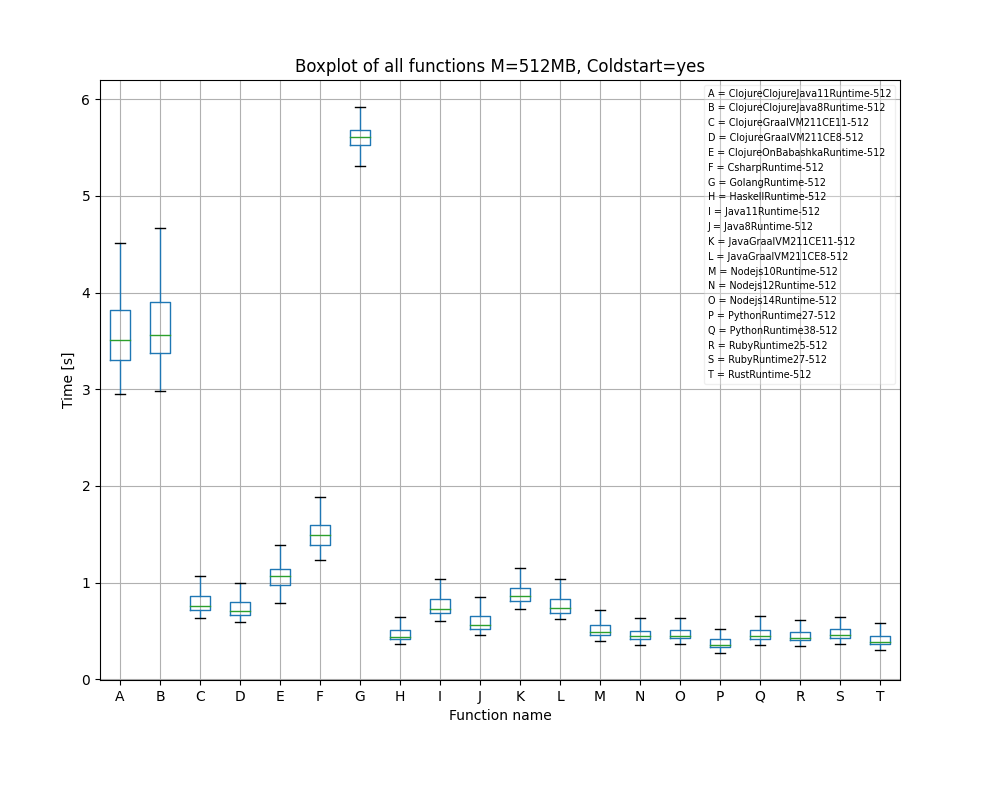
              **Individual boxplots**
            None

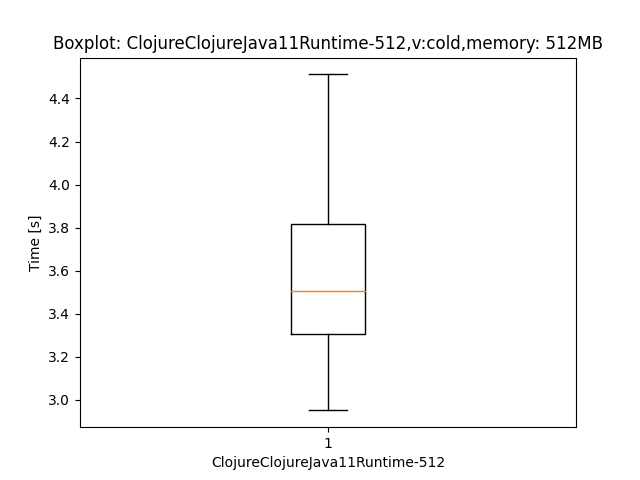
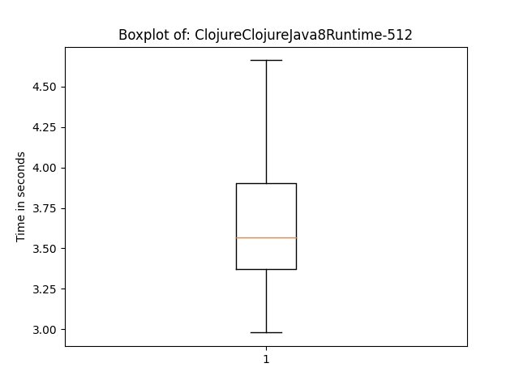
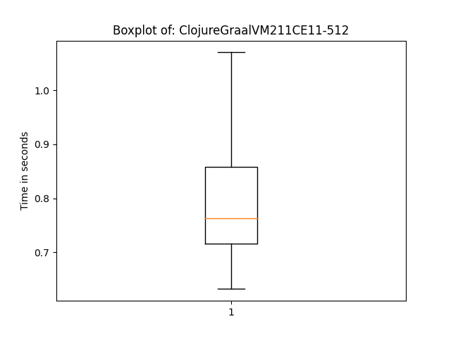
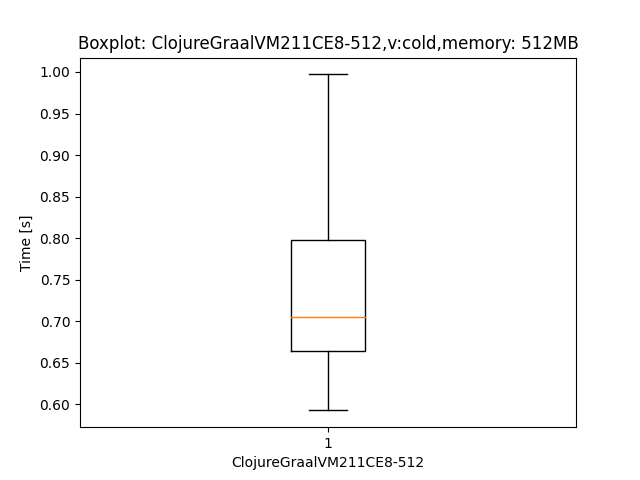
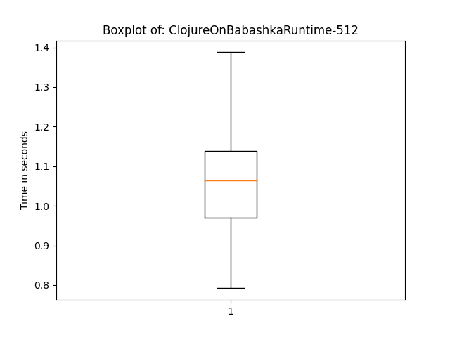
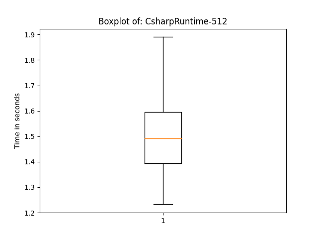
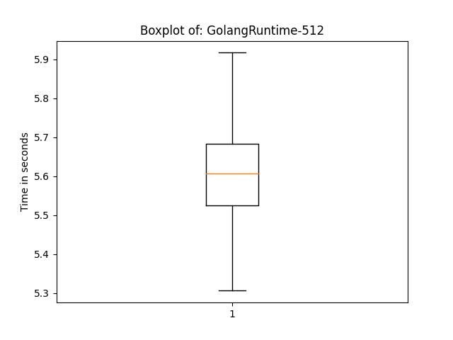
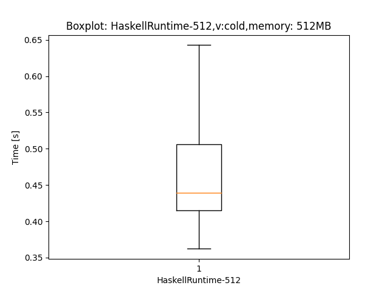
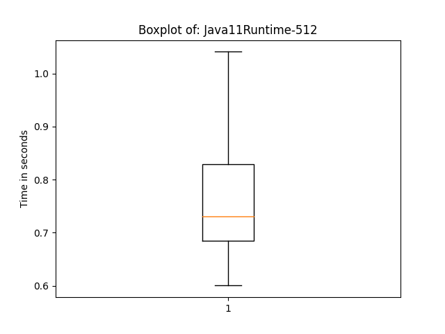
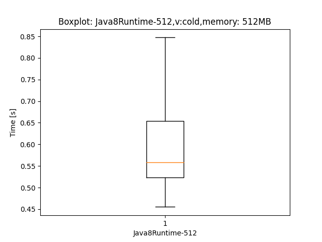
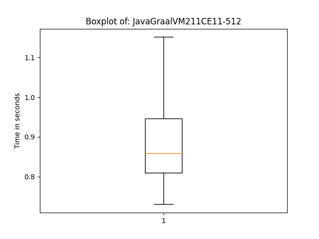
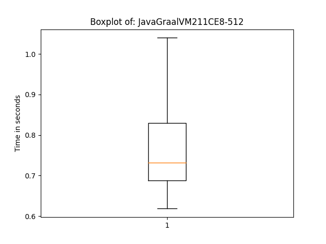
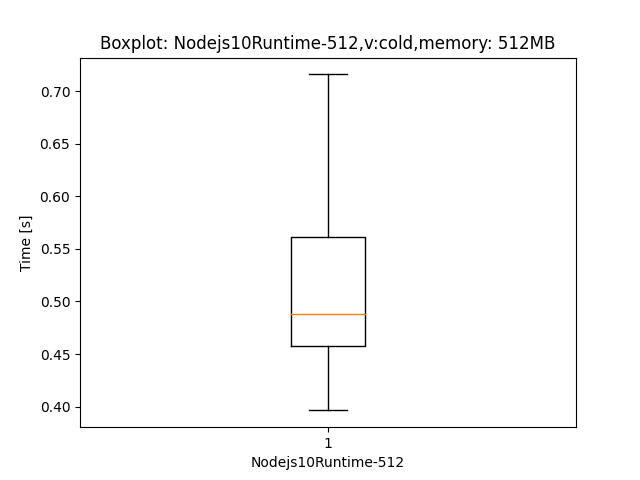
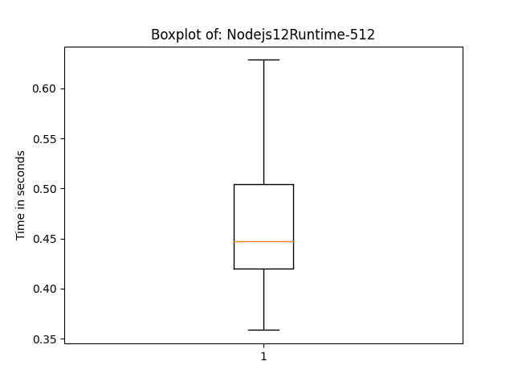
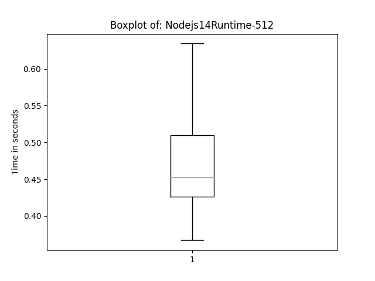
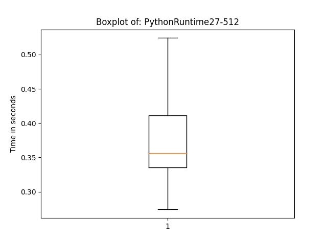
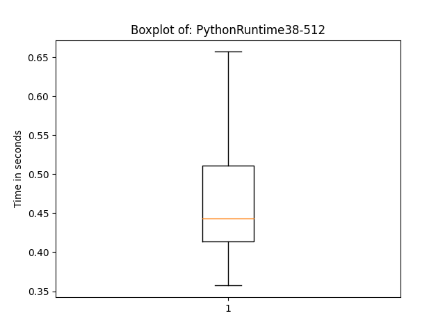
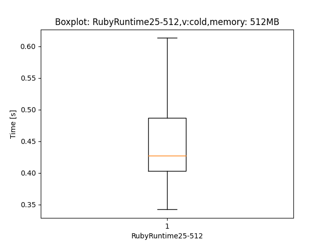
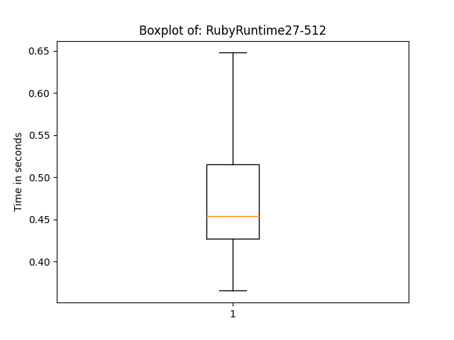
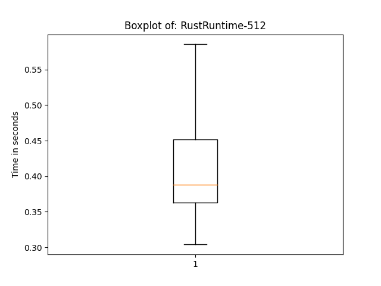

1.  Lambda with 1024 MB of memory
    In the test two Clojure runtimes has been ignored: ClojureJava8Runtime, ClojureJava11Runtime. Runtimes has been ignored, because the memory size usage exceeds 128MB.
    1.  Basic statistics
        
        <table border="2" cellspacing="0" cellpadding="6" rules="groups" frame="hsides">
        
        
        <colgroup>
        <col  class="org-left" />
        
        <col  class="org-right" />
        
        <col  class="org-right" />
        
        <col  class="org-right" />
        
        <col  class="org-right" />
        
        <col  class="org-right" />
        
        <col  class="org-right" />
        
        <col  class="org-right" />
        
        <col  class="org-right" />
        </colgroup>
        <thead>
        <tr>
        <th scope="col" class="org-left">&#xa0;</th>
        <th scope="col" class="org-right">mean</th>
        <th scope="col" class="org-right">std</th>
        <th scope="col" class="org-right">min</th>
        <th scope="col" class="org-right">max</th>
        <th scope="col" class="org-right">25%</th>
        <th scope="col" class="org-right">50%</th>
        <th scope="col" class="org-right">75%</th>
        <th scope="col" class="org-right">status 200 in %</th>
        </tr>
        </thead>
        
        <tbody>
        <tr>
        <td class="org-left">ClojureClojureJava11Runtime-1024</td>
        <td class="org-right">3.4299</td>
        <td class="org-right">0.516205</td>
        <td class="org-right">2.72929</td>
        <td class="org-right">5.52286</td>
        <td class="org-right">3.06063</td>
        <td class="org-right">3.31898</td>
        <td class="org-right">3.60859</td>
        <td class="org-right">100.0%</td>
        </tr>
        
        
        <tr>
        <td class="org-left">ClojureClojureJava8Runtime-1024</td>
        <td class="org-right">3.28816</td>
        <td class="org-right">0.427307</td>
        <td class="org-right">2.69686</td>
        <td class="org-right">4.96568</td>
        <td class="org-right">2.99065</td>
        <td class="org-right">3.1744</td>
        <td class="org-right">3.42546</td>
        <td class="org-right">100.0%</td>
        </tr>
        
        
        <tr>
        <td class="org-left">ClojureGraalVM211CE11-1024</td>
        <td class="org-right">0.79567</td>
        <td class="org-right">0.105458</td>
        <td class="org-right">0.654798</td>
        <td class="org-right">1.27405</td>
        <td class="org-right">0.722494</td>
        <td class="org-right">0.760577</td>
        <td class="org-right">0.843481</td>
        <td class="org-right">100.0%</td>
        </tr>
        
        
        <tr>
        <td class="org-left">ClojureGraalVM211CE8-1024</td>
        <td class="org-right">0.75663</td>
        <td class="org-right">0.117296</td>
        <td class="org-right">0.598409</td>
        <td class="org-right">1.25419</td>
        <td class="org-right">0.671662</td>
        <td class="org-right">0.721038</td>
        <td class="org-right">0.808708</td>
        <td class="org-right">100.0%</td>
        </tr>
        
        
        <tr>
        <td class="org-left">ClojureOnBabashkaRuntime-1024</td>
        <td class="org-right">1.04816</td>
        <td class="org-right">0.110737</td>
        <td class="org-right">0.783214</td>
        <td class="org-right">1.41588</td>
        <td class="org-right">0.963213</td>
        <td class="org-right">1.05283</td>
        <td class="org-right">1.12168</td>
        <td class="org-right">100.0%</td>
        </tr>
        
        
        <tr>
        <td class="org-left">CsharpRuntime-1024</td>
        <td class="org-right">0.980764</td>
        <td class="org-right">0.110012</td>
        <td class="org-right">0.798334</td>
        <td class="org-right">1.52851</td>
        <td class="org-right">0.899433</td>
        <td class="org-right">0.948845</td>
        <td class="org-right">1.03312</td>
        <td class="org-right">100.0%</td>
        </tr>
        
        
        <tr>
        <td class="org-left">GolangRuntime-1024</td>
        <td class="org-right">5.63231</td>
        <td class="org-right">0.123809</td>
        <td class="org-right">5.31267</td>
        <td class="org-right">6.09333</td>
        <td class="org-right">5.5484</td>
        <td class="org-right">5.6301</td>
        <td class="org-right">5.70204</td>
        <td class="org-right">100.0%</td>
        </tr>
        
        
        <tr>
        <td class="org-left">HaskellRuntime-1024</td>
        <td class="org-right">0.487218</td>
        <td class="org-right">0.108925</td>
        <td class="org-right">0.367565</td>
        <td class="org-right">1.04526</td>
        <td class="org-right">0.417187</td>
        <td class="org-right">0.448376</td>
        <td class="org-right">0.51964</td>
        <td class="org-right">100.0%</td>
        </tr>
        
        
        <tr>
        <td class="org-left">Java11Runtime-1024</td>
        <td class="org-right">0.768738</td>
        <td class="org-right">0.117183</td>
        <td class="org-right">0.600235</td>
        <td class="org-right">1.32272</td>
        <td class="org-right">0.684912</td>
        <td class="org-right">0.728411</td>
        <td class="org-right">0.823612</td>
        <td class="org-right">100.0%</td>
        </tr>
        
        
        <tr>
        <td class="org-left">Java8Runtime-1024</td>
        <td class="org-right">0.601121</td>
        <td class="org-right">0.107099</td>
        <td class="org-right">0.455898</td>
        <td class="org-right">1.08001</td>
        <td class="org-right">0.525155</td>
        <td class="org-right">0.565485</td>
        <td class="org-right">0.651792</td>
        <td class="org-right">100.0%</td>
        </tr>
        
        
        <tr>
        <td class="org-left">JavaGraalVM211CE11-1024</td>
        <td class="org-right">0.899437</td>
        <td class="org-right">0.114341</td>
        <td class="org-right">0.74397</td>
        <td class="org-right">1.42422</td>
        <td class="org-right">0.815022</td>
        <td class="org-right">0.866759</td>
        <td class="org-right">0.95904</td>
        <td class="org-right">100.0%</td>
        </tr>
        
        
        <tr>
        <td class="org-left">JavaGraalVM211CE8-1024</td>
        <td class="org-right">0.77488</td>
        <td class="org-right">0.115719</td>
        <td class="org-right">0.613155</td>
        <td class="org-right">1.26526</td>
        <td class="org-right">0.693472</td>
        <td class="org-right">0.735399</td>
        <td class="org-right">0.825933</td>
        <td class="org-right">100.0%</td>
        </tr>
        
        
        <tr>
        <td class="org-left">Nodejs10Runtime-1024</td>
        <td class="org-right">0.523741</td>
        <td class="org-right">0.106764</td>
        <td class="org-right">0.395034</td>
        <td class="org-right">1.02863</td>
        <td class="org-right">0.454472</td>
        <td class="org-right">0.488308</td>
        <td class="org-right">0.552888</td>
        <td class="org-right">100.0%</td>
        </tr>
        
        
        <tr>
        <td class="org-left">Nodejs12Runtime-1024</td>
        <td class="org-right">0.487226</td>
        <td class="org-right">0.0922366</td>
        <td class="org-right">0.371258</td>
        <td class="org-right">0.835285</td>
        <td class="org-right">0.424494</td>
        <td class="org-right">0.451495</td>
        <td class="org-right">0.522307</td>
        <td class="org-right">100.0%</td>
        </tr>
        
        
        <tr>
        <td class="org-left">Nodejs14Runtime-1024</td>
        <td class="org-right">0.495293</td>
        <td class="org-right">0.0993444</td>
        <td class="org-right">0.373809</td>
        <td class="org-right">0.914613</td>
        <td class="org-right">0.429974</td>
        <td class="org-right">0.457192</td>
        <td class="org-right">0.526994</td>
        <td class="org-right">100.0%</td>
        </tr>
        
        
        <tr>
        <td class="org-left">PythonRuntime27-1024</td>
        <td class="org-right">0.393577</td>
        <td class="org-right">0.0878113</td>
        <td class="org-right">0.285595</td>
        <td class="org-right">0.720549</td>
        <td class="org-right">0.335537</td>
        <td class="org-right">0.359448</td>
        <td class="org-right">0.421494</td>
        <td class="org-right">100.0%</td>
        </tr>
        
        
        <tr>
        <td class="org-left">PythonRuntime38-1024</td>
        <td class="org-right">0.471926</td>
        <td class="org-right">0.101753</td>
        <td class="org-right">0.35758</td>
        <td class="org-right">1.03092</td>
        <td class="org-right">0.409528</td>
        <td class="org-right">0.435529</td>
        <td class="org-right">0.495907</td>
        <td class="org-right">100.0%</td>
        </tr>
        
        
        <tr>
        <td class="org-left">RubyRuntime25-1024</td>
        <td class="org-right">0.470383</td>
        <td class="org-right">0.0959179</td>
        <td class="org-right">0.350102</td>
        <td class="org-right">0.890789</td>
        <td class="org-right">0.407506</td>
        <td class="org-right">0.436452</td>
        <td class="org-right">0.500903</td>
        <td class="org-right">100.0%</td>
        </tr>
        
        
        <tr>
        <td class="org-left">RubyRuntime27-1024</td>
        <td class="org-right">0.493324</td>
        <td class="org-right">0.106454</td>
        <td class="org-right">0.373846</td>
        <td class="org-right">1.08042</td>
        <td class="org-right">0.427152</td>
        <td class="org-right">0.455522</td>
        <td class="org-right">0.517483</td>
        <td class="org-right">100.0%</td>
        </tr>
        
        
        <tr>
        <td class="org-left">RustRuntime-1024</td>
        <td class="org-right">0.431437</td>
        <td class="org-right">0.102973</td>
        <td class="org-right">0.309548</td>
        <td class="org-right">0.916079</td>
        <td class="org-right">0.364791</td>
        <td class="org-right">0.39208</td>
        <td class="org-right">0.464565</td>
        <td class="org-right">100.0%</td>
        </tr>
        </tbody>
        </table>
    
    2.  Box plot
        **Boxplot all functions**
        None

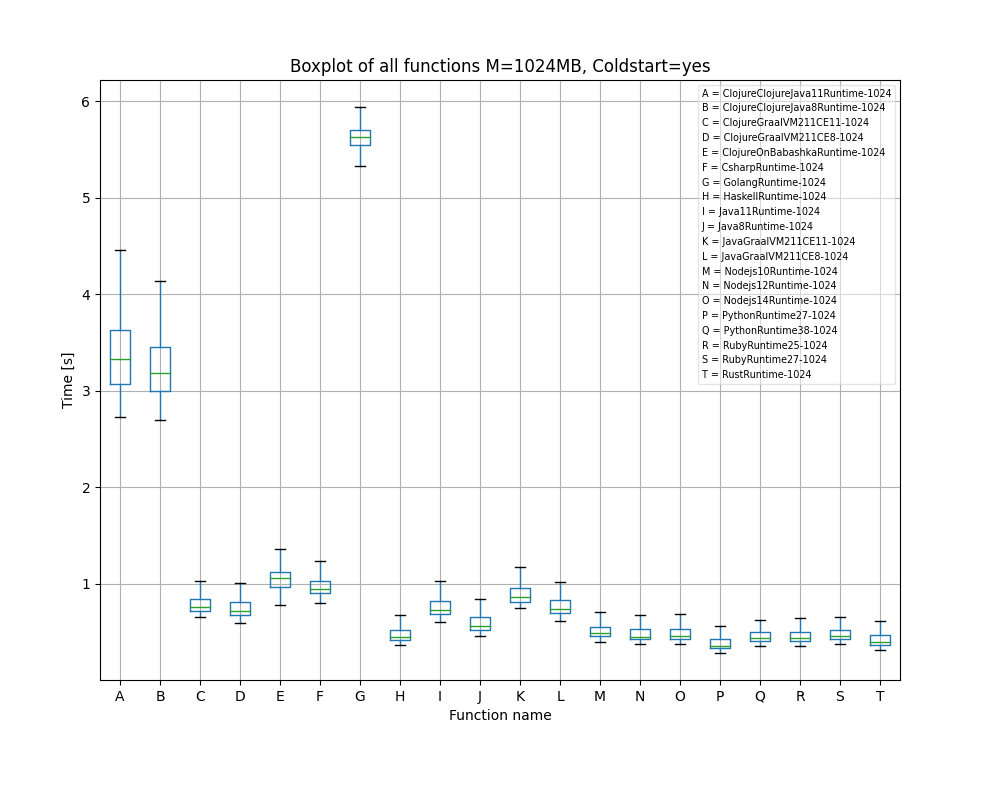

  **Individual boxplots**
None

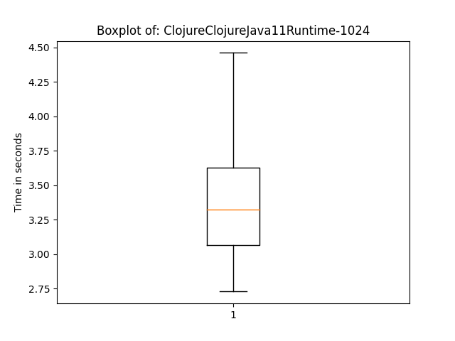
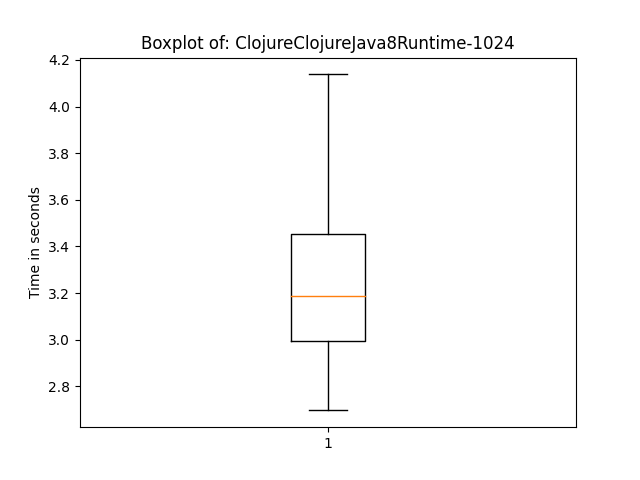
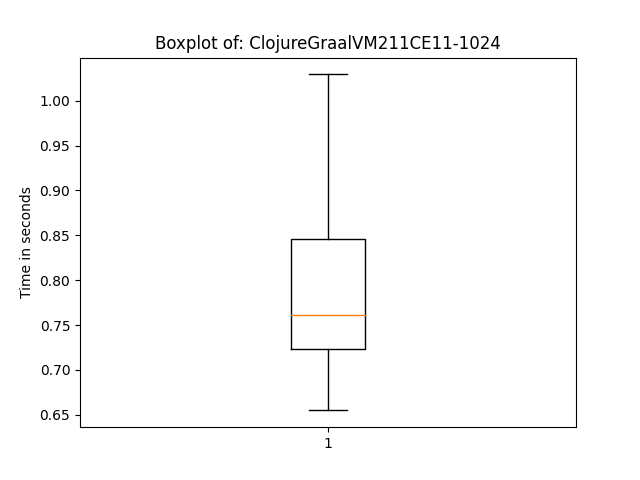
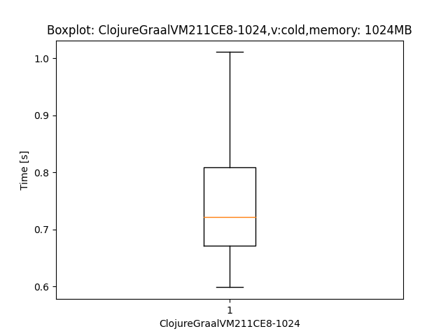
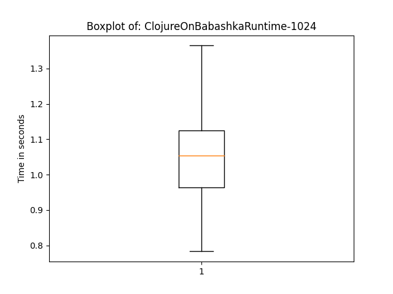
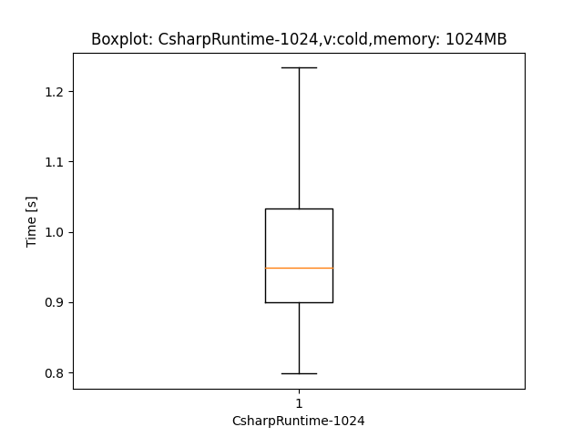
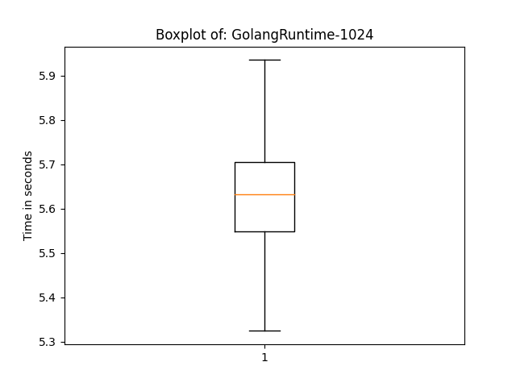
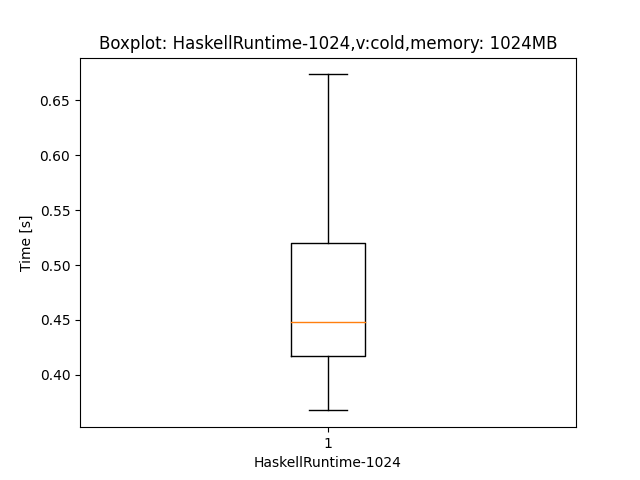

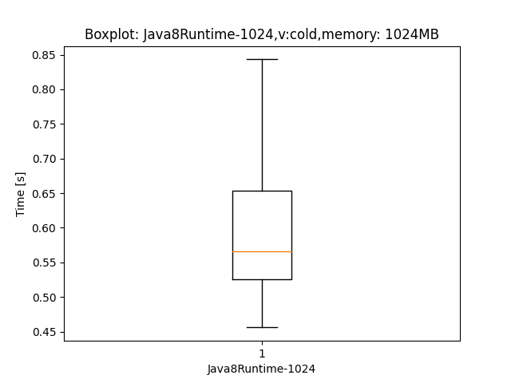
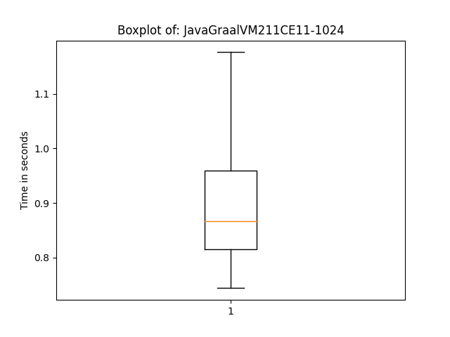
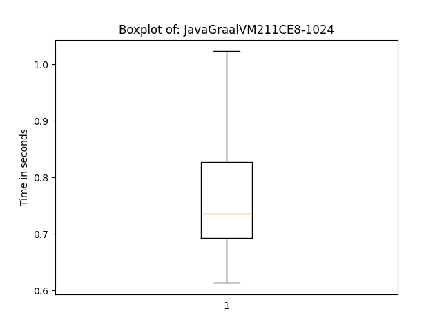
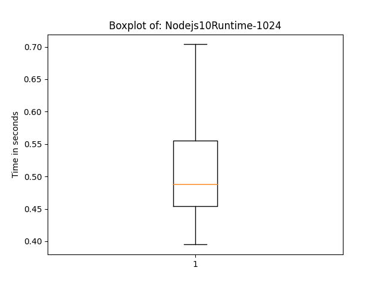
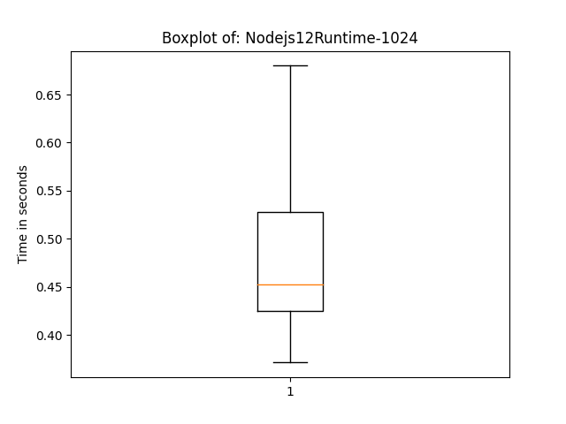
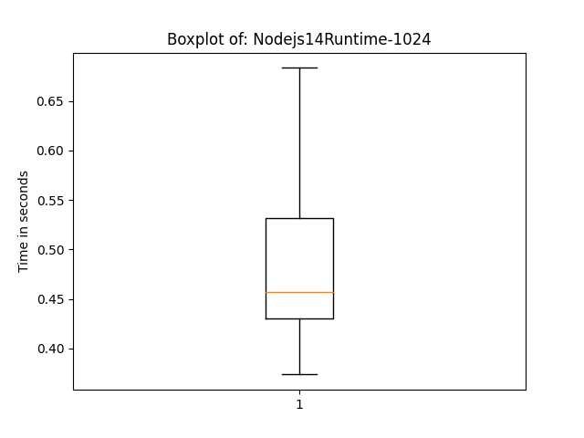
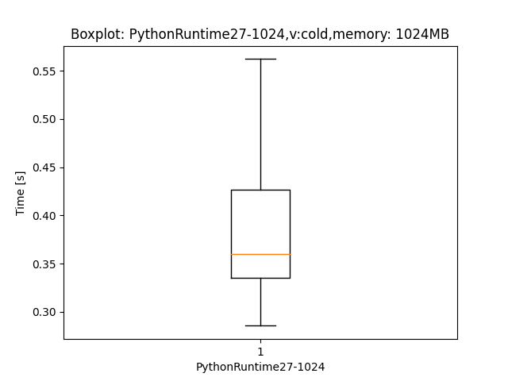
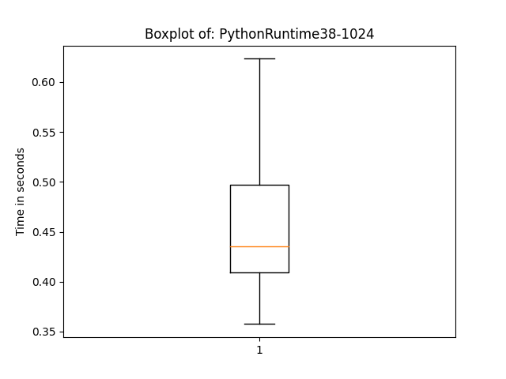
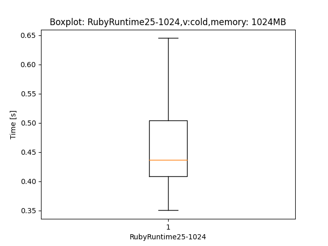
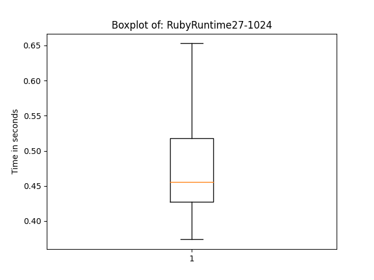
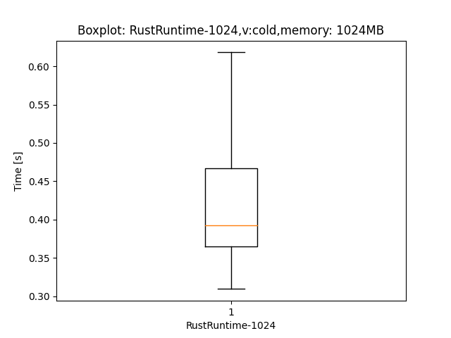

1.  Lambda with 2048MB of memory
    All possible runtimes are included.
    1.  Basic statistics
        
        <table border="2" cellspacing="0" cellpadding="6" rules="groups" frame="hsides">
        
        
        <colgroup>
        <col  class="org-left" />
        
        <col  class="org-right" />
        
        <col  class="org-right" />
        
        <col  class="org-right" />
        
        <col  class="org-right" />
        
        <col  class="org-right" />
        
        <col  class="org-right" />
        
        <col  class="org-right" />
        
        <col  class="org-right" />
        </colgroup>
        <thead>
        <tr>
        <th scope="col" class="org-left">&#xa0;</th>
        <th scope="col" class="org-right">mean</th>
        <th scope="col" class="org-right">std</th>
        <th scope="col" class="org-right">min</th>
        <th scope="col" class="org-right">max</th>
        <th scope="col" class="org-right">25%</th>
        <th scope="col" class="org-right">50%</th>
        <th scope="col" class="org-right">75%</th>
        <th scope="col" class="org-right">status 200 in %</th>
        </tr>
        </thead>
        
        <tbody>
        <tr>
        <td class="org-left">ClojureClojureJava11Runtime-2048</td>
        <td class="org-right">2.92799</td>
        <td class="org-right">0.272345</td>
        <td class="org-right">2.43928</td>
        <td class="org-right">3.83936</td>
        <td class="org-right">2.69444</td>
        <td class="org-right">2.85116</td>
        <td class="org-right">3.14217</td>
        <td class="org-right">100.0%</td>
        </tr>
        
        
        <tr>
        <td class="org-left">ClojureClojureJava8Runtime-2048</td>
        <td class="org-right">2.73644</td>
        <td class="org-right">0.224656</td>
        <td class="org-right">2.29793</td>
        <td class="org-right">3.54138</td>
        <td class="org-right">2.56425</td>
        <td class="org-right">2.70357</td>
        <td class="org-right">2.89778</td>
        <td class="org-right">100.0%</td>
        </tr>
        
        
        <tr>
        <td class="org-left">ClojureGraalVM211CE11-2048</td>
        <td class="org-right">0.804898</td>
        <td class="org-right">0.118211</td>
        <td class="org-right">0.650118</td>
        <td class="org-right">1.44274</td>
        <td class="org-right">0.722097</td>
        <td class="org-right">0.769181</td>
        <td class="org-right">0.858055</td>
        <td class="org-right">100.0%</td>
        </tr>
        
        
        <tr>
        <td class="org-left">ClojureGraalVM211CE8-2048</td>
        <td class="org-right">0.7502</td>
        <td class="org-right">0.117493</td>
        <td class="org-right">0.585724</td>
        <td class="org-right">1.42923</td>
        <td class="org-right">0.666288</td>
        <td class="org-right">0.70809</td>
        <td class="org-right">0.807289</td>
        <td class="org-right">100.0%</td>
        </tr>
        
        
        <tr>
        <td class="org-left">ClojureJava11Runtime-2048</td>
        <td class="org-right">3.71966</td>
        <td class="org-right">0.264577</td>
        <td class="org-right">3.21078</td>
        <td class="org-right">4.97785</td>
        <td class="org-right">3.54606</td>
        <td class="org-right">3.66034</td>
        <td class="org-right">3.82701</td>
        <td class="org-right">100.0%</td>
        </tr>
        
        
        <tr>
        <td class="org-left">ClojureJava8Runtime-2048</td>
        <td class="org-right">3.38563</td>
        <td class="org-right">0.232172</td>
        <td class="org-right">2.91588</td>
        <td class="org-right">4.43562</td>
        <td class="org-right">3.22424</td>
        <td class="org-right">3.34385</td>
        <td class="org-right">3.50171</td>
        <td class="org-right">100.0%</td>
        </tr>
        
        
        <tr>
        <td class="org-left">ClojureOnBabashkaRuntime-2048</td>
        <td class="org-right">1.04305</td>
        <td class="org-right">0.123855</td>
        <td class="org-right">0.77982</td>
        <td class="org-right">1.61031</td>
        <td class="org-right">0.951814</td>
        <td class="org-right">1.03576</td>
        <td class="org-right">1.11987</td>
        <td class="org-right">100.0%</td>
        </tr>
        
        
        <tr>
        <td class="org-left">CsharpRuntime-2048</td>
        <td class="org-right">0.820751</td>
        <td class="org-right">0.120625</td>
        <td class="org-right">0.652978</td>
        <td class="org-right">1.45015</td>
        <td class="org-right">0.736065</td>
        <td class="org-right">0.779492</td>
        <td class="org-right">0.873494</td>
        <td class="org-right">100.0%</td>
        </tr>
        
        
        <tr>
        <td class="org-left">GolangRuntime-2048</td>
        <td class="org-right">5.6573</td>
        <td class="org-right">0.133507</td>
        <td class="org-right">5.31721</td>
        <td class="org-right">6.19294</td>
        <td class="org-right">5.57006</td>
        <td class="org-right">5.66162</td>
        <td class="org-right">5.74533</td>
        <td class="org-right">100.0%</td>
        </tr>
        
        
        <tr>
        <td class="org-left">HaskellRuntime-2048</td>
        <td class="org-right">0.486618</td>
        <td class="org-right">0.111626</td>
        <td class="org-right">0.354074</td>
        <td class="org-right">1.06188</td>
        <td class="org-right">0.416465</td>
        <td class="org-right">0.444968</td>
        <td class="org-right">0.511646</td>
        <td class="org-right">100.0%</td>
        </tr>
        
        
        <tr>
        <td class="org-left">Java11Runtime-2048</td>
        <td class="org-right">0.770344</td>
        <td class="org-right">0.127143</td>
        <td class="org-right">0.58766</td>
        <td class="org-right">1.37743</td>
        <td class="org-right">0.680178</td>
        <td class="org-right">0.730112</td>
        <td class="org-right">0.828026</td>
        <td class="org-right">100.0%</td>
        </tr>
        
        
        <tr>
        <td class="org-left">Java8Runtime-2048</td>
        <td class="org-right">0.606067</td>
        <td class="org-right">0.113531</td>
        <td class="org-right">0.457597</td>
        <td class="org-right">1.14565</td>
        <td class="org-right">0.531069</td>
        <td class="org-right">0.567573</td>
        <td class="org-right">0.643435</td>
        <td class="org-right">100.0%</td>
        </tr>
        
        
        <tr>
        <td class="org-left">JavaGraalVM211CE11-2048</td>
        <td class="org-right">0.902936</td>
        <td class="org-right">0.121697</td>
        <td class="org-right">0.742646</td>
        <td class="org-right">1.60586</td>
        <td class="org-right">0.814963</td>
        <td class="org-right">0.867508</td>
        <td class="org-right">0.960273</td>
        <td class="org-right">100.0%</td>
        </tr>
        
        
        <tr>
        <td class="org-left">JavaGraalVM211CE8-2048</td>
        <td class="org-right">0.7706</td>
        <td class="org-right">0.117491</td>
        <td class="org-right">0.605758</td>
        <td class="org-right">1.45188</td>
        <td class="org-right">0.689058</td>
        <td class="org-right">0.733248</td>
        <td class="org-right">0.82006</td>
        <td class="org-right">100.0%</td>
        </tr>
        
        
        <tr>
        <td class="org-left">Nodejs10Runtime-2048</td>
        <td class="org-right">0.523508</td>
        <td class="org-right">0.110036</td>
        <td class="org-right">0.38714</td>
        <td class="org-right">1.03967</td>
        <td class="org-right">0.45163</td>
        <td class="org-right">0.483639</td>
        <td class="org-right">0.556604</td>
        <td class="org-right">100.0%</td>
        </tr>
        
        
        <tr>
        <td class="org-left">Nodejs12Runtime-2048</td>
        <td class="org-right">0.490053</td>
        <td class="org-right">0.108222</td>
        <td class="org-right">0.367538</td>
        <td class="org-right">1.1863</td>
        <td class="org-right">0.422507</td>
        <td class="org-right">0.450118</td>
        <td class="org-right">0.521201</td>
        <td class="org-right">100.0%</td>
        </tr>
        
        
        <tr>
        <td class="org-left">Nodejs14Runtime-2048</td>
        <td class="org-right">0.497705</td>
        <td class="org-right">0.108624</td>
        <td class="org-right">0.372895</td>
        <td class="org-right">1.10113</td>
        <td class="org-right">0.430261</td>
        <td class="org-right">0.456736</td>
        <td class="org-right">0.520074</td>
        <td class="org-right">100.0%</td>
        </tr>
        
        
        <tr>
        <td class="org-left">PythonRuntime27-2048</td>
        <td class="org-right">0.402463</td>
        <td class="org-right">0.110973</td>
        <td class="org-right">0.286314</td>
        <td class="org-right">1.10604</td>
        <td class="org-right">0.33556</td>
        <td class="org-right">0.35971</td>
        <td class="org-right">0.424409</td>
        <td class="org-right">100.0%</td>
        </tr>
        
        
        <tr>
        <td class="org-left">PythonRuntime38-2048</td>
        <td class="org-right">0.494634</td>
        <td class="org-right">0.113815</td>
        <td class="org-right">0.360488</td>
        <td class="org-right">1.06288</td>
        <td class="org-right">0.419299</td>
        <td class="org-right">0.454634</td>
        <td class="org-right">0.528026</td>
        <td class="org-right">100.0%</td>
        </tr>
        
        
        <tr>
        <td class="org-left">RubyRuntime25-2048</td>
        <td class="org-right">0.476061</td>
        <td class="org-right">0.109684</td>
        <td class="org-right">0.348395</td>
        <td class="org-right">1.01329</td>
        <td class="org-right">0.407704</td>
        <td class="org-right">0.434057</td>
        <td class="org-right">0.502698</td>
        <td class="org-right">100.0%</td>
        </tr>
        
        
        <tr>
        <td class="org-left">RubyRuntime27-2048</td>
        <td class="org-right">0.493976</td>
        <td class="org-right">0.105726</td>
        <td class="org-right">0.375783</td>
        <td class="org-right">1.16421</td>
        <td class="org-right">0.428802</td>
        <td class="org-right">0.456788</td>
        <td class="org-right">0.515502</td>
        <td class="org-right">100.0%</td>
        </tr>
        
        
        <tr>
        <td class="org-left">RustRuntime-2048</td>
        <td class="org-right">0.426249</td>
        <td class="org-right">0.0977116</td>
        <td class="org-right">0.315532</td>
        <td class="org-right">0.901215</td>
        <td class="org-right">0.362562</td>
        <td class="org-right">0.389235</td>
        <td class="org-right">0.459304</td>
        <td class="org-right">100.0%</td>
        </tr>
        </tbody>
        </table>
    
    2.  Box plot
        **Boxplot all functions**
        None

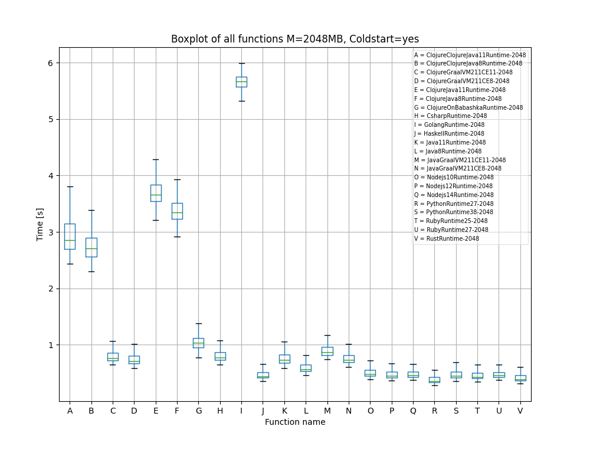

  **Individual boxplots**
None

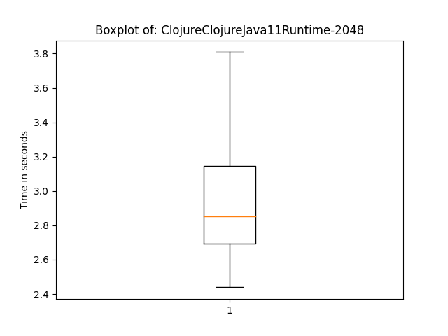
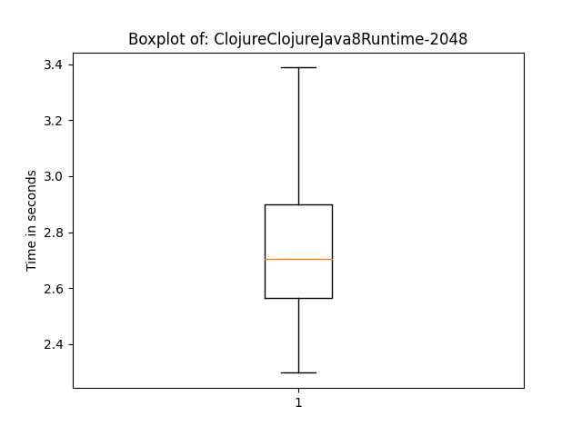
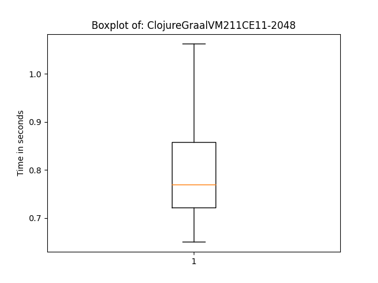
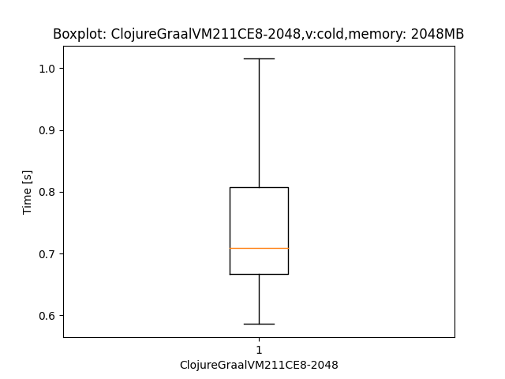
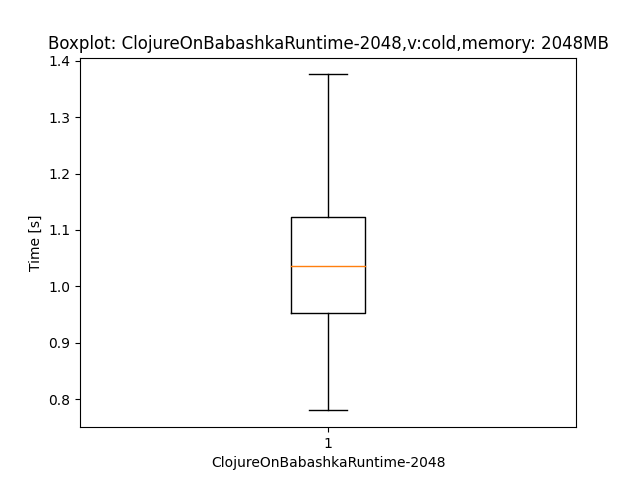
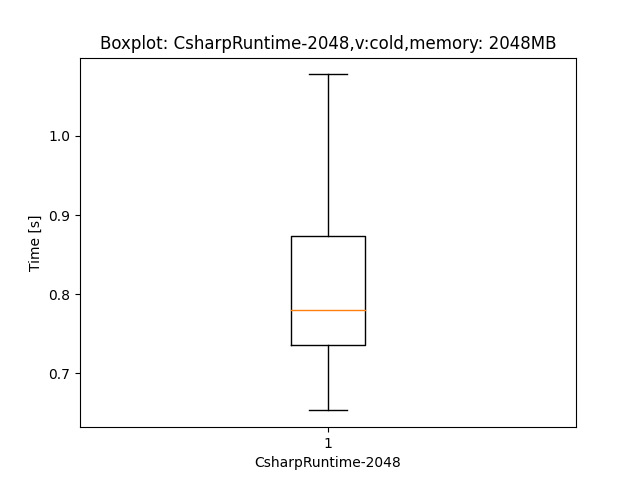
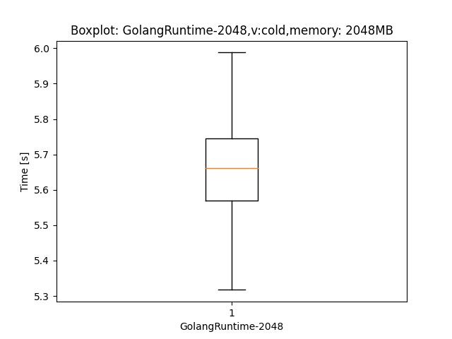
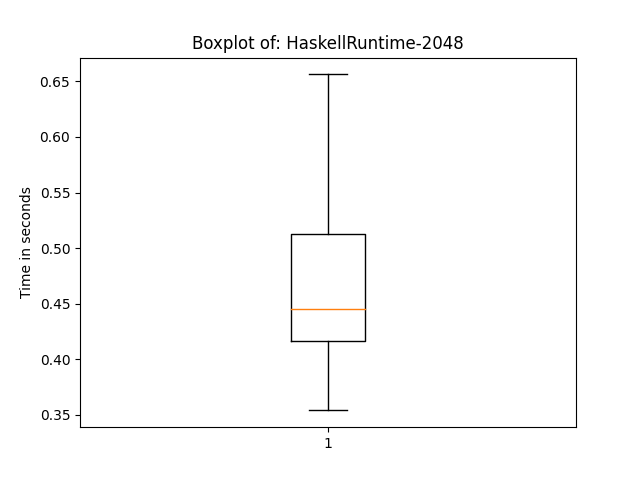
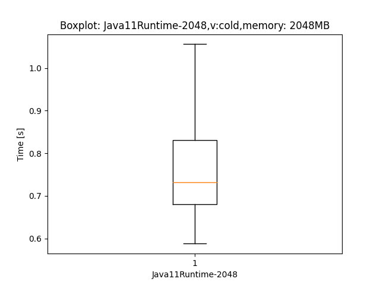
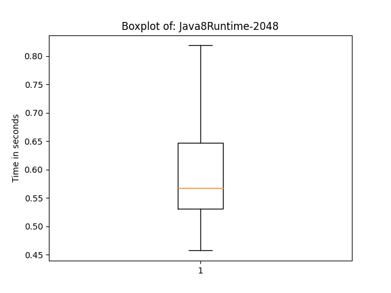
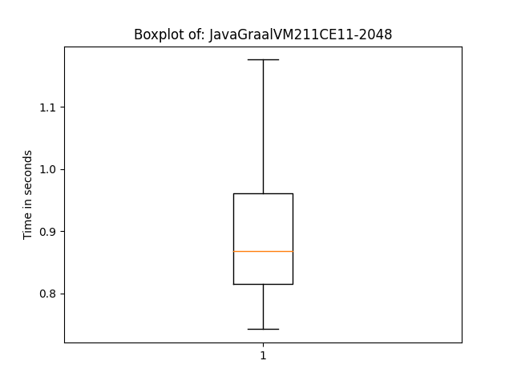
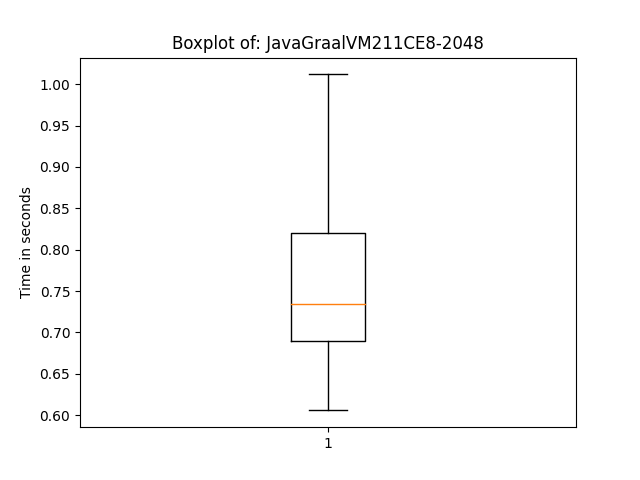
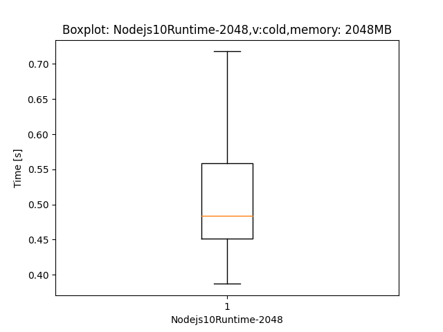
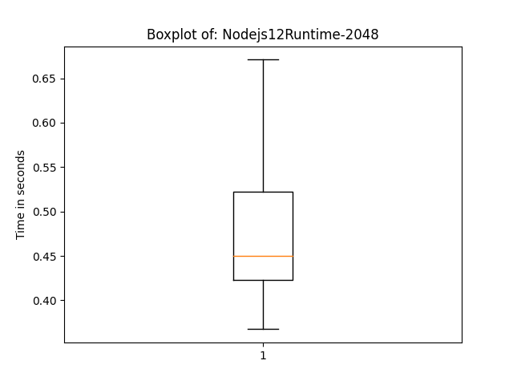
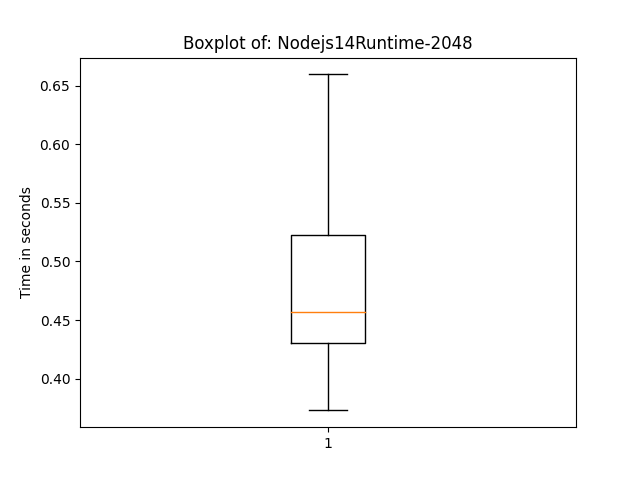
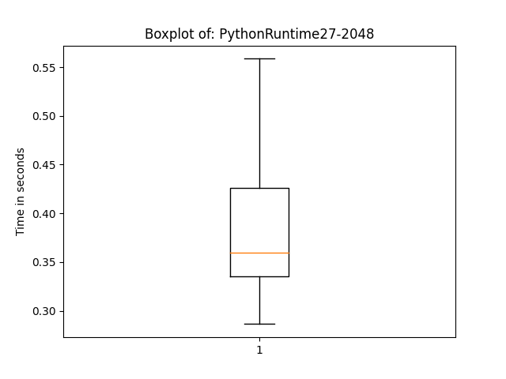
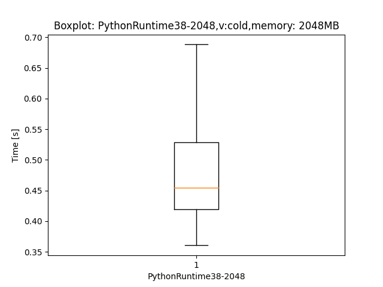
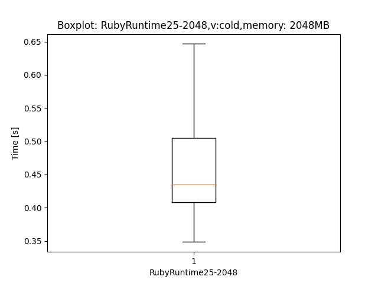
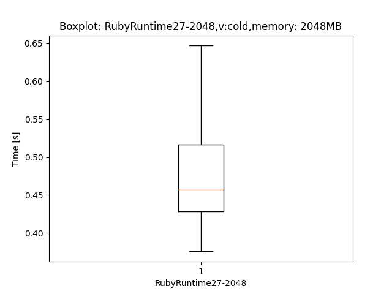
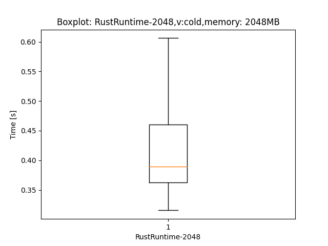

1.  Variant 2
    1.  Lambda with 128 MB of memory
        In the test two Clojure runtimes has been ignored: ClojureJava8Runtime, ClojureJava11Runtime.
        Runtimes has been ignored, because the memory size usage exceeds 128MB.
        1.  Basic statistics
            
            <table border="2" cellspacing="0" cellpadding="6" rules="groups" frame="hsides">
            
            
            <colgroup>
            <col  class="org-left" />
            
            <col  class="org-right" />
            
            <col  class="org-right" />
            
            <col  class="org-right" />
            
            <col  class="org-right" />
            
            <col  class="org-right" />
            
            <col  class="org-right" />
            
            <col  class="org-right" />
            
            <col  class="org-right" />
            </colgroup>
            <thead>
            <tr>
            <th scope="col" class="org-left">&#xa0;</th>
            <th scope="col" class="org-right">mean</th>
            <th scope="col" class="org-right">std</th>
            <th scope="col" class="org-right">min</th>
            <th scope="col" class="org-right">max</th>
            <th scope="col" class="org-right">25%</th>
            <th scope="col" class="org-right">50%</th>
            <th scope="col" class="org-right">75%</th>
            <th scope="col" class="org-right">status 200 in %</th>
            </tr>
            </thead>
            
            <tbody>
            <tr>
            <td class="org-left">ClojureClojureJava11Runtime-128</td>
            <td class="org-right">0.409623</td>
            <td class="org-right">0.131976</td>
            <td class="org-right">0.215051</td>
            <td class="org-right">1.04838</td>
            <td class="org-right">0.308431</td>
            <td class="org-right">0.376046</td>
            <td class="org-right">0.471229</td>
            <td class="org-right">100.0%</td>
            </tr>
            
            
            <tr>
            <td class="org-left">ClojureClojureJava8Runtime-128</td>
            <td class="org-right">0.345013</td>
            <td class="org-right">0.118742</td>
            <td class="org-right">0.186707</td>
            <td class="org-right">0.852571</td>
            <td class="org-right">0.260016</td>
            <td class="org-right">0.31512</td>
            <td class="org-right">0.383491</td>
            <td class="org-right">100.0%</td>
            </tr>
            
            
            <tr>
            <td class="org-left">ClojureGraalVM211CE11-128</td>
            <td class="org-right">0.314592</td>
            <td class="org-right">0.0985654</td>
            <td class="org-right">0.176572</td>
            <td class="org-right">0.67807</td>
            <td class="org-right">0.24015</td>
            <td class="org-right">0.294578</td>
            <td class="org-right">0.350466</td>
            <td class="org-right">100.0%</td>
            </tr>
            
            
            <tr>
            <td class="org-left">ClojureGraalVM211CE8-128</td>
            <td class="org-right">0.381741</td>
            <td class="org-right">0.109926</td>
            <td class="org-right">0.209035</td>
            <td class="org-right">0.762574</td>
            <td class="org-right">0.29564</td>
            <td class="org-right">0.347946</td>
            <td class="org-right">0.438217</td>
            <td class="org-right">100.0%</td>
            </tr>
            
            
            <tr>
            <td class="org-left">ClojureOnBabashkaRuntime-128</td>
            <td class="org-right">0.397423</td>
            <td class="org-right">0.123888</td>
            <td class="org-right">0.230038</td>
            <td class="org-right">0.805994</td>
            <td class="org-right">0.299951</td>
            <td class="org-right">0.355235</td>
            <td class="org-right">0.47283</td>
            <td class="org-right">100.0%</td>
            </tr>
            
            
            <tr>
            <td class="org-left">CsharpRuntime-128</td>
            <td class="org-right">0.373699</td>
            <td class="org-right">0.110121</td>
            <td class="org-right">0.195871</td>
            <td class="org-right">0.760379</td>
            <td class="org-right">0.292554</td>
            <td class="org-right">0.337778</td>
            <td class="org-right">0.428304</td>
            <td class="org-right">100.0%</td>
            </tr>
            
            
            <tr>
            <td class="org-left">GolangRuntime-128</td>
            <td class="org-right">0.349032</td>
            <td class="org-right">0.102157</td>
            <td class="org-right">0.18466</td>
            <td class="org-right">0.715566</td>
            <td class="org-right">0.274439</td>
            <td class="org-right">0.323318</td>
            <td class="org-right">0.393975</td>
            <td class="org-right">100.0%</td>
            </tr>
            
            
            <tr>
            <td class="org-left">HaskellRuntime-128</td>
            <td class="org-right">0.391532</td>
            <td class="org-right">0.117861</td>
            <td class="org-right">0.196142</td>
            <td class="org-right">0.818385</td>
            <td class="org-right">0.301454</td>
            <td class="org-right">0.354134</td>
            <td class="org-right">0.458263</td>
            <td class="org-right">100.0%</td>
            </tr>
            
            
            <tr>
            <td class="org-left">Java11Runtime-128</td>
            <td class="org-right">0.385189</td>
            <td class="org-right">0.114567</td>
            <td class="org-right">0.220015</td>
            <td class="org-right">0.784505</td>
            <td class="org-right">0.298269</td>
            <td class="org-right">0.351905</td>
            <td class="org-right">0.444632</td>
            <td class="org-right">100.0%</td>
            </tr>
            
            
            <tr>
            <td class="org-left">Java8Runtime-128</td>
            <td class="org-right">0.396991</td>
            <td class="org-right">0.125801</td>
            <td class="org-right">0.220176</td>
            <td class="org-right">0.844481</td>
            <td class="org-right">0.300706</td>
            <td class="org-right">0.357</td>
            <td class="org-right">0.469628</td>
            <td class="org-right">100.0%</td>
            </tr>
            
            
            <tr>
            <td class="org-left">JavaGraalVM211CE11-128</td>
            <td class="org-right">0.349619</td>
            <td class="org-right">0.10046</td>
            <td class="org-right">0.168313</td>
            <td class="org-right">0.704987</td>
            <td class="org-right">0.27676</td>
            <td class="org-right">0.322897</td>
            <td class="org-right">0.397004</td>
            <td class="org-right">100.0%</td>
            </tr>
            
            
            <tr>
            <td class="org-left">JavaGraalVM211CE8-128</td>
            <td class="org-right">0.313281</td>
            <td class="org-right">0.0978465</td>
            <td class="org-right">0.174512</td>
            <td class="org-right">0.665003</td>
            <td class="org-right">0.239271</td>
            <td class="org-right">0.292064</td>
            <td class="org-right">0.356829</td>
            <td class="org-right">100.0%</td>
            </tr>
            
            
            <tr>
            <td class="org-left">Nodejs10Runtime-128</td>
            <td class="org-right">0.376942</td>
            <td class="org-right">0.108515</td>
            <td class="org-right">0.185385</td>
            <td class="org-right">0.738734</td>
            <td class="org-right">0.29527</td>
            <td class="org-right">0.346398</td>
            <td class="org-right">0.437565</td>
            <td class="org-right">100.0%</td>
            </tr>
            
            
            <tr>
            <td class="org-left">Nodejs12Runtime-128</td>
            <td class="org-right">0.333955</td>
            <td class="org-right">0.101126</td>
            <td class="org-right">0.173551</td>
            <td class="org-right">0.695503</td>
            <td class="org-right">0.258111</td>
            <td class="org-right">0.310647</td>
            <td class="org-right">0.376544</td>
            <td class="org-right">100.0%</td>
            </tr>
            
            
            <tr>
            <td class="org-left">Nodejs14Runtime-128</td>
            <td class="org-right">0.351089</td>
            <td class="org-right">0.105506</td>
            <td class="org-right">0.189226</td>
            <td class="org-right">0.738632</td>
            <td class="org-right">0.274707</td>
            <td class="org-right">0.320379</td>
            <td class="org-right">0.404915</td>
            <td class="org-right">100.0%</td>
            </tr>
            
            
            <tr>
            <td class="org-left">PythonRuntime27-128</td>
            <td class="org-right">0.395043</td>
            <td class="org-right">0.120682</td>
            <td class="org-right">0.220718</td>
            <td class="org-right">0.818269</td>
            <td class="org-right">0.302052</td>
            <td class="org-right">0.357369</td>
            <td class="org-right">0.470531</td>
            <td class="org-right">100.0%</td>
            </tr>
            
            
            <tr>
            <td class="org-left">PythonRuntime38-128</td>
            <td class="org-right">0.308521</td>
            <td class="org-right">0.0986438</td>
            <td class="org-right">0.172125</td>
            <td class="org-right">0.678249</td>
            <td class="org-right">0.237116</td>
            <td class="org-right">0.283411</td>
            <td class="org-right">0.341932</td>
            <td class="org-right">100.0%</td>
            </tr>
            
            
            <tr>
            <td class="org-left">RubyRuntime25-128</td>
            <td class="org-right">0.35789</td>
            <td class="org-right">0.106725</td>
            <td class="org-right">0.185749</td>
            <td class="org-right">0.719243</td>
            <td class="org-right">0.28244</td>
            <td class="org-right">0.32592</td>
            <td class="org-right">0.414038</td>
            <td class="org-right">100.0%</td>
            </tr>
            
            
            <tr>
            <td class="org-left">RubyRuntime27-128</td>
            <td class="org-right">0.398041</td>
            <td class="org-right">0.124297</td>
            <td class="org-right">0.225129</td>
            <td class="org-right">0.821187</td>
            <td class="org-right">0.302054</td>
            <td class="org-right">0.353223</td>
            <td class="org-right">0.471031</td>
            <td class="org-right">100.0%</td>
            </tr>
            
            
            <tr>
            <td class="org-left">RustRuntime-128</td>
            <td class="org-right">0.34958</td>
            <td class="org-right">0.0998513</td>
            <td class="org-right">0.186196</td>
            <td class="org-right">0.707899</td>
            <td class="org-right">0.276292</td>
            <td class="org-right">0.321863</td>
            <td class="org-right">0.402452</td>
            <td class="org-right">100.0%</td>
            </tr>
            </tbody>
            </table>
        
        2.  Box plot
            **Boxplot all functions**
            None
            
            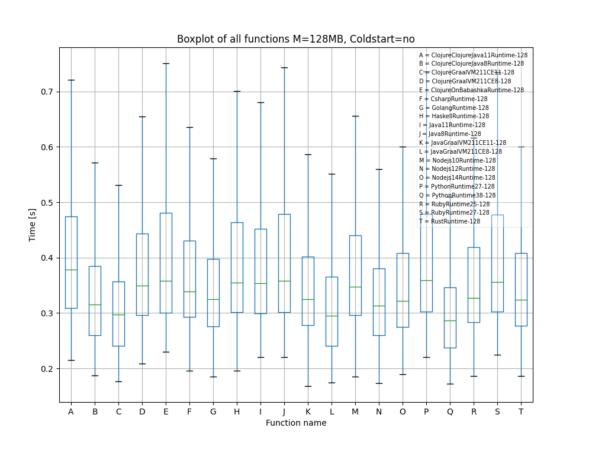
            
            **Individual boxplots**
             None
            
            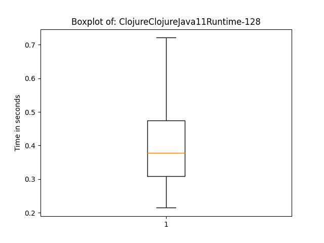
            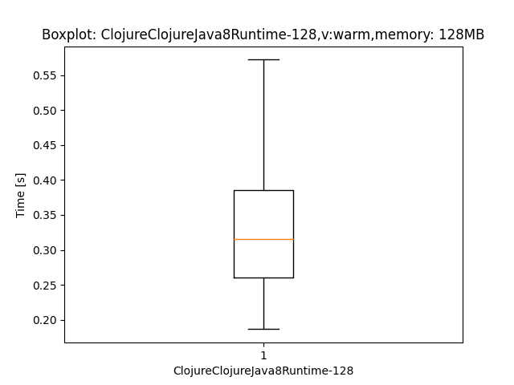
            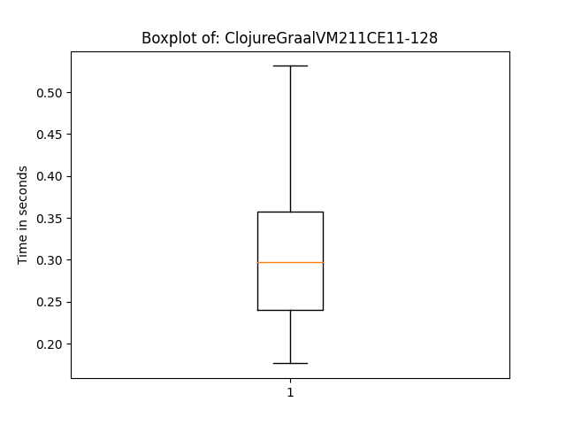
            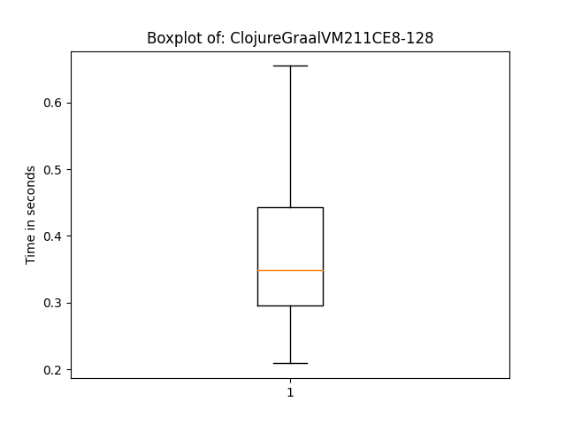
            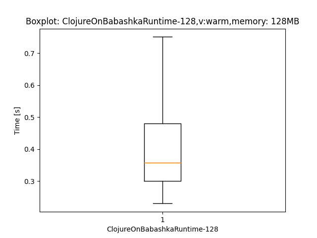
            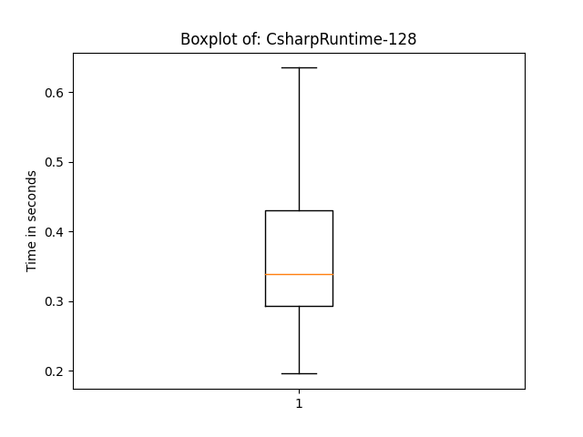
            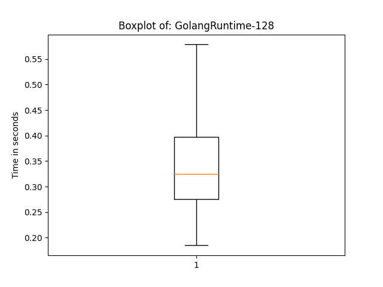
            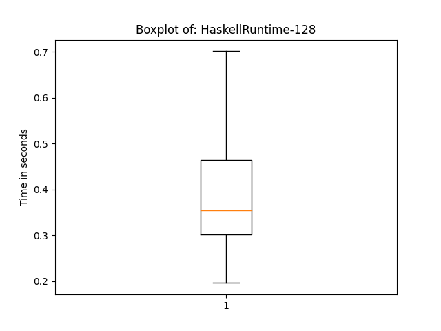
            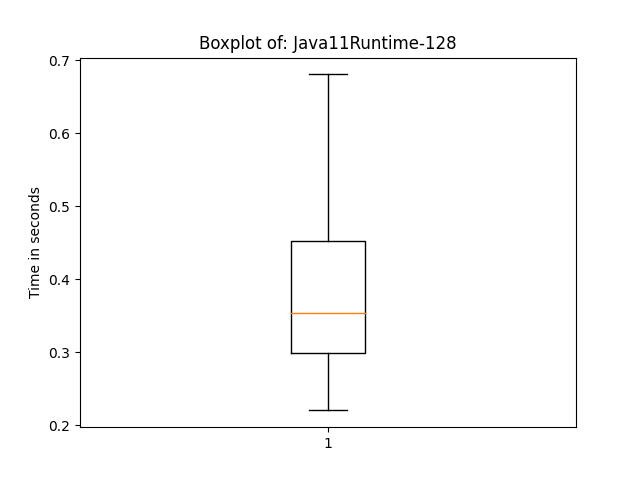
            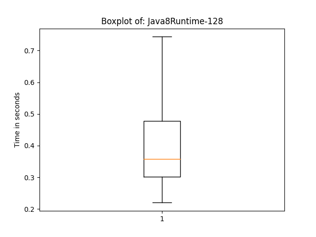
            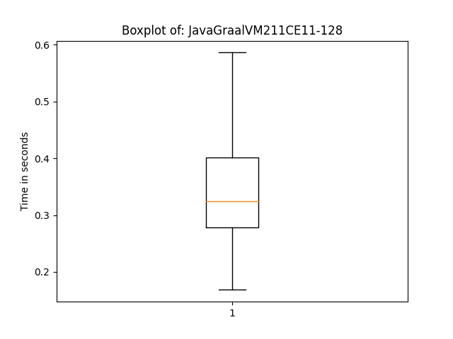
            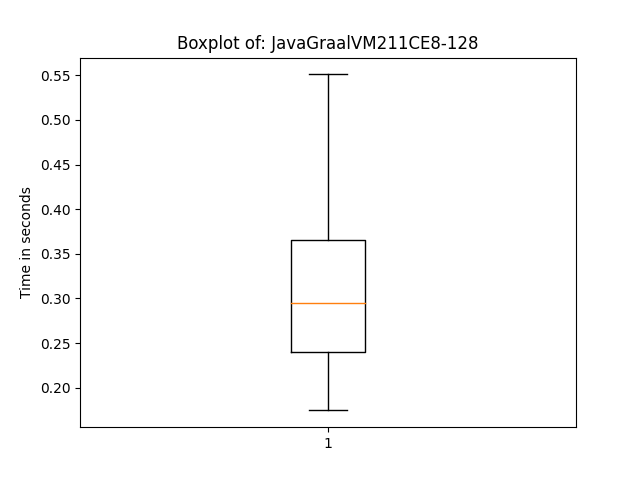
            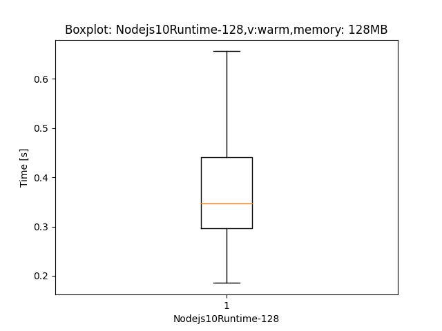
            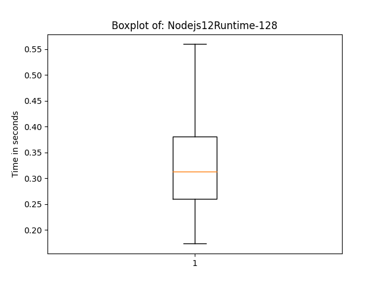
            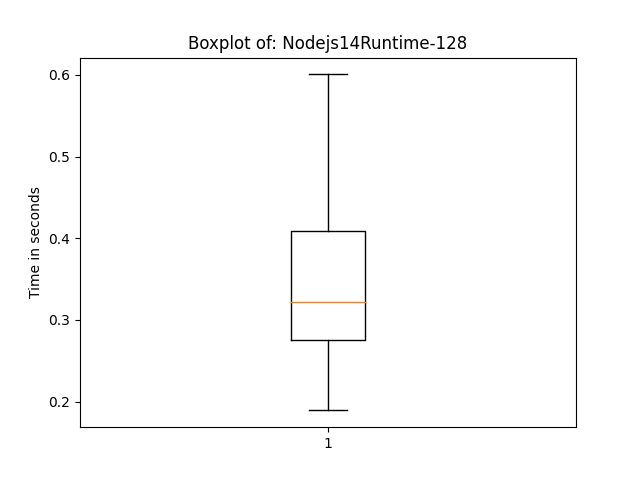
            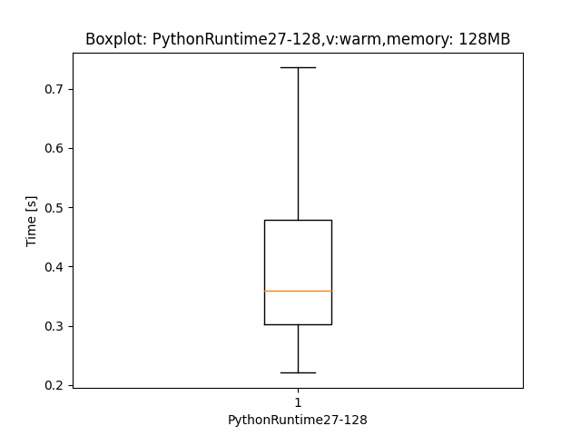
            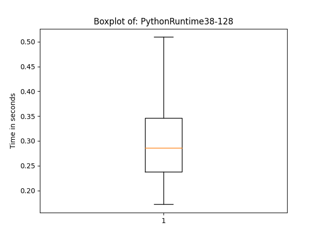
            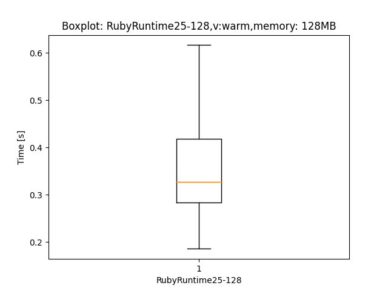
            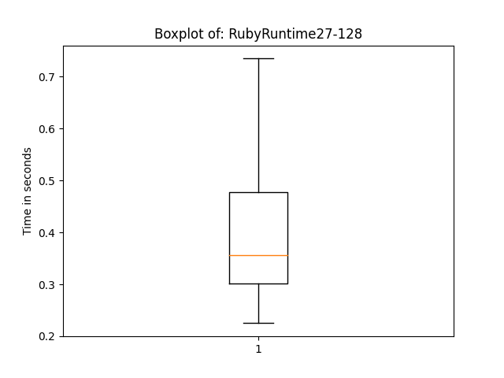
            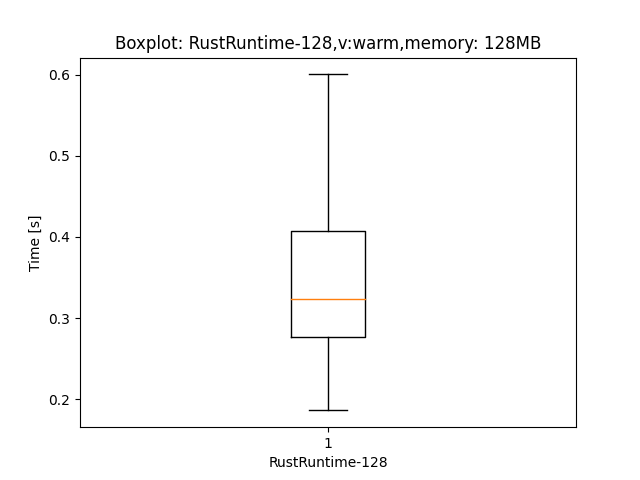
    
    2.  Lambda with 512 MB of memory
        In the test two Clojure runtimes has been ignored: ClojureJava8Runtime, ClojureJava11Runtime.
        Runtimes has been ignored, because the memory size usage exceeds 128MB.
        1.  Basic statistics
            
            <table border="2" cellspacing="0" cellpadding="6" rules="groups" frame="hsides">
            
            
            <colgroup>
            <col  class="org-left" />
            
            <col  class="org-right" />
            
            <col  class="org-right" />
            
            <col  class="org-right" />
            
            <col  class="org-right" />
            
            <col  class="org-right" />
            
            <col  class="org-right" />
            
            <col  class="org-right" />
            
            <col  class="org-right" />
            </colgroup>
            <thead>
            <tr>
            <th scope="col" class="org-left">&#xa0;</th>
            <th scope="col" class="org-right">mean</th>
            <th scope="col" class="org-right">std</th>
            <th scope="col" class="org-right">min</th>
            <th scope="col" class="org-right">max</th>
            <th scope="col" class="org-right">25%</th>
            <th scope="col" class="org-right">50%</th>
            <th scope="col" class="org-right">75%</th>
            <th scope="col" class="org-right">status 200 in %</th>
            </tr>
            </thead>
            
            <tbody>
            <tr>
            <td class="org-left">ClojureClojureJava11Runtime-512</td>
            <td class="org-right">0.345595</td>
            <td class="org-right">0.250042</td>
            <td class="org-right">0.168683</td>
            <td class="org-right">2.86832</td>
            <td class="org-right">0.243969</td>
            <td class="org-right">0.29259</td>
            <td class="org-right">0.357869</td>
            <td class="org-right">100.0%</td>
            </tr>
            
            
            <tr>
            <td class="org-left">ClojureClojureJava8Runtime-512</td>
            <td class="org-right">0.377682</td>
            <td class="org-right">0.225551</td>
            <td class="org-right">0.195085</td>
            <td class="org-right">2.77334</td>
            <td class="org-right">0.283594</td>
            <td class="org-right">0.324421</td>
            <td class="org-right">0.398108</td>
            <td class="org-right">100.0%</td>
            </tr>
            
            
            <tr>
            <td class="org-left">ClojureGraalVM211CE11-512</td>
            <td class="org-right">0.419601</td>
            <td class="org-right">0.271388</td>
            <td class="org-right">0.19965</td>
            <td class="org-right">3.12542</td>
            <td class="org-right">0.293992</td>
            <td class="org-right">0.335238</td>
            <td class="org-right">0.460203</td>
            <td class="org-right">100.0%</td>
            </tr>
            
            
            <tr>
            <td class="org-left">ClojureGraalVM211CE8-512</td>
            <td class="org-right">0.355002</td>
            <td class="org-right">0.21686</td>
            <td class="org-right">0.178936</td>
            <td class="org-right">2.79573</td>
            <td class="org-right">0.259776</td>
            <td class="org-right">0.306934</td>
            <td class="org-right">0.375495</td>
            <td class="org-right">100.0%</td>
            </tr>
            
            
            <tr>
            <td class="org-left">ClojureOnBabashkaRuntime-512</td>
            <td class="org-right">0.411181</td>
            <td class="org-right">0.271019</td>
            <td class="org-right">0.224945</td>
            <td class="org-right">3.11854</td>
            <td class="org-right">0.294913</td>
            <td class="org-right">0.334764</td>
            <td class="org-right">0.447194</td>
            <td class="org-right">100.0%</td>
            </tr>
            
            
            <tr>
            <td class="org-left">CsharpRuntime-512</td>
            <td class="org-right">0.367465</td>
            <td class="org-right">0.201332</td>
            <td class="org-right">0.171738</td>
            <td class="org-right">2.84555</td>
            <td class="org-right">0.275246</td>
            <td class="org-right">0.319581</td>
            <td class="org-right">0.383879</td>
            <td class="org-right">100.0%</td>
            </tr>
            
            
            <tr>
            <td class="org-left">GolangRuntime-512</td>
            <td class="org-right">0.405272</td>
            <td class="org-right">0.262439</td>
            <td class="org-right">0.205517</td>
            <td class="org-right">3.08258</td>
            <td class="org-right">0.2928</td>
            <td class="org-right">0.333025</td>
            <td class="org-right">0.435553</td>
            <td class="org-right">100.0%</td>
            </tr>
            
            
            <tr>
            <td class="org-left">HaskellRuntime-512</td>
            <td class="org-right">0.410056</td>
            <td class="org-right">0.260333</td>
            <td class="org-right">0.21777</td>
            <td class="org-right">3.07808</td>
            <td class="org-right">0.293731</td>
            <td class="org-right">0.335627</td>
            <td class="org-right">0.452697</td>
            <td class="org-right">100.0%</td>
            </tr>
            
            
            <tr>
            <td class="org-left">Java11Runtime-512</td>
            <td class="org-right">0.369097</td>
            <td class="org-right">0.212607</td>
            <td class="org-right">0.177341</td>
            <td class="org-right">2.60142</td>
            <td class="org-right">0.275549</td>
            <td class="org-right">0.314168</td>
            <td class="org-right">0.387015</td>
            <td class="org-right">100.0%</td>
            </tr>
            
            
            <tr>
            <td class="org-left">Java8Runtime-512</td>
            <td class="org-right">0.403535</td>
            <td class="org-right">0.223023</td>
            <td class="org-right">0.212648</td>
            <td class="org-right">2.74286</td>
            <td class="org-right">0.294634</td>
            <td class="org-right">0.336083</td>
            <td class="org-right">0.439583</td>
            <td class="org-right">100.0%</td>
            </tr>
            
            
            <tr>
            <td class="org-left">JavaGraalVM211CE11-512</td>
            <td class="org-right">0.412176</td>
            <td class="org-right">0.225363</td>
            <td class="org-right">0.220867</td>
            <td class="org-right">2.77571</td>
            <td class="org-right">0.294662</td>
            <td class="org-right">0.338276</td>
            <td class="org-right">0.468245</td>
            <td class="org-right">100.0%</td>
            </tr>
            
            
            <tr>
            <td class="org-left">JavaGraalVM211CE8-512</td>
            <td class="org-right">0.343314</td>
            <td class="org-right">0.259097</td>
            <td class="org-right">0.175806</td>
            <td class="org-right">2.9276</td>
            <td class="org-right">0.240725</td>
            <td class="org-right">0.290447</td>
            <td class="org-right">0.357102</td>
            <td class="org-right">100.0%</td>
            </tr>
            
            
            <tr>
            <td class="org-left">Nodejs10Runtime-512</td>
            <td class="org-right">0.348562</td>
            <td class="org-right">0.233213</td>
            <td class="org-right">0.177641</td>
            <td class="org-right">3.06136</td>
            <td class="org-right">0.256168</td>
            <td class="org-right">0.295141</td>
            <td class="org-right">0.359678</td>
            <td class="org-right">100.0%</td>
            </tr>
            
            
            <tr>
            <td class="org-left">Nodejs12Runtime-512</td>
            <td class="org-right">0.395855</td>
            <td class="org-right">0.253513</td>
            <td class="org-right">0.177947</td>
            <td class="org-right">2.98196</td>
            <td class="org-right">0.291148</td>
            <td class="org-right">0.329509</td>
            <td class="org-right">0.429247</td>
            <td class="org-right">100.0%</td>
            </tr>
            
            
            <tr>
            <td class="org-left">Nodejs14Runtime-512</td>
            <td class="org-right">0.415972</td>
            <td class="org-right">0.249329</td>
            <td class="org-right">0.220293</td>
            <td class="org-right">2.98149</td>
            <td class="org-right">0.294017</td>
            <td class="org-right">0.336998</td>
            <td class="org-right">0.471957</td>
            <td class="org-right">100.0%</td>
            </tr>
            
            
            <tr>
            <td class="org-left">PythonRuntime27-512</td>
            <td class="org-right">0.411323</td>
            <td class="org-right">0.235246</td>
            <td class="org-right">0.228823</td>
            <td class="org-right">2.85051</td>
            <td class="org-right">0.295199</td>
            <td class="org-right">0.336646</td>
            <td class="org-right">0.460445</td>
            <td class="org-right">100.0%</td>
            </tr>
            
            
            <tr>
            <td class="org-left">PythonRuntime38-512</td>
            <td class="org-right">0.347513</td>
            <td class="org-right">0.264469</td>
            <td class="org-right">0.185496</td>
            <td class="org-right">2.97312</td>
            <td class="org-right">0.245702</td>
            <td class="org-right">0.287651</td>
            <td class="org-right">0.355411</td>
            <td class="org-right">100.0%</td>
            </tr>
            
            
            <tr>
            <td class="org-left">RubyRuntime25-512</td>
            <td class="org-right">0.38029</td>
            <td class="org-right">0.252969</td>
            <td class="org-right">0.184142</td>
            <td class="org-right">2.95201</td>
            <td class="org-right">0.278143</td>
            <td class="org-right">0.317401</td>
            <td class="org-right">0.398079</td>
            <td class="org-right">100.0%</td>
            </tr>
            
            
            <tr>
            <td class="org-left">RubyRuntime27-512</td>
            <td class="org-right">0.378392</td>
            <td class="org-right">0.232686</td>
            <td class="org-right">0.190044</td>
            <td class="org-right">2.69756</td>
            <td class="org-right">0.282724</td>
            <td class="org-right">0.320444</td>
            <td class="org-right">0.394092</td>
            <td class="org-right">100.0%</td>
            </tr>
            
            
            <tr>
            <td class="org-left">RustRuntime-512</td>
            <td class="org-right">0.387028</td>
            <td class="org-right">0.258765</td>
            <td class="org-right">0.173775</td>
            <td class="org-right">3.09224</td>
            <td class="org-right">0.286154</td>
            <td class="org-right">0.324395</td>
            <td class="org-right">0.407642</td>
            <td class="org-right">100.0%</td>
            </tr>
            </tbody>
            </table>
        
        2.  Box plot
            None
            
            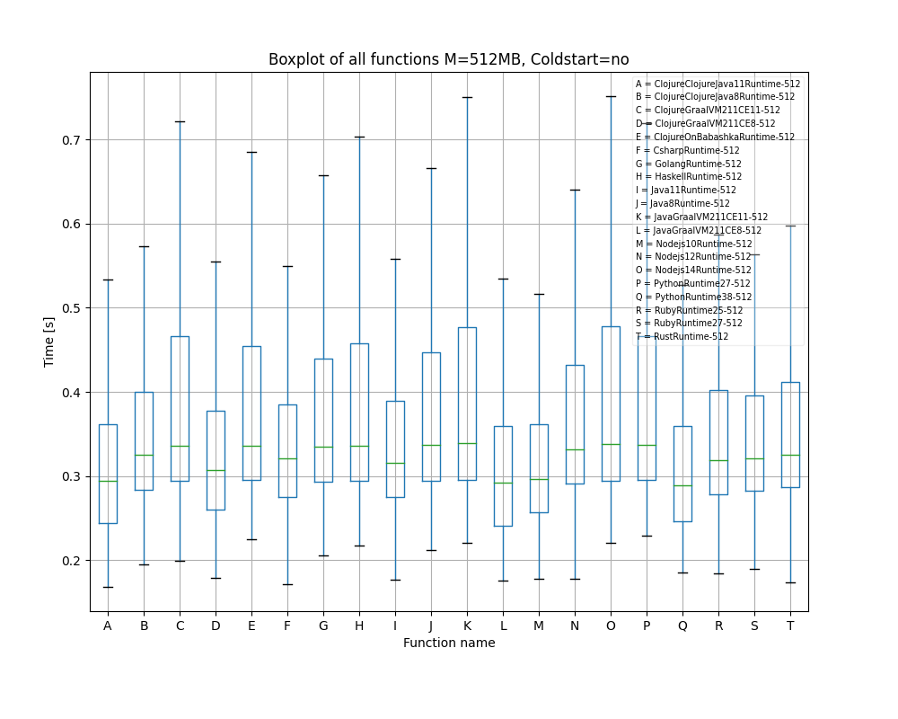
            
            **Individual boxplots**
             None
            
            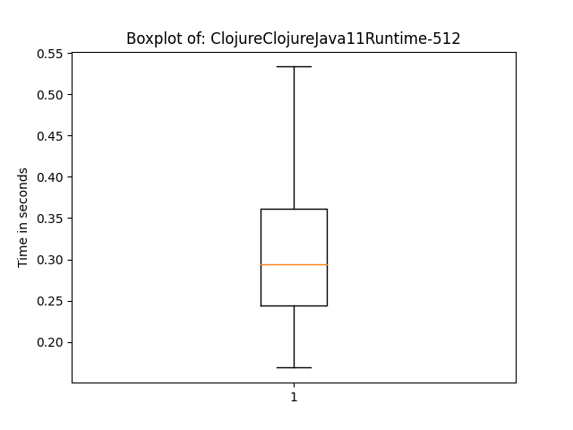
            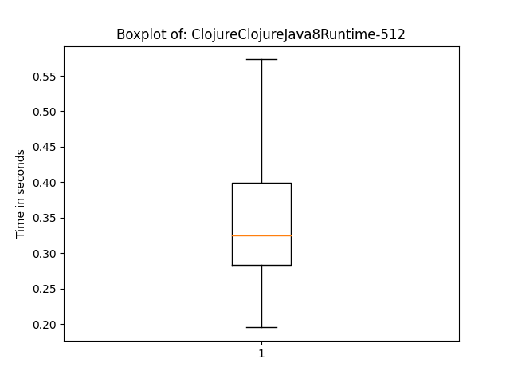
            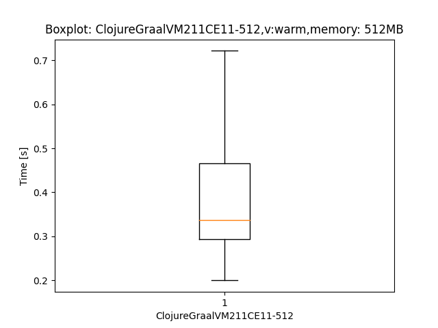
            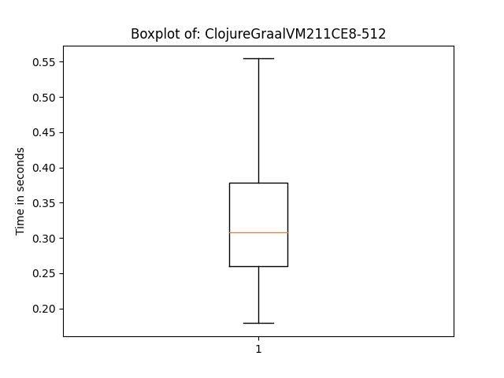
            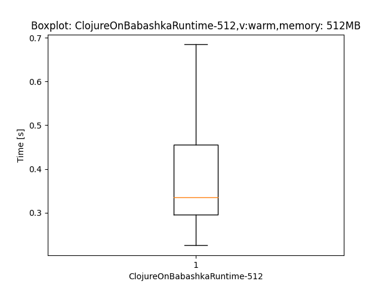
            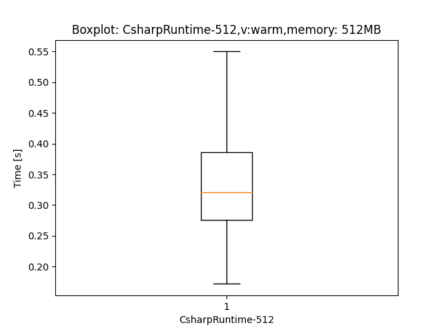
            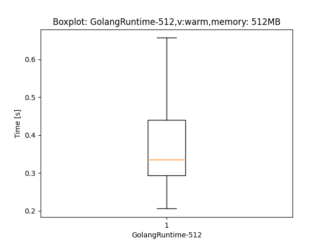
            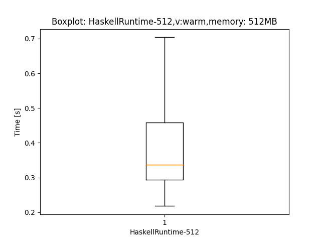
            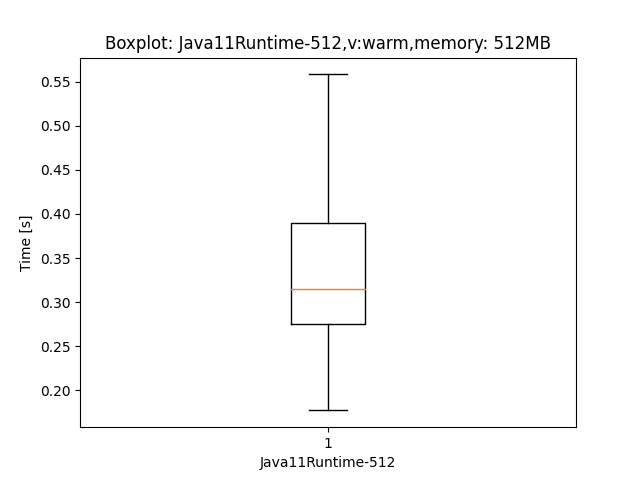
            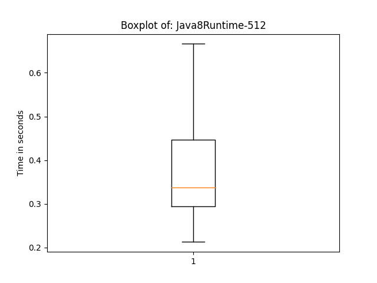
            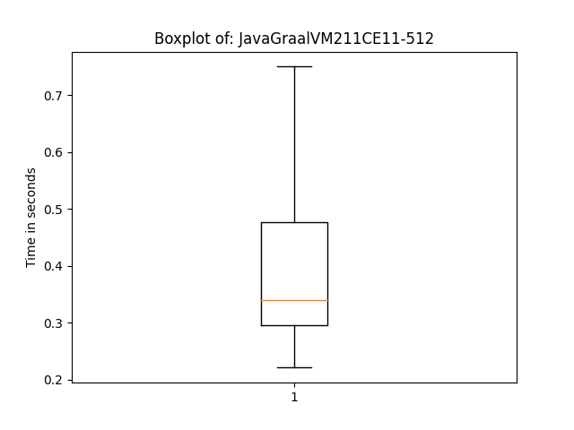
            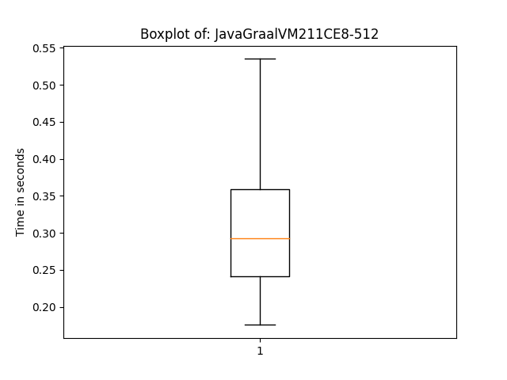
            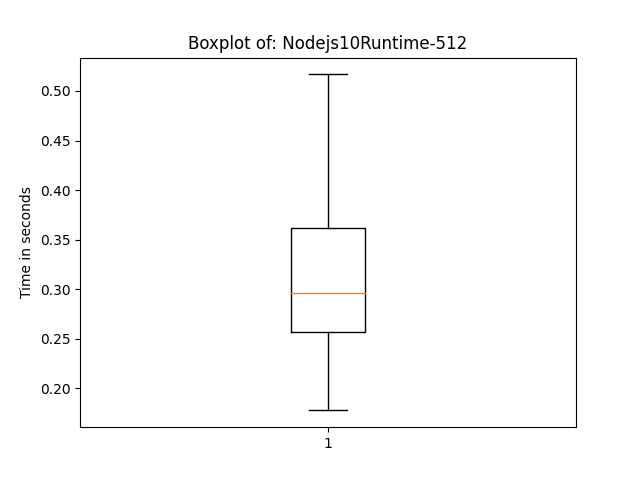
            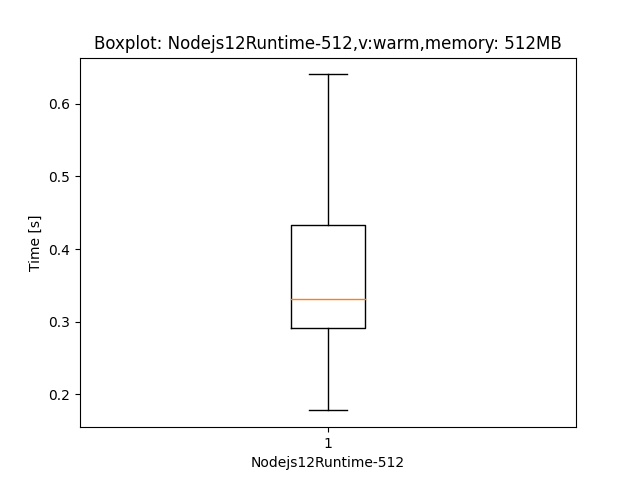
            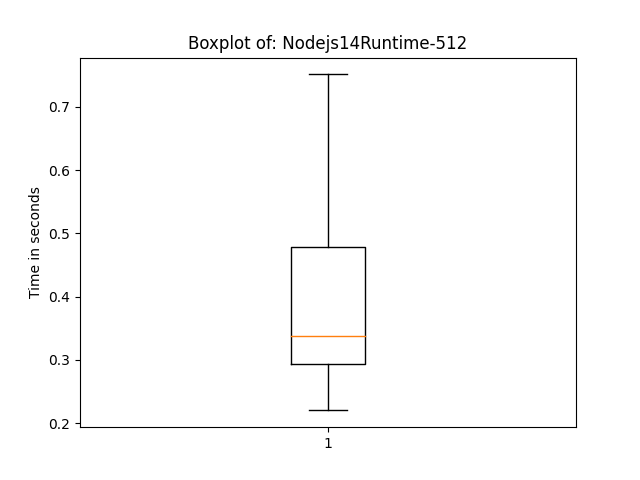
            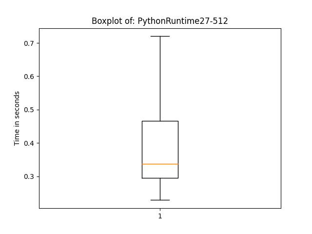
            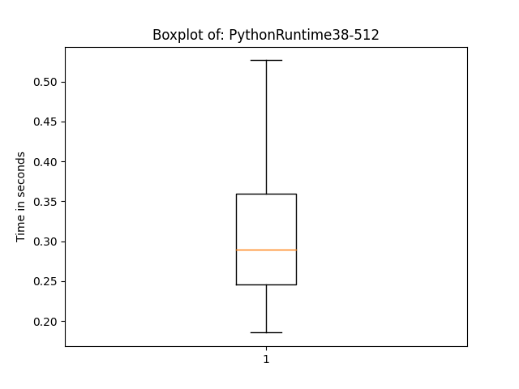
            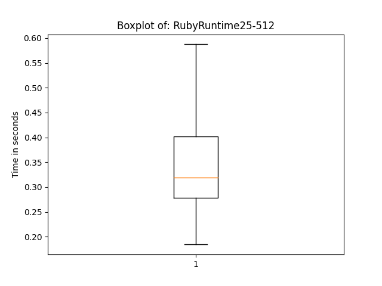
            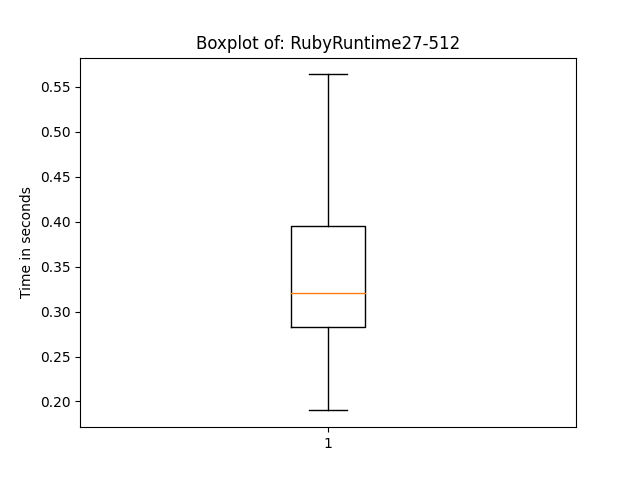
            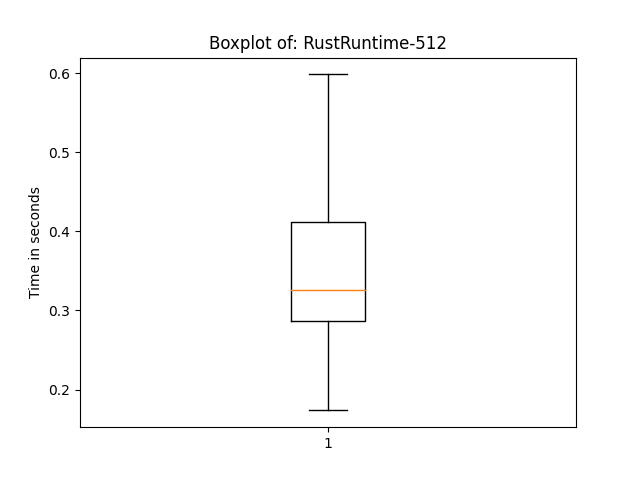
    
    3.  Lambda with 1024 MB of memory
        In the test two Clojure runtimes has been ignored: ClojureJava8Runtime, ClojureJava11Runtime.
        Runtimes has been ignored, because the memory size usage exceeds 128MB.
        1.  Basic statistics
            
            <table border="2" cellspacing="0" cellpadding="6" rules="groups" frame="hsides">
            
            
            <colgroup>
            <col  class="org-left" />
            
            <col  class="org-right" />
            
            <col  class="org-right" />
            
            <col  class="org-right" />
            
            <col  class="org-right" />
            
            <col  class="org-right" />
            
            <col  class="org-right" />
            
            <col  class="org-right" />
            
            <col  class="org-right" />
            </colgroup>
            <thead>
            <tr>
            <th scope="col" class="org-left">&#xa0;</th>
            <th scope="col" class="org-right">mean</th>
            <th scope="col" class="org-right">std</th>
            <th scope="col" class="org-right">min</th>
            <th scope="col" class="org-right">max</th>
            <th scope="col" class="org-right">25%</th>
            <th scope="col" class="org-right">50%</th>
            <th scope="col" class="org-right">75%</th>
            <th scope="col" class="org-right">status 200 in %</th>
            </tr>
            </thead>
            
            <tbody>
            <tr>
            <td class="org-left">ClojureClojureJava11Runtime-1024</td>
            <td class="org-right">0.432127</td>
            <td class="org-right">0.285062</td>
            <td class="org-right">0.205129</td>
            <td class="org-right">3.12507</td>
            <td class="org-right">0.300108</td>
            <td class="org-right">0.358199</td>
            <td class="org-right">0.475639</td>
            <td class="org-right">100.0%</td>
            </tr>
            
            
            <tr>
            <td class="org-left">ClojureClojureJava8Runtime-1024</td>
            <td class="org-right">0.43599</td>
            <td class="org-right">0.269754</td>
            <td class="org-right">0.19828</td>
            <td class="org-right">2.93968</td>
            <td class="org-right">0.301937</td>
            <td class="org-right">0.366572</td>
            <td class="org-right">0.487283</td>
            <td class="org-right">100.0%</td>
            </tr>
            
            
            <tr>
            <td class="org-left">ClojureGraalVM211CE11-1024</td>
            <td class="org-right">0.438272</td>
            <td class="org-right">0.284175</td>
            <td class="org-right">0.210076</td>
            <td class="org-right">3.28233</td>
            <td class="org-right">0.299686</td>
            <td class="org-right">0.362376</td>
            <td class="org-right">0.499641</td>
            <td class="org-right">100.0%</td>
            </tr>
            
            
            <tr>
            <td class="org-left">ClojureGraalVM211CE8-1024</td>
            <td class="org-right">0.417708</td>
            <td class="org-right">0.280422</td>
            <td class="org-right">0.191196</td>
            <td class="org-right">3.07499</td>
            <td class="org-right">0.294984</td>
            <td class="org-right">0.344799</td>
            <td class="org-right">0.445701</td>
            <td class="org-right">100.0%</td>
            </tr>
            
            
            <tr>
            <td class="org-left">ClojureOnBabashkaRuntime-1024</td>
            <td class="org-right">0.416888</td>
            <td class="org-right">0.265451</td>
            <td class="org-right">0.215563</td>
            <td class="org-right">3.32148</td>
            <td class="org-right">0.293608</td>
            <td class="org-right">0.350574</td>
            <td class="org-right">0.452661</td>
            <td class="org-right">100.0%</td>
            </tr>
            
            
            <tr>
            <td class="org-left">CsharpRuntime-1024</td>
            <td class="org-right">0.439793</td>
            <td class="org-right">0.292734</td>
            <td class="org-right">0.216186</td>
            <td class="org-right">3.56019</td>
            <td class="org-right">0.300652</td>
            <td class="org-right">0.364888</td>
            <td class="org-right">0.488173</td>
            <td class="org-right">100.0%</td>
            </tr>
            
            
            <tr>
            <td class="org-left">GolangRuntime-1024</td>
            <td class="org-right">0.387789</td>
            <td class="org-right">0.268458</td>
            <td class="org-right">0.166632</td>
            <td class="org-right">2.8602</td>
            <td class="org-right">0.2739</td>
            <td class="org-right">0.328098</td>
            <td class="org-right">0.401681</td>
            <td class="org-right">100.0%</td>
            </tr>
            
            
            <tr>
            <td class="org-left">HaskellRuntime-1024</td>
            <td class="org-right">0.370154</td>
            <td class="org-right">0.261493</td>
            <td class="org-right">0.179338</td>
            <td class="org-right">2.90397</td>
            <td class="org-right">0.261339</td>
            <td class="org-right">0.311896</td>
            <td class="org-right">0.384603</td>
            <td class="org-right">100.0%</td>
            </tr>
            
            
            <tr>
            <td class="org-left">Java11Runtime-1024</td>
            <td class="org-right">0.349385</td>
            <td class="org-right">0.266785</td>
            <td class="org-right">0.166739</td>
            <td class="org-right">2.97486</td>
            <td class="org-right">0.237486</td>
            <td class="org-right">0.286</td>
            <td class="org-right">0.363604</td>
            <td class="org-right">100.0%</td>
            </tr>
            
            
            <tr>
            <td class="org-left">Java8Runtime-1024</td>
            <td class="org-right">0.387167</td>
            <td class="org-right">0.237501</td>
            <td class="org-right">0.177014</td>
            <td class="org-right">3.10073</td>
            <td class="org-right">0.280014</td>
            <td class="org-right">0.33039</td>
            <td class="org-right">0.417858</td>
            <td class="org-right">100.0%</td>
            </tr>
            
            
            <tr>
            <td class="org-left">JavaGraalVM211CE11-1024</td>
            <td class="org-right">0.352983</td>
            <td class="org-right">0.282517</td>
            <td class="org-right">0.165924</td>
            <td class="org-right">2.98187</td>
            <td class="org-right">0.238749</td>
            <td class="org-right">0.292596</td>
            <td class="org-right">0.367328</td>
            <td class="org-right">100.0%</td>
            </tr>
            
            
            <tr>
            <td class="org-left">JavaGraalVM211CE8-1024</td>
            <td class="org-right">0.352259</td>
            <td class="org-right">0.232738</td>
            <td class="org-right">0.182647</td>
            <td class="org-right">2.64087</td>
            <td class="org-right">0.244883</td>
            <td class="org-right">0.292646</td>
            <td class="org-right">0.368703</td>
            <td class="org-right">100.0%</td>
            </tr>
            
            
            <tr>
            <td class="org-left">Nodejs10Runtime-1024</td>
            <td class="org-right">0.352894</td>
            <td class="org-right">0.2855</td>
            <td class="org-right">0.177752</td>
            <td class="org-right">2.94522</td>
            <td class="org-right">0.234733</td>
            <td class="org-right">0.281288</td>
            <td class="org-right">0.364609</td>
            <td class="org-right">100.0%</td>
            </tr>
            
            
            <tr>
            <td class="org-left">Nodejs12Runtime-1024</td>
            <td class="org-right">0.42402</td>
            <td class="org-right">0.265864</td>
            <td class="org-right">0.201416</td>
            <td class="org-right">3.07049</td>
            <td class="org-right">0.297752</td>
            <td class="org-right">0.356238</td>
            <td class="org-right">0.4683</td>
            <td class="org-right">100.0%</td>
            </tr>
            
            
            <tr>
            <td class="org-left">Nodejs14Runtime-1024</td>
            <td class="org-right">0.382717</td>
            <td class="org-right">0.256422</td>
            <td class="org-right">0.170008</td>
            <td class="org-right">3.25043</td>
            <td class="org-right">0.27189</td>
            <td class="org-right">0.326837</td>
            <td class="org-right">0.405751</td>
            <td class="org-right">100.0%</td>
            </tr>
            
            
            <tr>
            <td class="org-left">PythonRuntime27-1024</td>
            <td class="org-right">0.447556</td>
            <td class="org-right">0.309027</td>
            <td class="org-right">0.230619</td>
            <td class="org-right">3.06274</td>
            <td class="org-right">0.300828</td>
            <td class="org-right">0.365965</td>
            <td class="org-right">0.497362</td>
            <td class="org-right">100.0%</td>
            </tr>
            
            
            <tr>
            <td class="org-left">PythonRuntime38-1024</td>
            <td class="org-right">0.428233</td>
            <td class="org-right">0.271039</td>
            <td class="org-right">0.209916</td>
            <td class="org-right">2.84926</td>
            <td class="org-right">0.296185</td>
            <td class="org-right">0.35399</td>
            <td class="org-right">0.470179</td>
            <td class="org-right">100.0%</td>
            </tr>
            
            
            <tr>
            <td class="org-left">RubyRuntime25-1024</td>
            <td class="org-right">0.37339</td>
            <td class="org-right">0.221114</td>
            <td class="org-right">0.180803</td>
            <td class="org-right">2.74568</td>
            <td class="org-right">0.274284</td>
            <td class="org-right">0.322558</td>
            <td class="org-right">0.393941</td>
            <td class="org-right">100.0%</td>
            </tr>
            
            
            <tr>
            <td class="org-left">RubyRuntime27-1024</td>
            <td class="org-right">0.436283</td>
            <td class="org-right">0.283512</td>
            <td class="org-right">0.198071</td>
            <td class="org-right">3.10114</td>
            <td class="org-right">0.299364</td>
            <td class="org-right">0.361992</td>
            <td class="org-right">0.482593</td>
            <td class="org-right">100.0%</td>
            </tr>
            
            
            <tr>
            <td class="org-left">RustRuntime-1024</td>
            <td class="org-right">0.40419</td>
            <td class="org-right">0.266298</td>
            <td class="org-right">0.16962</td>
            <td class="org-right">2.86381</td>
            <td class="org-right">0.285565</td>
            <td class="org-right">0.33571</td>
            <td class="org-right">0.433258</td>
            <td class="org-right">100.0%</td>
            </tr>
            </tbody>
            </table>
        
        2.  Box plot
            None
            
            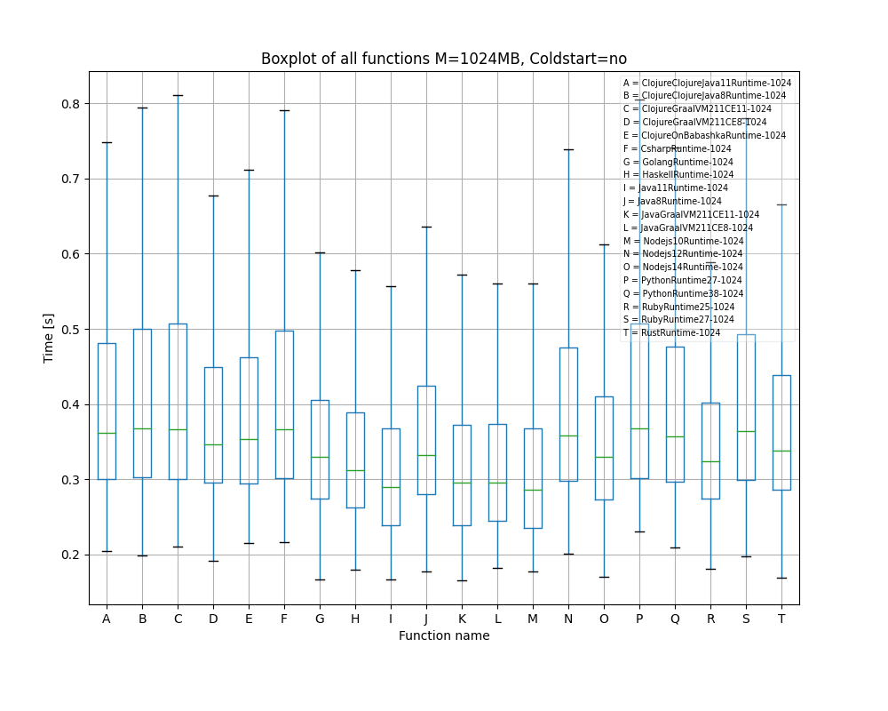
            
            **Individual boxplots**
             None
            
            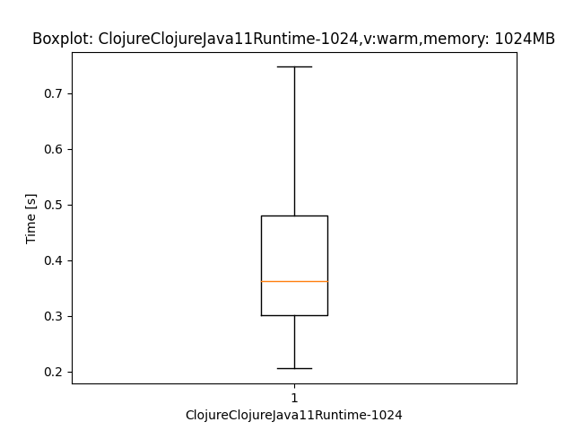
            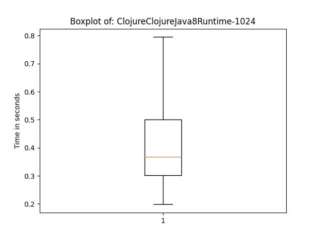
            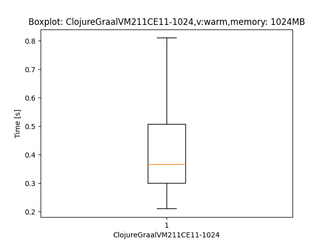
            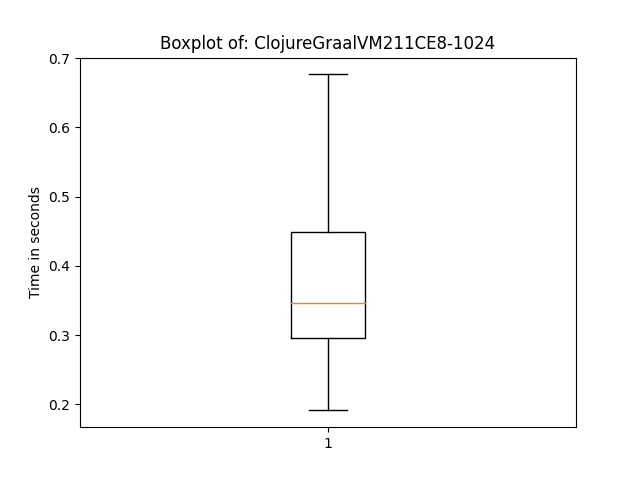
            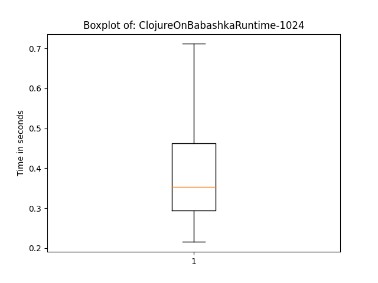
            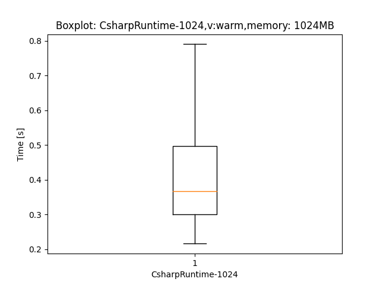
            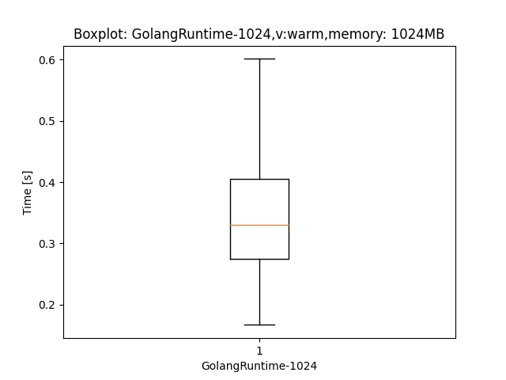
            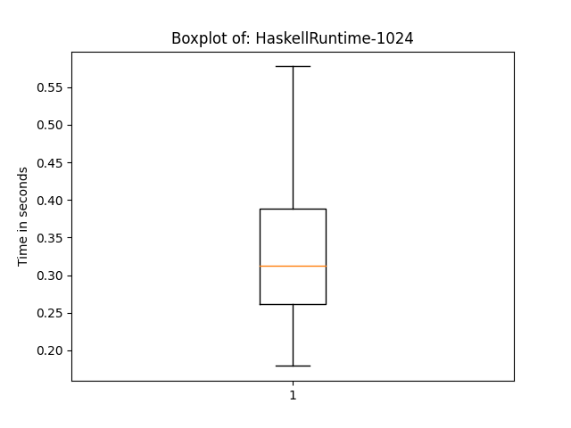
            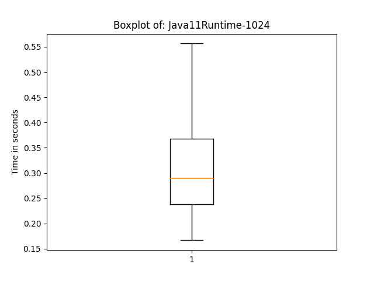
            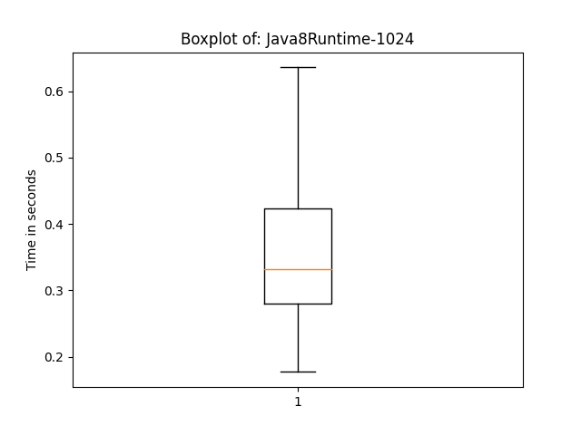
            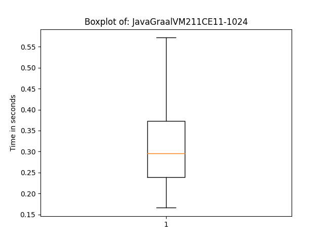
            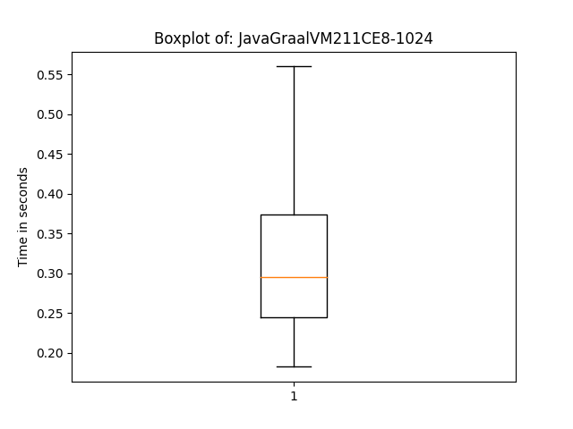
            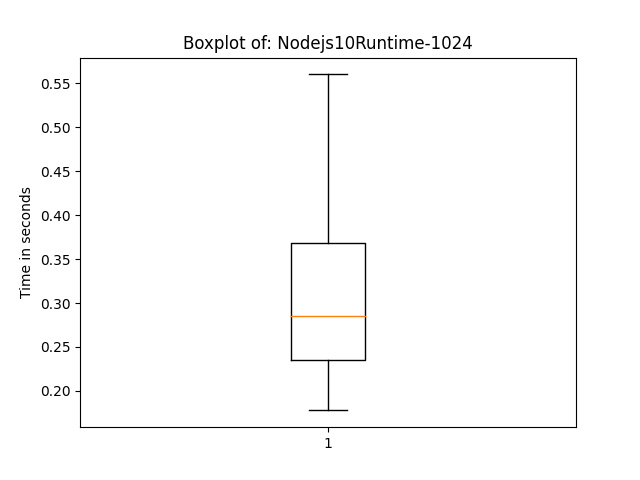
            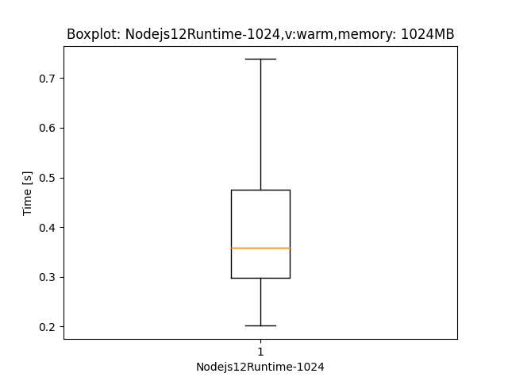
            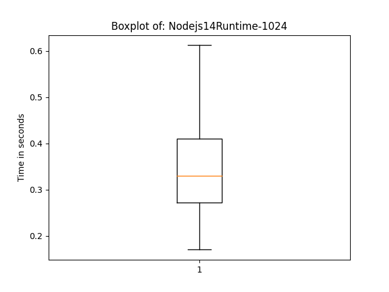
            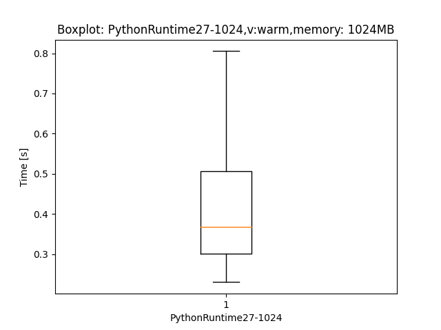
            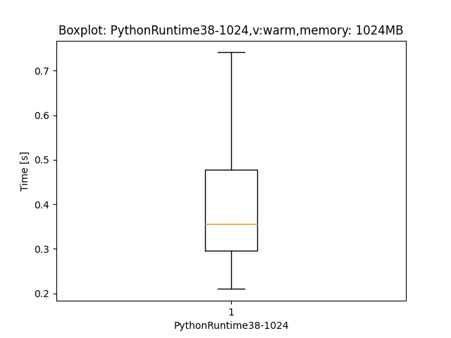
            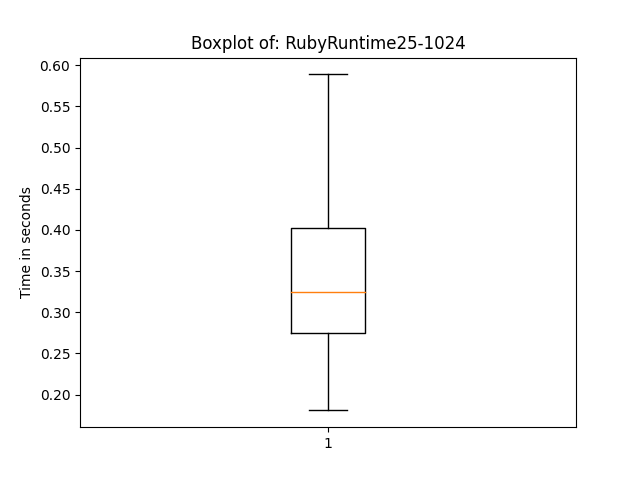
            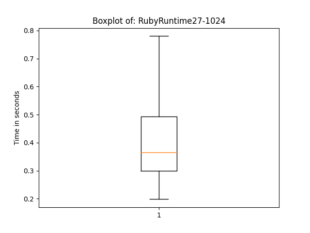
            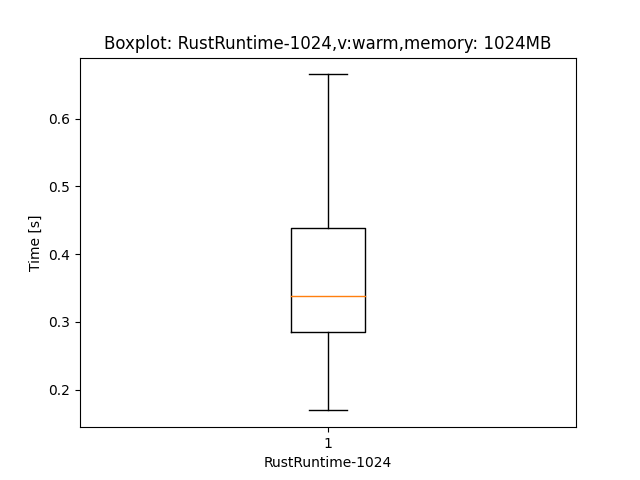
    
    4.  Lambda with 2048 MB of memory
        All possible runtimes are included.
        1.  Basic statistics
            
            <table border="2" cellspacing="0" cellpadding="6" rules="groups" frame="hsides">
            
            
            <colgroup>
            <col  class="org-left" />
            
            <col  class="org-right" />
            
            <col  class="org-right" />
            
            <col  class="org-right" />
            
            <col  class="org-right" />
            
            <col  class="org-right" />
            
            <col  class="org-right" />
            
            <col  class="org-right" />
            
            <col  class="org-right" />
            </colgroup>
            <thead>
            <tr>
            <th scope="col" class="org-left">&#xa0;</th>
            <th scope="col" class="org-right">mean</th>
            <th scope="col" class="org-right">std</th>
            <th scope="col" class="org-right">min</th>
            <th scope="col" class="org-right">max</th>
            <th scope="col" class="org-right">25%</th>
            <th scope="col" class="org-right">50%</th>
            <th scope="col" class="org-right">75%</th>
            <th scope="col" class="org-right">status 200 in %</th>
            </tr>
            </thead>
            
            <tbody>
            <tr>
            <td class="org-left">ClojureClojureJava11Runtime-2048</td>
            <td class="org-right">0.314254</td>
            <td class="org-right">0.173658</td>
            <td class="org-right">0.177283</td>
            <td class="org-right">1.86213</td>
            <td class="org-right">0.229847</td>
            <td class="org-right">0.263339</td>
            <td class="org-right">0.344907</td>
            <td class="org-right">100.0%</td>
            </tr>
            
            
            <tr>
            <td class="org-left">ClojureClojureJava8Runtime-2048</td>
            <td class="org-right">0.338547</td>
            <td class="org-right">0.178334</td>
            <td class="org-right">0.176469</td>
            <td class="org-right">1.83561</td>
            <td class="org-right">0.246416</td>
            <td class="org-right">0.294489</td>
            <td class="org-right">0.368763</td>
            <td class="org-right">100.0%</td>
            </tr>
            
            
            <tr>
            <td class="org-left">ClojureGraalVM211CE11-2048</td>
            <td class="org-right">0.357099</td>
            <td class="org-right">0.176687</td>
            <td class="org-right">0.184323</td>
            <td class="org-right">1.86161</td>
            <td class="org-right">0.259428</td>
            <td class="org-right">0.313767</td>
            <td class="org-right">0.391196</td>
            <td class="org-right">100.0%</td>
            </tr>
            
            
            <tr>
            <td class="org-left">ClojureGraalVM211CE8-2048</td>
            <td class="org-right">0.422863</td>
            <td class="org-right">0.196984</td>
            <td class="org-right">0.196153</td>
            <td class="org-right">2.08012</td>
            <td class="org-right">0.300137</td>
            <td class="org-right">0.360929</td>
            <td class="org-right">0.503868</td>
            <td class="org-right">100.0%</td>
            </tr>
            
            
            <tr>
            <td class="org-left">ClojureJava11Runtime-2048</td>
            <td class="org-right">0.410217</td>
            <td class="org-right">0.186492</td>
            <td class="org-right">0.195789</td>
            <td class="org-right">1.70386</td>
            <td class="org-right">0.299893</td>
            <td class="org-right">0.355002</td>
            <td class="org-right">0.470302</td>
            <td class="org-right">100.0%</td>
            </tr>
            
            
            <tr>
            <td class="org-left">ClojureJava8Runtime-2048</td>
            <td class="org-right">0.325731</td>
            <td class="org-right">0.182345</td>
            <td class="org-right">0.174838</td>
            <td class="org-right">1.75687</td>
            <td class="org-right">0.235691</td>
            <td class="org-right">0.27608</td>
            <td class="org-right">0.350901</td>
            <td class="org-right">100.0%</td>
            </tr>
            
            
            <tr>
            <td class="org-left">ClojureOnBabashkaRuntime-2048</td>
            <td class="org-right">0.418626</td>
            <td class="org-right">0.193175</td>
            <td class="org-right">0.205689</td>
            <td class="org-right">1.85453</td>
            <td class="org-right">0.297013</td>
            <td class="org-right">0.359824</td>
            <td class="org-right">0.495016</td>
            <td class="org-right">100.0%</td>
            </tr>
            
            
            <tr>
            <td class="org-left">CsharpRuntime-2048</td>
            <td class="org-right">0.350368</td>
            <td class="org-right">0.185161</td>
            <td class="org-right">0.175463</td>
            <td class="org-right">1.81377</td>
            <td class="org-right">0.254414</td>
            <td class="org-right">0.311627</td>
            <td class="org-right">0.381131</td>
            <td class="org-right">100.0%</td>
            </tr>
            
            
            <tr>
            <td class="org-left">GolangRuntime-2048</td>
            <td class="org-right">0.417937</td>
            <td class="org-right">0.186729</td>
            <td class="org-right">0.202071</td>
            <td class="org-right">2.30379</td>
            <td class="org-right">0.304326</td>
            <td class="org-right">0.359023</td>
            <td class="org-right">0.491642</td>
            <td class="org-right">100.0%</td>
            </tr>
            
            
            <tr>
            <td class="org-left">HaskellRuntime-2048</td>
            <td class="org-right">0.374945</td>
            <td class="org-right">0.186047</td>
            <td class="org-right">0.187635</td>
            <td class="org-right">1.8044</td>
            <td class="org-right">0.270406</td>
            <td class="org-right">0.328359</td>
            <td class="org-right">0.415904</td>
            <td class="org-right">100.0%</td>
            </tr>
            
            
            <tr>
            <td class="org-left">Java11Runtime-2048</td>
            <td class="org-right">0.378447</td>
            <td class="org-right">0.156282</td>
            <td class="org-right">0.192319</td>
            <td class="org-right">1.84507</td>
            <td class="org-right">0.28394</td>
            <td class="org-right">0.34071</td>
            <td class="org-right">0.431422</td>
            <td class="org-right">100.0%</td>
            </tr>
            
            
            <tr>
            <td class="org-left">Java8Runtime-2048</td>
            <td class="org-right">0.402119</td>
            <td class="org-right">0.199303</td>
            <td class="org-right">0.199057</td>
            <td class="org-right">1.88359</td>
            <td class="org-right">0.294693</td>
            <td class="org-right">0.345864</td>
            <td class="org-right">0.451657</td>
            <td class="org-right">100.0%</td>
            </tr>
            
            
            <tr>
            <td class="org-left">JavaGraalVM211CE11-2048</td>
            <td class="org-right">0.315651</td>
            <td class="org-right">0.165385</td>
            <td class="org-right">0.180786</td>
            <td class="org-right">1.90322</td>
            <td class="org-right">0.232486</td>
            <td class="org-right">0.265937</td>
            <td class="org-right">0.34716</td>
            <td class="org-right">100.0%</td>
            </tr>
            
            
            <tr>
            <td class="org-left">JavaGraalVM211CE8-2048</td>
            <td class="org-right">0.420017</td>
            <td class="org-right">0.202215</td>
            <td class="org-right">0.208138</td>
            <td class="org-right">1.93317</td>
            <td class="org-right">0.302561</td>
            <td class="org-right">0.362854</td>
            <td class="org-right">0.495174</td>
            <td class="org-right">100.0%</td>
            </tr>
            
            
            <tr>
            <td class="org-left">Nodejs10Runtime-2048</td>
            <td class="org-right">0.355216</td>
            <td class="org-right">0.156157</td>
            <td class="org-right">0.192288</td>
            <td class="org-right">1.7426</td>
            <td class="org-right">0.262274</td>
            <td class="org-right">0.318344</td>
            <td class="org-right">0.395808</td>
            <td class="org-right">100.0%</td>
            </tr>
            
            
            <tr>
            <td class="org-left">Nodejs12Runtime-2048</td>
            <td class="org-right">0.421017</td>
            <td class="org-right">0.194478</td>
            <td class="org-right">0.182593</td>
            <td class="org-right">1.75944</td>
            <td class="org-right">0.301289</td>
            <td class="org-right">0.364898</td>
            <td class="org-right">0.493348</td>
            <td class="org-right">100.0%</td>
            </tr>
            
            
            <tr>
            <td class="org-left">Nodejs14Runtime-2048</td>
            <td class="org-right">0.419276</td>
            <td class="org-right">0.191904</td>
            <td class="org-right">0.206474</td>
            <td class="org-right">1.79869</td>
            <td class="org-right">0.302992</td>
            <td class="org-right">0.36056</td>
            <td class="org-right">0.497988</td>
            <td class="org-right">100.0%</td>
            </tr>
            
            
            <tr>
            <td class="org-left">PythonRuntime27-2048</td>
            <td class="org-right">0.410085</td>
            <td class="org-right">0.176365</td>
            <td class="org-right">0.205783</td>
            <td class="org-right">1.70406</td>
            <td class="org-right">0.297199</td>
            <td class="org-right">0.356469</td>
            <td class="org-right">0.484367</td>
            <td class="org-right">100.0%</td>
            </tr>
            
            
            <tr>
            <td class="org-left">PythonRuntime38-2048</td>
            <td class="org-right">0.31559</td>
            <td class="org-right">0.176329</td>
            <td class="org-right">0.165965</td>
            <td class="org-right">1.80219</td>
            <td class="org-right">0.22828</td>
            <td class="org-right">0.261798</td>
            <td class="org-right">0.346369</td>
            <td class="org-right">100.0%</td>
            </tr>
            
            
            <tr>
            <td class="org-left">RubyRuntime25-2048</td>
            <td class="org-right">0.380975</td>
            <td class="org-right">0.18774</td>
            <td class="org-right">0.188393</td>
            <td class="org-right">1.79179</td>
            <td class="org-right">0.278037</td>
            <td class="org-right">0.334998</td>
            <td class="org-right">0.42265</td>
            <td class="org-right">100.0%</td>
            </tr>
            
            
            <tr>
            <td class="org-left">RubyRuntime27-2048</td>
            <td class="org-right">0.408132</td>
            <td class="org-right">0.19263</td>
            <td class="org-right">0.206305</td>
            <td class="org-right">1.81411</td>
            <td class="org-right">0.296032</td>
            <td class="org-right">0.353133</td>
            <td class="org-right">0.47057</td>
            <td class="org-right">100.0%</td>
            </tr>
            
            
            <tr>
            <td class="org-left">RustRuntime-2048</td>
            <td class="org-right">0.424372</td>
            <td class="org-right">0.193998</td>
            <td class="org-right">0.211139</td>
            <td class="org-right">1.93719</td>
            <td class="org-right">0.302968</td>
            <td class="org-right">0.365264</td>
            <td class="org-right">0.506106</td>
            <td class="org-right">100.0%</td>
            </tr>
            </tbody>
            </table>
        
        2.  Box plot
            None
            
            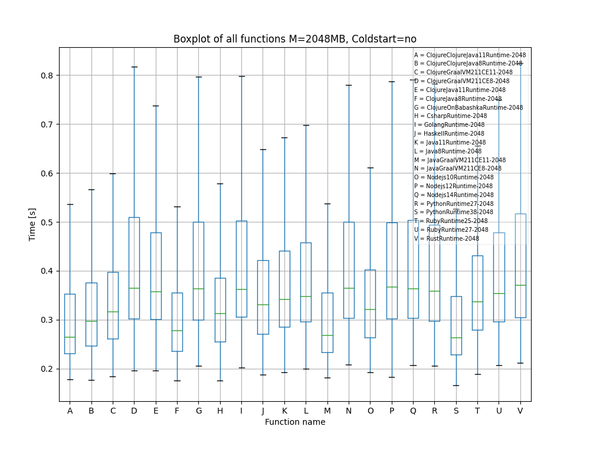
            
            **Individual boxplots**
             None
            
            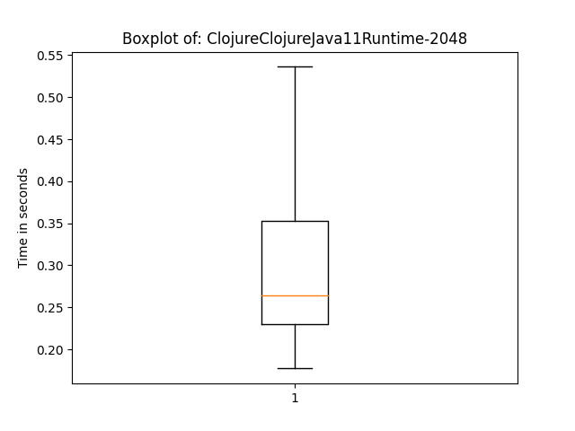
            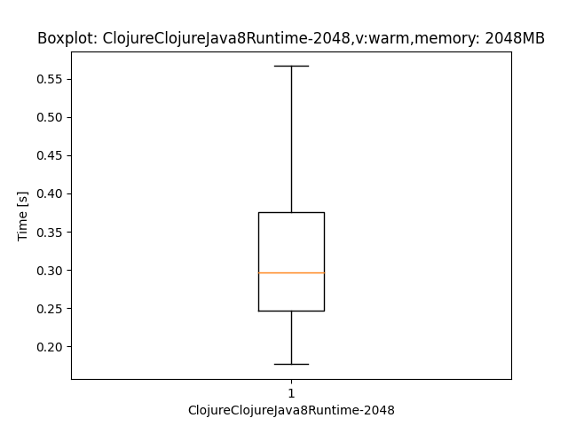
            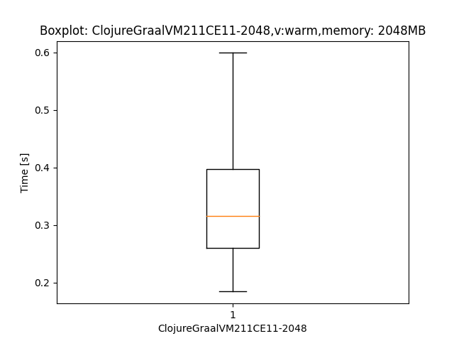
            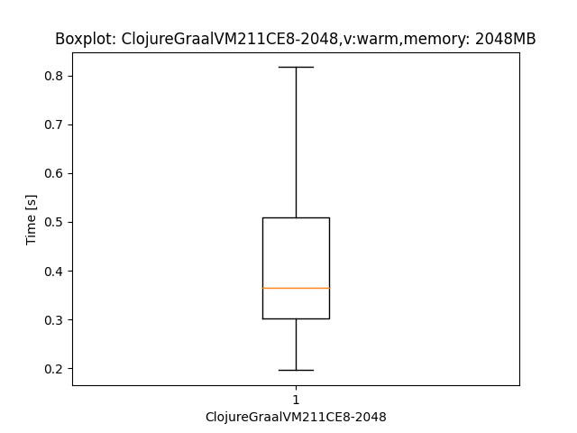
            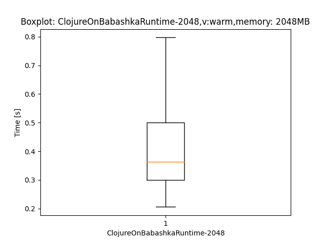
            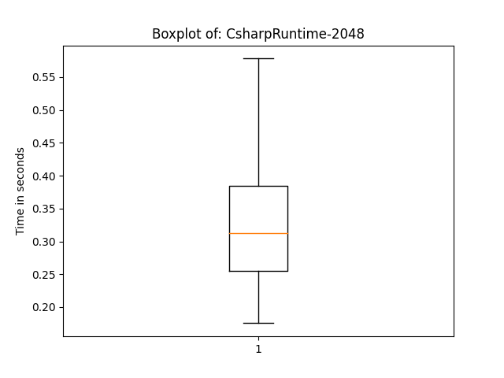
            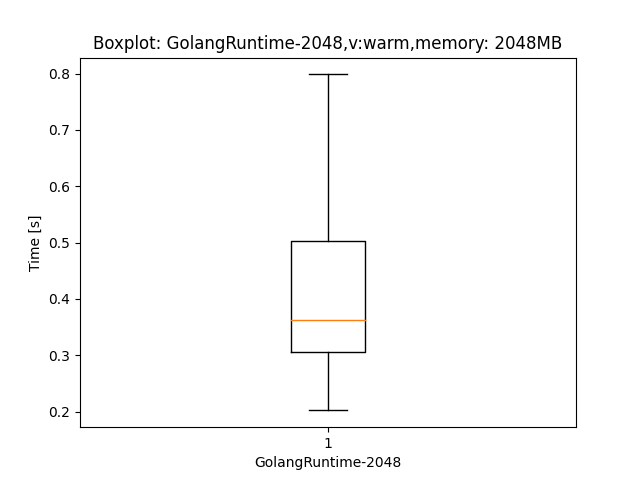
            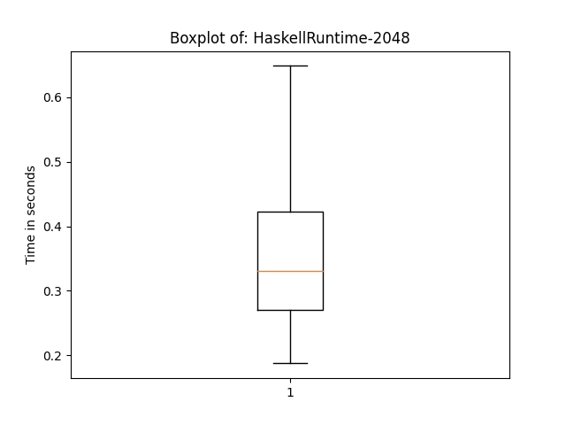
            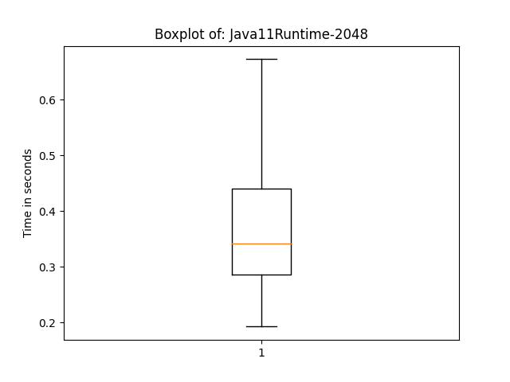
            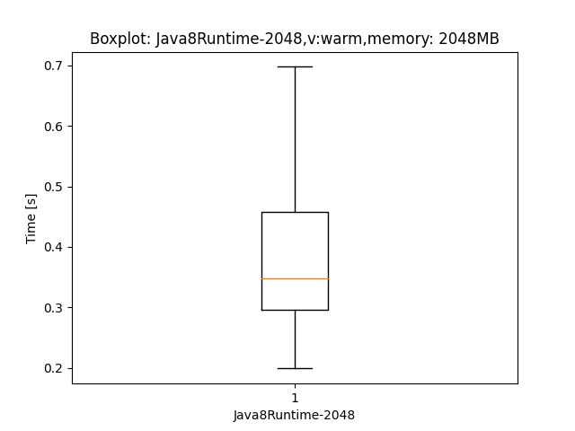
            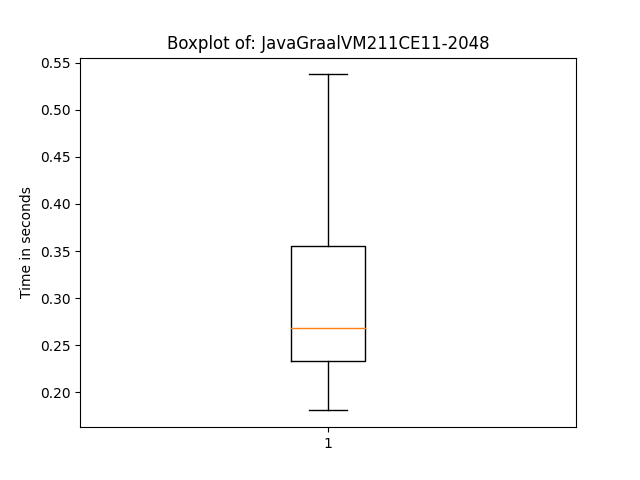
            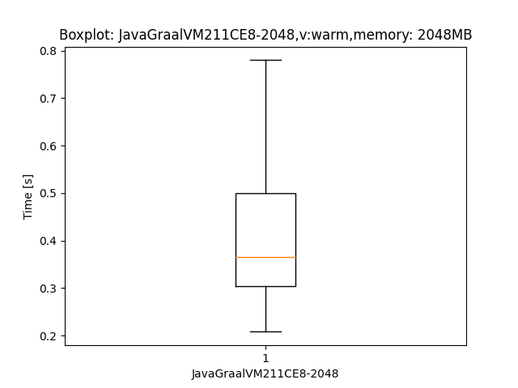
            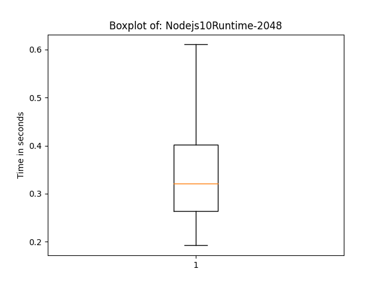
            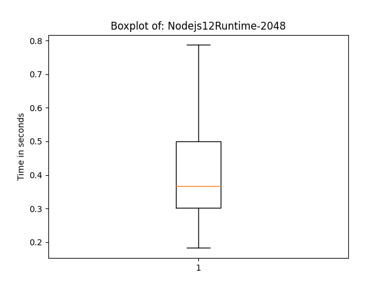
            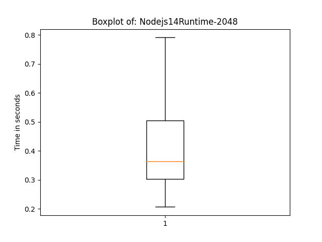
            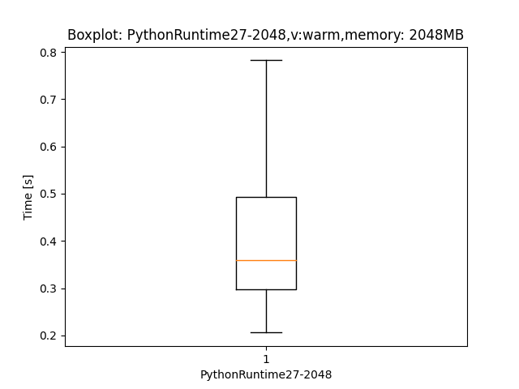
            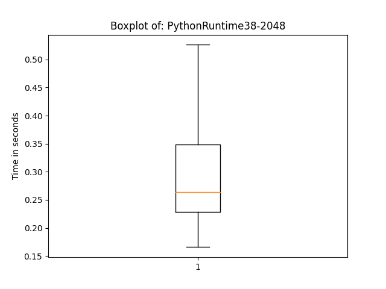
            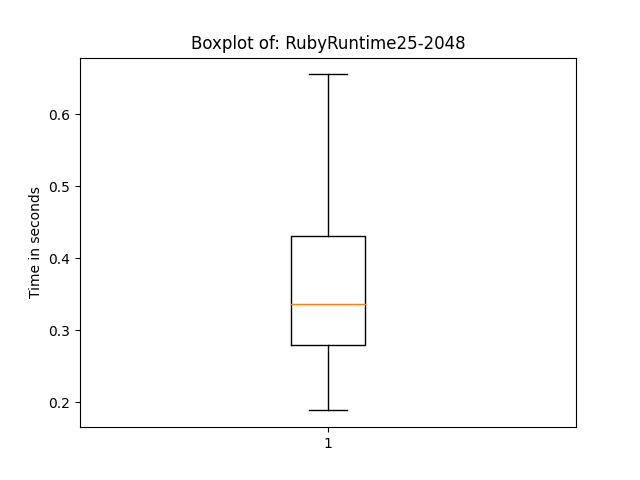
            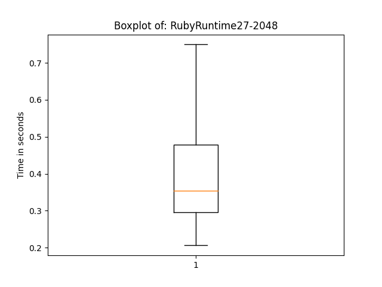
            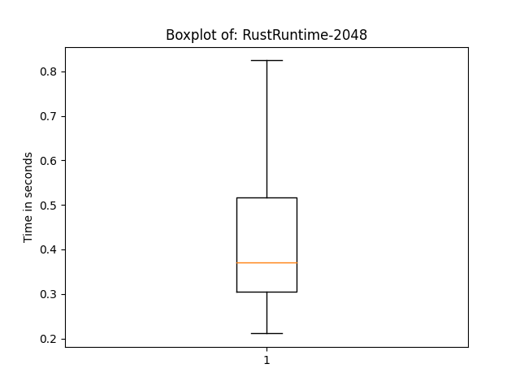

