# Table of Contents

1.  [About the benchmark](#org779015e)
2.  [Expectations](#org2a7713f)
3.  [Analysed parameters](#org6067b49)
4.  [Lambda functions](#org6ecb010)
5.  [Artifacts size](#org6e2d6eb)
6.  [Test variants](#org98f5f79)
7.  [Raw results](#org4e875f5)

    (setq user-python-command "/home/fierycod/.anaconda3/bin/python")
    (setq python-shell-interpreter user-python-command)
    (org-babel-do-load-languages
     'org-babel-load-languages
     '((python . t)
       (shell . t)))
    (setq org-confirm-babel-evaluate nil)

    /usr/bin/python3 -m pip install tabulate

# About the benchmark

Following synthetic benchmark aggregates the results of running sample &ldquo;Hello World&rdquo; program on curated list of AWS Lambda runtimes:

1.  Official AWS Node.js runtime (Nodejs v10, Nodejs v12, Nodejs v14)
2.  Official AWS Ruby runtime (ruby2.5, ruby2.7)
3.  Official AWS Python runtime (python2.7, python3.8)
4.  Official AWS Rust runtime (runtime v0.3.0)
5.  Official AWS Java runtime (Java8, Java11)
6.  Official AWS DotnetCore runtime (dotnetcore2.1)
7.  Community Haskell runtime (aws-lambda-haskell-runtime 1.1.1)
8.  Official AWS Golang runtime (golang1.x)
9.  Custom Clojure on Babashka Runtime (Babashka 0.4.6) (HL)
10. Clojure on Official AWS Java runtime (Java8, Java11)
11. Clojure on Custom Clojure runtime (Java8, Java11) (HL)
12. Official AWS Java Main Function adapter. Native compiled with GraalVM (Java8 GraalVM CE 21.1.0, Java11 GraalVM CE 21.1.0)
13. Clojure on Custom Clojure runtime. Native compiled with GraalVM (Java8 GraalVM CE 21.1.0, Java11 GraalVM CE 21.1.0) (HL)

Benchmark has been crafted to compare the results of the already established AWS Lambda runtimes with the ones proposed by the `Holy Lambda` microframework. In order to make the comparision fair, we limited the scope of the test to return the &ldquo;Hello world!&rdquo; text from each Lambda. Although the test might seem to simple and naive it&rsquo;s truly not.

Architecture of every runtime more or less follows the official AWS recommendations for creating a Custom Runtime. This means each of the presented runtime:

1.  Fetches the new event from the API gateway
2.  Decodes JSON event to a structure which might be read by the user handler
3.  Handler returns a structure `{"body": "Hello world!", "Content-Type": "plain/text"}` which is then encoded to valid json string and POST to an API Gateway.

The test is both minimal enough, complete and fair, because we compare only the runtimes work.

# Expectations

1.  Holy Lambda runtimes should be as fast as the others.
2.  Holy Lambda runtimes should be statistically stable.
3.  Holy Lambda runtimes should work without the errors under the same load as other runtimes.
4.  Holy Lambda runtimes should have approximetely same memory usage characteristics as other runtimes.

# Analysed parameters

In the test the following parameters are closely studied:

-   memory usage of each runtime (mean, max, min, std)
-   percentage of successful responses of each runtime
-   cold start time, processing, and response (mean, max, min, std, 25%, 50%, 75%)
-   warm start time, processing, and response (mean, max, min, std, 25%, 50%, 75%)
-   cold start time, and processing (without response)
-   warm start time, and processing (without response)
-   artifacts size

# Lambda functions

1.  *ClojureClojureJava8Runtime-{MemorySize}* - HL Custom Clojure runtime on Java8
2.  *ClojureClojureJava11Runtime-{MemorySize}* - HL Custom Clojure runtime on Java11
3.  *ClojureJava8Runtime-{MemorySize}* - Clojure on official Java runtime. Java8
4.  *ClojureJava11Runtime-{MemorySize}* - Clojure on official Java runtime. Java11
5.  *ClojureGraalVM211CE8-{MemorySize}* - HL Custom Clojure runtime native compiled with GraalVM 21.1 on Java8
6.  *ClojureGraalVM211CE11-{MemorySize}* - HL Custom Clojure runtime native compiled with GraalVM 21.1 on Java11
7.  *Java8Runtime-{MemorySize}* - Official AWS Lambda Java runtime. Java8
8.  *Java11Runtime-{MemorySize}* - Official AWS Lambda Java runtime. Java11
9.  *JavaGraalVM211CE8-{MemorySize}* - Custom Java runtime native compiled with GraalVM 21.1 on Java8
10. *JavaGraalVM211CE11-{MemorySize}* - Custom Java runtime native compiled with GraalVM 21.1 on Java11
11. *ClojureOnBabashkaRuntime-{MemorySize}* - Custom Clojure runtime running on Babashka (0.4.6)
12. *Nodejs14Runtime-{MemorySize}* - Official Node.js runtime (v14)
13. *Nodejs12Runtime-{MemorySize}* - Official Node.js runtime (v12)
14. *Nodejs10Runtime-{MemorySize}* - Official Node.js runtime (v10)
15. *PythonRuntime38-{MemorySize}* - Official Python runtime (Python3.8)
16. *PythonRuntime27-{MemorySize}* - Official Python runtime (Python2.7)
17. *RubyRuntime25-{MemorySize}* - Official Ruby runtime (ruby2.5)
18. *RubyRuntime27-{MemorySize}* - Official Ruby runtime (ruby2.7)
19. *GolangRuntime-{MemorySize}* - Official Golang runtime (go1.x)
20. *RustRuntime-{MemorySize}* - Official Rust runtime (v0.3.0)
21. *HaskellRuntime-{MemorySize}* - Community Haskell runtime (v1.1.1)
22. *CsharpRuntime-{MemorySize}* - Official DotnetCore runtime (v2.1)

Function name changes according to dynamic MemorySize parameter, where MemorySize is one of {128, 512, 1024, 2048}.

# Artifacts size

Artifacts size are the same for all of the memory variants.

<table border="2" cellspacing="0" cellpadding="6" rules="groups" frame="hsides">
<caption class="t-above">Table 1: Function to it&rsquo;s artifact size in (KB)</caption>

<colgroup>
<col  class="org-left" />

<col  class="org-left" />
</colgroup>
<thead>
<tr>
<th scope="col" class="org-left">Function Name</th>
<th scope="col" class="org-left">Artifact size (KB)</th>
</tr>
</thead>

<tbody>
<tr>
<td class="org-left">RubyRuntime25</td>
<td class="org-left">~=0.236</td>
</tr>

<tr>
<td class="org-left">RubyRuntime27</td>
<td class="org-left">~=0.236</td>
</tr>

<tr>
<td class="org-left">PythonRuntime27</td>
<td class="org-left">~=0.248</td>
</tr>

<tr>
<td class="org-left">PythonRuntime38</td>
<td class="org-left">~=0.248</td>
</tr>

<tr>
<td class="org-left">Nodejs10Runtime</td>
<td class="org-left">~=0.263</td>
</tr>

<tr>
<td class="org-left">Nodejs12Runtime</td>
<td class="org-left">~=0.263</td>
</tr>

<tr>
<td class="org-left">Nodejs14Runtime</td>
<td class="org-left">~=0.263</td>
</tr>

<tr>
<td class="org-left">CsharpRuntime-128</td>
<td class="org-left">~=204.6</td>
</tr>

<tr>
<td class="org-left">GolangRuntime</td>
<td class="org-left">~=67500</td>
</tr>

<tr>
<td class="org-left">RustRuntime</td>
<td class="org-left">~=1500</td>
</tr>

<tr>
<td class="org-left">HaskellRuntime</td>
<td class="org-left">~=2400</td>
</tr>

<tr>
<td class="org-left">Java8Runtime</td>
<td class="org-left">~=3200</td>
</tr>

<tr>
<td class="org-left">Java11Runtime</td>
<td class="org-left">~=3200</td>
</tr>

<tr>
<td class="org-left">JavaGraalVM211CE8</td>
<td class="org-left">~=9500</td>
</tr>

<tr>
<td class="org-left">JavaGraalVM211CE11</td>
<td class="org-left">~=12700</td>
</tr>

<tr>
<td class="org-left">ClojureJava8Runtime</td>
<td class="org-left">~=6600</td>
</tr>

<tr>
<td class="org-left">ClojureJava11Runtime</td>
<td class="org-left">~=6700</td>
</tr>

<tr>
<td class="org-left">ClojureClojureJava8Runtime</td>
<td class="org-left">~=237000</td>
</tr>

<tr>
<td class="org-left">ClojureClojureJava11Runtime</td>
<td class="org-left">~=340000</td>
</tr>

<tr>
<td class="org-left">ClojureOnBabashkaRuntime</td>
<td class="org-left">~=0.270</td>
</tr>

<tr>
<td class="org-left">ClojureGraalVM211CE8</td>
<td class="org-left">~=8900</td>
</tr>

<tr>
<td class="org-left">ClojureGraalVM211CE11</td>
<td class="org-left">~=10200</td>
</tr>
</tbody>
</table>

# Test variants

1.  Thousand full curl GET requests to each Lambda representing the runtime with cold start simulation:
    1.  Lambda with 128 MB of memory
    2.  Lambda with 512 MB of memory
    3.  Lambda with 1024 MB of memory
    4.  Lambda with 2048 MB of memory
2.  Thousand full curl GET requests to each Lambda representing the runtime. Warm Lambda execution only:
    1.  Lambda with 128 MB of memory
    2.  Lambda with 512 MB of memory
    3.  Lambda with 1024 MB of memory
    4.  Lambda with 2048 MB of memory

# Raw results

1.  Variant 1
    1.  Lambda with 128 MB of memory
        In the test two Clojure runtimes has been ignored: ClojureJava8Runtime, ClojureJava11Runtime.
        Runtimes has been ignored, because the memory size usage exceeds 128MB.
        
        1.  Basic statistics
        
        <table border="2" cellspacing="0" cellpadding="6" rules="groups" frame="hsides">
        
        
        <colgroup>
        <col  class="org-left" />
        
        <col  class="org-right" />
        
        <col  class="org-right" />
        
        <col  class="org-right" />
        
        <col  class="org-right" />
        
        <col  class="org-right" />
        
        <col  class="org-right" />
        
        <col  class="org-right" />
        
        <col  class="org-right" />
        </colgroup>
        <thead>
        <tr>
        <th scope="col" class="org-left">&#xa0;</th>
        <th scope="col" class="org-right">mean</th>
        <th scope="col" class="org-right">std</th>
        <th scope="col" class="org-right">min</th>
        <th scope="col" class="org-right">max</th>
        <th scope="col" class="org-right">25%</th>
        <th scope="col" class="org-right">50%</th>
        <th scope="col" class="org-right">75%</th>
        <th scope="col" class="org-right">status 200 in %</th>
        </tr>
        </thead>
        
        <tbody>
        <tr>
        <td class="org-left">ClojureClojureJava11Runtime-128</td>
        <td class="org-right">4.90988</td>
        <td class="org-right">0.317468</td>
        <td class="org-right">4.0844</td>
        <td class="org-right">6.44153</td>
        <td class="org-right">4.70436</td>
        <td class="org-right">4.90553</td>
        <td class="org-right">5.09559</td>
        <td class="org-right">99.6%</td>
        </tr>
        
        
        <tr>
        <td class="org-left">ClojureClojureJava11RuntimeTiered-128</td>
        <td class="org-right">3.46636</td>
        <td class="org-right">0.244351</td>
        <td class="org-right">2.89737</td>
        <td class="org-right">4.46724</td>
        <td class="org-right">3.27885</td>
        <td class="org-right">3.48608</td>
        <td class="org-right">3.62971</td>
        <td class="org-right">99.5%</td>
        </tr>
        
        
        <tr>
        <td class="org-left">ClojureClojureJava8Runtime-128</td>
        <td class="org-right">5.21273</td>
        <td class="org-right">0.389268</td>
        <td class="org-right">4.21188</td>
        <td class="org-right">6.80188</td>
        <td class="org-right">4.92676</td>
        <td class="org-right">5.17007</td>
        <td class="org-right">5.45463</td>
        <td class="org-right">99.5%</td>
        </tr>
        
        
        <tr>
        <td class="org-left">ClojureClojureJava8RuntimeTiered-128</td>
        <td class="org-right">3.63801</td>
        <td class="org-right">0.251178</td>
        <td class="org-right">3.09481</td>
        <td class="org-right">4.85363</td>
        <td class="org-right">3.48209</td>
        <td class="org-right">3.63023</td>
        <td class="org-right">3.7844</td>
        <td class="org-right">99.6%</td>
        </tr>
        
        
        <tr>
        <td class="org-left">ClojureGraalVM211CE11-128</td>
        <td class="org-right">0.777105</td>
        <td class="org-right">0.116017</td>
        <td class="org-right">0.608059</td>
        <td class="org-right">1.34646</td>
        <td class="org-right">0.699478</td>
        <td class="org-right">0.739737</td>
        <td class="org-right">0.822856</td>
        <td class="org-right">100.0%</td>
        </tr>
        
        
        <tr>
        <td class="org-left">ClojureGraalVM211CE8-128</td>
        <td class="org-right">0.778442</td>
        <td class="org-right">0.116025</td>
        <td class="org-right">0.603823</td>
        <td class="org-right">1.4594</td>
        <td class="org-right">0.69901</td>
        <td class="org-right">0.740988</td>
        <td class="org-right">0.832955</td>
        <td class="org-right">100.0%</td>
        </tr>
        
        
        <tr>
        <td class="org-left">ClojureOnBabashkaRuntime-128</td>
        <td class="org-right">1.27612</td>
        <td class="org-right">0.108295</td>
        <td class="org-right">1.0472</td>
        <td class="org-right">1.69143</td>
        <td class="org-right">1.19261</td>
        <td class="org-right">1.26734</td>
        <td class="org-right">1.34532</td>
        <td class="org-right">100.0%</td>
        </tr>
        
        
        <tr>
        <td class="org-left">CsharpRuntime-128</td>
        <td class="org-right">4.26561</td>
        <td class="org-right">0.167551</td>
        <td class="org-right">3.65622</td>
        <td class="org-right">4.91009</td>
        <td class="org-right">4.14332</td>
        <td class="org-right">4.25825</td>
        <td class="org-right">4.36209</td>
        <td class="org-right">100.0%</td>
        </tr>
        
        
        <tr>
        <td class="org-left">GolangRuntime-128</td>
        <td class="org-right">4.93261</td>
        <td class="org-right">0.153144</td>
        <td class="org-right">4.59882</td>
        <td class="org-right">5.57946</td>
        <td class="org-right">4.82611</td>
        <td class="org-right">4.92748</td>
        <td class="org-right">5.02557</td>
        <td class="org-right">100.0%</td>
        </tr>
        
        
        <tr>
        <td class="org-left">HaskellRuntime-128</td>
        <td class="org-right">0.495249</td>
        <td class="org-right">0.0953261</td>
        <td class="org-right">0.369421</td>
        <td class="org-right">0.953195</td>
        <td class="org-right">0.433635</td>
        <td class="org-right">0.461402</td>
        <td class="org-right">0.519225</td>
        <td class="org-right">100.0%</td>
        </tr>
        
        
        <tr>
        <td class="org-left">Java11Runtime-128</td>
        <td class="org-right">0.802278</td>
        <td class="org-right">0.120786</td>
        <td class="org-right">0.621967</td>
        <td class="org-right">1.52329</td>
        <td class="org-right">0.716924</td>
        <td class="org-right">0.767513</td>
        <td class="org-right">0.854894</td>
        <td class="org-right">100.0%</td>
        </tr>
        
        
        <tr>
        <td class="org-left">Java8Runtime-128</td>
        <td class="org-right">0.63156</td>
        <td class="org-right">0.118338</td>
        <td class="org-right">0.449002</td>
        <td class="org-right">1.40646</td>
        <td class="org-right">0.551601</td>
        <td class="org-right">0.590213</td>
        <td class="org-right">0.683046</td>
        <td class="org-right">100.0%</td>
        </tr>
        
        
        <tr>
        <td class="org-left">JavaGraalVM211CE11-128</td>
        <td class="org-right">0.830719</td>
        <td class="org-right">0.109054</td>
        <td class="org-right">0.655662</td>
        <td class="org-right">1.30314</td>
        <td class="org-right">0.751406</td>
        <td class="org-right">0.795318</td>
        <td class="org-right">0.886124</td>
        <td class="org-right">100.0%</td>
        </tr>
        
        
        <tr>
        <td class="org-left">JavaGraalVM211CE8-128</td>
        <td class="org-right">0.79041</td>
        <td class="org-right">0.106763</td>
        <td class="org-right">0.630931</td>
        <td class="org-right">1.22947</td>
        <td class="org-right">0.709222</td>
        <td class="org-right">0.755681</td>
        <td class="org-right">0.853571</td>
        <td class="org-right">100.0%</td>
        </tr>
        
        
        <tr>
        <td class="org-left">Nodejs10Runtime-128</td>
        <td class="org-right">0.533473</td>
        <td class="org-right">0.0938903</td>
        <td class="org-right">0.410479</td>
        <td class="org-right">0.904425</td>
        <td class="org-right">0.471721</td>
        <td class="org-right">0.500674</td>
        <td class="org-right">0.564902</td>
        <td class="org-right">100.0%</td>
        </tr>
        
        
        <tr>
        <td class="org-left">Nodejs12Runtime-128</td>
        <td class="org-right">0.501893</td>
        <td class="org-right">0.0942564</td>
        <td class="org-right">0.386124</td>
        <td class="org-right">1.08131</td>
        <td class="org-right">0.440193</td>
        <td class="org-right">0.468531</td>
        <td class="org-right">0.530596</td>
        <td class="org-right">100.0%</td>
        </tr>
        
        
        <tr>
        <td class="org-left">Nodejs14Runtime-128</td>
        <td class="org-right">0.505511</td>
        <td class="org-right">0.0955143</td>
        <td class="org-right">0.369251</td>
        <td class="org-right">1.01084</td>
        <td class="org-right">0.44524</td>
        <td class="org-right">0.475097</td>
        <td class="org-right">0.526858</td>
        <td class="org-right">100.0%</td>
        </tr>
        
        
        <tr>
        <td class="org-left">PythonRuntime27-128</td>
        <td class="org-right">0.396074</td>
        <td class="org-right">0.0878231</td>
        <td class="org-right">0.285585</td>
        <td class="org-right">0.962381</td>
        <td class="org-right">0.342952</td>
        <td class="org-right">0.364317</td>
        <td class="org-right">0.409595</td>
        <td class="org-right">100.0%</td>
        </tr>
        
        
        <tr>
        <td class="org-left">PythonRuntime38-128</td>
        <td class="org-right">0.494242</td>
        <td class="org-right">0.0991799</td>
        <td class="org-right">0.365842</td>
        <td class="org-right">1.04877</td>
        <td class="org-right">0.429268</td>
        <td class="org-right">0.459148</td>
        <td class="org-right">0.526572</td>
        <td class="org-right">100.0%</td>
        </tr>
        
        
        <tr>
        <td class="org-left">RubyRuntime25-128</td>
        <td class="org-right">0.485346</td>
        <td class="org-right">0.0933085</td>
        <td class="org-right">0.331401</td>
        <td class="org-right">1.06657</td>
        <td class="org-right">0.422935</td>
        <td class="org-right">0.455778</td>
        <td class="org-right">0.51764</td>
        <td class="org-right">100.0%</td>
        </tr>
        
        
        <tr>
        <td class="org-left">RubyRuntime27-128</td>
        <td class="org-right">0.513761</td>
        <td class="org-right">0.0963435</td>
        <td class="org-right">0.382749</td>
        <td class="org-right">1.09313</td>
        <td class="org-right">0.453807</td>
        <td class="org-right">0.482876</td>
        <td class="org-right">0.539947</td>
        <td class="org-right">100.0%</td>
        </tr>
        
        
        <tr>
        <td class="org-left">RustRuntime-128</td>
        <td class="org-right">0.44318</td>
        <td class="org-right">0.0899988</td>
        <td class="org-right">0.314023</td>
        <td class="org-right">0.995236</td>
        <td class="org-right">0.383697</td>
        <td class="org-right">0.413132</td>
        <td class="org-right">0.470302</td>
        <td class="org-right">100.0%</td>
        </tr>
        </tbody>
        </table>

1.  Box plot
    
    **Boxplot all functions**
    
    

    
    

    
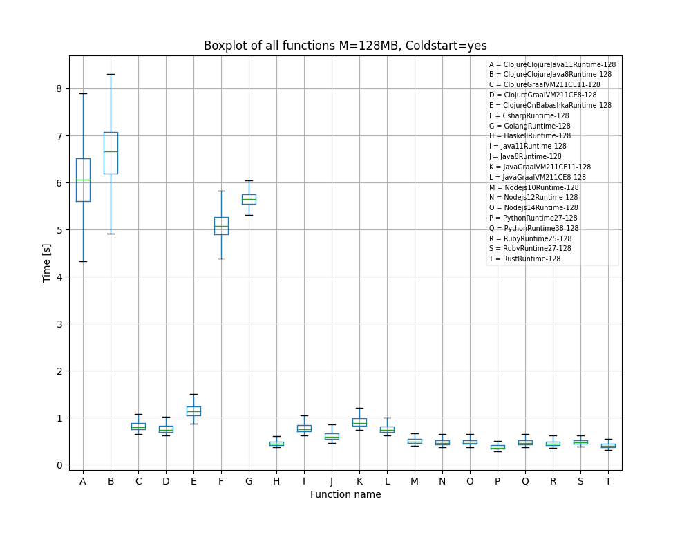
    

    

    

    
    **Individual boxplots**
    
    

    

    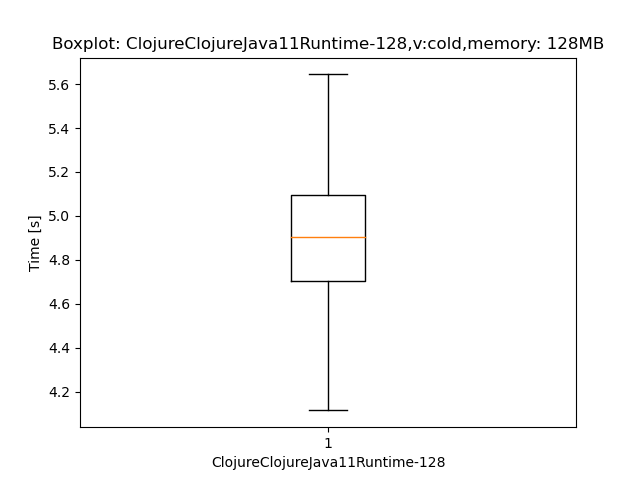
    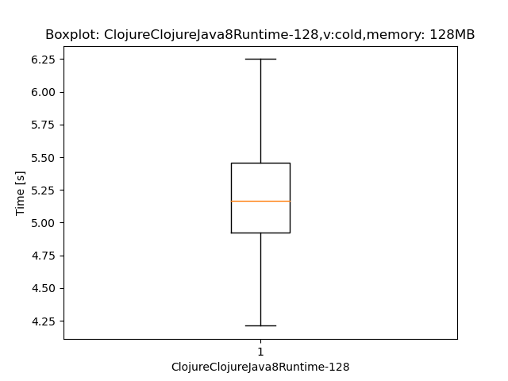
    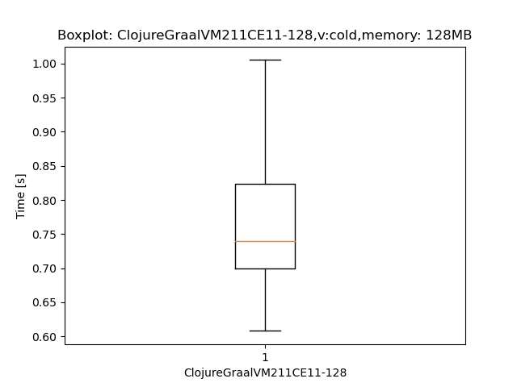
    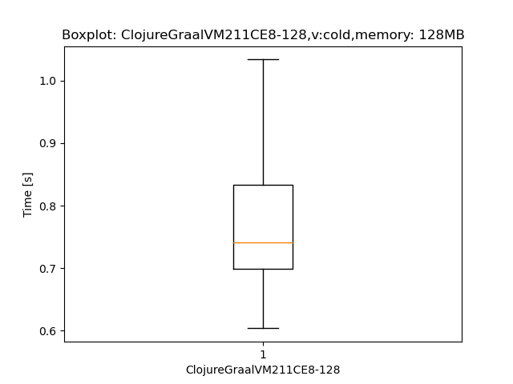
    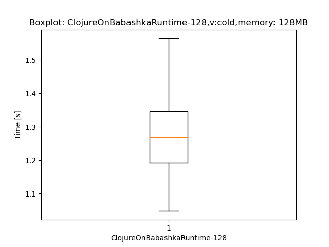
    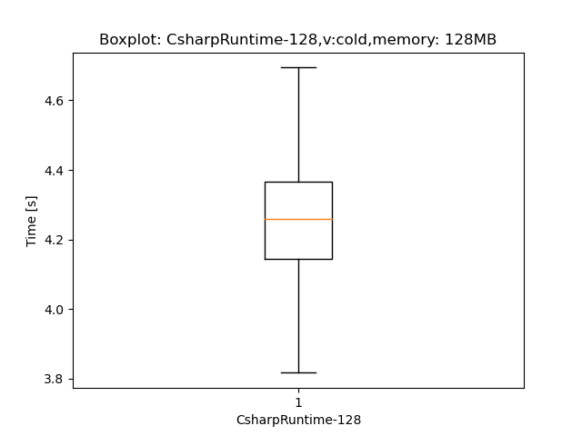
    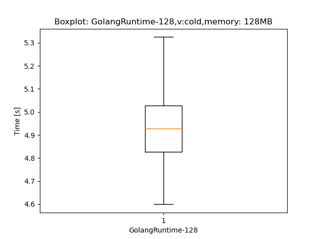
    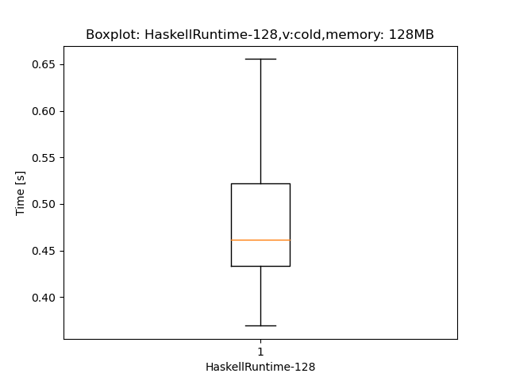
    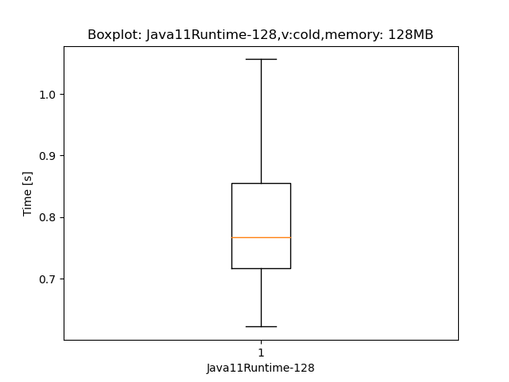
    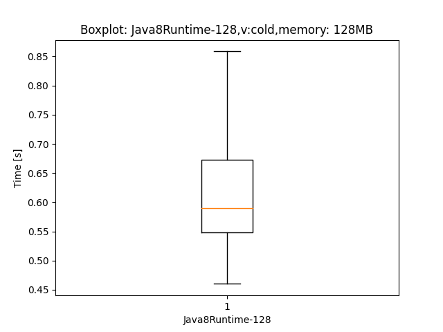
    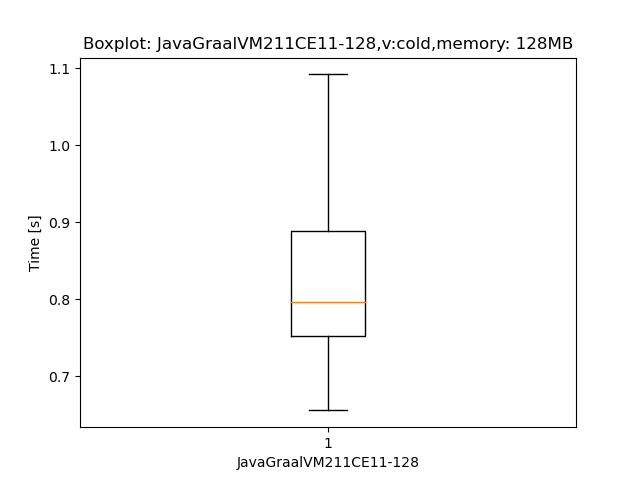
    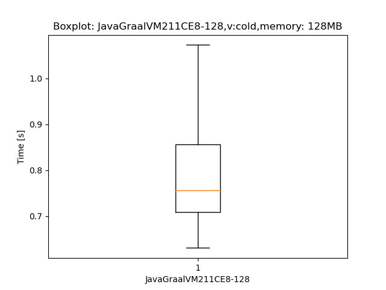
    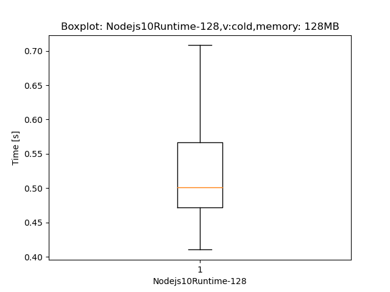
    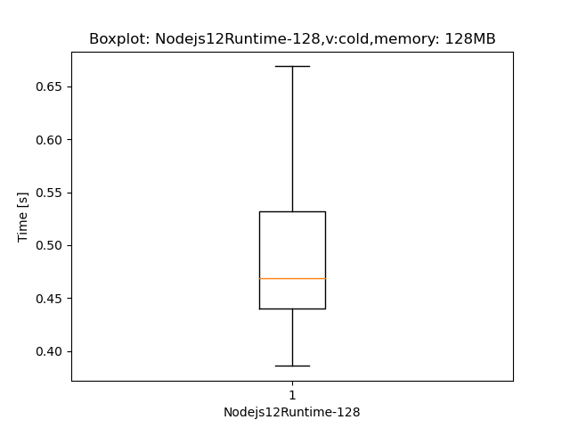
    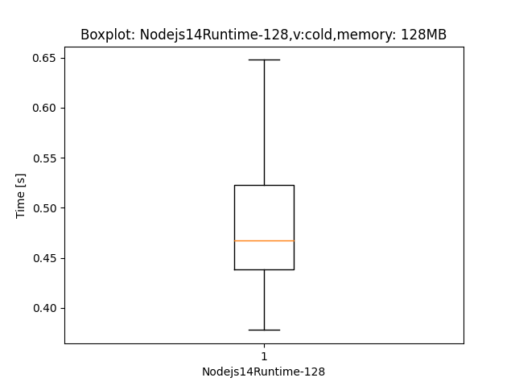
    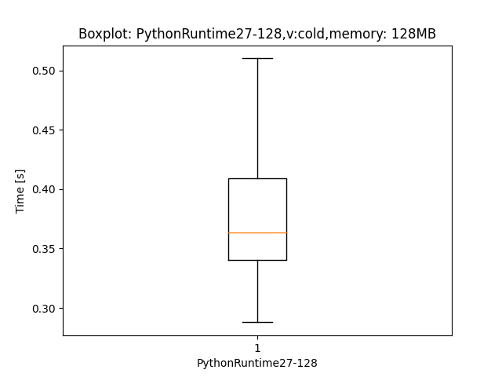
    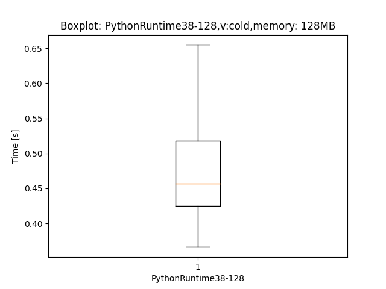
    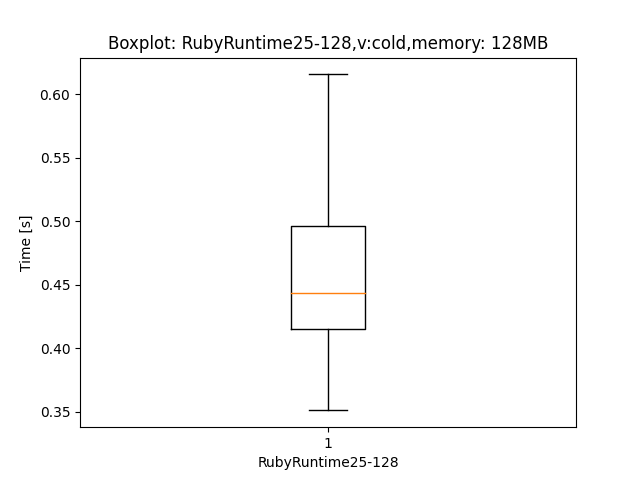
    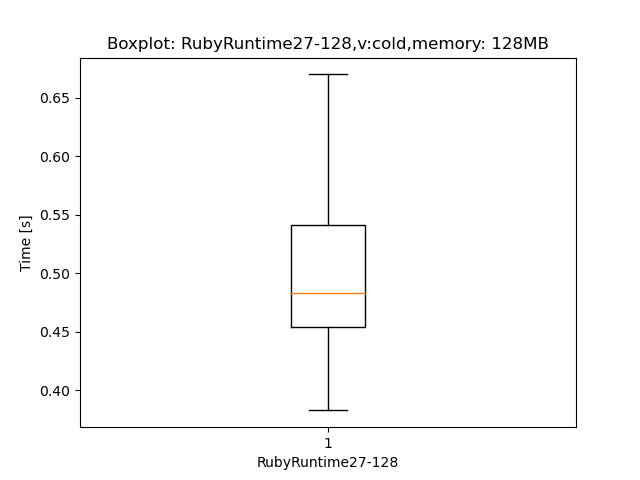
    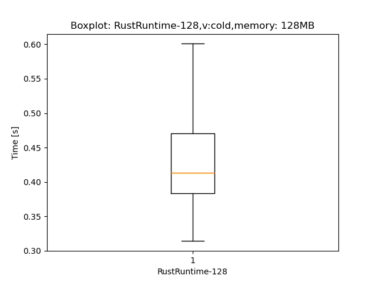
    

    

1.  Lambda with 512 MB of memory
    In the test two Clojure runtimes has been ignored: ClojureJava8Runtime, ClojureJava11Runtime. Runtimes has been ignored, because the memory size usage exceeds 128MB.
    
    1.  Basic statistics
    
    <table border="2" cellspacing="0" cellpadding="6" rules="groups" frame="hsides">
    
    
    <colgroup>
    <col  class="org-left" />
    
    <col  class="org-right" />
    
    <col  class="org-right" />
    
    <col  class="org-right" />
    
    <col  class="org-right" />
    
    <col  class="org-right" />
    
    <col  class="org-right" />
    
    <col  class="org-right" />
    
    <col  class="org-right" />
    </colgroup>
    <thead>
    <tr>
    <th scope="col" class="org-left">&#xa0;</th>
    <th scope="col" class="org-right">mean</th>
    <th scope="col" class="org-right">std</th>
    <th scope="col" class="org-right">min</th>
    <th scope="col" class="org-right">max</th>
    <th scope="col" class="org-right">25%</th>
    <th scope="col" class="org-right">50%</th>
    <th scope="col" class="org-right">75%</th>
    <th scope="col" class="org-right">status 200 in %</th>
    </tr>
    </thead>
    
    <tbody>
    <tr>
    <td class="org-left">ClojureClojureJava11Runtime-512</td>
    <td class="org-right">3.52947</td>
    <td class="org-right">0.269656</td>
    <td class="org-right">2.91128</td>
    <td class="org-right">4.796</td>
    <td class="org-right">3.35982</td>
    <td class="org-right">3.52304</td>
    <td class="org-right">3.67256</td>
    <td class="org-right">99.6%</td>
    </tr>
    
    
    <tr>
    <td class="org-left">ClojureClojureJava11RuntimeTiered-512</td>
    <td class="org-right">2.50029</td>
    <td class="org-right">0.249224</td>
    <td class="org-right">1.91057</td>
    <td class="org-right">3.56823</td>
    <td class="org-right">2.32467</td>
    <td class="org-right">2.51893</td>
    <td class="org-right">2.65332</td>
    <td class="org-right">99.6%</td>
    </tr>
    
    
    <tr>
    <td class="org-left">ClojureClojureJava8Runtime-512</td>
    <td class="org-right">3.60212</td>
    <td class="org-right">0.269788</td>
    <td class="org-right">2.97111</td>
    <td class="org-right">4.80827</td>
    <td class="org-right">3.42666</td>
    <td class="org-right">3.57725</td>
    <td class="org-right">3.74541</td>
    <td class="org-right">99.6%</td>
    </tr>
    
    
    <tr>
    <td class="org-left">ClojureClojureJava8RuntimeTiered-512</td>
    <td class="org-right">2.62544</td>
    <td class="org-right">0.244625</td>
    <td class="org-right">2.10785</td>
    <td class="org-right">3.57667</td>
    <td class="org-right">2.4589</td>
    <td class="org-right">2.63394</td>
    <td class="org-right">2.75937</td>
    <td class="org-right">99.7%</td>
    </tr>
    
    
    <tr>
    <td class="org-left">ClojureGraalVM211CE11-512</td>
    <td class="org-right">0.775327</td>
    <td class="org-right">0.120629</td>
    <td class="org-right">0.603627</td>
    <td class="org-right">1.33967</td>
    <td class="org-right">0.688195</td>
    <td class="org-right">0.7402</td>
    <td class="org-right">0.832272</td>
    <td class="org-right">100.0%</td>
    </tr>
    
    
    <tr>
    <td class="org-left">ClojureGraalVM211CE8-512</td>
    <td class="org-right">0.774601</td>
    <td class="org-right">0.119334</td>
    <td class="org-right">0.606556</td>
    <td class="org-right">1.36037</td>
    <td class="org-right">0.688168</td>
    <td class="org-right">0.736588</td>
    <td class="org-right">0.835118</td>
    <td class="org-right">100.0%</td>
    </tr>
    
    
    <tr>
    <td class="org-left">ClojureOnBabashkaRuntime-512</td>
    <td class="org-right">1.03894</td>
    <td class="org-right">0.117252</td>
    <td class="org-right">0.810452</td>
    <td class="org-right">1.4968</td>
    <td class="org-right">0.947307</td>
    <td class="org-right">1.03561</td>
    <td class="org-right">1.1138</td>
    <td class="org-right">100.0%</td>
    </tr>
    
    
    <tr>
    <td class="org-left">CsharpRuntime-512</td>
    <td class="org-right">1.49214</td>
    <td class="org-right">0.132304</td>
    <td class="org-right">1.24332</td>
    <td class="org-right">2.15712</td>
    <td class="org-right">1.38969</td>
    <td class="org-right">1.47076</td>
    <td class="org-right">1.5696</td>
    <td class="org-right">100.0%</td>
    </tr>
    
    
    <tr>
    <td class="org-left">GolangRuntime-512</td>
    <td class="org-right">4.90836</td>
    <td class="org-right">0.141842</td>
    <td class="org-right">4.57591</td>
    <td class="org-right">5.44373</td>
    <td class="org-right">4.81445</td>
    <td class="org-right">4.90556</td>
    <td class="org-right">4.97931</td>
    <td class="org-right">100.0%</td>
    </tr>
    
    
    <tr>
    <td class="org-left">HaskellRuntime-512</td>
    <td class="org-right">0.502239</td>
    <td class="org-right">0.100928</td>
    <td class="org-right">0.374865</td>
    <td class="org-right">1.06655</td>
    <td class="org-right">0.434825</td>
    <td class="org-right">0.467105</td>
    <td class="org-right">0.536173</td>
    <td class="org-right">100.0%</td>
    </tr>
    
    
    <tr>
    <td class="org-left">Java11Runtime-512</td>
    <td class="org-right">0.801952</td>
    <td class="org-right">0.119361</td>
    <td class="org-right">0.617442</td>
    <td class="org-right">1.37648</td>
    <td class="org-right">0.713774</td>
    <td class="org-right">0.765502</td>
    <td class="org-right">0.861483</td>
    <td class="org-right">100.0%</td>
    </tr>
    
    
    <tr>
    <td class="org-left">Java8Runtime-512</td>
    <td class="org-right">0.632588</td>
    <td class="org-right">0.112081</td>
    <td class="org-right">0.458565</td>
    <td class="org-right">1.24395</td>
    <td class="org-right">0.554285</td>
    <td class="org-right">0.59434</td>
    <td class="org-right">0.692535</td>
    <td class="org-right">100.0%</td>
    </tr>
    
    
    <tr>
    <td class="org-left">JavaGraalVM211CE11-512</td>
    <td class="org-right">0.826579</td>
    <td class="org-right">0.117502</td>
    <td class="org-right">0.659515</td>
    <td class="org-right">1.38481</td>
    <td class="org-right">0.742441</td>
    <td class="org-right">0.788928</td>
    <td class="org-right">0.889136</td>
    <td class="org-right">100.0%</td>
    </tr>
    
    
    <tr>
    <td class="org-left">JavaGraalVM211CE8-512</td>
    <td class="org-right">0.786416</td>
    <td class="org-right">0.111862</td>
    <td class="org-right">0.607291</td>
    <td class="org-right">1.20823</td>
    <td class="org-right">0.704046</td>
    <td class="org-right">0.751926</td>
    <td class="org-right">0.845404</td>
    <td class="org-right">100.0%</td>
    </tr>
    
    
    <tr>
    <td class="org-left">Nodejs10Runtime-512</td>
    <td class="org-right">0.541757</td>
    <td class="org-right">0.0992073</td>
    <td class="org-right">0.410098</td>
    <td class="org-right">1.13754</td>
    <td class="org-right">0.473921</td>
    <td class="org-right">0.509495</td>
    <td class="org-right">0.578547</td>
    <td class="org-right">100.0%</td>
    </tr>
    
    
    <tr>
    <td class="org-left">Nodejs12Runtime-512</td>
    <td class="org-right">0.50472</td>
    <td class="org-right">0.0944189</td>
    <td class="org-right">0.382236</td>
    <td class="org-right">1.04292</td>
    <td class="org-right">0.442684</td>
    <td class="org-right">0.47448</td>
    <td class="org-right">0.536971</td>
    <td class="org-right">100.0%</td>
    </tr>
    
    
    <tr>
    <td class="org-left">Nodejs14Runtime-512</td>
    <td class="org-right">0.51042</td>
    <td class="org-right">0.0956968</td>
    <td class="org-right">0.385393</td>
    <td class="org-right">1.06475</td>
    <td class="org-right">0.449024</td>
    <td class="org-right">0.478419</td>
    <td class="org-right">0.540734</td>
    <td class="org-right">100.0%</td>
    </tr>
    
    
    <tr>
    <td class="org-left">PythonRuntime27-512</td>
    <td class="org-right">0.396848</td>
    <td class="org-right">0.0889055</td>
    <td class="org-right">0.287671</td>
    <td class="org-right">0.936253</td>
    <td class="org-right">0.341359</td>
    <td class="org-right">0.364599</td>
    <td class="org-right">0.419638</td>
    <td class="org-right">100.0%</td>
    </tr>
    
    
    <tr>
    <td class="org-left">PythonRuntime38-512</td>
    <td class="org-right">0.493236</td>
    <td class="org-right">0.0937295</td>
    <td class="org-right">0.361494</td>
    <td class="org-right">0.945132</td>
    <td class="org-right">0.430356</td>
    <td class="org-right">0.461929</td>
    <td class="org-right">0.523081</td>
    <td class="org-right">100.0%</td>
    </tr>
    
    
    <tr>
    <td class="org-left">RubyRuntime25-512</td>
    <td class="org-right">0.487656</td>
    <td class="org-right">0.0963141</td>
    <td class="org-right">0.358048</td>
    <td class="org-right">1.04651</td>
    <td class="org-right">0.426487</td>
    <td class="org-right">0.454773</td>
    <td class="org-right">0.512442</td>
    <td class="org-right">100.0%</td>
    </tr>
    
    
    <tr>
    <td class="org-left">RubyRuntime27-512</td>
    <td class="org-right">0.51636</td>
    <td class="org-right">0.0988495</td>
    <td class="org-right">0.383519</td>
    <td class="org-right">1.08434</td>
    <td class="org-right">0.450547</td>
    <td class="org-right">0.480036</td>
    <td class="org-right">0.55202</td>
    <td class="org-right">100.0%</td>
    </tr>
    
    
    <tr>
    <td class="org-left">RustRuntime-512</td>
    <td class="org-right">0.445613</td>
    <td class="org-right">0.0891878</td>
    <td class="org-right">0.317023</td>
    <td class="org-right">0.824105</td>
    <td class="org-right">0.384787</td>
    <td class="org-right">0.414933</td>
    <td class="org-right">0.480772</td>
    <td class="org-right">100.0%</td>
    </tr>
    </tbody>
    </table>
    
    1.  Box plot
        
        **Boxplot all functions**
        
        

        
        

        
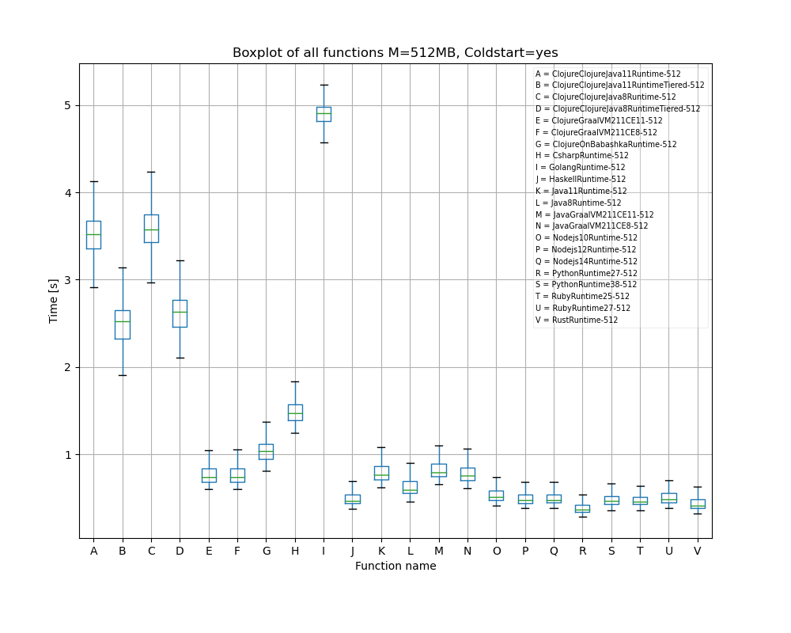
        

        

        

        
        **Individual boxplots**
        
        

        

        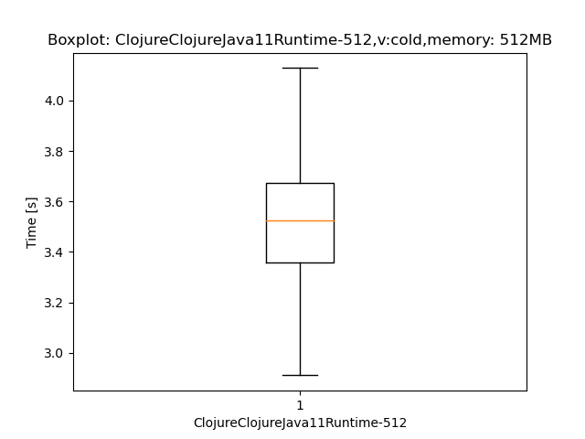
        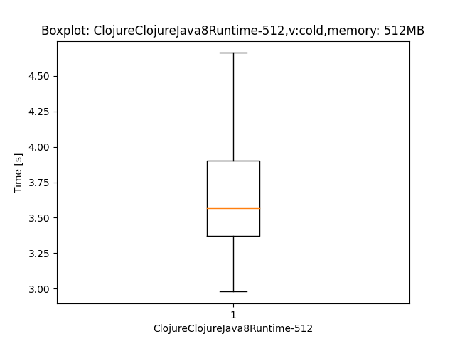
        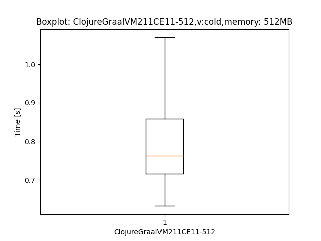
        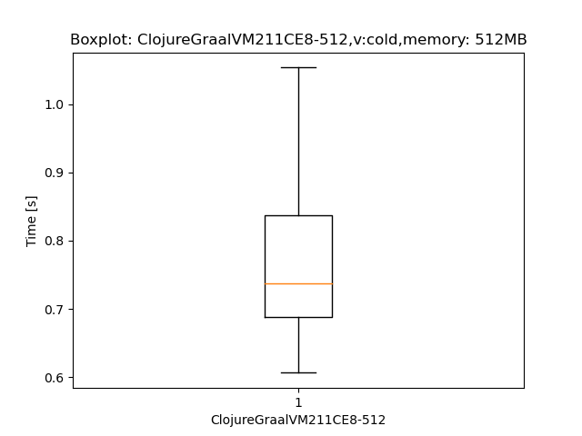
        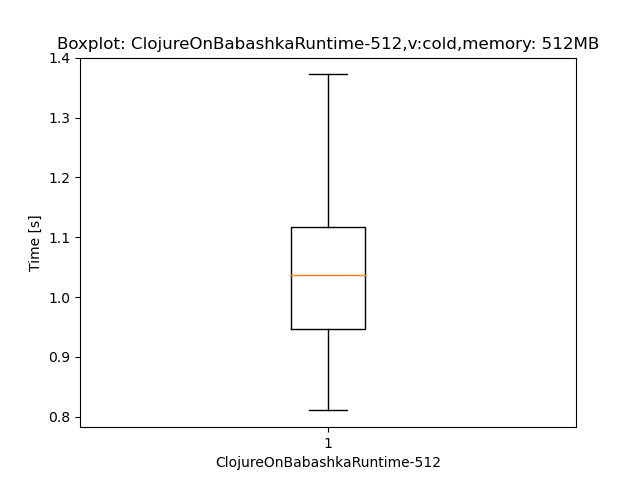
        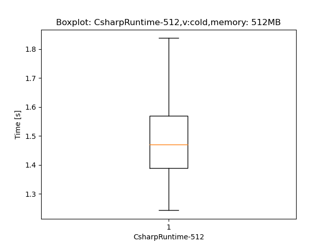
        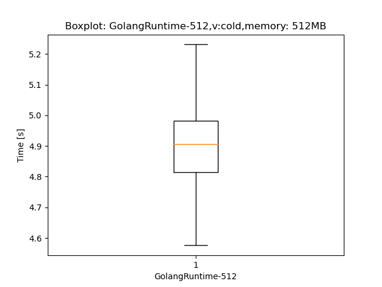
        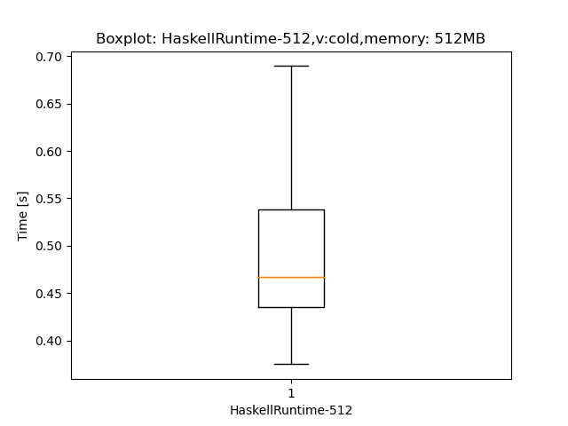
        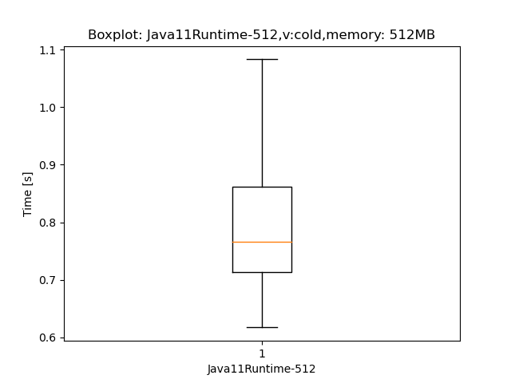
        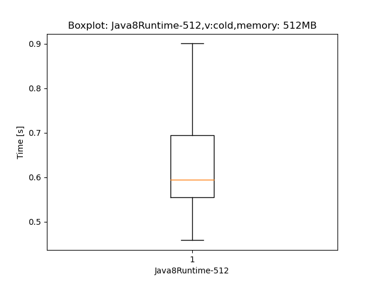
        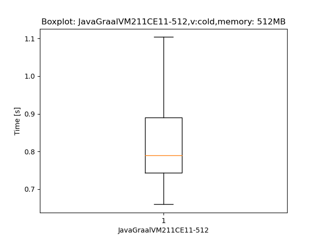
        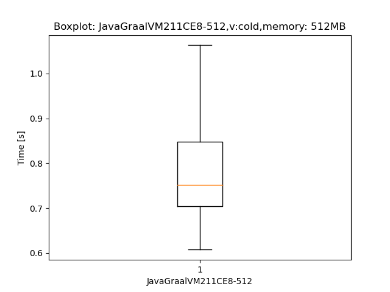
        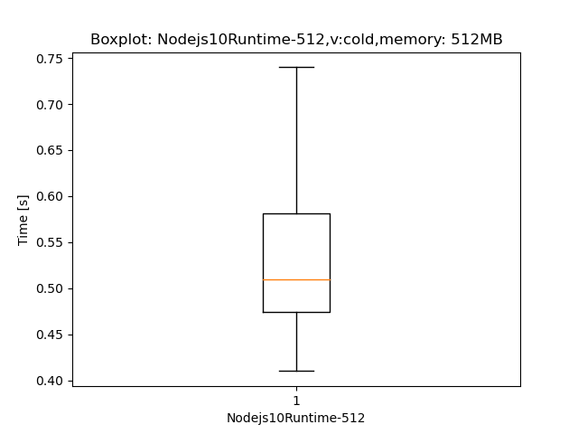
        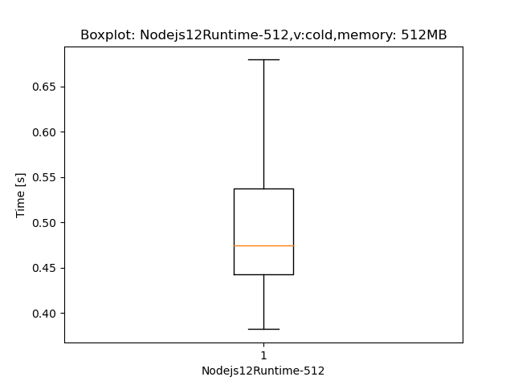
        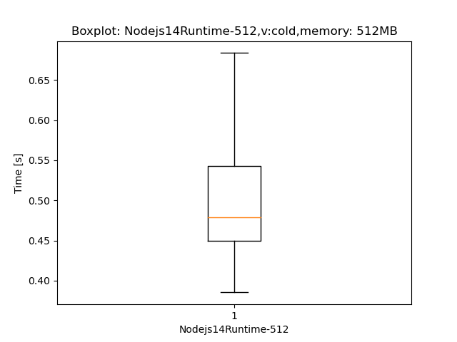
        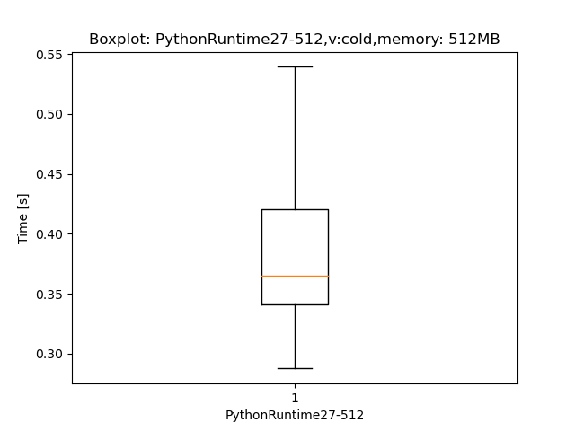
        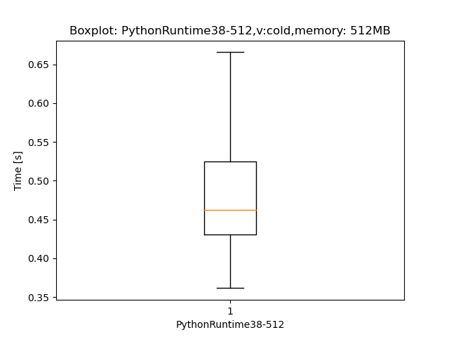
        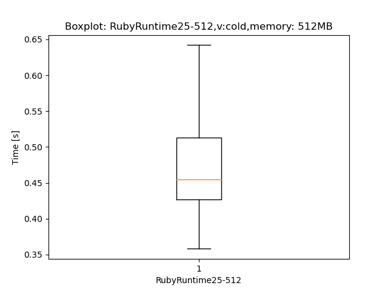
        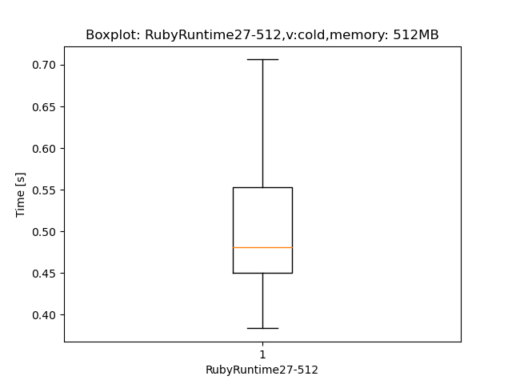
        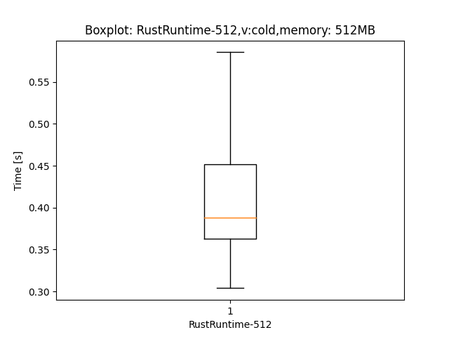
        

        

2.  Lambda with 1024 MB of memory
    In the test two Clojure runtimes has been ignored: ClojureJava8Runtime, ClojureJava11Runtime. Runtimes has been ignored, because the memory size usage exceeds 128MB.
    
    1.  Basic statistics
    
    <table border="2" cellspacing="0" cellpadding="6" rules="groups" frame="hsides">
    
    
    <colgroup>
    <col  class="org-left" />
    
    <col  class="org-right" />
    
    <col  class="org-right" />
    
    <col  class="org-right" />
    
    <col  class="org-right" />
    
    <col  class="org-right" />
    
    <col  class="org-right" />
    
    <col  class="org-right" />
    
    <col  class="org-right" />
    </colgroup>
    <thead>
    <tr>
    <th scope="col" class="org-left">&#xa0;</th>
    <th scope="col" class="org-right">mean</th>
    <th scope="col" class="org-right">std</th>
    <th scope="col" class="org-right">min</th>
    <th scope="col" class="org-right">max</th>
    <th scope="col" class="org-right">25%</th>
    <th scope="col" class="org-right">50%</th>
    <th scope="col" class="org-right">75%</th>
    <th scope="col" class="org-right">status 200 in %</th>
    </tr>
    </thead>
    
    <tbody>
    <tr>
    <td class="org-left">ClojureClojureJava11Runtime-1024</td>
    <td class="org-right">3.36645</td>
    <td class="org-right">1.13659</td>
    <td class="org-right">0.31881</td>
    <td class="org-right">18.2044</td>
    <td class="org-right">2.97407</td>
    <td class="org-right">3.16682</td>
    <td class="org-right">3.30472</td>
    <td class="org-right">100.0%</td>
    </tr>
    
    
    <tr>
    <td class="org-left">ClojureClojureJava11RuntimeTiered-1024</td>
    <td class="org-right">2.22651</td>
    <td class="org-right">0.262903</td>
    <td class="org-right">0.228986</td>
    <td class="org-right">4.92461</td>
    <td class="org-right">2.01665</td>
    <td class="org-right">2.25498</td>
    <td class="org-right">2.37443</td>
    <td class="org-right">100.0%</td>
    </tr>
    
    
    <tr>
    <td class="org-left">ClojureClojureJava8Runtime-1024</td>
    <td class="org-right">3.32426</td>
    <td class="org-right">1.12626</td>
    <td class="org-right">0.19602</td>
    <td class="org-right">17.6994</td>
    <td class="org-right">2.9571</td>
    <td class="org-right">3.12906</td>
    <td class="org-right">3.26439</td>
    <td class="org-right">100.0%</td>
    </tr>
    
    
    <tr>
    <td class="org-left">ClojureClojureJava8RuntimeTiered-1024</td>
    <td class="org-right">2.28794</td>
    <td class="org-right">0.260948</td>
    <td class="org-right">0.237835</td>
    <td class="org-right">4.3893</td>
    <td class="org-right">2.1065</td>
    <td class="org-right">2.30848</td>
    <td class="org-right">2.43066</td>
    <td class="org-right">100.0%</td>
    </tr>
    
    
    <tr>
    <td class="org-left">ClojureGraalVM211CE11-1024</td>
    <td class="org-right">1.40528</td>
    <td class="org-right">1.43247</td>
    <td class="org-right">0.586716</td>
    <td class="org-right">5.89004</td>
    <td class="org-right">0.689155</td>
    <td class="org-right">0.771153</td>
    <td class="org-right">1.27791</td>
    <td class="org-right">100.0%</td>
    </tr>
    
    
    <tr>
    <td class="org-left">ClojureGraalVM211CE8-1024</td>
    <td class="org-right">1.36049</td>
    <td class="org-right">1.39333</td>
    <td class="org-right">0.602205</td>
    <td class="org-right">5.71417</td>
    <td class="org-right">0.687904</td>
    <td class="org-right">0.768454</td>
    <td class="org-right">1.22731</td>
    <td class="org-right">100.0%</td>
    </tr>
    
    
    <tr>
    <td class="org-left">ClojureOnBabashkaRuntime-1024</td>
    <td class="org-right">1.21439</td>
    <td class="org-right">0.69666</td>
    <td class="org-right">0.804709</td>
    <td class="org-right">4.24583</td>
    <td class="org-right">0.932711</td>
    <td class="org-right">0.994268</td>
    <td class="org-right">1.05522</td>
    <td class="org-right">100.0%</td>
    </tr>
    
    
    <tr>
    <td class="org-left">CsharpRuntime-1024</td>
    <td class="org-right">1.15749</td>
    <td class="org-right">0.528916</td>
    <td class="org-right">0.8212</td>
    <td class="org-right">5.65255</td>
    <td class="org-right">0.92031</td>
    <td class="org-right">0.977066</td>
    <td class="org-right">1.21704</td>
    <td class="org-right">100.0%</td>
    </tr>
    
    
    <tr>
    <td class="org-left">GolangRuntime-1024</td>
    <td class="org-right">5.24139</td>
    <td class="org-right">1.09038</td>
    <td class="org-right">4.5587</td>
    <td class="org-right">8.93726</td>
    <td class="org-right">4.77089</td>
    <td class="org-right">4.84622</td>
    <td class="org-right">4.97525</td>
    <td class="org-right">100.0%</td>
    </tr>
    
    
    <tr>
    <td class="org-left">HaskellRuntime-1024</td>
    <td class="org-right">0.657025</td>
    <td class="org-right">0.52389</td>
    <td class="org-right">0.374058</td>
    <td class="org-right">5.13352</td>
    <td class="org-right">0.432022</td>
    <td class="org-right">0.464727</td>
    <td class="org-right">0.699286</td>
    <td class="org-right">100.0%</td>
    </tr>
    
    
    <tr>
    <td class="org-left">Java11Runtime-1024</td>
    <td class="org-right">0.919282</td>
    <td class="org-right">0.487989</td>
    <td class="org-right">0.621063</td>
    <td class="org-right">5.23554</td>
    <td class="org-right">0.703861</td>
    <td class="org-right">0.765396</td>
    <td class="org-right">0.934403</td>
    <td class="org-right">100.0%</td>
    </tr>
    
    
    <tr>
    <td class="org-left">Java8Runtime-1024</td>
    <td class="org-right">0.978826</td>
    <td class="org-right">1.04097</td>
    <td class="org-right">0.455273</td>
    <td class="org-right">5.48466</td>
    <td class="org-right">0.557065</td>
    <td class="org-right">0.614689</td>
    <td class="org-right">0.900265</td>
    <td class="org-right">100.0%</td>
    </tr>
    
    
    <tr>
    <td class="org-left">JavaGraalVM211CE11-1024</td>
    <td class="org-right">1.44422</td>
    <td class="org-right">1.4183</td>
    <td class="org-right">0.646927</td>
    <td class="org-right">5.84971</td>
    <td class="org-right">0.747386</td>
    <td class="org-right">0.836372</td>
    <td class="org-right">1.30113</td>
    <td class="org-right">100.0%</td>
    </tr>
    
    
    <tr>
    <td class="org-left">JavaGraalVM211CE8-1024</td>
    <td class="org-right">1.32661</td>
    <td class="org-right">1.35231</td>
    <td class="org-right">0.623771</td>
    <td class="org-right">5.64823</td>
    <td class="org-right">0.702913</td>
    <td class="org-right">0.772053</td>
    <td class="org-right">1.18091</td>
    <td class="org-right">100.0%</td>
    </tr>
    
    
    <tr>
    <td class="org-left">Nodejs10Runtime-1024</td>
    <td class="org-right">0.614959</td>
    <td class="org-right">0.279299</td>
    <td class="org-right">0.402085</td>
    <td class="org-right">2.06597</td>
    <td class="org-right">0.463518</td>
    <td class="org-right">0.49215</td>
    <td class="org-right">0.620712</td>
    <td class="org-right">100.0%</td>
    </tr>
    
    
    <tr>
    <td class="org-left">Nodejs12Runtime-1024</td>
    <td class="org-right">0.597247</td>
    <td class="org-right">0.28524</td>
    <td class="org-right">0.378149</td>
    <td class="org-right">2.04544</td>
    <td class="org-right">0.434894</td>
    <td class="org-right">0.468485</td>
    <td class="org-right">0.628355</td>
    <td class="org-right">100.0%</td>
    </tr>
    
    
    <tr>
    <td class="org-left">Nodejs14Runtime-1024</td>
    <td class="org-right">0.591239</td>
    <td class="org-right">0.274282</td>
    <td class="org-right">0.387222</td>
    <td class="org-right">2.04022</td>
    <td class="org-right">0.442948</td>
    <td class="org-right">0.473023</td>
    <td class="org-right">0.592988</td>
    <td class="org-right">100.0%</td>
    </tr>
    
    
    <tr>
    <td class="org-left">PythonRuntime27-1024</td>
    <td class="org-right">0.513251</td>
    <td class="org-right">0.335798</td>
    <td class="org-right">0.280968</td>
    <td class="org-right">4.40984</td>
    <td class="org-right">0.339187</td>
    <td class="org-right">0.364225</td>
    <td class="org-right">0.53192</td>
    <td class="org-right">100.0%</td>
    </tr>
    
    
    <tr>
    <td class="org-left">PythonRuntime38-1024</td>
    <td class="org-right">0.59943</td>
    <td class="org-right">0.345077</td>
    <td class="org-right">0.360125</td>
    <td class="org-right">4.53273</td>
    <td class="org-right">0.423322</td>
    <td class="org-right">0.455856</td>
    <td class="org-right">0.625665</td>
    <td class="org-right">100.0%</td>
    </tr>
    
    
    <tr>
    <td class="org-left">RubyRuntime25-1024</td>
    <td class="org-right">0.571561</td>
    <td class="org-right">0.287245</td>
    <td class="org-right">0.353553</td>
    <td class="org-right">2.20559</td>
    <td class="org-right">0.419758</td>
    <td class="org-right">0.448914</td>
    <td class="org-right">0.581847</td>
    <td class="org-right">100.0%</td>
    </tr>
    
    
    <tr>
    <td class="org-left">RubyRuntime27-1024</td>
    <td class="org-right">0.624502</td>
    <td class="org-right">0.368428</td>
    <td class="org-right">0.373373</td>
    <td class="org-right">4.70633</td>
    <td class="org-right">0.445694</td>
    <td class="org-right">0.480279</td>
    <td class="org-right">0.647376</td>
    <td class="org-right">100.0%</td>
    </tr>
    
    
    <tr>
    <td class="org-left">RustRuntime-1024</td>
    <td class="org-right">0.631884</td>
    <td class="org-right">0.598159</td>
    <td class="org-right">0.321131</td>
    <td class="org-right">5.08821</td>
    <td class="org-right">0.380808</td>
    <td class="org-right">0.413442</td>
    <td class="org-right">0.634221</td>
    <td class="org-right">100.0%</td>
    </tr>
    </tbody>
    </table>
    
    1.  Box plot
        
        **Boxplot all functions**
        
        

        
        

        
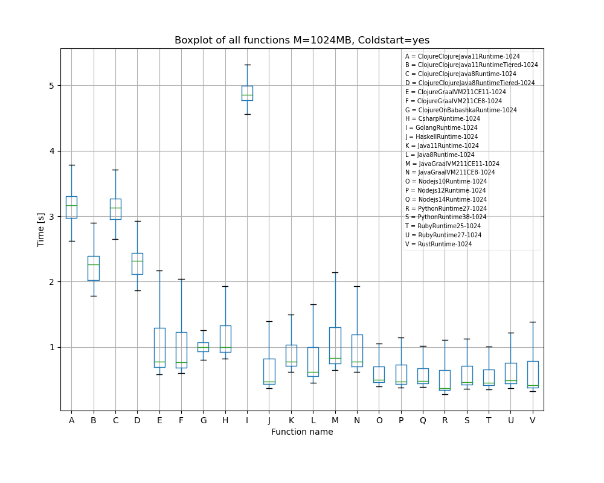
        

        

        

        
        **Individual boxplots**
        
        

        

        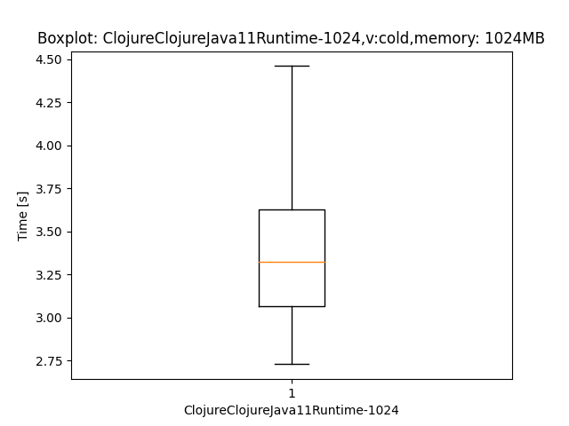
        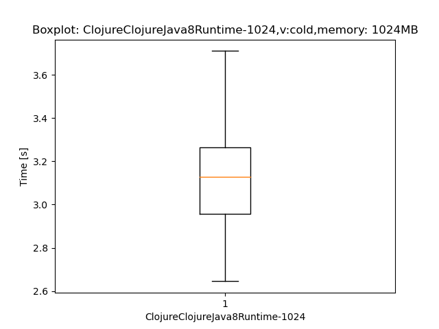
        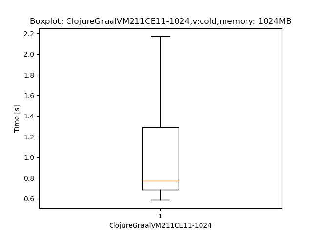
        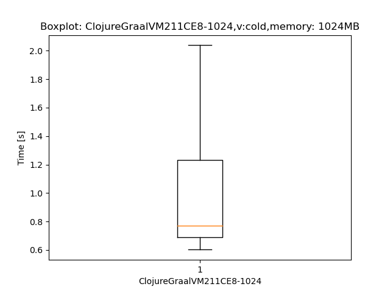
        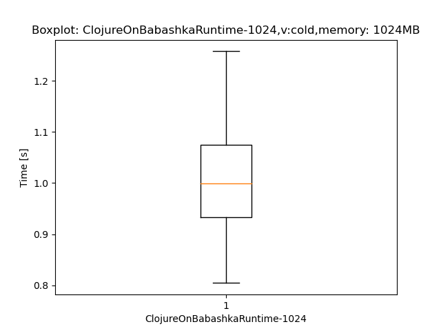
        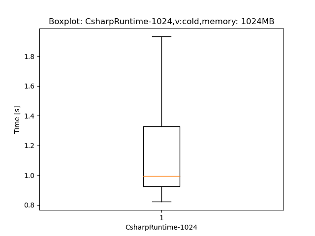
        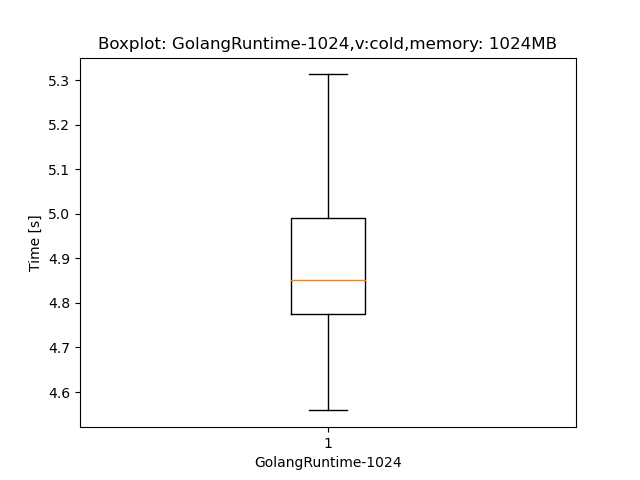
        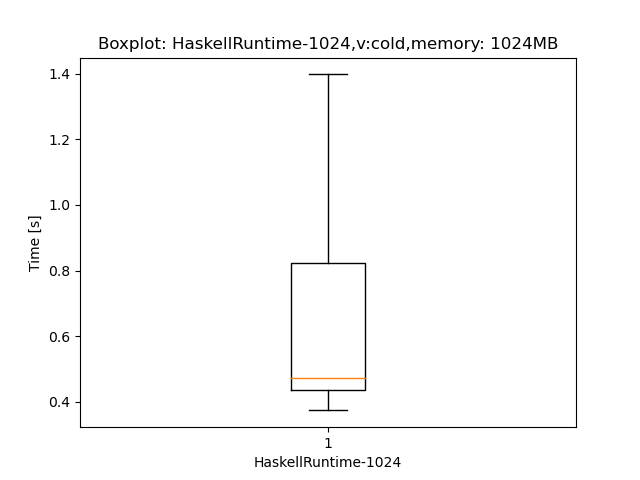
        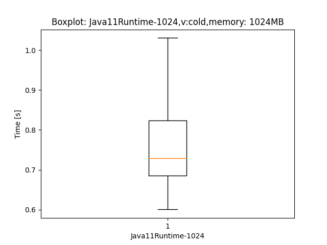
        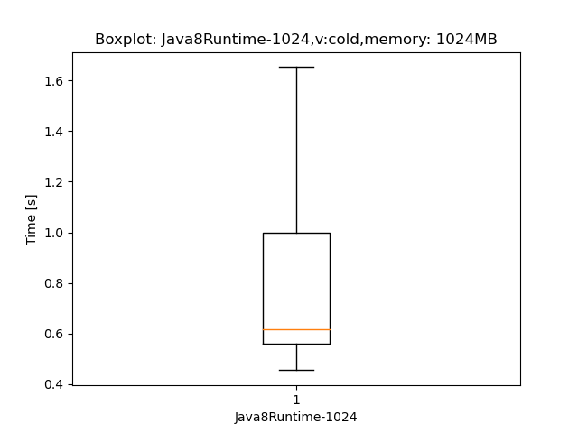
        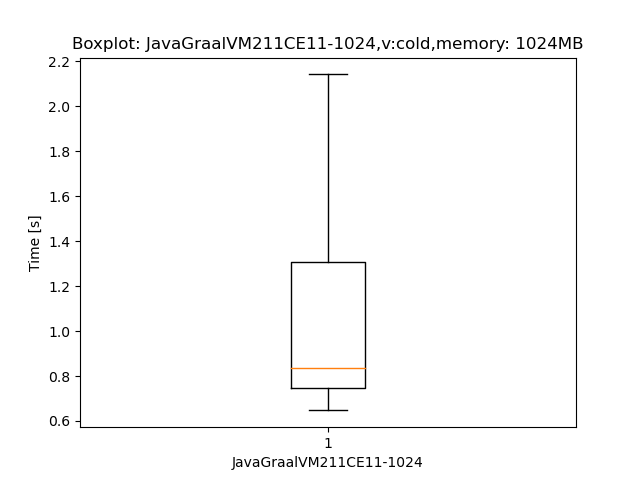
        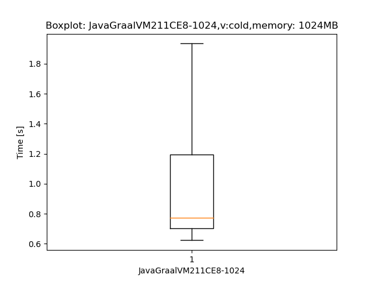
        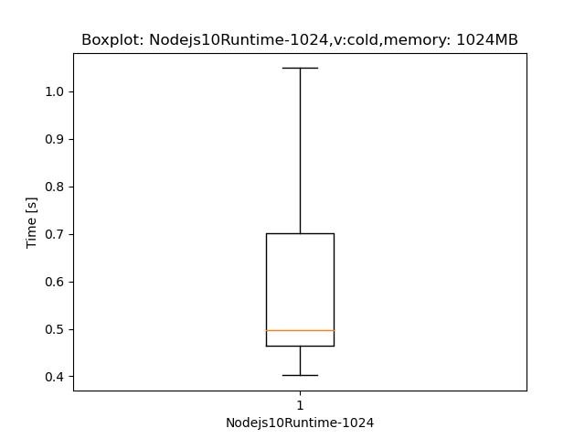
        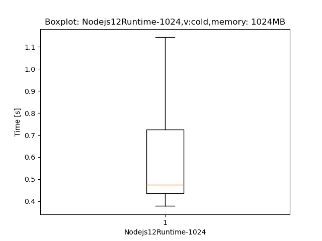
        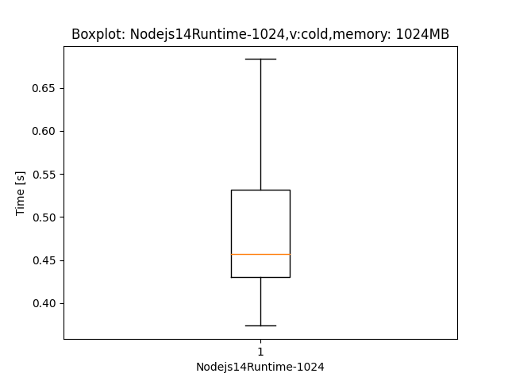
        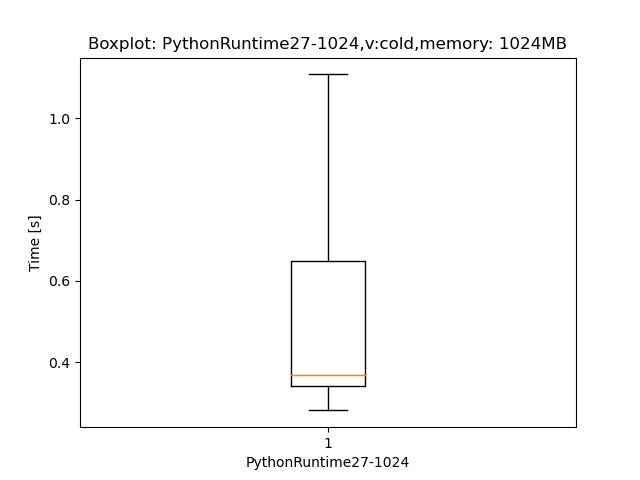
        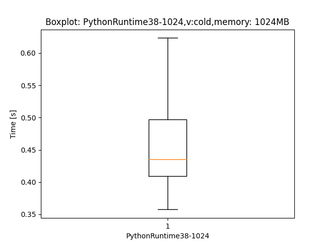
        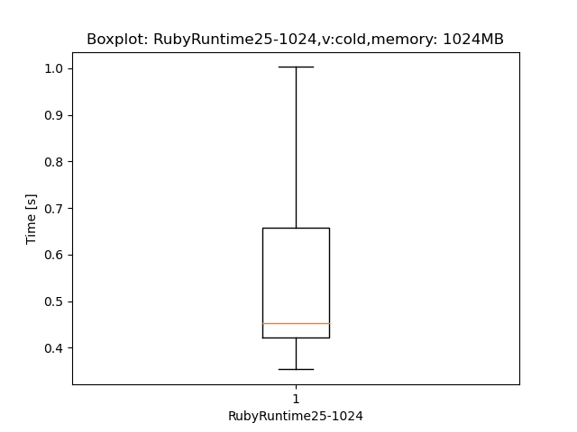
        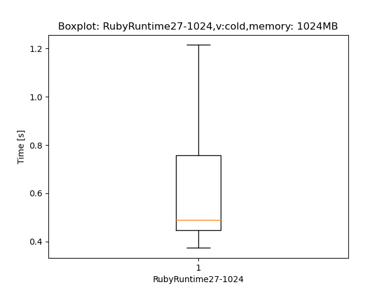
        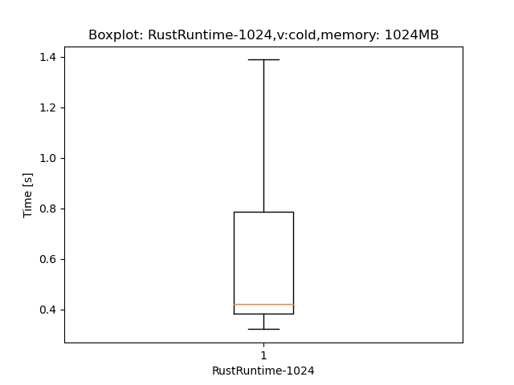
        

        

3.  Lambda with 2048MB of memory
    All possible runtimes are included.
    
    1.  Basic statistics
    
    <table border="2" cellspacing="0" cellpadding="6" rules="groups" frame="hsides">
    
    
    <colgroup>
    <col  class="org-left" />
    
    <col  class="org-right" />
    
    <col  class="org-right" />
    
    <col  class="org-right" />
    
    <col  class="org-right" />
    
    <col  class="org-right" />
    
    <col  class="org-right" />
    
    <col  class="org-right" />
    
    <col  class="org-right" />
    </colgroup>
    <thead>
    <tr>
    <th scope="col" class="org-left">&#xa0;</th>
    <th scope="col" class="org-right">mean</th>
    <th scope="col" class="org-right">std</th>
    <th scope="col" class="org-right">min</th>
    <th scope="col" class="org-right">max</th>
    <th scope="col" class="org-right">25%</th>
    <th scope="col" class="org-right">50%</th>
    <th scope="col" class="org-right">75%</th>
    <th scope="col" class="org-right">status 200 in %</th>
    </tr>
    </thead>
    
    <tbody>
    <tr>
    <td class="org-left">ClojureClojureJava11Runtime-2048</td>
    <td class="org-right">2.97934</td>
    <td class="org-right">0.305558</td>
    <td class="org-right">2.35627</td>
    <td class="org-right">6.23715</td>
    <td class="org-right">2.75644</td>
    <td class="org-right">2.97813</td>
    <td class="org-right">3.14606</td>
    <td class="org-right">99.9%</td>
    </tr>
    
    
    <tr>
    <td class="org-left">ClojureClojureJava11RuntimeTiered-2048</td>
    <td class="org-right">2.14507</td>
    <td class="org-right">0.270302</td>
    <td class="org-right">1.6662</td>
    <td class="org-right">4.2253</td>
    <td class="org-right">1.92348</td>
    <td class="org-right">2.16617</td>
    <td class="org-right">2.30427</td>
    <td class="org-right">99.9%</td>
    </tr>
    
    
    <tr>
    <td class="org-left">ClojureClojureJava8Runtime-2048</td>
    <td class="org-right">2.7603</td>
    <td class="org-right">0.312006</td>
    <td class="org-right">0.2092</td>
    <td class="org-right">6.02485</td>
    <td class="org-right">2.56879</td>
    <td class="org-right">2.76506</td>
    <td class="org-right">2.90171</td>
    <td class="org-right">100.0%</td>
    </tr>
    
    
    <tr>
    <td class="org-left">ClojureClojureJava8RuntimeTiered-2048</td>
    <td class="org-right">2.17027</td>
    <td class="org-right">0.318095</td>
    <td class="org-right">-1</td>
    <td class="org-right">5.59403</td>
    <td class="org-right">1.96743</td>
    <td class="org-right">2.18556</td>
    <td class="org-right">2.30797</td>
    <td class="org-right">99.9%</td>
    </tr>
    
    
    <tr>
    <td class="org-left">ClojureGraalVM211CE11-2048</td>
    <td class="org-right">1.39295</td>
    <td class="org-right">1.47731</td>
    <td class="org-right">0.586302</td>
    <td class="org-right">6.26732</td>
    <td class="org-right">0.683427</td>
    <td class="org-right">0.759486</td>
    <td class="org-right">1.19435</td>
    <td class="org-right">100.0%</td>
    </tr>
    
    
    <tr>
    <td class="org-left">ClojureGraalVM211CE8-2048</td>
    <td class="org-right">1.43352</td>
    <td class="org-right">1.53044</td>
    <td class="org-right">0.601307</td>
    <td class="org-right">6.17938</td>
    <td class="org-right">0.684293</td>
    <td class="org-right">0.750363</td>
    <td class="org-right">1.21159</td>
    <td class="org-right">100.0%</td>
    </tr>
    
    
    <tr>
    <td class="org-left">ClojureJava11Runtime-2048</td>
    <td class="org-right">4.30164</td>
    <td class="org-right">1.62848</td>
    <td class="org-right">3.16741</td>
    <td class="org-right">9.53551</td>
    <td class="org-right">3.51093</td>
    <td class="org-right">3.64533</td>
    <td class="org-right">4.0512</td>
    <td class="org-right">100.0%</td>
    </tr>
    
    
    <tr>
    <td class="org-left">ClojureJava8Runtime-2048</td>
    <td class="org-right">3.98749</td>
    <td class="org-right">1.6312</td>
    <td class="org-right">2.81642</td>
    <td class="org-right">9.44418</td>
    <td class="org-right">3.22416</td>
    <td class="org-right">3.34342</td>
    <td class="org-right">3.71174</td>
    <td class="org-right">100.0%</td>
    </tr>
    
    
    <tr>
    <td class="org-left">ClojureOnBabashkaRuntime-2048</td>
    <td class="org-right">1.3366</td>
    <td class="org-right">0.881247</td>
    <td class="org-right">0.780058</td>
    <td class="org-right">4.66707</td>
    <td class="org-right">0.939583</td>
    <td class="org-right">1.02046</td>
    <td class="org-right">1.11885</td>
    <td class="org-right">100.0%</td>
    </tr>
    
    
    <tr>
    <td class="org-left">CsharpRuntime-2048</td>
    <td class="org-right">0.954278</td>
    <td class="org-right">0.498195</td>
    <td class="org-right">0.674211</td>
    <td class="org-right">5.4533</td>
    <td class="org-right">0.745688</td>
    <td class="org-right">0.794178</td>
    <td class="org-right">0.975116</td>
    <td class="org-right">100.0%</td>
    </tr>
    
    
    <tr>
    <td class="org-left">GolangRuntime-2048</td>
    <td class="org-right">5.37647</td>
    <td class="org-right">1.23689</td>
    <td class="org-right">4.56457</td>
    <td class="org-right">9.33388</td>
    <td class="org-right">4.79242</td>
    <td class="org-right">4.86713</td>
    <td class="org-right">5.0314</td>
    <td class="org-right">100.0%</td>
    </tr>
    
    
    <tr>
    <td class="org-left">HaskellRuntime-2048</td>
    <td class="org-right">0.944637</td>
    <td class="org-right">1.25769</td>
    <td class="org-right">0.376664</td>
    <td class="org-right">5.45453</td>
    <td class="org-right">0.434415</td>
    <td class="org-right">0.468842</td>
    <td class="org-right">0.760983</td>
    <td class="org-right">100.0%</td>
    </tr>
    
    
    <tr>
    <td class="org-left">Java11Runtime-2048</td>
    <td class="org-right">1.2425</td>
    <td class="org-right">1.29723</td>
    <td class="org-right">0.615552</td>
    <td class="org-right">5.70704</td>
    <td class="org-right">0.691166</td>
    <td class="org-right">0.7554</td>
    <td class="org-right">1.05878</td>
    <td class="org-right">100.0%</td>
    </tr>
    
    
    <tr>
    <td class="org-left">Java8Runtime-2048</td>
    <td class="org-right">1.12245</td>
    <td class="org-right">1.31426</td>
    <td class="org-right">-1</td>
    <td class="org-right">5.69256</td>
    <td class="org-right">0.557118</td>
    <td class="org-right">0.60118</td>
    <td class="org-right">0.989592</td>
    <td class="org-right">99.9%</td>
    </tr>
    
    
    <tr>
    <td class="org-left">JavaGraalVM211CE11-2048</td>
    <td class="org-right">1.34834</td>
    <td class="org-right">1.36496</td>
    <td class="org-right">0.632538</td>
    <td class="org-right">5.96589</td>
    <td class="org-right">0.739123</td>
    <td class="org-right">0.7994</td>
    <td class="org-right">1.14098</td>
    <td class="org-right">100.0%</td>
    </tr>
    
    
    <tr>
    <td class="org-left">JavaGraalVM211CE8-2048</td>
    <td class="org-right">1.46387</td>
    <td class="org-right">1.55524</td>
    <td class="org-right">0.5993</td>
    <td class="org-right">6.53289</td>
    <td class="org-right">0.697774</td>
    <td class="org-right">0.759916</td>
    <td class="org-right">1.19597</td>
    <td class="org-right">100.0%</td>
    </tr>
    
    
    <tr>
    <td class="org-left">Nodejs10Runtime-2048</td>
    <td class="org-right">0.621477</td>
    <td class="org-right">0.344925</td>
    <td class="org-right">0.400507</td>
    <td class="org-right">4.66429</td>
    <td class="org-right">0.463118</td>
    <td class="org-right">0.491526</td>
    <td class="org-right">0.617317</td>
    <td class="org-right">100.0%</td>
    </tr>
    
    
    <tr>
    <td class="org-left">Nodejs12Runtime-2048</td>
    <td class="org-right">0.634559</td>
    <td class="org-right">0.497761</td>
    <td class="org-right">0.372049</td>
    <td class="org-right">5.1668</td>
    <td class="org-right">0.435652</td>
    <td class="org-right">0.467707</td>
    <td class="org-right">0.602701</td>
    <td class="org-right">100.0%</td>
    </tr>
    
    
    <tr>
    <td class="org-left">Nodejs14Runtime-2048</td>
    <td class="org-right">0.633727</td>
    <td class="org-right">0.430799</td>
    <td class="org-right">0.372838</td>
    <td class="org-right">5.20183</td>
    <td class="org-right">0.442149</td>
    <td class="org-right">0.475561</td>
    <td class="org-right">0.653626</td>
    <td class="org-right">100.0%</td>
    </tr>
    
    
    <tr>
    <td class="org-left">PythonRuntime27-2048</td>
    <td class="org-right">0.530443</td>
    <td class="org-right">0.488467</td>
    <td class="org-right">0.285741</td>
    <td class="org-right">5.11973</td>
    <td class="org-right">0.339708</td>
    <td class="org-right">0.363233</td>
    <td class="org-right">0.490204</td>
    <td class="org-right">100.0%</td>
    </tr>
    
    
    <tr>
    <td class="org-left">PythonRuntime38-2048</td>
    <td class="org-right">0.576295</td>
    <td class="org-right">0.297033</td>
    <td class="org-right">0.352728</td>
    <td class="org-right">4.13077</td>
    <td class="org-right">0.425913</td>
    <td class="org-right">0.458038</td>
    <td class="org-right">0.564474</td>
    <td class="org-right">100.0%</td>
    </tr>
    
    
    <tr>
    <td class="org-left">RubyRuntime25-2048</td>
    <td class="org-right">0.578372</td>
    <td class="org-right">0.324729</td>
    <td class="org-right">0.358704</td>
    <td class="org-right">4.58618</td>
    <td class="org-right">0.4192</td>
    <td class="org-right">0.447618</td>
    <td class="org-right">0.550013</td>
    <td class="org-right">100.0%</td>
    </tr>
    
    
    <tr>
    <td class="org-left">RubyRuntime27-2048</td>
    <td class="org-right">0.600237</td>
    <td class="org-right">0.284012</td>
    <td class="org-right">0.374218</td>
    <td class="org-right">2.37509</td>
    <td class="org-right">0.444613</td>
    <td class="org-right">0.478494</td>
    <td class="org-right">0.589735</td>
    <td class="org-right">100.0%</td>
    </tr>
    
    
    <tr>
    <td class="org-left">RustRuntime-2048</td>
    <td class="org-right">0.976868</td>
    <td class="org-right">1.3904</td>
    <td class="org-right">0.321094</td>
    <td class="org-right">5.57102</td>
    <td class="org-right">0.382666</td>
    <td class="org-right">0.413257</td>
    <td class="org-right">0.753409</td>
    <td class="org-right">100.0%</td>
    </tr>
    </tbody>
    </table>
    
    1.  Box plot
        
        **Boxplot all functions**
        
        

        
        

        
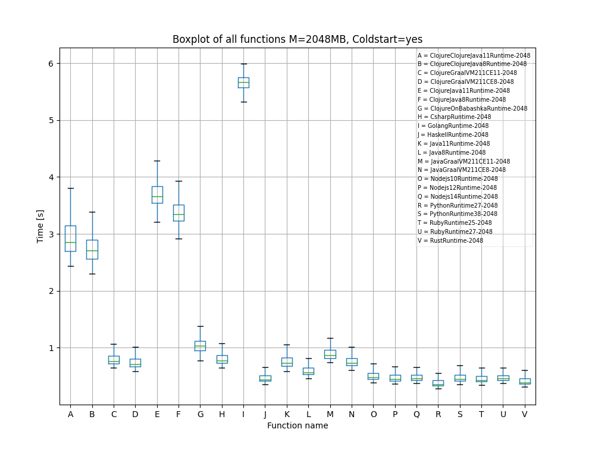
        

        

        

        
        **Individual boxplots**
        
        

        

        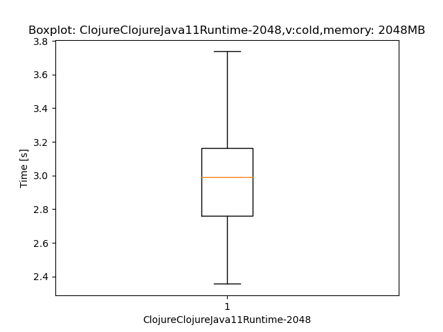
        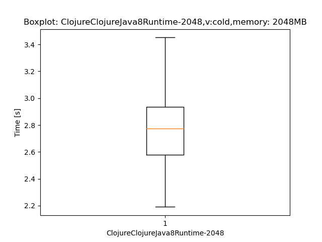
        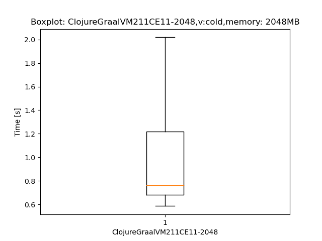
        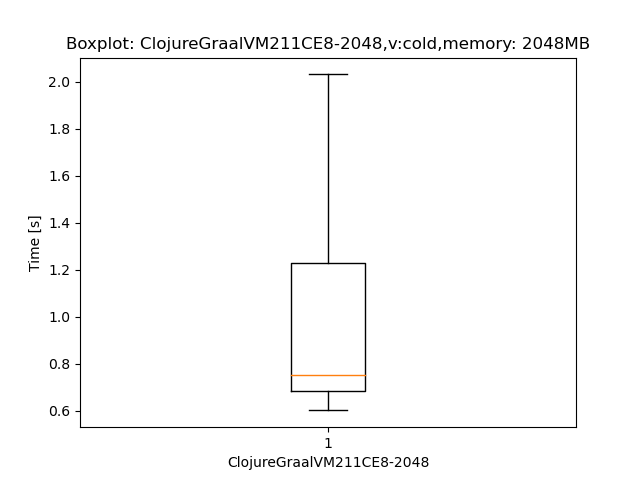
        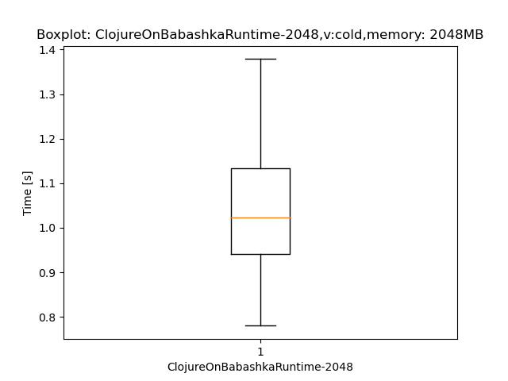
        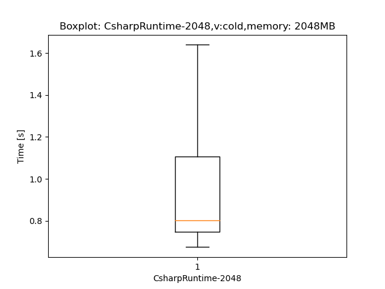
        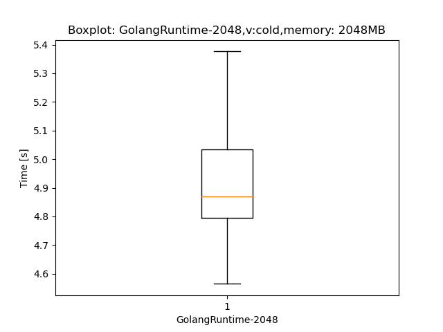
        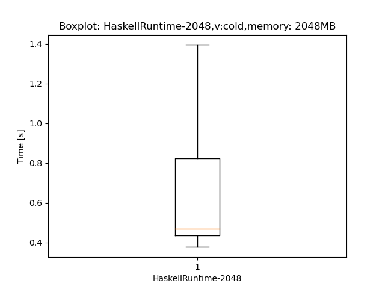
        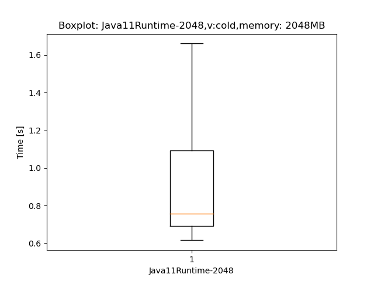
        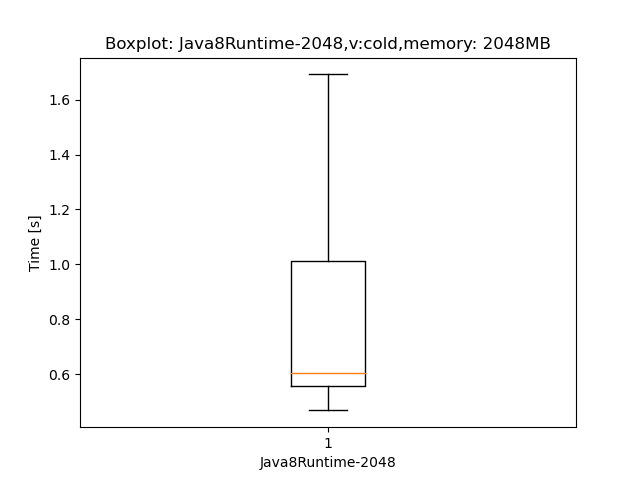
        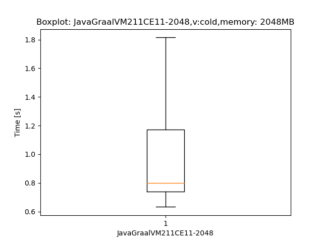
        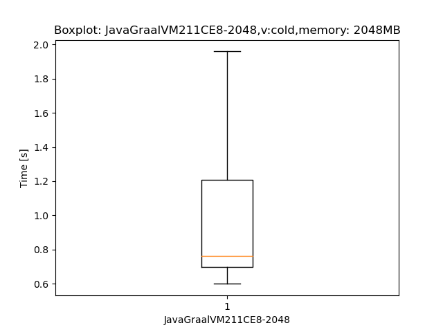
        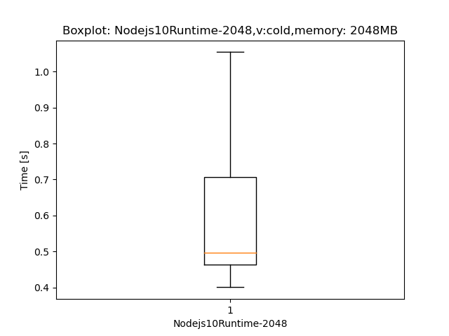
        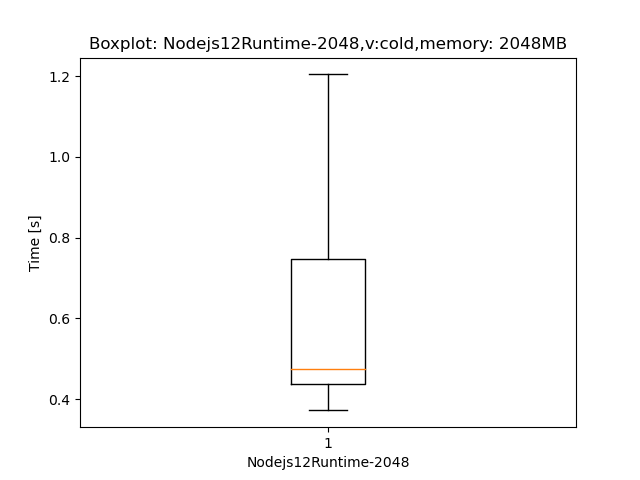
        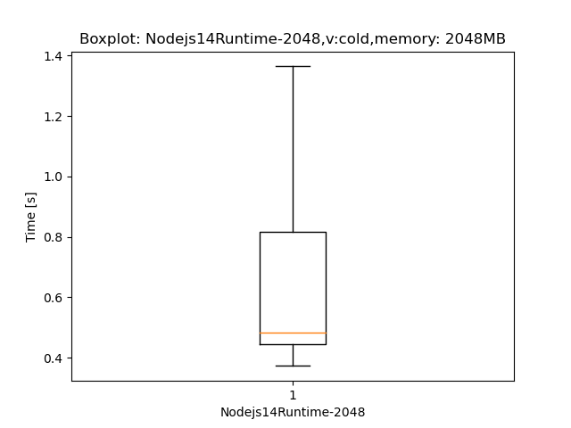
        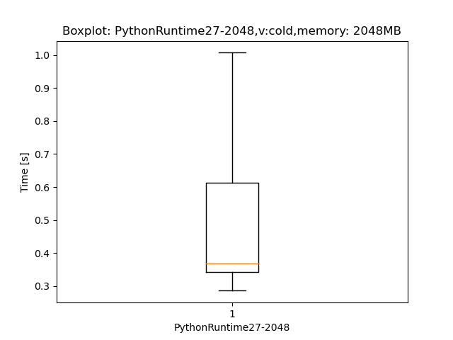
        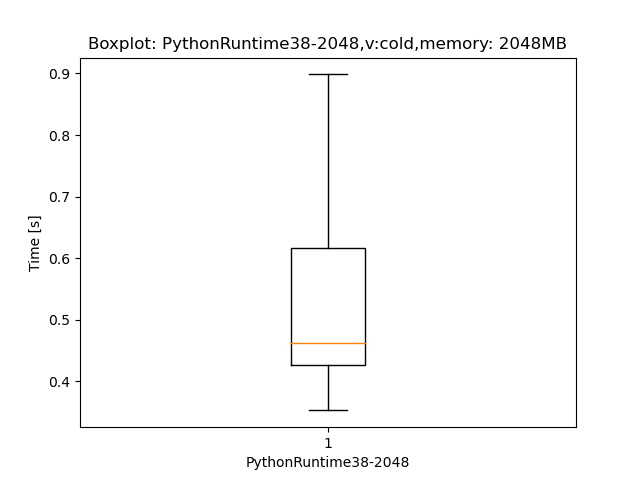
        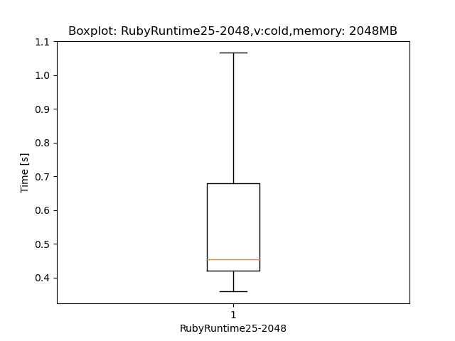
        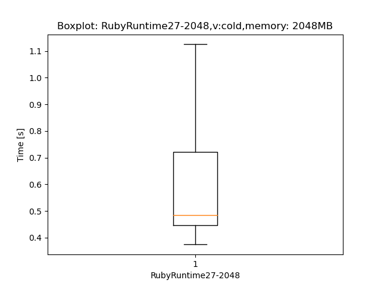
        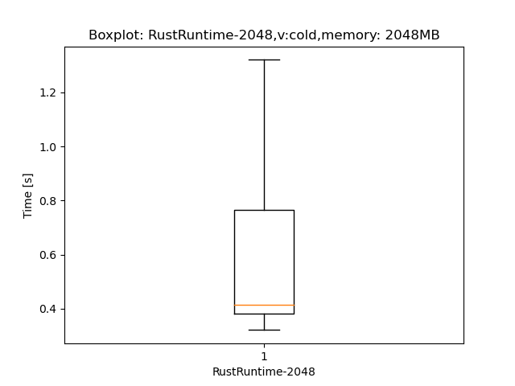
        

        

1.  Variant 2
    1.  Lambda with 128 MB of memory
        In the test two Clojure runtimes has been ignored: ClojureJava8Runtime, ClojureJava11Runtime.
        Runtimes has been ignored, because the memory size usage exceeds 128MB.
        
        1.  Basic statistics
        
        <table border="2" cellspacing="0" cellpadding="6" rules="groups" frame="hsides">
        
        
        <colgroup>
        <col  class="org-left" />
        
        <col  class="org-right" />
        
        <col  class="org-right" />
        
        <col  class="org-right" />
        
        <col  class="org-right" />
        
        <col  class="org-right" />
        
        <col  class="org-right" />
        
        <col  class="org-right" />
        
        <col  class="org-right" />
        </colgroup>
        <thead>
        <tr>
        <th scope="col" class="org-left">&#xa0;</th>
        <th scope="col" class="org-right">mean</th>
        <th scope="col" class="org-right">std</th>
        <th scope="col" class="org-right">min</th>
        <th scope="col" class="org-right">max</th>
        <th scope="col" class="org-right">25%</th>
        <th scope="col" class="org-right">50%</th>
        <th scope="col" class="org-right">75%</th>
        <th scope="col" class="org-right">status 200 in %</th>
        </tr>
        </thead>
        
        <tbody>
        <tr>
        <td class="org-left">ClojureClojureJava11Runtime-128</td>
        <td class="org-right">0.3855</td>
        <td class="org-right">0.127072</td>
        <td class="org-right">0.224779</td>
        <td class="org-right">1.12871</td>
        <td class="org-right">0.303415</td>
        <td class="org-right">0.336821</td>
        <td class="org-right">0.436888</td>
        <td class="org-right">100.0%</td>
        </tr>
        
        
        <tr>
        <td class="org-left">ClojureClojureJava11RuntimeTiered-128</td>
        <td class="org-right">0.390112</td>
        <td class="org-right">0.128103</td>
        <td class="org-right">0.240021</td>
        <td class="org-right">1.11713</td>
        <td class="org-right">0.307164</td>
        <td class="org-right">0.338022</td>
        <td class="org-right">0.445678</td>
        <td class="org-right">100.0%</td>
        </tr>
        
        
        <tr>
        <td class="org-left">ClojureClojureJava8Runtime-128</td>
        <td class="org-right">0.320541</td>
        <td class="org-right">0.0996134</td>
        <td class="org-right">0.193702</td>
        <td class="org-right">0.899914</td>
        <td class="org-right">0.253642</td>
        <td class="org-right">0.291156</td>
        <td class="org-right">0.350359</td>
        <td class="org-right">100.0%</td>
        </tr>
        
        
        <tr>
        <td class="org-left">ClojureClojureJava8RuntimeTiered-128</td>
        <td class="org-right">0.367066</td>
        <td class="org-right">0.108136</td>
        <td class="org-right">0.212605</td>
        <td class="org-right">0.934313</td>
        <td class="org-right">0.296582</td>
        <td class="org-right">0.331558</td>
        <td class="org-right">0.406811</td>
        <td class="org-right">100.0%</td>
        </tr>
        
        
        <tr>
        <td class="org-left">ClojureGraalVM211CE11-128</td>
        <td class="org-right">0.309127</td>
        <td class="org-right">0.10483</td>
        <td class="org-right">0.172608</td>
        <td class="org-right">0.982413</td>
        <td class="org-right">0.241335</td>
        <td class="org-right">0.275929</td>
        <td class="org-right">0.338582</td>
        <td class="org-right">100.0%</td>
        </tr>
        
        
        <tr>
        <td class="org-left">ClojureGraalVM211CE8-128</td>
        <td class="org-right">0.375414</td>
        <td class="org-right">0.116741</td>
        <td class="org-right">0.214749</td>
        <td class="org-right">0.920598</td>
        <td class="org-right">0.299092</td>
        <td class="org-right">0.330723</td>
        <td class="org-right">0.418968</td>
        <td class="org-right">100.0%</td>
        </tr>
        
        
        <tr>
        <td class="org-left">ClojureOnBabashkaRuntime-128</td>
        <td class="org-right">0.389648</td>
        <td class="org-right">0.126757</td>
        <td class="org-right">0.233808</td>
        <td class="org-right">1.08471</td>
        <td class="org-right">0.306355</td>
        <td class="org-right">0.335069</td>
        <td class="org-right">0.444421</td>
        <td class="org-right">100.0%</td>
        </tr>
        
        
        <tr>
        <td class="org-left">CsharpRuntime-128</td>
        <td class="org-right">0.356877</td>
        <td class="org-right">0.105933</td>
        <td class="org-right">0.181759</td>
        <td class="org-right">0.851053</td>
        <td class="org-right">0.29025</td>
        <td class="org-right">0.322528</td>
        <td class="org-right">0.396913</td>
        <td class="org-right">100.0%</td>
        </tr>
        
        
        <tr>
        <td class="org-left">GolangRuntime-128</td>
        <td class="org-right">0.343877</td>
        <td class="org-right">0.109964</td>
        <td class="org-right">0.186073</td>
        <td class="org-right">1.03035</td>
        <td class="org-right">0.273514</td>
        <td class="org-right">0.312825</td>
        <td class="org-right">0.379621</td>
        <td class="org-right">100.0%</td>
        </tr>
        
        
        <tr>
        <td class="org-left">HaskellRuntime-128</td>
        <td class="org-right">0.379583</td>
        <td class="org-right">0.122559</td>
        <td class="org-right">0.199435</td>
        <td class="org-right">1.04466</td>
        <td class="org-right">0.299388</td>
        <td class="org-right">0.331164</td>
        <td class="org-right">0.427482</td>
        <td class="org-right">100.0%</td>
        </tr>
        
        
        <tr>
        <td class="org-left">Java11Runtime-128</td>
        <td class="org-right">0.378549</td>
        <td class="org-right">0.125963</td>
        <td class="org-right">0.209511</td>
        <td class="org-right">1.16437</td>
        <td class="org-right">0.298437</td>
        <td class="org-right">0.328766</td>
        <td class="org-right">0.42423</td>
        <td class="org-right">100.0%</td>
        </tr>
        
        
        <tr>
        <td class="org-left">Java8Runtime-128</td>
        <td class="org-right">0.38392</td>
        <td class="org-right">0.126028</td>
        <td class="org-right">0.176963</td>
        <td class="org-right">1.10225</td>
        <td class="org-right">0.30366</td>
        <td class="org-right">0.334004</td>
        <td class="org-right">0.431535</td>
        <td class="org-right">100.0%</td>
        </tr>
        
        
        <tr>
        <td class="org-left">JavaGraalVM211CE11-128</td>
        <td class="org-right">0.350163</td>
        <td class="org-right">0.115198</td>
        <td class="org-right">0.186874</td>
        <td class="org-right">1.12247</td>
        <td class="org-right">0.279203</td>
        <td class="org-right">0.318719</td>
        <td class="org-right">0.383795</td>
        <td class="org-right">100.0%</td>
        </tr>
        
        
        <tr>
        <td class="org-left">JavaGraalVM211CE8-128</td>
        <td class="org-right">0.305591</td>
        <td class="org-right">0.105521</td>
        <td class="org-right">0.173112</td>
        <td class="org-right">0.915291</td>
        <td class="org-right">0.235215</td>
        <td class="org-right">0.270971</td>
        <td class="org-right">0.33678</td>
        <td class="org-right">100.0%</td>
        </tr>
        
        
        <tr>
        <td class="org-left">Nodejs10Runtime-128</td>
        <td class="org-right">0.37497</td>
        <td class="org-right">0.118291</td>
        <td class="org-right">0.212375</td>
        <td class="org-right">1.0184</td>
        <td class="org-right">0.298668</td>
        <td class="org-right">0.331569</td>
        <td class="org-right">0.412553</td>
        <td class="org-right">100.0%</td>
        </tr>
        
        
        <tr>
        <td class="org-left">Nodejs12Runtime-128</td>
        <td class="org-right">0.327761</td>
        <td class="org-right">0.104622</td>
        <td class="org-right">0.186369</td>
        <td class="org-right">0.886587</td>
        <td class="org-right">0.257198</td>
        <td class="org-right">0.303451</td>
        <td class="org-right">0.362252</td>
        <td class="org-right">100.0%</td>
        </tr>
        
        
        <tr>
        <td class="org-left">Nodejs14Runtime-128</td>
        <td class="org-right">0.346969</td>
        <td class="org-right">0.107732</td>
        <td class="org-right">0.187367</td>
        <td class="org-right">0.944356</td>
        <td class="org-right">0.277928</td>
        <td class="org-right">0.312081</td>
        <td class="org-right">0.380987</td>
        <td class="org-right">100.0%</td>
        </tr>
        
        
        <tr>
        <td class="org-left">PythonRuntime27-128</td>
        <td class="org-right">0.379833</td>
        <td class="org-right">0.120104</td>
        <td class="org-right">0.217203</td>
        <td class="org-right">0.977981</td>
        <td class="org-right">0.300337</td>
        <td class="org-right">0.331067</td>
        <td class="org-right">0.433847</td>
        <td class="org-right">100.0%</td>
        </tr>
        
        
        <tr>
        <td class="org-left">PythonRuntime38-128</td>
        <td class="org-right">0.306507</td>
        <td class="org-right">0.109936</td>
        <td class="org-right">0.184855</td>
        <td class="org-right">1.00847</td>
        <td class="org-right">0.235879</td>
        <td class="org-right">0.269254</td>
        <td class="org-right">0.336101</td>
        <td class="org-right">100.0%</td>
        </tr>
        
        
        <tr>
        <td class="org-left">RubyRuntime25-128</td>
        <td class="org-right">0.347371</td>
        <td class="org-right">0.101273</td>
        <td class="org-right">0.192205</td>
        <td class="org-right">0.850099</td>
        <td class="org-right">0.280906</td>
        <td class="org-right">0.317789</td>
        <td class="org-right">0.38354</td>
        <td class="org-right">100.0%</td>
        </tr>
        
        
        <tr>
        <td class="org-left">RubyRuntime27-128</td>
        <td class="org-right">0.385044</td>
        <td class="org-right">0.119278</td>
        <td class="org-right">0.224737</td>
        <td class="org-right">1.02913</td>
        <td class="org-right">0.306523</td>
        <td class="org-right">0.335905</td>
        <td class="org-right">0.437847</td>
        <td class="org-right">100.0%</td>
        </tr>
        
        
        <tr>
        <td class="org-left">RustRuntime-128</td>
        <td class="org-right">0.346516</td>
        <td class="org-right">0.109695</td>
        <td class="org-right">0.180404</td>
        <td class="org-right">0.980337</td>
        <td class="org-right">0.277646</td>
        <td class="org-right">0.314024</td>
        <td class="org-right">0.380203</td>
        <td class="org-right">100.0%</td>
        </tr>
        </tbody>
        </table>
        
        1.  Box plot
            
            **Boxplot all functions**
            
            

            
            

            
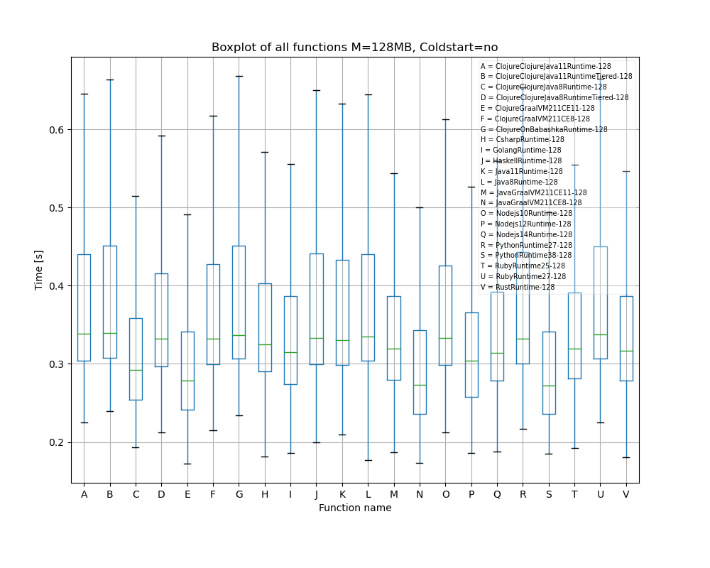
            

            

            

            
            **Individual boxplots**
            
            

            

            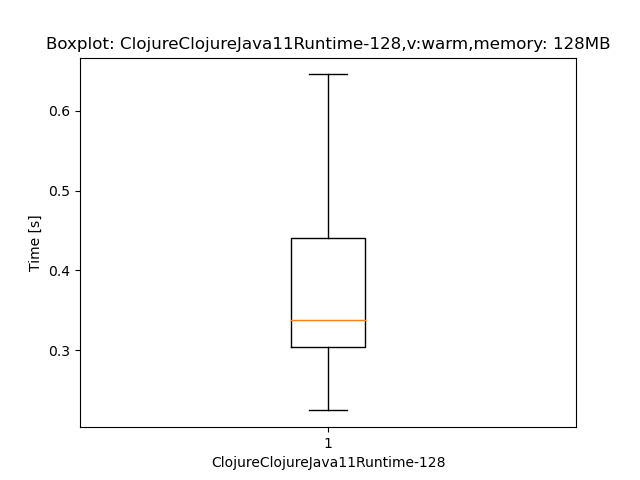
            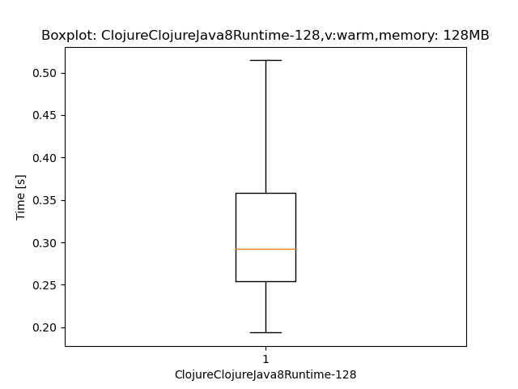
            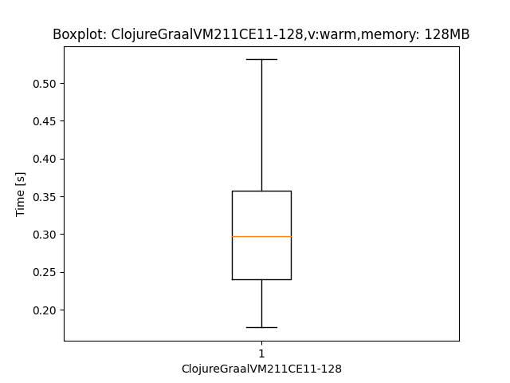
            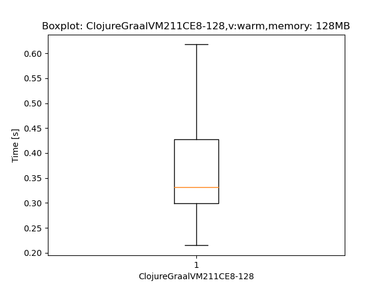
            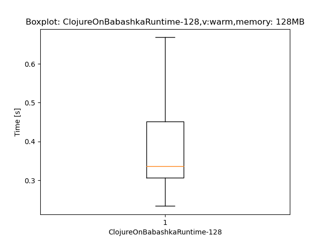
            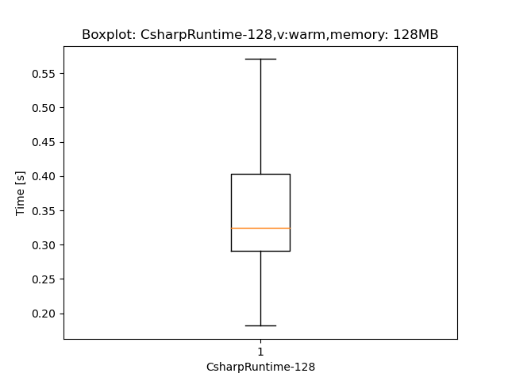
            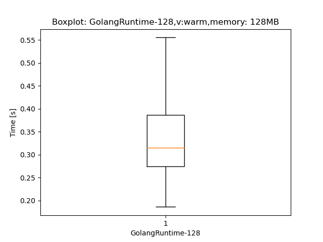
            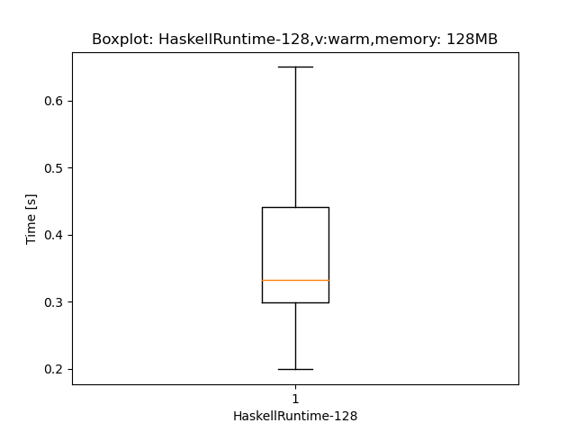
            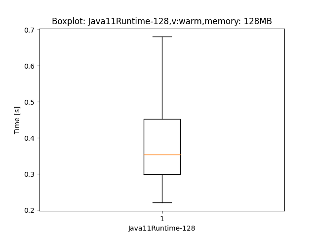
            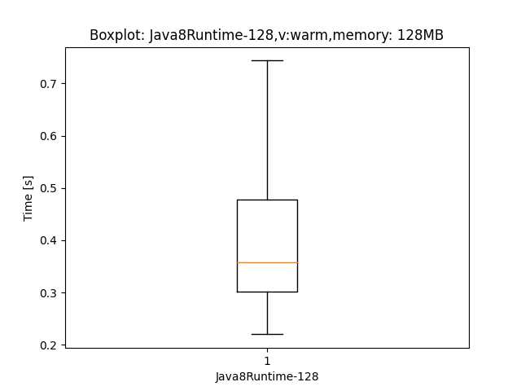
            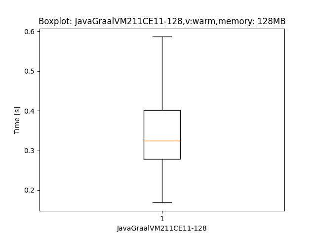
            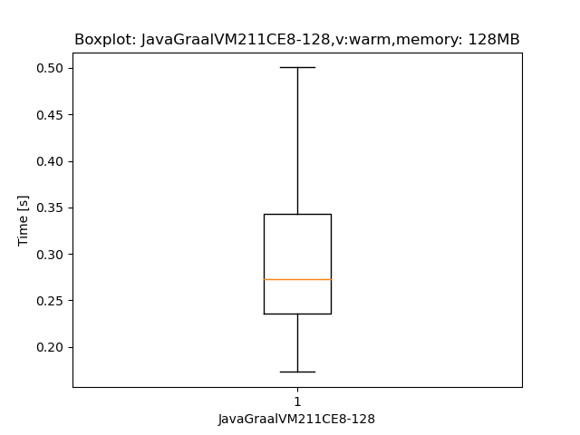
            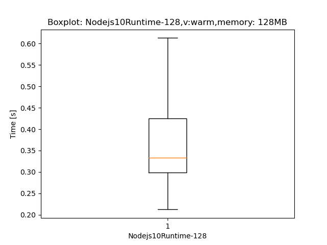
            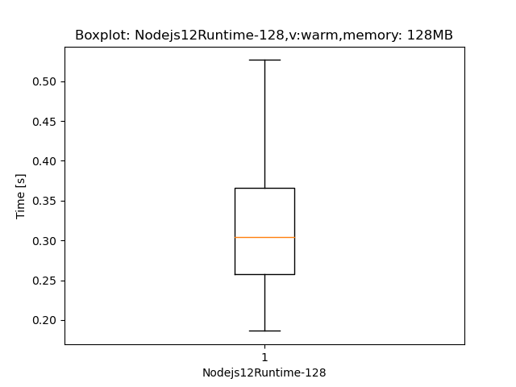
            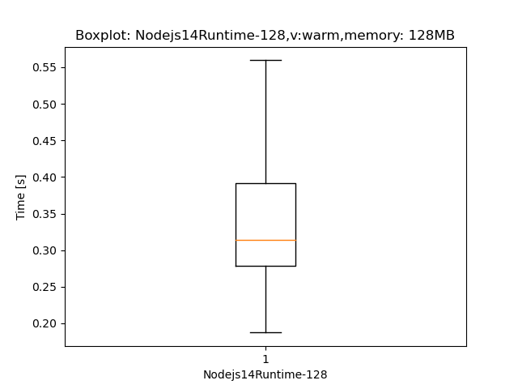
            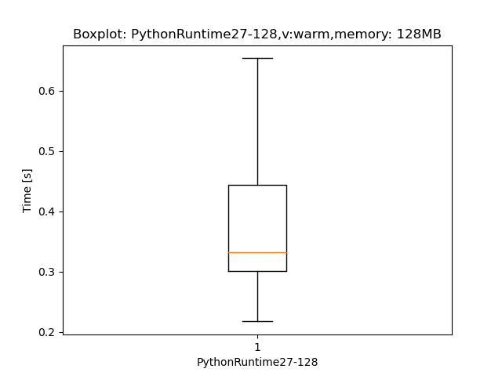
            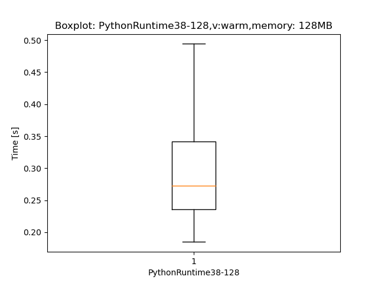
            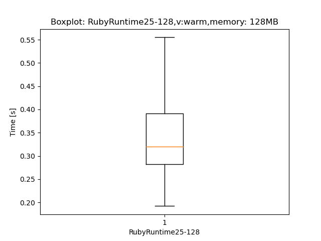
            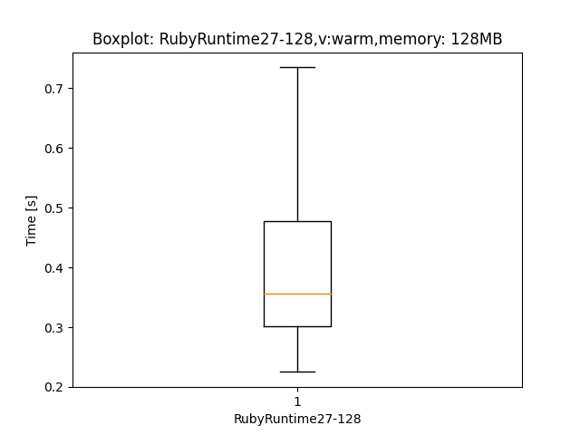
            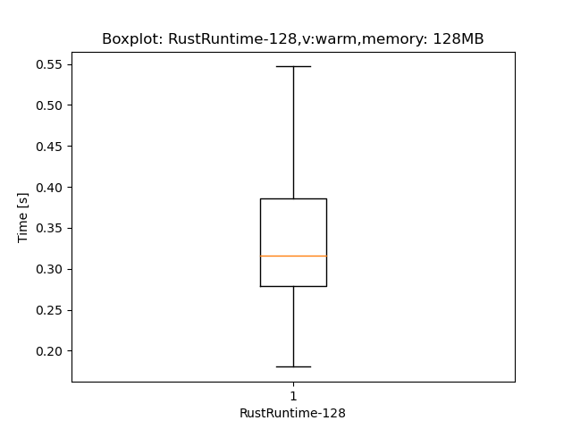
            

            

    
    2.  Lambda with 512 MB of memory
        In the test two Clojure runtimes has been ignored: ClojureJava8Runtime, ClojureJava11Runtime.
        Runtimes has been ignored, because the memory size usage exceeds 128MB.
        
        1.  Basic statistics
        
        <table border="2" cellspacing="0" cellpadding="6" rules="groups" frame="hsides">
        
        
        <colgroup>
        <col  class="org-left" />
        
        <col  class="org-right" />
        
        <col  class="org-right" />
        
        <col  class="org-right" />
        
        <col  class="org-right" />
        
        <col  class="org-right" />
        
        <col  class="org-right" />
        
        <col  class="org-right" />
        
        <col  class="org-right" />
        </colgroup>
        <thead>
        <tr>
        <th scope="col" class="org-left">&#xa0;</th>
        <th scope="col" class="org-right">mean</th>
        <th scope="col" class="org-right">std</th>
        <th scope="col" class="org-right">min</th>
        <th scope="col" class="org-right">max</th>
        <th scope="col" class="org-right">25%</th>
        <th scope="col" class="org-right">50%</th>
        <th scope="col" class="org-right">75%</th>
        <th scope="col" class="org-right">status 200 in %</th>
        </tr>
        </thead>
        
        <tbody>
        <tr>
        <td class="org-left">ClojureClojureJava11Runtime-512</td>
        <td class="org-right">0.321247</td>
        <td class="org-right">0.122377</td>
        <td class="org-right">0.17799</td>
        <td class="org-right">1.11962</td>
        <td class="org-right">0.248141</td>
        <td class="org-right">0.288717</td>
        <td class="org-right">0.344379</td>
        <td class="org-right">100.0%</td>
        </tr>
        
        
        <tr>
        <td class="org-left">ClojureClojureJava11RuntimeTiered-512</td>
        <td class="org-right">0.357867</td>
        <td class="org-right">0.10903</td>
        <td class="org-right">0.198455</td>
        <td class="org-right">1.04263</td>
        <td class="org-right">0.290613</td>
        <td class="org-right">0.327941</td>
        <td class="org-right">0.390665</td>
        <td class="org-right">100.0%</td>
        </tr>
        
        
        <tr>
        <td class="org-left">ClojureClojureJava8Runtime-512</td>
        <td class="org-right">0.358645</td>
        <td class="org-right">0.110701</td>
        <td class="org-right">0.194767</td>
        <td class="org-right">1.07439</td>
        <td class="org-right">0.287857</td>
        <td class="org-right">0.325322</td>
        <td class="org-right">0.39358</td>
        <td class="org-right">100.0%</td>
        </tr>
        
        
        <tr>
        <td class="org-left">ClojureClojureJava8RuntimeTiered-512</td>
        <td class="org-right">0.33263</td>
        <td class="org-right">0.115129</td>
        <td class="org-right">0.180117</td>
        <td class="org-right">1.13</td>
        <td class="org-right">0.260612</td>
        <td class="org-right">0.303464</td>
        <td class="org-right">0.361768</td>
        <td class="org-right">100.0%</td>
        </tr>
        
        
        <tr>
        <td class="org-left">ClojureGraalVM211CE11-512</td>
        <td class="org-right">0.389269</td>
        <td class="org-right">0.12296</td>
        <td class="org-right">0.228605</td>
        <td class="org-right">1.0132</td>
        <td class="org-right">0.309301</td>
        <td class="org-right">0.338557</td>
        <td class="org-right">0.436565</td>
        <td class="org-right">100.0%</td>
        </tr>
        
        
        <tr>
        <td class="org-left">ClojureGraalVM211CE8-512</td>
        <td class="org-right">0.344466</td>
        <td class="org-right">0.105468</td>
        <td class="org-right">0.1719</td>
        <td class="org-right">0.964815</td>
        <td class="org-right">0.278396</td>
        <td class="org-right">0.318152</td>
        <td class="org-right">0.373028</td>
        <td class="org-right">100.0%</td>
        </tr>
        
        
        <tr>
        <td class="org-left">ClojureOnBabashkaRuntime-512</td>
        <td class="org-right">0.385985</td>
        <td class="org-right">0.114898</td>
        <td class="org-right">0.229387</td>
        <td class="org-right">0.989148</td>
        <td class="org-right">0.309074</td>
        <td class="org-right">0.342643</td>
        <td class="org-right">0.425427</td>
        <td class="org-right">100.0%</td>
        </tr>
        
        
        <tr>
        <td class="org-left">CsharpRuntime-512</td>
        <td class="org-right">0.35779</td>
        <td class="org-right">0.110001</td>
        <td class="org-right">0.1957</td>
        <td class="org-right">1.14192</td>
        <td class="org-right">0.287744</td>
        <td class="org-right">0.329402</td>
        <td class="org-right">0.388892</td>
        <td class="org-right">100.0%</td>
        </tr>
        
        
        <tr>
        <td class="org-left">GolangRuntime-512</td>
        <td class="org-right">0.387733</td>
        <td class="org-right">0.117417</td>
        <td class="org-right">0.218579</td>
        <td class="org-right">1.05667</td>
        <td class="org-right">0.309943</td>
        <td class="org-right">0.343105</td>
        <td class="org-right">0.434042</td>
        <td class="org-right">100.0%</td>
        </tr>
        
        
        <tr>
        <td class="org-left">HaskellRuntime-512</td>
        <td class="org-right">0.386162</td>
        <td class="org-right">0.119157</td>
        <td class="org-right">0.224305</td>
        <td class="org-right">0.952474</td>
        <td class="org-right">0.308206</td>
        <td class="org-right">0.337035</td>
        <td class="org-right">0.42868</td>
        <td class="org-right">100.0%</td>
        </tr>
        
        
        <tr>
        <td class="org-left">Java11Runtime-512</td>
        <td class="org-right">0.362061</td>
        <td class="org-right">0.113548</td>
        <td class="org-right">0.183088</td>
        <td class="org-right">1.02782</td>
        <td class="org-right">0.29492</td>
        <td class="org-right">0.327863</td>
        <td class="org-right">0.39203</td>
        <td class="org-right">100.0%</td>
        </tr>
        
        
        <tr>
        <td class="org-left">Java8Runtime-512</td>
        <td class="org-right">0.387107</td>
        <td class="org-right">0.118474</td>
        <td class="org-right">0.204987</td>
        <td class="org-right">0.982825</td>
        <td class="org-right">0.309152</td>
        <td class="org-right">0.341361</td>
        <td class="org-right">0.427934</td>
        <td class="org-right">100.0%</td>
        </tr>
        
        
        <tr>
        <td class="org-left">JavaGraalVM211CE11-512</td>
        <td class="org-right">0.393049</td>
        <td class="org-right">0.125308</td>
        <td class="org-right">0.247605</td>
        <td class="org-right">1.0464</td>
        <td class="org-right">0.307402</td>
        <td class="org-right">0.343983</td>
        <td class="org-right">0.447881</td>
        <td class="org-right">100.0%</td>
        </tr>
        
        
        <tr>
        <td class="org-left">JavaGraalVM211CE8-512</td>
        <td class="org-right">0.318283</td>
        <td class="org-right">0.112656</td>
        <td class="org-right">0.17827</td>
        <td class="org-right">1.08628</td>
        <td class="org-right">0.247311</td>
        <td class="org-right">0.289502</td>
        <td class="org-right">0.345787</td>
        <td class="org-right">100.0%</td>
        </tr>
        
        
        <tr>
        <td class="org-left">Nodejs10Runtime-512</td>
        <td class="org-right">0.32233</td>
        <td class="org-right">0.10358</td>
        <td class="org-right">0.18755</td>
        <td class="org-right">0.852069</td>
        <td class="org-right">0.256012</td>
        <td class="org-right">0.295196</td>
        <td class="org-right">0.355498</td>
        <td class="org-right">100.0%</td>
        </tr>
        
        
        <tr>
        <td class="org-left">Nodejs12Runtime-512</td>
        <td class="org-right">0.38651</td>
        <td class="org-right">0.118126</td>
        <td class="org-right">0.213986</td>
        <td class="org-right">1.05769</td>
        <td class="org-right">0.309296</td>
        <td class="org-right">0.343982</td>
        <td class="org-right">0.426356</td>
        <td class="org-right">100.0%</td>
        </tr>
        
        
        <tr>
        <td class="org-left">Nodejs14Runtime-512</td>
        <td class="org-right">0.391733</td>
        <td class="org-right">0.124145</td>
        <td class="org-right">0.232113</td>
        <td class="org-right">1.02219</td>
        <td class="org-right">0.30724</td>
        <td class="org-right">0.342141</td>
        <td class="org-right">0.442157</td>
        <td class="org-right">100.0%</td>
        </tr>
        
        
        <tr>
        <td class="org-left">PythonRuntime27-512</td>
        <td class="org-right">0.395355</td>
        <td class="org-right">0.131141</td>
        <td class="org-right">0.234431</td>
        <td class="org-right">1.0578</td>
        <td class="org-right">0.308697</td>
        <td class="org-right">0.340225</td>
        <td class="org-right">0.449718</td>
        <td class="org-right">100.0%</td>
        </tr>
        
        
        <tr>
        <td class="org-left">PythonRuntime38-512</td>
        <td class="org-right">0.318014</td>
        <td class="org-right">0.104583</td>
        <td class="org-right">0.183057</td>
        <td class="org-right">0.886876</td>
        <td class="org-right">0.249465</td>
        <td class="org-right">0.288581</td>
        <td class="org-right">0.350324</td>
        <td class="org-right">100.0%</td>
        </tr>
        
        
        <tr>
        <td class="org-left">RubyRuntime25-512</td>
        <td class="org-right">0.373595</td>
        <td class="org-right">0.117667</td>
        <td class="org-right">0.16683</td>
        <td class="org-right">1.00011</td>
        <td class="org-right">0.299759</td>
        <td class="org-right">0.335182</td>
        <td class="org-right">0.410021</td>
        <td class="org-right">100.0%</td>
        </tr>
        
        
        <tr>
        <td class="org-left">RubyRuntime27-512</td>
        <td class="org-right">0.362254</td>
        <td class="org-right">0.118303</td>
        <td class="org-right">0.184282</td>
        <td class="org-right">1.08205</td>
        <td class="org-right">0.292955</td>
        <td class="org-right">0.325421</td>
        <td class="org-right">0.392409</td>
        <td class="org-right">100.0%</td>
        </tr>
        
        
        <tr>
        <td class="org-left">RustRuntime-512</td>
        <td class="org-right">0.378437</td>
        <td class="org-right">0.115554</td>
        <td class="org-right">0.208969</td>
        <td class="org-right">0.979145</td>
        <td class="org-right">0.304206</td>
        <td class="org-right">0.338312</td>
        <td class="org-right">0.414661</td>
        <td class="org-right">100.0%</td>
        </tr>
        </tbody>
        </table>
        
        1.  Box plot
            
            **Boxplot all functions**
            
            

            
            

            
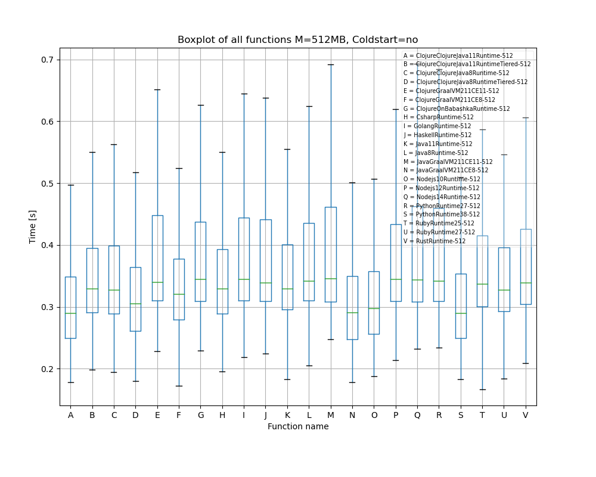
            

            

            

            
            **Individual boxplots**
            
            

            

            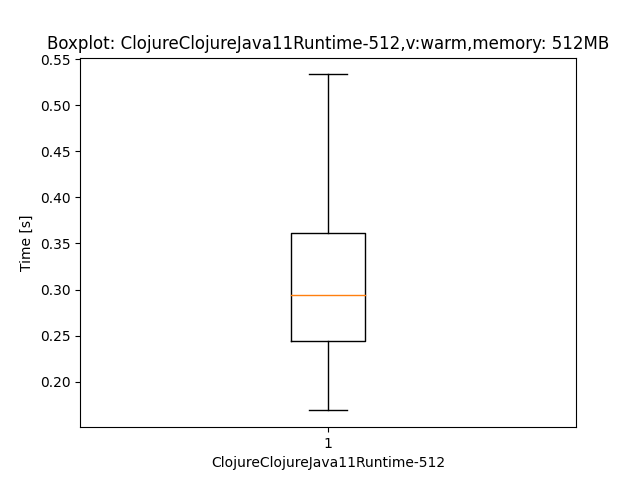
            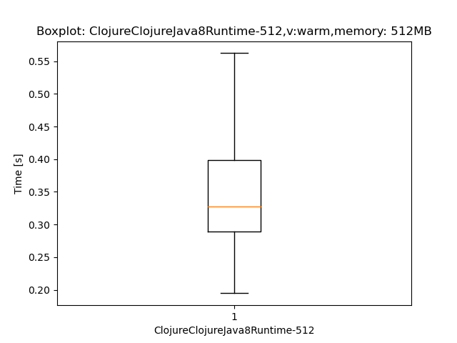
            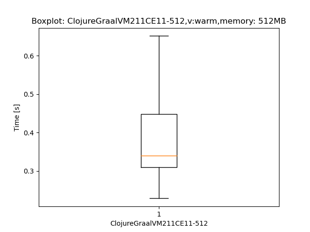
            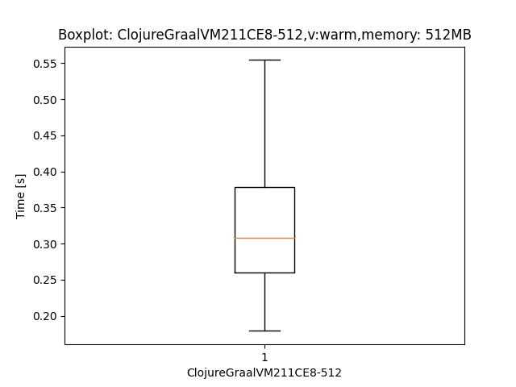
            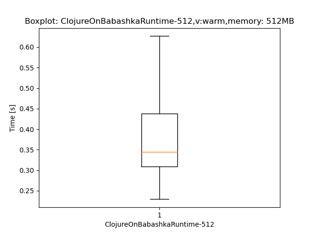
            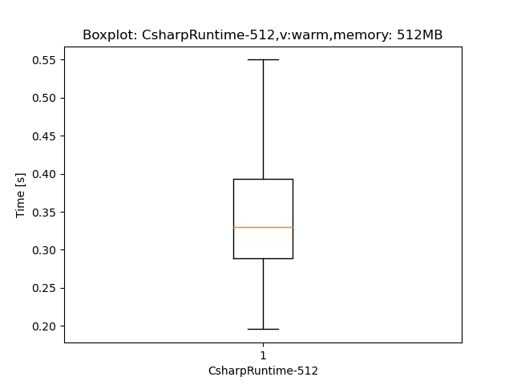
            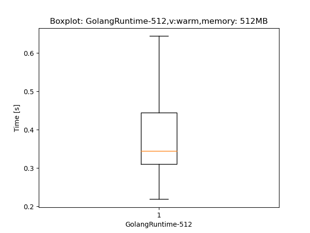
            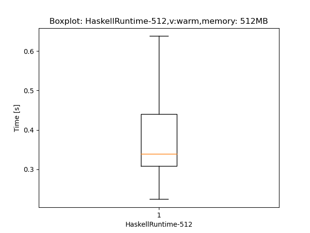
            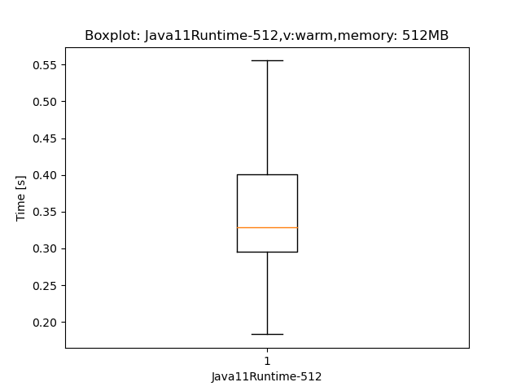
            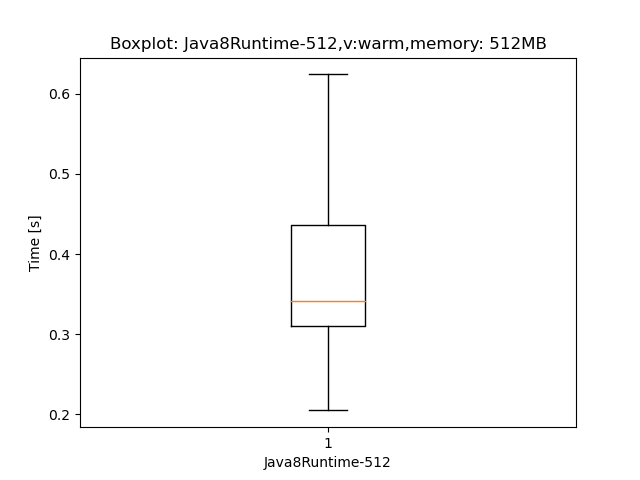
            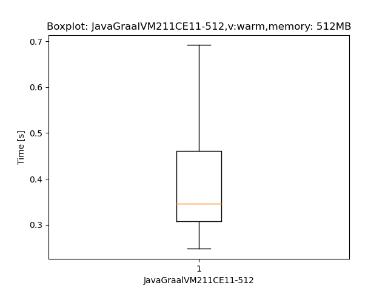
            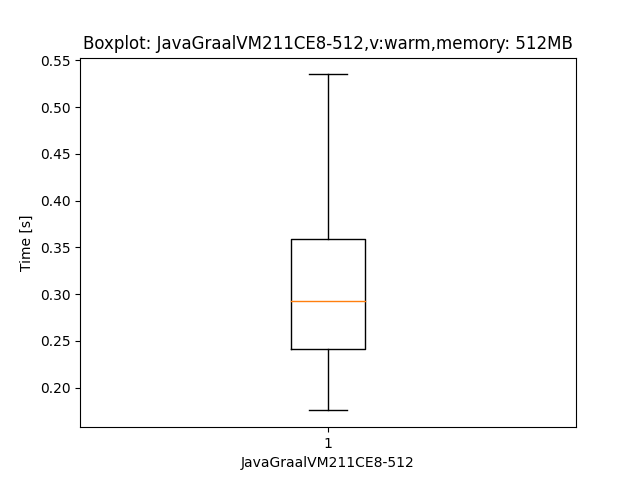
            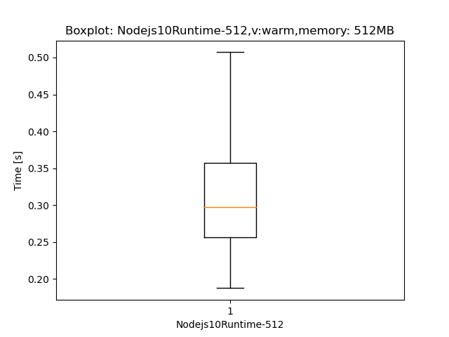
            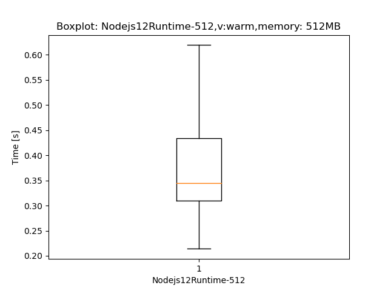
            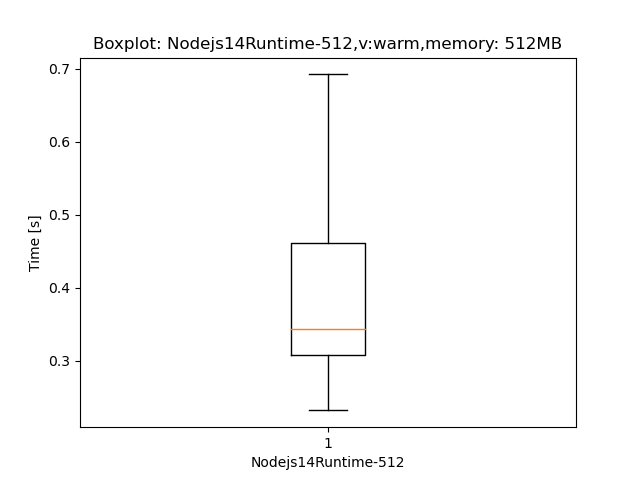
            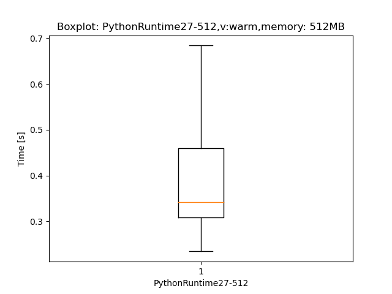
            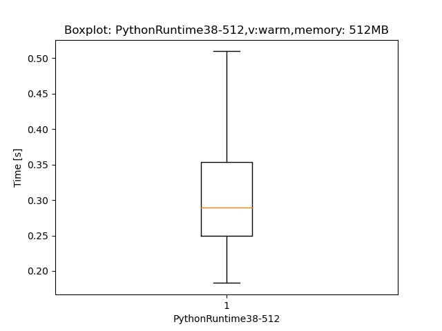
            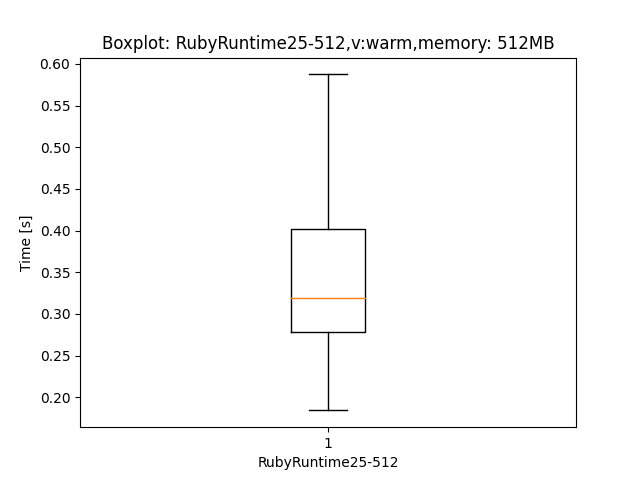
            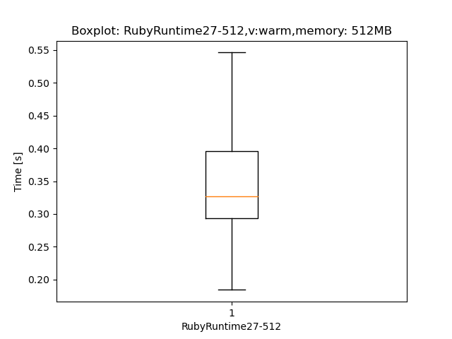
            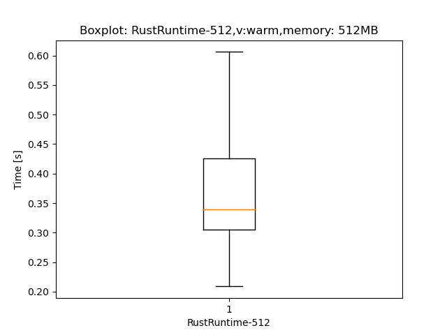
            

            

    
    3.  Lambda with 1024 MB of memory
        In the test two Clojure runtimes has been ignored: ClojureJava8Runtime, ClojureJava11Runtime.
        Runtimes has been ignored, because the memory size usage exceeds 128MB.
        
        1.  Basic statistics
        
        <table border="2" cellspacing="0" cellpadding="6" rules="groups" frame="hsides">
        
        
        <colgroup>
        <col  class="org-left" />
        
        <col  class="org-right" />
        
        <col  class="org-right" />
        
        <col  class="org-right" />
        
        <col  class="org-right" />
        
        <col  class="org-right" />
        
        <col  class="org-right" />
        
        <col  class="org-right" />
        
        <col  class="org-right" />
        </colgroup>
        <thead>
        <tr>
        <th scope="col" class="org-left">&#xa0;</th>
        <th scope="col" class="org-right">mean</th>
        <th scope="col" class="org-right">std</th>
        <th scope="col" class="org-right">min</th>
        <th scope="col" class="org-right">max</th>
        <th scope="col" class="org-right">25%</th>
        <th scope="col" class="org-right">50%</th>
        <th scope="col" class="org-right">75%</th>
        <th scope="col" class="org-right">status 200 in %</th>
        </tr>
        </thead>
        
        <tbody>
        <tr>
        <td class="org-left">ClojureClojureJava11Runtime-1024</td>
        <td class="org-right">0.44129</td>
        <td class="org-right">0.209702</td>
        <td class="org-right">0.218641</td>
        <td class="org-right">1.57943</td>
        <td class="org-right">0.313859</td>
        <td class="org-right">0.369594</td>
        <td class="org-right">0.501246</td>
        <td class="org-right">100.0%</td>
        </tr>
        
        
        <tr>
        <td class="org-left">ClojureClojureJava11RuntimeTiered-1024</td>
        <td class="org-right">0.398254</td>
        <td class="org-right">0.178614</td>
        <td class="org-right">0.180057</td>
        <td class="org-right">1.44693</td>
        <td class="org-right">0.294024</td>
        <td class="org-right">0.340727</td>
        <td class="org-right">0.437185</td>
        <td class="org-right">100.0%</td>
        </tr>
        
        
        <tr>
        <td class="org-left">ClojureClojureJava8Runtime-1024</td>
        <td class="org-right">0.43451</td>
        <td class="org-right">0.189679</td>
        <td class="org-right">0.220877</td>
        <td class="org-right">1.44353</td>
        <td class="org-right">0.313106</td>
        <td class="org-right">0.366048</td>
        <td class="org-right">0.506577</td>
        <td class="org-right">100.0%</td>
        </tr>
        
        
        <tr>
        <td class="org-left">ClojureClojureJava8RuntimeTiered-1024</td>
        <td class="org-right">0.425084</td>
        <td class="org-right">0.189031</td>
        <td class="org-right">0.212485</td>
        <td class="org-right">1.54118</td>
        <td class="org-right">0.309144</td>
        <td class="org-right">0.359664</td>
        <td class="org-right">0.485088</td>
        <td class="org-right">100.0%</td>
        </tr>
        
        
        <tr>
        <td class="org-left">ClojureGraalVM211CE11-1024</td>
        <td class="org-right">0.458183</td>
        <td class="org-right">0.234324</td>
        <td class="org-right">0.21741</td>
        <td class="org-right">1.844</td>
        <td class="org-right">0.316734</td>
        <td class="org-right">0.372652</td>
        <td class="org-right">0.523239</td>
        <td class="org-right">100.0%</td>
        </tr>
        
        
        <tr>
        <td class="org-left">ClojureGraalVM211CE8-1024</td>
        <td class="org-right">0.417829</td>
        <td class="org-right">0.189184</td>
        <td class="org-right">0.192126</td>
        <td class="org-right">1.40671</td>
        <td class="org-right">0.309916</td>
        <td class="org-right">0.352655</td>
        <td class="org-right">0.463353</td>
        <td class="org-right">100.0%</td>
        </tr>
        
        
        <tr>
        <td class="org-left">ClojureOnBabashkaRuntime-1024</td>
        <td class="org-right">0.433661</td>
        <td class="org-right">0.204765</td>
        <td class="org-right">0.21498</td>
        <td class="org-right">1.54753</td>
        <td class="org-right">0.312845</td>
        <td class="org-right">0.363461</td>
        <td class="org-right">0.48762</td>
        <td class="org-right">100.0%</td>
        </tr>
        
        
        <tr>
        <td class="org-left">CsharpRuntime-1024</td>
        <td class="org-right">0.455432</td>
        <td class="org-right">0.223959</td>
        <td class="org-right">0.235278</td>
        <td class="org-right">1.62962</td>
        <td class="org-right">0.317121</td>
        <td class="org-right">0.375415</td>
        <td class="org-right">0.521617</td>
        <td class="org-right">100.0%</td>
        </tr>
        
        
        <tr>
        <td class="org-left">GolangRuntime-1024</td>
        <td class="org-right">0.389881</td>
        <td class="org-right">0.183602</td>
        <td class="org-right">0.201141</td>
        <td class="org-right">1.45643</td>
        <td class="org-right">0.284702</td>
        <td class="org-right">0.337615</td>
        <td class="org-right">0.419064</td>
        <td class="org-right">100.0%</td>
        </tr>
        
        
        <tr>
        <td class="org-left">HaskellRuntime-1024</td>
        <td class="org-right">0.37552</td>
        <td class="org-right">0.206656</td>
        <td class="org-right">0.179409</td>
        <td class="org-right">1.5388</td>
        <td class="org-right">0.264485</td>
        <td class="org-right">0.316454</td>
        <td class="org-right">0.392968</td>
        <td class="org-right">100.0%</td>
        </tr>
        
        
        <tr>
        <td class="org-left">Java11Runtime-1024</td>
        <td class="org-right">0.35391</td>
        <td class="org-right">0.198913</td>
        <td class="org-right">0.183527</td>
        <td class="org-right">1.56547</td>
        <td class="org-right">0.245584</td>
        <td class="org-right">0.303432</td>
        <td class="org-right">0.369834</td>
        <td class="org-right">100.0%</td>
        </tr>
        
        
        <tr>
        <td class="org-left">Java8Runtime-1024</td>
        <td class="org-right">0.389976</td>
        <td class="org-right">0.174663</td>
        <td class="org-right">0.178749</td>
        <td class="org-right">1.46117</td>
        <td class="org-right">0.288482</td>
        <td class="org-right">0.334905</td>
        <td class="org-right">0.429794</td>
        <td class="org-right">100.0%</td>
        </tr>
        
        
        <tr>
        <td class="org-left">JavaGraalVM211CE11-1024</td>
        <td class="org-right">0.361644</td>
        <td class="org-right">0.223795</td>
        <td class="org-right">0.180549</td>
        <td class="org-right">1.60334</td>
        <td class="org-right">0.244085</td>
        <td class="org-right">0.301901</td>
        <td class="org-right">0.364708</td>
        <td class="org-right">100.0%</td>
        </tr>
        
        
        <tr>
        <td class="org-left">JavaGraalVM211CE8-1024</td>
        <td class="org-right">0.361778</td>
        <td class="org-right">0.206281</td>
        <td class="org-right">0.183523</td>
        <td class="org-right">1.57105</td>
        <td class="org-right">0.252155</td>
        <td class="org-right">0.306605</td>
        <td class="org-right">0.376836</td>
        <td class="org-right">100.0%</td>
        </tr>
        
        
        <tr>
        <td class="org-left">Nodejs10Runtime-1024</td>
        <td class="org-right">0.349608</td>
        <td class="org-right">0.188329</td>
        <td class="org-right">0.182304</td>
        <td class="org-right">1.46541</td>
        <td class="org-right">0.246439</td>
        <td class="org-right">0.300781</td>
        <td class="org-right">0.367223</td>
        <td class="org-right">100.0%</td>
        </tr>
        
        
        <tr>
        <td class="org-left">Nodejs12Runtime-1024</td>
        <td class="org-right">0.436175</td>
        <td class="org-right">0.205472</td>
        <td class="org-right">0.221065</td>
        <td class="org-right">1.6448</td>
        <td class="org-right">0.311391</td>
        <td class="org-right">0.366672</td>
        <td class="org-right">0.495493</td>
        <td class="org-right">100.0%</td>
        </tr>
        
        
        <tr>
        <td class="org-left">Nodejs14Runtime-1024</td>
        <td class="org-right">0.397963</td>
        <td class="org-right">0.202715</td>
        <td class="org-right">0.188828</td>
        <td class="org-right">1.63094</td>
        <td class="org-right">0.289215</td>
        <td class="org-right">0.336848</td>
        <td class="org-right">0.425721</td>
        <td class="org-right">100.0%</td>
        </tr>
        
        
        <tr>
        <td class="org-left">PythonRuntime27-1024</td>
        <td class="org-right">0.457415</td>
        <td class="org-right">0.232039</td>
        <td class="org-right">0.229159</td>
        <td class="org-right">1.72454</td>
        <td class="org-right">0.318152</td>
        <td class="org-right">0.367</td>
        <td class="org-right">0.527081</td>
        <td class="org-right">100.0%</td>
        </tr>
        
        
        <tr>
        <td class="org-left">PythonRuntime38-1024</td>
        <td class="org-right">0.43795</td>
        <td class="org-right">0.206787</td>
        <td class="org-right">0.227265</td>
        <td class="org-right">1.55788</td>
        <td class="org-right">0.31175</td>
        <td class="org-right">0.364204</td>
        <td class="org-right">0.496868</td>
        <td class="org-right">100.0%</td>
        </tr>
        
        
        <tr>
        <td class="org-left">RubyRuntime25-1024</td>
        <td class="org-right">0.379772</td>
        <td class="org-right">0.181957</td>
        <td class="org-right">0.183376</td>
        <td class="org-right">1.46143</td>
        <td class="org-right">0.280118</td>
        <td class="org-right">0.328376</td>
        <td class="org-right">0.40968</td>
        <td class="org-right">100.0%</td>
        </tr>
        
        
        <tr>
        <td class="org-left">RubyRuntime27-1024</td>
        <td class="org-right">0.445906</td>
        <td class="org-right">0.212471</td>
        <td class="org-right">0.230908</td>
        <td class="org-right">1.61203</td>
        <td class="org-right">0.316001</td>
        <td class="org-right">0.371086</td>
        <td class="org-right">0.511428</td>
        <td class="org-right">100.0%</td>
        </tr>
        
        
        <tr>
        <td class="org-left">RustRuntime-1024</td>
        <td class="org-right">0.415385</td>
        <td class="org-right">0.222845</td>
        <td class="org-right">0.197082</td>
        <td class="org-right">1.7065</td>
        <td class="org-right">0.301925</td>
        <td class="org-right">0.347179</td>
        <td class="org-right">0.448557</td>
        <td class="org-right">100.0%</td>
        </tr>
        </tbody>
        </table>
        
        1.  Box plot
            
            **Boxplot all functions**
            
            

            
            

            
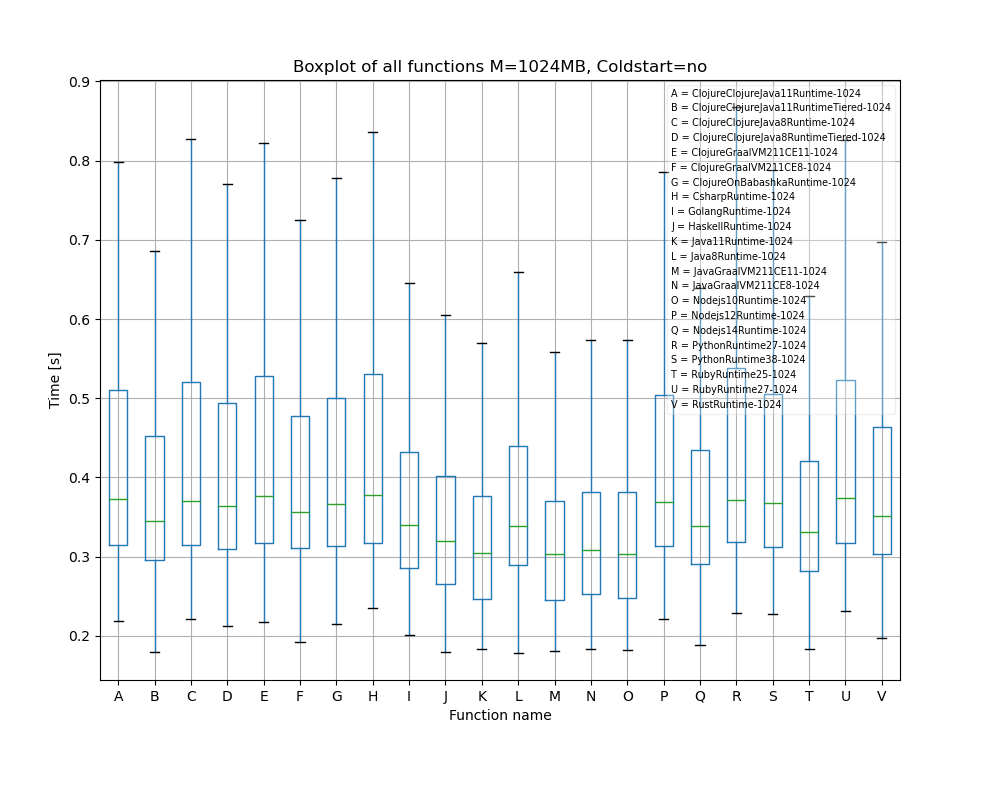
            

            

            

            
            **Individual boxplots**
            
            

            

            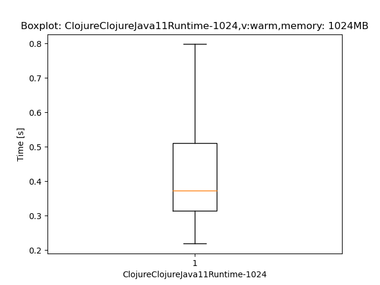
            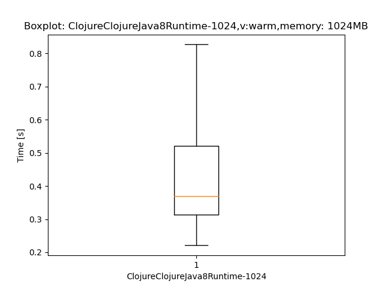
            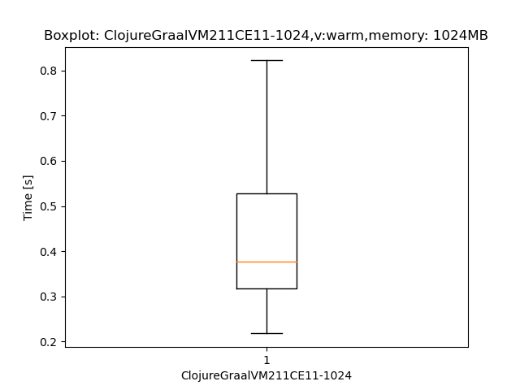
            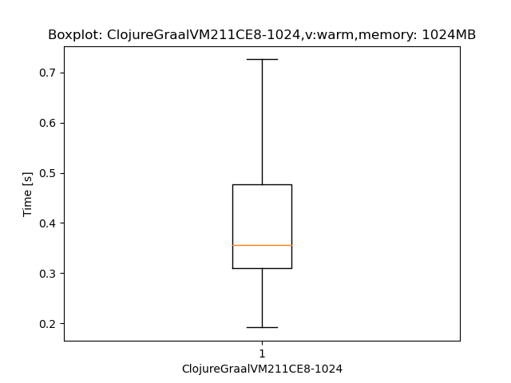
            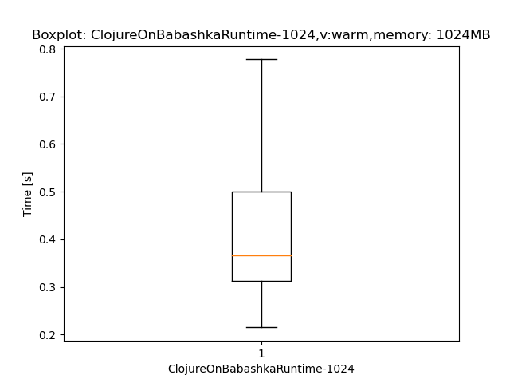
            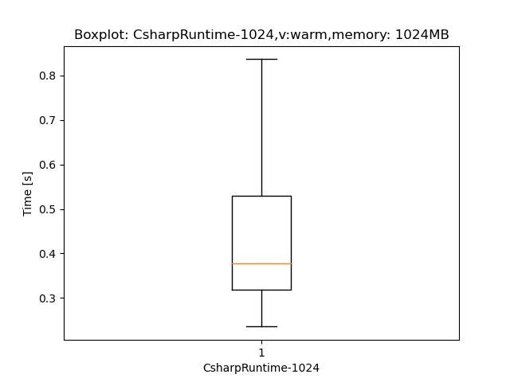
            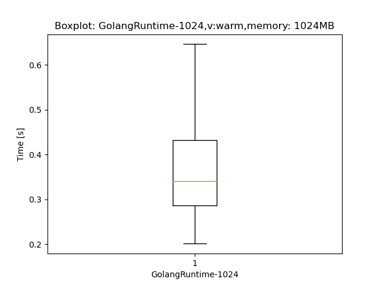
            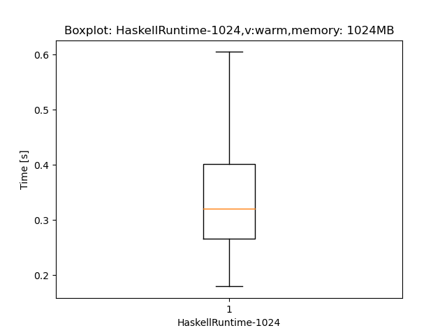
            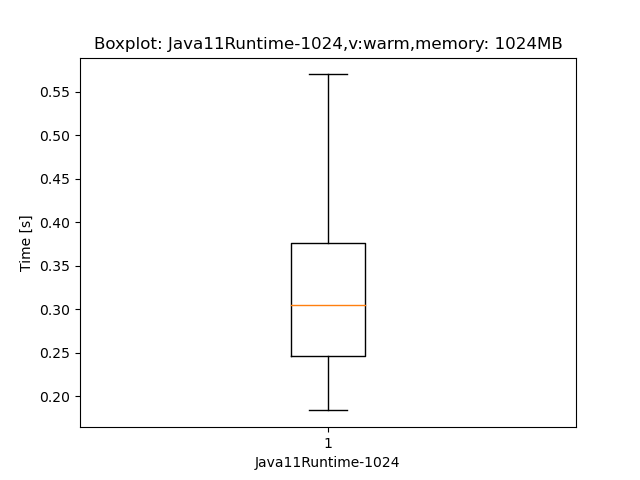
            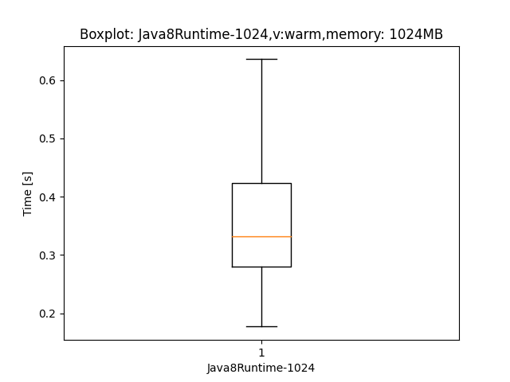
            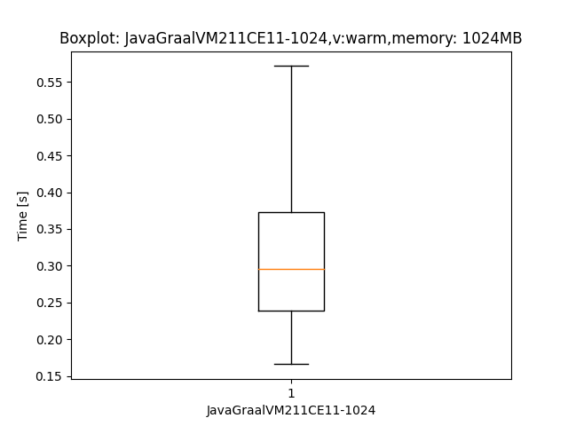
            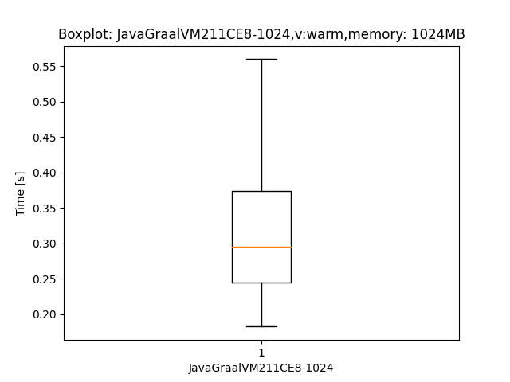
            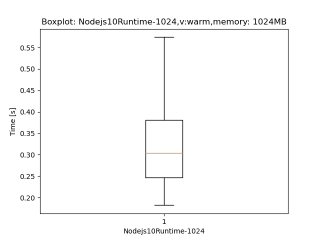
            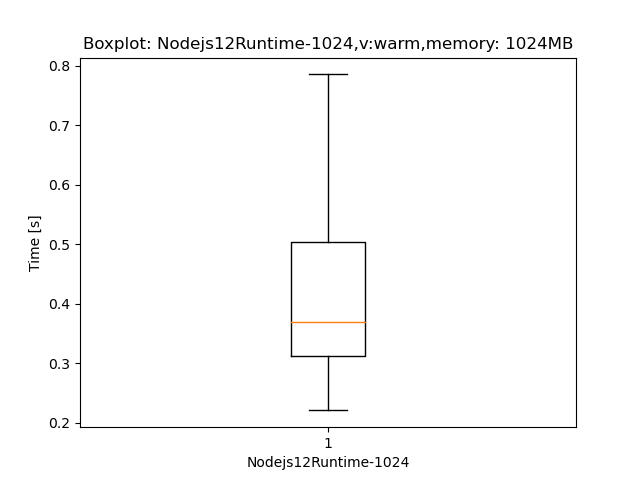
            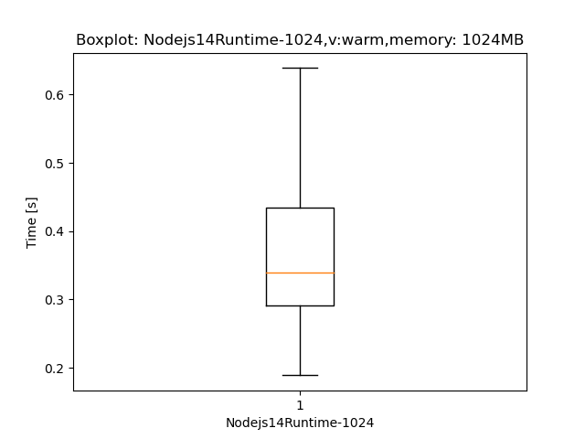
            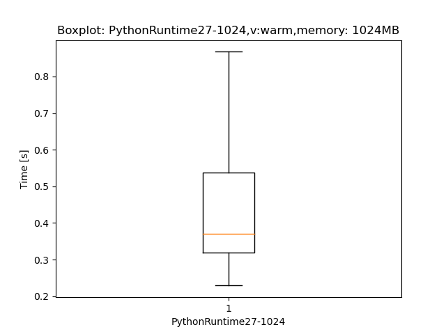
            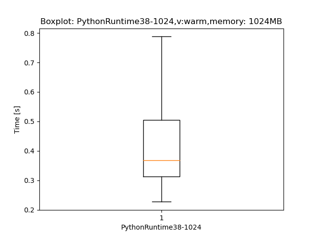
            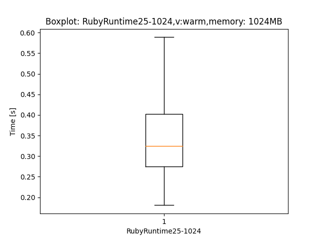
            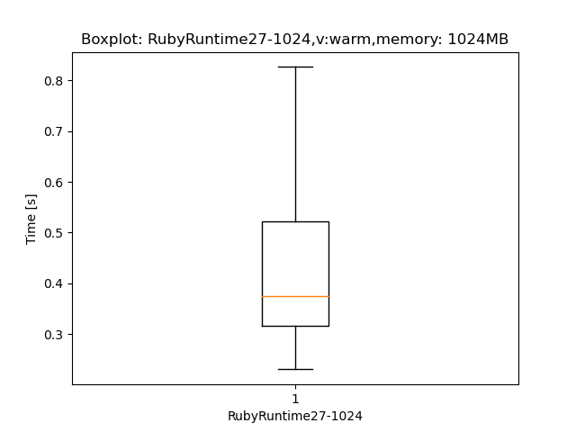
            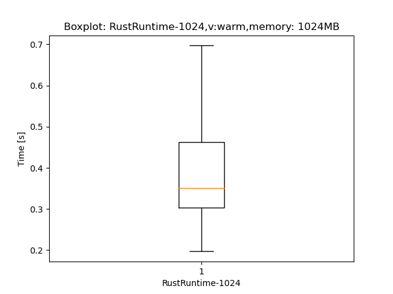
            

            

    
    4.  Lambda with 2048 MB of memory
        All possible runtimes are included.
        
        1.  Basic statistics
        
        <table border="2" cellspacing="0" cellpadding="6" rules="groups" frame="hsides">
        
        
        <colgroup>
        <col  class="org-left" />
        
        <col  class="org-right" />
        
        <col  class="org-right" />
        
        <col  class="org-right" />
        
        <col  class="org-right" />
        
        <col  class="org-right" />
        
        <col  class="org-right" />
        
        <col  class="org-right" />
        
        <col  class="org-right" />
        </colgroup>
        <thead>
        <tr>
        <th scope="col" class="org-left">&#xa0;</th>
        <th scope="col" class="org-right">mean</th>
        <th scope="col" class="org-right">std</th>
        <th scope="col" class="org-right">min</th>
        <th scope="col" class="org-right">max</th>
        <th scope="col" class="org-right">25%</th>
        <th scope="col" class="org-right">50%</th>
        <th scope="col" class="org-right">75%</th>
        <th scope="col" class="org-right">status 200 in %</th>
        </tr>
        </thead>
        
        <tbody>
        <tr>
        <td class="org-left">ClojureClojureJava11Runtime-2048</td>
        <td class="org-right">0.322253</td>
        <td class="org-right">0.108977</td>
        <td class="org-right">0.178417</td>
        <td class="org-right">1.02178</td>
        <td class="org-right">0.247955</td>
        <td class="org-right">0.293736</td>
        <td class="org-right">0.355229</td>
        <td class="org-right">100.0%</td>
        </tr>
        
        
        <tr>
        <td class="org-left">ClojureClojureJava11RuntimeTiered-2048</td>
        <td class="org-right">0.423205</td>
        <td class="org-right">0.132688</td>
        <td class="org-right">0.260403</td>
        <td class="org-right">1.21679</td>
        <td class="org-right">0.330986</td>
        <td class="org-right">0.370219</td>
        <td class="org-right">0.496949</td>
        <td class="org-right">100.0%</td>
        </tr>
        
        
        <tr>
        <td class="org-left">ClojureClojureJava8Runtime-2048</td>
        <td class="org-right">0.340457</td>
        <td class="org-right">0.115159</td>
        <td class="org-right">0.175916</td>
        <td class="org-right">1.15271</td>
        <td class="org-right">0.264237</td>
        <td class="org-right">0.317144</td>
        <td class="org-right">0.375511</td>
        <td class="org-right">100.0%</td>
        </tr>
        
        
        <tr>
        <td class="org-left">ClojureClojureJava8RuntimeTiered-2048</td>
        <td class="org-right">0.397645</td>
        <td class="org-right">0.116694</td>
        <td class="org-right">0.211797</td>
        <td class="org-right">0.989235</td>
        <td class="org-right">0.319875</td>
        <td class="org-right">0.360731</td>
        <td class="org-right">0.442648</td>
        <td class="org-right">100.0%</td>
        </tr>
        
        
        <tr>
        <td class="org-left">ClojureGraalVM211CE11-2048</td>
        <td class="org-right">0.366223</td>
        <td class="org-right">0.109125</td>
        <td class="org-right">0.174912</td>
        <td class="org-right">0.967031</td>
        <td class="org-right">0.295834</td>
        <td class="org-right">0.338794</td>
        <td class="org-right">0.402311</td>
        <td class="org-right">100.0%</td>
        </tr>
        
        
        <tr>
        <td class="org-left">ClojureGraalVM211CE8-2048</td>
        <td class="org-right">0.427325</td>
        <td class="org-right">0.138811</td>
        <td class="org-right">0.230142</td>
        <td class="org-right">1.25734</td>
        <td class="org-right">0.33311</td>
        <td class="org-right">0.371356</td>
        <td class="org-right">0.494058</td>
        <td class="org-right">100.0%</td>
        </tr>
        
        
        <tr>
        <td class="org-left">ClojureJava11Runtime-2048</td>
        <td class="org-right">0.411262</td>
        <td class="org-right">0.123295</td>
        <td class="org-right">0.209299</td>
        <td class="org-right">1.23685</td>
        <td class="org-right">0.327885</td>
        <td class="org-right">0.369606</td>
        <td class="org-right">0.466892</td>
        <td class="org-right">100.0%</td>
        </tr>
        
        
        <tr>
        <td class="org-left">ClojureJava8Runtime-2048</td>
        <td class="org-right">0.32228</td>
        <td class="org-right">0.115382</td>
        <td class="org-right">0.176478</td>
        <td class="org-right">1.14802</td>
        <td class="org-right">0.24415</td>
        <td class="org-right">0.293836</td>
        <td class="org-right">0.356617</td>
        <td class="org-right">100.0%</td>
        </tr>
        
        
        <tr>
        <td class="org-left">ClojureOnBabashkaRuntime-2048</td>
        <td class="org-right">0.433665</td>
        <td class="org-right">0.153819</td>
        <td class="org-right">0.254908</td>
        <td class="org-right">1.39979</td>
        <td class="org-right">0.33409</td>
        <td class="org-right">0.37481</td>
        <td class="org-right">0.500001</td>
        <td class="org-right">100.0%</td>
        </tr>
        
        
        <tr>
        <td class="org-left">CsharpRuntime-2048</td>
        <td class="org-right">0.356902</td>
        <td class="org-right">0.109141</td>
        <td class="org-right">0.185276</td>
        <td class="org-right">0.960439</td>
        <td class="org-right">0.285861</td>
        <td class="org-right">0.331594</td>
        <td class="org-right">0.393415</td>
        <td class="org-right">100.0%</td>
        </tr>
        
        
        <tr>
        <td class="org-left">GolangRuntime-2048</td>
        <td class="org-right">0.40538</td>
        <td class="org-right">0.112385</td>
        <td class="org-right">0.215362</td>
        <td class="org-right">0.914984</td>
        <td class="org-right">0.32316</td>
        <td class="org-right">0.364608</td>
        <td class="org-right">0.466637</td>
        <td class="org-right">100.0%</td>
        </tr>
        
        
        <tr>
        <td class="org-left">HaskellRuntime-2048</td>
        <td class="org-right">0.369931</td>
        <td class="org-right">0.117461</td>
        <td class="org-right">0.197533</td>
        <td class="org-right">1.12021</td>
        <td class="org-right">0.294861</td>
        <td class="org-right">0.33642</td>
        <td class="org-right">0.406594</td>
        <td class="org-right">100.0%</td>
        </tr>
        
        
        <tr>
        <td class="org-left">Java11Runtime-2048</td>
        <td class="org-right">0.376076</td>
        <td class="org-right">0.112653</td>
        <td class="org-right">0.181131</td>
        <td class="org-right">1.12827</td>
        <td class="org-right">0.299037</td>
        <td class="org-right">0.345112</td>
        <td class="org-right">0.4148</td>
        <td class="org-right">100.0%</td>
        </tr>
        
        
        <tr>
        <td class="org-left">Java8Runtime-2048</td>
        <td class="org-right">0.387741</td>
        <td class="org-right">0.109577</td>
        <td class="org-right">0.209472</td>
        <td class="org-right">1.02371</td>
        <td class="org-right">0.313234</td>
        <td class="org-right">0.358793</td>
        <td class="org-right">0.436942</td>
        <td class="org-right">100.0%</td>
        </tr>
        
        
        <tr>
        <td class="org-left">JavaGraalVM211CE11-2048</td>
        <td class="org-right">0.325124</td>
        <td class="org-right">0.103773</td>
        <td class="org-right">0.192618</td>
        <td class="org-right">0.881713</td>
        <td class="org-right">0.254103</td>
        <td class="org-right">0.295801</td>
        <td class="org-right">0.361488</td>
        <td class="org-right">100.0%</td>
        </tr>
        
        
        <tr>
        <td class="org-left">JavaGraalVM211CE8-2048</td>
        <td class="org-right">0.40998</td>
        <td class="org-right">0.120181</td>
        <td class="org-right">0.198017</td>
        <td class="org-right">1.02678</td>
        <td class="org-right">0.325235</td>
        <td class="org-right">0.36646</td>
        <td class="org-right">0.476009</td>
        <td class="org-right">100.0%</td>
        </tr>
        
        
        <tr>
        <td class="org-left">Nodejs10Runtime-2048</td>
        <td class="org-right">0.367488</td>
        <td class="org-right">0.107852</td>
        <td class="org-right">0.194411</td>
        <td class="org-right">0.990055</td>
        <td class="org-right">0.296395</td>
        <td class="org-right">0.339979</td>
        <td class="org-right">0.403867</td>
        <td class="org-right">100.0%</td>
        </tr>
        
        
        <tr>
        <td class="org-left">Nodejs12Runtime-2048</td>
        <td class="org-right">0.412613</td>
        <td class="org-right">0.126718</td>
        <td class="org-right">0.236935</td>
        <td class="org-right">1.21155</td>
        <td class="org-right">0.325024</td>
        <td class="org-right">0.366812</td>
        <td class="org-right">0.471605</td>
        <td class="org-right">100.0%</td>
        </tr>
        
        
        <tr>
        <td class="org-left">Nodejs14Runtime-2048</td>
        <td class="org-right">0.417948</td>
        <td class="org-right">0.125555</td>
        <td class="org-right">0.217509</td>
        <td class="org-right">1.10573</td>
        <td class="org-right">0.328171</td>
        <td class="org-right">0.371792</td>
        <td class="org-right">0.483821</td>
        <td class="org-right">100.0%</td>
        </tr>
        
        
        <tr>
        <td class="org-left">PythonRuntime27-2048</td>
        <td class="org-right">0.41175</td>
        <td class="org-right">0.123325</td>
        <td class="org-right">0.181413</td>
        <td class="org-right">1.13458</td>
        <td class="org-right">0.32555</td>
        <td class="org-right">0.365654</td>
        <td class="org-right">0.470356</td>
        <td class="org-right">100.0%</td>
        </tr>
        
        
        <tr>
        <td class="org-left">PythonRuntime38-2048</td>
        <td class="org-right">0.323485</td>
        <td class="org-right">0.11131</td>
        <td class="org-right">0.184386</td>
        <td class="org-right">1.12223</td>
        <td class="org-right">0.250086</td>
        <td class="org-right">0.294766</td>
        <td class="org-right">0.35291</td>
        <td class="org-right">100.0%</td>
        </tr>
        
        
        <tr>
        <td class="org-left">RubyRuntime25-2048</td>
        <td class="org-right">0.371401</td>
        <td class="org-right">0.112247</td>
        <td class="org-right">0.196981</td>
        <td class="org-right">0.999423</td>
        <td class="org-right">0.298025</td>
        <td class="org-right">0.339697</td>
        <td class="org-right">0.411847</td>
        <td class="org-right">100.0%</td>
        </tr>
        
        
        <tr>
        <td class="org-left">RubyRuntime27-2048</td>
        <td class="org-right">0.405108</td>
        <td class="org-right">0.11715</td>
        <td class="org-right">0.223906</td>
        <td class="org-right">1.04593</td>
        <td class="org-right">0.322358</td>
        <td class="org-right">0.366306</td>
        <td class="org-right">0.4667</td>
        <td class="org-right">100.0%</td>
        </tr>
        
        
        <tr>
        <td class="org-left">RustRuntime-2048</td>
        <td class="org-right">0.419241</td>
        <td class="org-right">0.128171</td>
        <td class="org-right">0.243239</td>
        <td class="org-right">1.08902</td>
        <td class="org-right">0.328542</td>
        <td class="org-right">0.369083</td>
        <td class="org-right">0.485873</td>
        <td class="org-right">100.0%</td>
        </tr>
        </tbody>
        </table>
        
        1.  Box plot
            
            **Boxplot all functions**
            
            

            
            

            
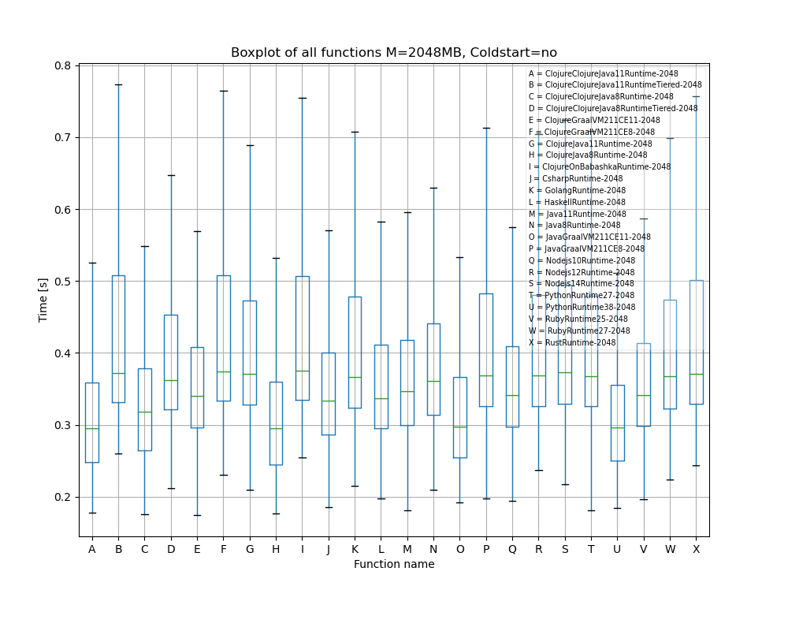
            

            

            

            
            **Individual boxplots**
            
            

            

            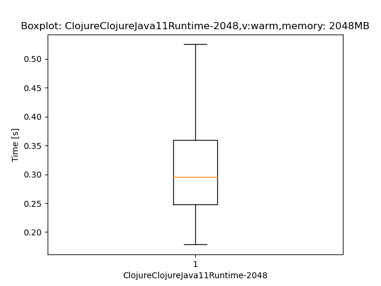
            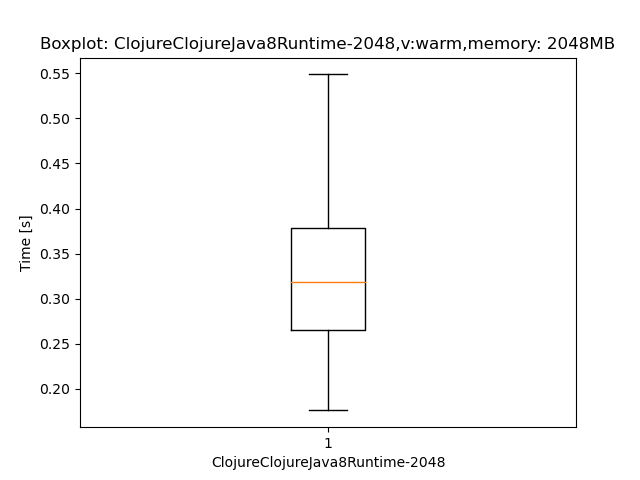
            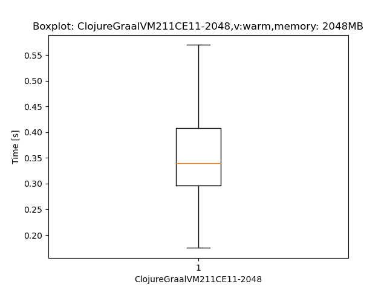
            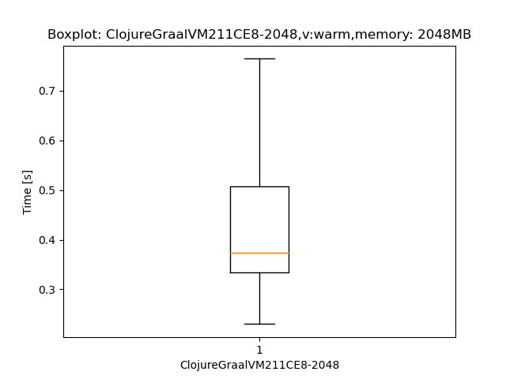
            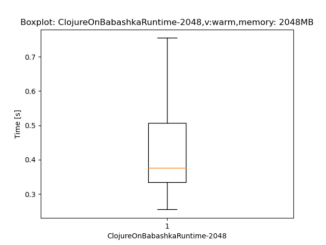
            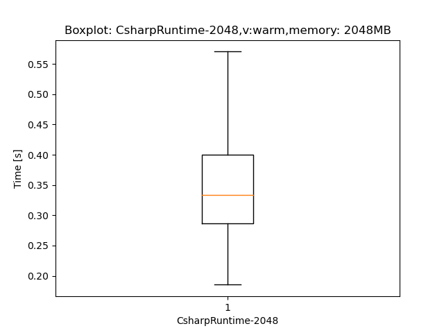
            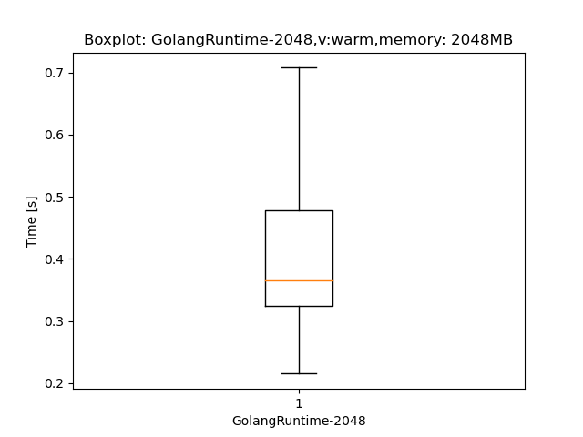
            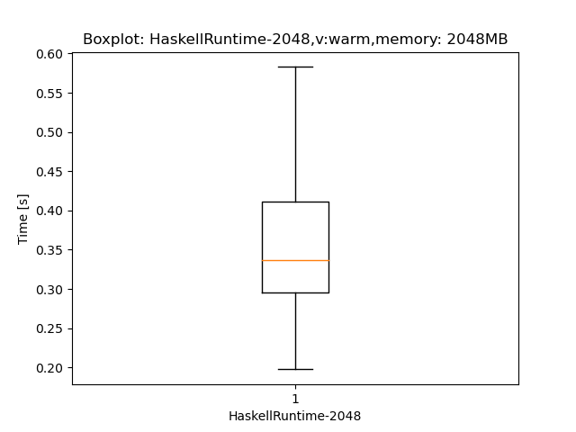
            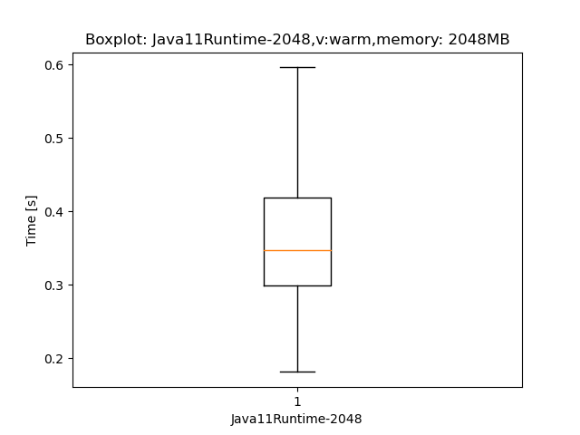
            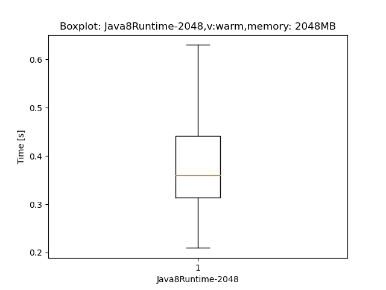
            
            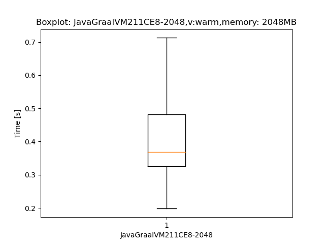
            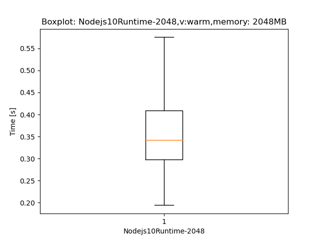
            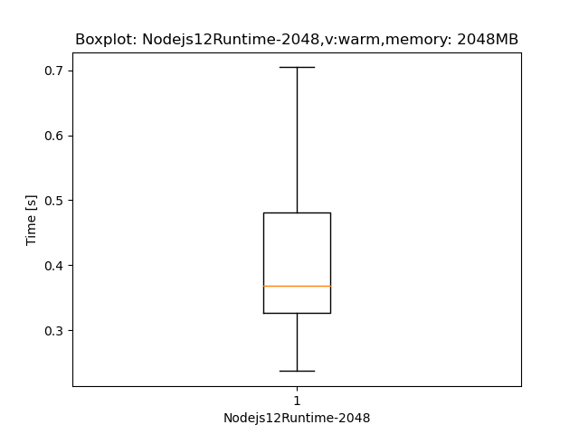
            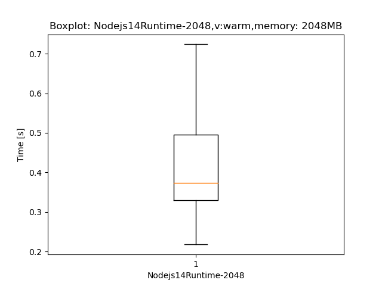
            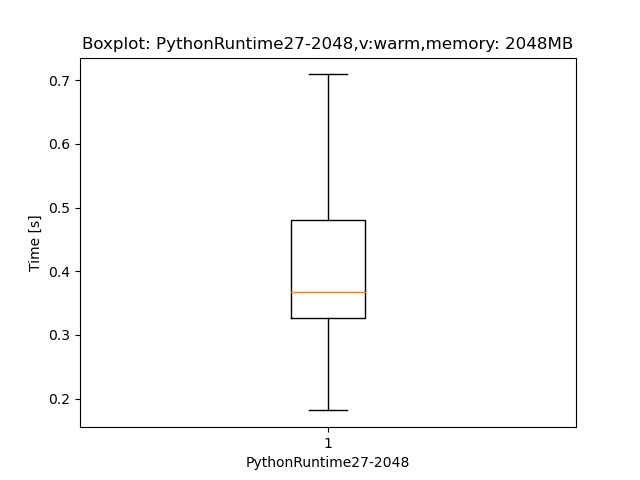
            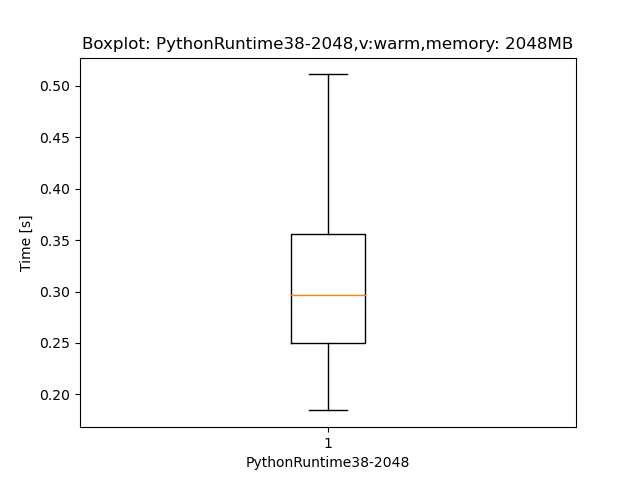
            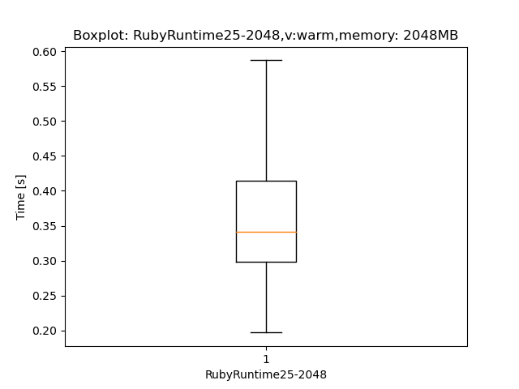
            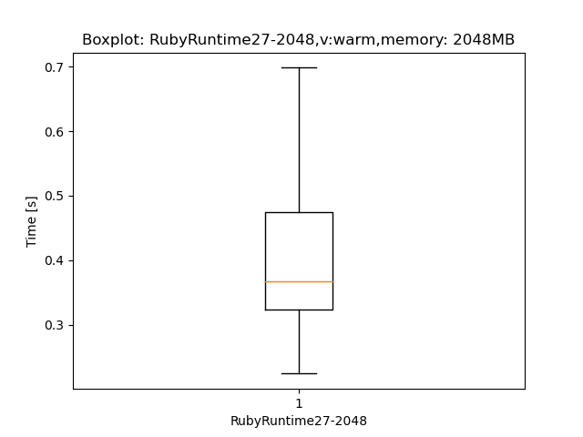
            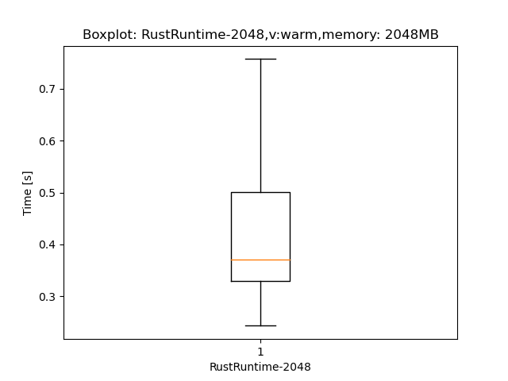
            

            

