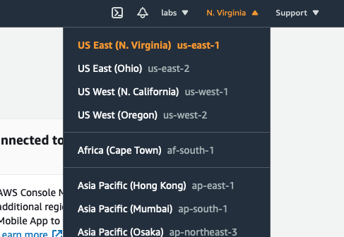

# Getting started

This guide will quickly take you through the basics of using `holy-lambda`:

- Development environment setup
- Generate a scaffold project for your code
- Locally test the code in Docker 
- Deploy to AWS
- Invoke from API Gateway (optional)

Here's an overview of what we'll create ([version with working links](https://swimlanes.io/d/F_CZgZSY3)):


## Before We Begin
  1. You will need an AWS account with [sufficient privileges](https://docs.aws.amazon.com/serverless-application-model/latest/developerguide/sam-permissions.html)

  2. The following components need to be installed on your system:

      - [Homebrew](https://brew.sh) (for Mac OS) / [Linuxbrew](https://docs.brew.sh/Homebrew-on-Linux) (for Linux)
      - Java 8
      - Docker, Docker Compose >= 1.13.1, 1.22.0


## Dependencies

  1. Install aws, aws-sam, make, clojure, babashka (>= 0.4.1), and clj-kondo
     ```bash
     brew tap aws/tap && \
        brew install awscli \
                     aws-sam-cli \
                     make \
                     clojure/tools/clojure \
                     borkdude/brew/babashka \
                     borkdude/brew/clj-kondo
     ```
     
  2. Install [clj-new](https://github.com/seancorfield/clj-new) using these [instructions](https://github.com/seancorfield/clj-new#getting-started)

  3. Configure a **default** AWS profile via `aws-cli`. 
     This is necessary for interacting with AWS from holy-lambda.

     ```bash
     aws configure
     ```

## First Project

1. We'll generate our first project using the `holy-lambda` project template. This will create a project tree with all the necessary resources to get us started.

    ```bash
    clojure -X:new :template holy-lambda :name com.company/example-lambda :output holy-lambda-example
    ```

    `cd` to the project directory
  
    ```bash
    cd holy-lambda-example
    ```
  
    You should see following project structure:
    
    ```bash
    tree
    .
    ├── README.md
    ├── bb.edn
    ├── deps.edn
    ├── envs.json
    ├── resources
    │   └── native-agents-payloads
    │       └── 1.edn
    ├── src
    │   └── com
    │       └── company
    │           └── example_lambda
    │               └── core.cljc
    └── template.yml
    
    6 directories, 7 files
    ```
   
2. Configure the `bb` (babashka) task runner

   `holy-lambda` uses babashka tasks to perform its duties. Configuration for the tasks are located in `bb.edn`. The defaults are mostly sufficient, however we need to make a couple of config changes to change the target runtime to babashka and set your AWS region.

      - Open `bb.edn` in the root of your project directory
      
      - Locate `:runtime` and set to `:babashka`:
      
      ```clojure
                             :runtime
                             {
                              ;; Choose one of the supported runtime `:babashka`, `:native`, `:java`
                              :name                :babashka
                             ... }
      ```
      
      - Locate `:infra` and set the `:region` to one of your choosing. This is where we'll create some intermediate assets and will ultimately deploy the lambda to in AWS.
      
      ```clojure
                             :infra
                             {...
      
                              :region              "us-east-1"}
      ```

3. Before we continue, let's run a couple of checks

      - Verify your AWS profile is working by creating our working bucket:
     
        ```bash
        bb bucket:create
        [holy-lambda] Command <bucket:create>
        [holy-lambda] Creating a bucket holy-lambda-example-5f3d731137724176b606beb6623b6f04
        [holy-lambda] Bucket holy-lambda-example-5f3d731137724176b606beb6623b6f04 has been succesfully created!
        ```
   
     > :information_source: It's not strictly necessary to create a bucket upfront (it's done automatically when required), but it serves as an isolated AWS test for this guide.
  
      - Check that docker is running:
      
        ```bash
        docker ps
        CONTAINER ID   IMAGE     COMMAND   CREATED   STATUS    PORTS     NAMES
        ```
      
      It shouldn't matter if there is anything else is running - we just care that docker is available.
      

## Initialise the Project

We will use the task `bb stack:sync` to gather all dependencies from `bb.edn`, `deps.edn` for Clojure, Native and Babashka runtimes. 

By default, sync also checks whether any additional [Lambda layers](https://docs.aws.amazon.com/lambda/latest/dg/configuration-layers.html) necessary for runtime should be published and will report them. This may be overridden (see `:self-manage-layers?` in `bb.edn`)

> :warning:  Ensure docker is running at this point

```bash
cd holy-lambda-example && bb stack:sync
```

> :information_source: On the first run, some activities such as downloading dependencies and docker images can take some time. Subsequent runs will be much faster.

See the troubleshooting section if anything fails at this point.

All being well, at the end of the output should be something like this:

```
Successfully created/updated stack - holy-lambda-template-bucket-123456789-hlbbri-0-0-29 in us-east-1

[holy-lambda] Waiting 5 seconds for deployment to propagate...
[holy-lambda] Checking the ARN of published layer. This might take a while..
[holy-lambda] Your ARN for babashka runtime layer is: arn:aws:lambda:us-east-1:123456789:layer:holy-lambda-babashka-runtime:1
[holy-lambda] You should add the provided ARN as a property of a Function in template.yml!

--------------- template.yml ------------------

      Resources:
        ExampleLambdaFunction:
          Type: AWS::Serverless::Function
          Properties:
            Handler: example.core.ExampleLambda 
            Layers:
              - PLEASE_ADD_THE_ARN_OF_LAYER_HERE 
            Events:
              HelloEvent:
                Type: Api
                Properties:
                  Path: /
                  Method: get

---------------------------------------------
[holy-lambda] Sync completed!
```

- Locate the following line from your output and copy the ARN...
  
  ```
  [holy-lambda] Your ARN for babashka runtime layer is: arn:aws:lambda:us-east-1:123456789:layer:holy-lambda-babashka-runtime:1
  ```
  
  The ARN is:
  
  ```
  arn:aws:lambda:us-east-1:123456789:layer:holy-lambda-babashka-runtime:1
  ```

- ... and amend the `template.yml` file:
  
  1. Add your `Layers` config just below the `Handler`
  
  ```yaml
  Resources:
    ExampleLambdaFunction:
      Type: AWS::Serverless::Function
      Properties:
        FunctionName: ExampleLambdaFunction
        Handler: com.company.example-lambda.core.ExampleLambda
        Layers:
          -  arn:aws:lambda:us-east-1:123456789:layer:holy-lambda-babashka-runtime:1
  ```
  
  2. Adjust the Lambda memory (reduce from 2000):
  ```yaml
  Parameters:
    MemorySize:
      Type: Number
      Default: 256   
  ```

Setup is now complete! We're now ready to start executing the code.

First, we'll test the code locally, and then we'll deploy the code to your AWS environment.

## Running the Lambda Locally

`holy-lambda` uses [AWS SAM](https://docs.aws.amazon.com/serverless-application-model/latest/developerguide/what-is-sam.html) and Docker to emulate a lambda environment locally. 

 Execute your lambda code using the babashka task `bb stack:invoke`:

 ```
bb stack:invoke
[holy-lambda] Command <stack:invoke>
Invoking com.company.example-lambda.core.ExampleLambda (provided)
arn:aws:lambda:us-east-1:123456789:layer:holy-lambda-babashka-runtime:1 is already cached. Skipping download
Image was not found.
Building image............
Skip pulling image and use local one: samcli/lambda:provided-5933bec634b68561a90673e32.

Mounting /path-to-source/holy-lambda-example/src as /var/task:ro,delegated inside runtime container
START RequestId: 241e4ecb-605b-4ce1-a484-be75f91e520a Version: $LATEST
END RequestId: 241e4ecb-605b-4ce1-a484-be75f91e520a
REPORT RequestId: 241e4ecb-605b-4ce1-a484-be75f91e520a	Init Duration: 0.22 ms	Duration: 198.10 ms	Billed Duration: 200 ms	Memory Size: 256 MB	Max Memory Used: 256 MB
{"statusCode":200,"headers":{"Content-Type":"text/plain; charset=utf-8"},"body":"Hello world. Babashka is sweet friend of mine! Babashka version: 0.4.1"}
 ```

After some time you should see above output.

> :information_source: The first invocation is rather slow locally since AWS SAM has to download runtime image for babashka. Subsequent invocations are much faster.

## Deploy to AWS

Having successfully run the Lambda locally, we will now deploy to AWS.

Deployment to AWS is a two-step process: 
- `pack` to prepare the deployment package; and
- `deploy` to apply it to your AWS environment.

```
bb stack:pack
[holy-lambda] Command <stack:pack>

Successfully packaged artifacts and wrote output template to file .holy-lambda/packaged.yml.
Execute the following command to deploy the packaged template
sam deploy --template-file /path-to-source/holy-lambda-example/.holy-lambda/packaged.yml --stack-name <YOUR STACK NAME>
```

Now deploy the application to AWS. `holy-lambda` will run AWS SAM to deploy the changes, so you will see cloudformation style output like this:

```
bb stack:deploy
...

2021-05-17 18:25:42 - Waiting for stack create/update to complete

CloudFormation events from changeset
-----------------------------------------------------------------------------------------------------------------------------------------------------------------------------------------------------
ResourceStatus                                    ResourceType                                      LogicalResourceId                                 ResourceStatusReason
-----------------------------------------------------------------------------------------------------------------------------------------------------------------------------------------------------
CREATE_IN_PROGRESS                                AWS::IAM::Role                                    ExampleLambdaFunctionRole                         -
CREATE_IN_PROGRESS                                AWS::IAM::Role                                    ExampleLambdaFunctionRole                         Resource creation Initiated
CREATE_COMPLETE                                   AWS::IAM::Role                                    ExampleLambdaFunctionRole                         -
CREATE_IN_PROGRESS                                AWS::Lambda::Function                             ExampleLambdaFunction                             -
CREATE_IN_PROGRESS                                AWS::Lambda::Function                             ExampleLambdaFunction                             Resource creation Initiated
CREATE_COMPLETE                                   AWS::Lambda::Function                             ExampleLambdaFunction                             -
CREATE_IN_PROGRESS                                AWS::ApiGateway::RestApi                          ServerlessRestApi                                 -
CREATE_COMPLETE                                   AWS::ApiGateway::RestApi                          ServerlessRestApi                                 -
CREATE_IN_PROGRESS                                AWS::ApiGateway::RestApi                          ServerlessRestApi                                 Resource creation Initiated
CREATE_IN_PROGRESS                                AWS::Lambda::Permission                           ExampleLambdaFunctionHelloEventPermissionProd     Resource creation Initiated
CREATE_IN_PROGRESS                                AWS::Lambda::Permission                           ExampleLambdaFunctionHelloEventPermissionProd     -
CREATE_IN_PROGRESS                                AWS::ApiGateway::Deployment                       ServerlessRestApiDeploymenta311ff041f             -
CREATE_COMPLETE                                   AWS::ApiGateway::Deployment                       ServerlessRestApiDeploymenta311ff041f             -
CREATE_IN_PROGRESS                                AWS::ApiGateway::Deployment                       ServerlessRestApiDeploymenta311ff041f             Resource creation Initiated
CREATE_IN_PROGRESS                                AWS::ApiGateway::Stage                            ServerlessRestApiProdStage                        -
CREATE_IN_PROGRESS                                AWS::ApiGateway::Stage                            ServerlessRestApiProdStage                        Resource creation Initiated
CREATE_COMPLETE                                   AWS::ApiGateway::Stage                            ServerlessRestApiProdStage                        -
CREATE_COMPLETE                                   AWS::Lambda::Permission                           ExampleLambdaFunctionHelloEventPermissionProd     -
CREATE_COMPLETE                                   AWS::CloudFormation::Stack                        example-                                          -
                                                                                                    lambda-18dc55c0dc4d4fccb28209f3a4e01352-stack
-----------------------------------------------------------------------------------------------------------------------------------------------------------------------------------------------------

Successfully created/updated stack - example-lambda-18dc55c0dc4d4fccb28209f3a4e01352-stack in us-east-1
```

Your stack is now deployed to AWS, and we're now ready to access it via the AWS console.

## Running the Lambda in AWS

Sign in to the [AWS Console](https://console.aws.amazon.com)

Select the region that was specified in the `bb.edn` for your lambda deployments:



### A Quick Tour

So what do we have now?


# Troubleshooting
  1. Running `bb stack:sync` results in:
     ```
     Project did not sync properly. Remove .holy-lambda directory and run
     ```
     
     *Solution*:
     ```
     bb stack:purge && bb stack:sync
     ```
   2. Commands are failing:
   
      *Solution*:
      ```
      bb stack:purge && bb stack:doctor
      ```
      
      Fix all errors reported by the tool. If you still experience any issue please report it at [Github](https://github.com/FieryCod/holy-lambda/issues).
   3. GraalVM native-image compilation fails due to not enough RAM memory on MacOS
   
      *Solution**:
      Increase the RAM limit in Docker UI [preferences](https://docs.docker.com/docker-for-mac/#resources).
      
4. stack:invoke fails with the following message"
```
Mounting /path-to-source/holy-lambda-example/src as /var/task:ro,delegated inside runtime container
START RequestId: 4dc6fcf5-7db2-4854-bba7-abae8038ef8f Version: $LATEST
time="2021-05-17T16:52:48.278" level=error msg="Init failed" InvokeID= error="Couldn't find valid bootstrap(s): [/var/task/bootstrap /opt/bootstrap /var/runtime/bootstrap]"
time="2021-05-17T16:52:48.279" level=error msg="INIT DONE failed: Runtime.InvalidEntrypoint"
```

The layers of your template have not been configured correctly. Ensure that stack:sync reports and ARN and it has been added to the `template.myl`


The first sync is not always successful. If this is the case check the following:  ** link to troubleshooting
- Is Docker running?
- Run `bb stack:purge` and run `bb stack:sync` once again
- If this still fails, run `bb stack:doctor` for diagnostic information

**This behaviour may be overridden by changing `:self-manage-layers?` flag is set to `false`, then `holy-lambda` will automatically publish all necessary layers and output `ARN` of each.

3. At this point you should have `.holy-lambda` directory in your project. If not then go to troubleshooting. Now you can choose one of three runtimes:

  - `:babashka`
  - `:native`
  - `:java`

   The template is adjusted in the way that all of the runtimes should work flawlessly and all you need to change is a `:runtime` value in `bb.edn`.


1. `:babashka` runtime
   Babashka runtime is probably the best one to start the journey with `holy-lambda`. 
       
