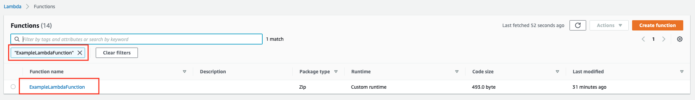
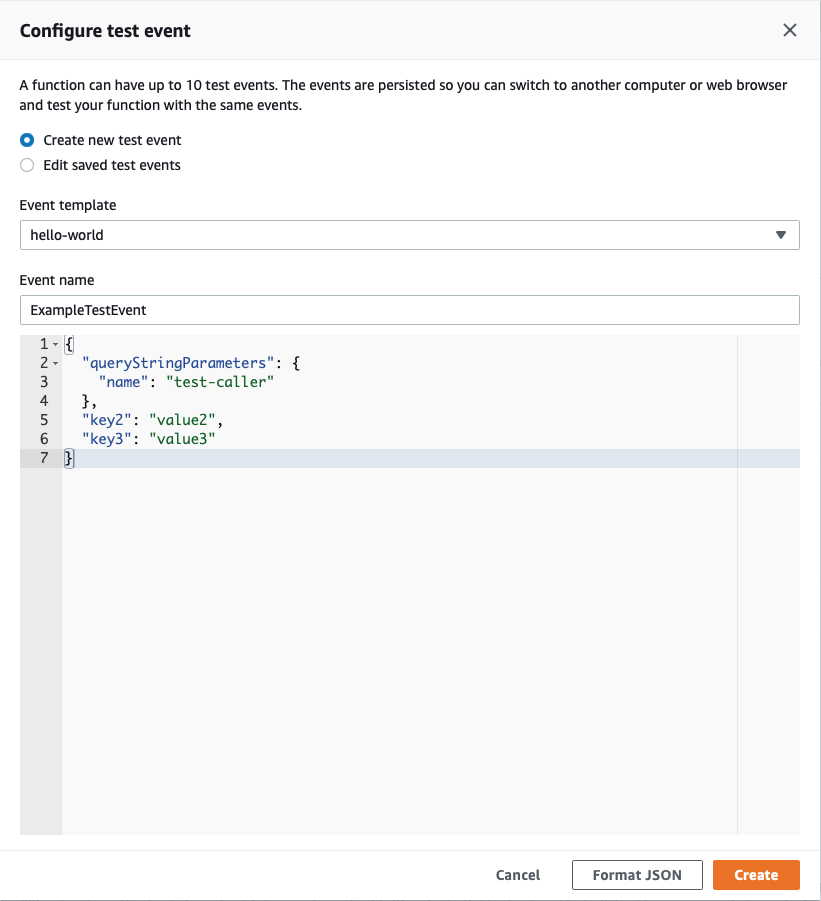
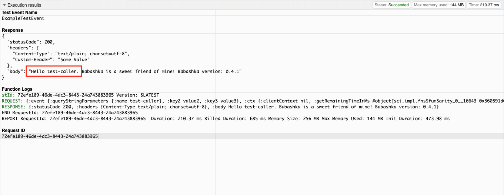
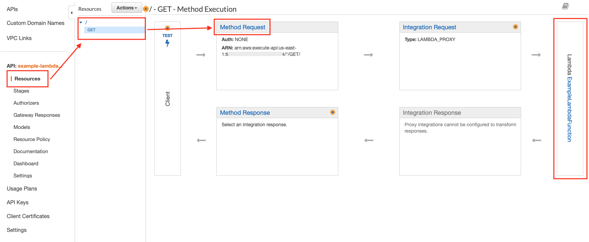
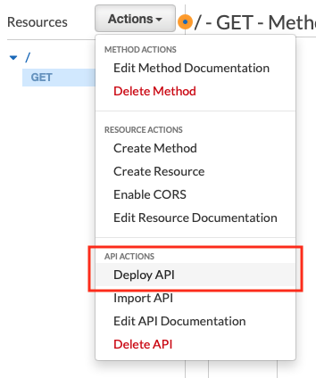

# Getting started

This guide will take you through the basics of using `holy-lambda`:

- Development environment setup
- Generate a scaffold project for your code
- Target the `babashka` interactive runtime so that we can edit Clojure code in AWS
- Locally test the code in Docker 
- Deploy to AWS
- Invoke from API Gateway (optional)

Here's an overview of what we'll create ([version with working links](https://swimlanes.io/d/F_CZgZSY3)):


## Before We Begin
  1. You will need an AWS account with [sufficient privileges](https://docs.aws.amazon.com/serverless-application-model/latest/developerguide/sam-permissions.html)

  2. The following components need to be installed on your system:

      - [Homebrew](https://brew.sh) (for Mac OS) / [Linuxbrew](https://docs.brew.sh/Homebrew-on-Linux) (for Linux)
      - Java 8
      - Docker, Docker Compose >= 1.13.1, 1.22.0


## Dependencies

  1. Install aws, aws-sam, make, clojure, babashka (>= 0.4.1), and clj-kondo
     ```bash
     brew tap aws/tap && \
        brew install awscli \
                     aws-sam-cli \
                     make \
                     clojure/tools/clojure \
                     borkdude/brew/babashka \
                     borkdude/brew/clj-kondo
     ```
     
  2. Install [clj-new](https://github.com/seancorfield/clj-new) using these [instructions](https://github.com/seancorfield/clj-new#getting-started)

  3. Configure a **default** AWS profile via `aws-cli`. 
     This is necessary for interacting with AWS from `holy-lambda`.

     ```bash
     aws configure
     ```

## First Project

1. We'll generate our first project using the `holy-lambda` project template. This will create a project tree with all the necessary resources to get us started.

    ```bash
    clojure -X:new :template holy-lambda :name com.company/example-lambda :output holy-lambda-example
    ```

    `cd` to the project directory
  
    ```bash
    cd holy-lambda-example
    ```
  
    You should see following project structure:
    
    ```bash
    tree
    .
    ├── README.md
    ├── bb.edn
    ├── deps.edn
    ├── envs.json
    ├── resources
    │   └── native-agents-payloads
    │       └── 1.edn
    ├── src
    │   └── com
    │       └── company
    │           └── example_lambda
    │               └── core.cljc
    └── template.yml
    
    6 directories, 7 files
    ```
   
2. Configure the `bb` (babashka) task runner

   `holy-lambda` uses babashka tasks to perform its duties. Configuration for the tasks are located in `bb.edn`. The defaults are mostly sufficient, however we need to make a couple of config changes to set the target runtime to babashka and set your AWS region.

      - Open `bb.edn` in the root of your project directory
      
      - Locate `:runtime` and set to `:babashka`:
      
      ```clojure
                             :runtime
                             {
                              ;; Choose one of the supported runtime `:babashka`, `:native`, `:java`
                              :name                :babashka
                             ... }
      ```
      
      - Locate `:infra` and set the `:region` to one of your choosing. This is where `holy-lambda` will create some intermediate assets in S3, and will ultimately deploy the Lambda function to in AWS.
      
      ```clojure
                             :infra
                             {...
      
                              :region              "us-east-1"}
      ```

3. Before we continue, let's run a couple of checks

      - Verify your AWS profile is working by creating our working bucket:
     
        ```bash
        bb bucket:create
        [holy-lambda] Command <bucket:create>
        [holy-lambda] Creating a bucket holy-lambda-example-5f3d731137724176b606beb6623b6f04
        [holy-lambda] Bucket holy-lambda-example-5f3d731137724176b606beb6623b6f04 has been succesfully created!
        ```
   
     > :information_source: It's not strictly necessary to create a bucket upfront (it's done automatically when required), but it serves as an isolated AWS test for this guide.
  
      - Check that docker is running:
      
        ```bash
        docker ps
        CONTAINER ID   IMAGE     COMMAND   CREATED   STATUS    PORTS     NAMES
        ```
      
      It shouldn't matter if there is anything else is running - we just care that docker is available at this point.
      
4. Check the help
      
      Information on all the `holy-lambda` tasks are available by running `bb tasks` 
      
```
bb tasks
The following tasks are available:

bucket:create          > Creates a s3 bucket using :bucket-name
bucket:remove          > Removes a s3 bucket using :bucket-name

----------------------------------------------------------------

docker:build:ee        > Builds local image for GraalVM EE
docker:run             > Run command in fierycod/graalvm-native-image docker context

----------------------------------------------------------------

native:conf            > Provides native configurations for the application
native:executable      > Provides native executable of the application

----------------------------------------------------------------

stack:sync             > Syncs project & dependencies from either:
       		        - <Clojure>  project.clj
       		        - <Clojure>  deps.edn
       		        - <Babashka> bb.edn:runtime:pods
stack:compile          > Compiles sources if necessary
stack:invoke           > Invokes lambda fn (check sam local invoke --help):
       		        - :name        - either :name or :stack:default-lambda
       		        - :event-file  - path to event file
       		        - :envs-file   - path to envs file
       		        - :params      - map of parameters to override in AWS SAM
       		        - :debug       - run invoke in debug mode
       		        - :logs        - logfile to runtime logs to
stack:api              > Runs local api (check sam local start-api):
       		        - :debug       - run api in debug mode
       		        - :port        - local port number to listen to
       		        - :static-dir  - assets which should be presented at /
       		        - :envs-file   - path to envs file
       		        - :params      - map of parameters to override in AWS SAM
stack:pack             > Packs Cloudformation stack
stack:deploy           > Deploys Cloudformation stack
  		        - :guided      - guide the deployment
  		        - :dry         - execute changeset?
  		        - :params      - map of parameters to override in AWS SAM
stack:describe         > Describes Cloudformation stack
stack:doctor           > Diagnoses common issues of holy-lambda stack
stack:purge            > Purges build artifacts
stack:destroy          > Destroys Cloudformation stack & removes bucket
stack:logs             > Possible arguments (check sam logs --help):
       		        - :name        - either :name or :stack:default-lambda
       		        - :e           - fetch logs up to this time
       		        - :s           - fetch logs starting at this time
       		        - :filter      - find logs that match terms
stack:version          > Outputs holy-lambda babashka tasks version
stack:lint             > Lints the project
```

## Initialise the Project

We will use the task `bb stack:sync` to gather all dependencies from `bb.edn`, `deps.edn` for Clojure, Native and Babashka runtimes. 

By default, sync also checks whether any additional [Lambda layers](https://docs.aws.amazon.com/lambda/latest/dg/configuration-layers.html) are necessary for runtime should be published and will report them. This may be overridden (see `:self-manage-layers?` in `bb.edn`)

> :warning:  Ensure docker is running at this point

```bash
cd holy-lambda-example && bb stack:sync
```

> :information_source: On the first run, some activities such as downloading dependencies and docker images can take some time. Subsequent runs will be much shorter.

See the troubleshooting section if anything fails at this point.

All being well, at the end of the output should be something like this:

```
Successfully created/updated stack - holy-lambda-template-bucket-123456789-hlbbri-0-0-29 in us-east-1

[holy-lambda] Waiting 5 seconds for deployment to propagate...
[holy-lambda] Checking the ARN of published layer. This might take a while..
[holy-lambda] Your ARN for babashka runtime layer is: arn:aws:lambda:us-east-1:123456789:layer:holy-lambda-babashka-runtime:1
[holy-lambda] You should add the provided ARN as a property of a Function in template.yml!

--------------- template.yml ------------------

      Resources:
        ExampleLambdaFunction:
          Type: AWS::Serverless::Function
          Properties:
            Handler: example.core.ExampleLambda 
            Layers:
              - PLEASE_ADD_THE_ARN_OF_LAYER_HERE 
            Events:
              HelloEvent:
                Type: Api
                Properties:
                  Path: /
                  Method: get

---------------------------------------------
[holy-lambda] Sync completed!
```

- Locate the following line from your output and copy the ARN...
  
  ```
  [holy-lambda] Your ARN for babashka runtime layer is: arn:aws:lambda:us-east-1:123456789:layer:holy-lambda-babashka-runtime:1
  ```
  
  The ARN is:
  
  ```
  arn:aws:lambda:us-east-1:123456789:layer:holy-lambda-babashka-runtime:1
  ```

- ... and amend the `template.yml` file to include your ARN:
  
  1. Add a `Layers` config section just below the `Handler` like this:
  
  ```yaml
  Resources:
    ExampleLambdaFunction:
      Type: AWS::Serverless::Function
      Properties:
        FunctionName: ExampleLambdaFunction
        Handler: com.company.example-lambda.core.ExampleLambda
        Layers:
          -  arn:aws:lambda:us-east-1:123456789:layer:holy-lambda-babashka-runtime:1
  ```
  
  2. Adjust the Lambda memory (reduce from 2000):
  ```yaml
  Parameters:
    MemorySize:
      Type: Number
      Default: 256   
  ```

Setup is now complete! We're now ready to start executing the code.

First, we'll test the code locally, and then we'll deploy the code to your AWS environment.

## Running the Lambda Locally

`holy-lambda` uses [AWS SAM](https://docs.aws.amazon.com/serverless-application-model/latest/developerguide/what-is-sam.html) and Docker to emulate a lambda environment locally. 

 Execute your Lambda code using the babashka task `bb stack:invoke`:

 ```
bb stack:invoke
[holy-lambda] Command <stack:invoke>
Invoking com.company.example-lambda.core.ExampleLambda (provided)
arn:aws:lambda:us-east-1:123456789:layer:holy-lambda-babashka-runtime:1 is already cached. Skipping download
Image was not found.
Building image............
Skip pulling image and use local one: samcli/lambda:provided-5933bec634b68561a90673e32.

Mounting /path-to-source/holy-lambda-example/src as /var/task:ro,delegated inside runtime container
START RequestId: 241e4ecb-605b-4ce1-a484-be75f91e520a Version: $LATEST
END RequestId: 241e4ecb-605b-4ce1-a484-be75f91e520a
REPORT RequestId: 241e4ecb-605b-4ce1-a484-be75f91e520a	Init Duration: 0.22 ms	Duration: 198.10 ms	Billed Duration: 200 ms	Memory Size: 256 MB	Max Memory Used: 256 MB
{"statusCode":200,"headers":{"Content-Type":"text/plain; charset=utf-8"},"body":"Hello world. Babashka is sweet friend of mine! Babashka version: 0.4.1"}
 ```

After some time you should see above output.

> :information_source: The first invocation is rather slow locally since AWS SAM has to download runtime image for babashka. Subsequent invocations are much faster.

## Deploy to AWS

Having successfully run the Lambda locally, we can now deploy to AWS.

Deployment to AWS is a two-step process: 
- `pack` to prepare the deployment package and stage a deployment descriptor in an S3 bucket
- `deploy` to apply the deployment package to your AWS environment

```
bb stack:pack
[holy-lambda] Command <stack:pack>

Successfully packaged artifacts and wrote output template to file .holy-lambda/packaged.yml.
Execute the following command to deploy the packaged template
sam deploy --template-file /path-to-source/holy-lambda-example/.holy-lambda/packaged.yml --stack-name <YOUR STACK NAME>
```

Now deploy the application to AWS. `holy-lambda` will run AWS SAM to deploy the changes, so you will see cloudformation style output like this:

```
bb stack:deploy
...

2021-05-17 18:25:42 - Waiting for stack create/update to complete

CloudFormation events from changeset
-----------------------------------------------------------------------------------------------------------------------------------------------------------------------------------------------------
ResourceStatus                                    ResourceType                                      LogicalResourceId                                 ResourceStatusReason
-----------------------------------------------------------------------------------------------------------------------------------------------------------------------------------------------------
CREATE_IN_PROGRESS                                AWS::IAM::Role                                    ExampleLambdaFunctionRole                         -
CREATE_IN_PROGRESS                                AWS::IAM::Role                                    ExampleLambdaFunctionRole                         Resource creation Initiated
CREATE_COMPLETE                                   AWS::IAM::Role                                    ExampleLambdaFunctionRole                         -
CREATE_IN_PROGRESS                                AWS::Lambda::Function                             ExampleLambdaFunction                             -
CREATE_IN_PROGRESS                                AWS::Lambda::Function                             ExampleLambdaFunction                             Resource creation Initiated
CREATE_COMPLETE                                   AWS::Lambda::Function                             ExampleLambdaFunction                             -
CREATE_IN_PROGRESS                                AWS::ApiGateway::RestApi                          ServerlessRestApi                                 -
CREATE_COMPLETE                                   AWS::ApiGateway::RestApi                          ServerlessRestApi                                 -
CREATE_IN_PROGRESS                                AWS::ApiGateway::RestApi                          ServerlessRestApi                                 Resource creation Initiated
CREATE_IN_PROGRESS                                AWS::Lambda::Permission                           ExampleLambdaFunctionHelloEventPermissionProd     Resource creation Initiated
CREATE_IN_PROGRESS                                AWS::Lambda::Permission                           ExampleLambdaFunctionHelloEventPermissionProd     -
CREATE_IN_PROGRESS                                AWS::ApiGateway::Deployment                       ServerlessRestApiDeploymenta311ff041f             -
CREATE_COMPLETE                                   AWS::ApiGateway::Deployment                       ServerlessRestApiDeploymenta311ff041f             -
CREATE_IN_PROGRESS                                AWS::ApiGateway::Deployment                       ServerlessRestApiDeploymenta311ff041f             Resource creation Initiated
CREATE_IN_PROGRESS                                AWS::ApiGateway::Stage                            ServerlessRestApiProdStage                        -
CREATE_IN_PROGRESS                                AWS::ApiGateway::Stage                            ServerlessRestApiProdStage                        Resource creation Initiated
CREATE_COMPLETE                                   AWS::ApiGateway::Stage                            ServerlessRestApiProdStage                        -
CREATE_COMPLETE                                   AWS::Lambda::Permission                           ExampleLambdaFunctionHelloEventPermissionProd     -
CREATE_COMPLETE                                   AWS::CloudFormation::Stack                        example-                                          -
                                                                                                    lambda-18dc55c0dc4d4fccb28209f3a4e01352-stack
-----------------------------------------------------------------------------------------------------------------------------------------------------------------------------------------------------

Successfully created/updated stack - example-lambda-18dc55c0dc4d4fccb28209f3a4e01352-stack in us-east-1
```

Your stack is now deployed to AWS, and we're ready to access it via the AWS console.

### Subsequent Edit-Deploy Cycles

`holy-lambda` supports rapid development cycles. As you develop your Lambda code locally, you will repeat the following steps to test the changes locally and, if successful, push the changes to AWS: 
```
bb stack:invoke
bb stack:pack
bb stack:deploy
```

## Running the Lambda in AWS

Sign in to the [AWS Console](https://console.aws.amazon.com)

Select the region that was previously specified in `bb.edn` for your lambda deployments:


## A Quick Tour

So what do we have now?

At this point we have an AWS serverless application stack comprising:
  * a Clojure based Lambda function
  * the necessary execution permissions, and
  * an API Gateway `GET` request using the Lambda as a handler

### CloudFormation Stack

You can look at the application stack by navigating to the CloudFormation service:


Filter the existing stacks (if any) by using `example-lambda` filter and select the link for `example-lambda-xxx-stack` to see its composition: 


We can see the resources that have been created in our application stack:


### Lambda Function

Let's take a closer look at the Clojure Lambda function by navigating to the Lambda service:


If you have several Lambda functions already, enter `ExampleLambdaFunction` into the filter.



Select the `ExampleLambdaFunction` link to view the Lambda in detail, including access to the Clojure code.

### Lambda Code

Here's our Clojure code in the AWS Lambda code editor:


Let's run it!

We invoke Lambda code from the AWS editor by creating a test event.

Select the orange `Test` button to create a test event:

Name the event as `ExampleTestEvent` and change the payload to:

```json
{
  "queryStringParameters": {
    "name": "test-caller"
  },
  "key2": "value2",
  "key3": "value3"
}
```

> :information_source: The API gateway integration with our Lambda is configured with an option to "Use Lambda Proxy integration", this will allow the API to pass named URL parameters through to Lambda (which we'll cover later). The URL parameters are presented to the Lambda via the as the nested `event` map `queryStringParameters`.

Finally, select `Create` button.



Click the orange `Test` button once more to execute the lambda function using the `ExampleTestEvent` test event, which results in an "Execution result" window like this: 


Some details to note in the above output:
- the interceptor is logging `REQUEST` and `RESPONSE` maps
- the `event` contains our test event payload (as a "keywordized" Clojure map, of course!)
- the response body is that generated by our `ExampleLambda` function

> :information_source: In this example, the time reported by the lambda will be larger on the first execution (code start), something like 600ms or more. Subsequent invocations will be "warm" as long as the code isn't redeployed and AWS keeps the lambda alive. In this example, a "warm" execution will typically be <3ms.

### Edit Code in AWS Lambda

Now we're going to try out interactive Clojure editing from the AWS Lambda code editor. We're going to update the code to use the `name` URL parameter from the test event in our hello function.

Select `code.cljc` and replace the existing `say-hello` and `ExampleLambda` functions with the following:

```clojure
(defn say-hello
  [name]
  (str "Hello " name ". Babashka is a sweet friend of mine! Babashka version: " (System/getProperty "babashka.version")))
```

```clojure
(h/deflambda ExampleLambda
             "I can run on Java, Babashka or Native runtime..."
             < {:interceptors [LambdaLogger AddHeaderToResponse]}
             [{:keys [event ctx] :as request}]

             ;; access the name from the input event and say hello! 
             (hr/text (say-hello (:name (:queryStringParameters event)))))
```

When you make edits, you need to deploy the changes:


Select the `Deploy` button.


Now when you run the `ExampleTestEvent` test event, you'll see the new output response:



That's interactive code editing, in Clojure, in AWS Lambda!

> :warning: Any changes that are made directly in the editor will be overwritten when the `bb stack:deploy` task is next run. Remember to copy any necessary changes made back to the code base. 

> :information_source: Interactive editing is only available with the Babashka runtime. Other runtime options package compiled Clojure code or produce native images.

## End to End: Calling the Lambda from API Gateway

The template project also creates a REST endpoint in API Gateway that is linked to our Lambda function.

This section will give a tour of this aspect of the stack, and will guide you through some amendments that are necessary to pass URL parameters to the Lambda, and the deployment of the API. Finally, we'll make a call to the API using `curl` to see our stack working end-to-end.

### API Gateway

You can look at the application API by navigating to the API Gateway service:


Filter the APIs using `example-lambda`, and choose the name starting with `example-lambda-xxx.stack`:


From the left-hand menus, select `Resources` and the `GET` method. Here you can see that the `GET` method calls our Lambda function (highlighted on the far right):



### Amend the API

Select `Method Request` (highlighted above) to access the `Method Request editor`.

We need to configure the API Gateway to pass the URL parameter `name` through to our Lambda function:

- Edit the `Request Validator` option and set to `Validate query string parameters and headers`
- Expand the section `URL Query String Parameters`
- Select `Add query string`
- An edit box will appear, enter `name`
- Use the tick icon on the right of the row to apply the change
- Select the `Required` checkbox


### Deploy the API

Now we have our API changes in place, now we need to deploy the API to make it available to call.

From the `Actions` menu, select `Deploy API`:



Select `Prod` from the `Deployment stage` dropdown. Select `Deploy`:


Your API is now deployed and available to call. The API URL is shown at the top of the following screen. Copy *your* URL:


From your terminal, replace `YOUR_URL` with the output from the previous step:

```bash
curl YOUR_URL?name="api-caller"
```
For example:
```bash
# Your command should look something like this (note: this is a non-working URL)
curl https://a1bbbzzz99.execute-api.us-east-1.amazonaws.com/Prod?name="api-caller"
```

The API call will say hello to the name we provided as a URL parameter:

```
Hello api-caller. Babashka is a sweet friend of mine! Babashka version: 0.4.1
```

Finally, we'll go and check the log output from the API invocation.

In the Lambda service AWS console, go back to your Lambda function and select the `Monitor` tab, followed by `View logs in CloudWatch`:


Select a stream:


Output from one or more of your Lambda invocations are available to inspect:


## Conclusion

In this guide, we've covered many of the basics with `holy-lambda`. We've covered quite a lot actually, so well done for getting this far!

We created a `holy-lambda` project based on the Babashka runtime to allow interactive code editing in AWS. We ran local tests and deployed our stack to AWS.

We demonstrated the power of interactive editing by enhancing our code in the AWS editor and using the Lambda test feature.

Finally, we extended the API Gateway configuration to pass URL parameters to our Lambda function and conducted an end-to-end test from our terminal.

We hope you enjoy using Clojure in AWS Lambdas using `holy-lambda`

## Clean up

The resources created in this guide incur minimal AWS costs when they're not being executed.

If you prefer to completely remove the resources using the following command to tear down and delete the `example-lambda` application stack:

```bash
bb stack:destroy
[holy-lambda] Command <stack:destroy>
[holy-lambda] Command <bucket:remove>
[holy-lambda] Removing a bucket example-lambda-18dc55c0dc4d4fccb28209f3a4e01352
delete: s3://example-lambda-18dc55c0dc4d4fccb28209f3a4e01352/holy-lambda/c522c95bb1b6466deca9e7f465994aa3
remove_bucket: example-lambda-18dc55c0dc4d4fccb28209f3a4e01352
```


# Troubleshooting
  1. Running `bb stack:sync` results in:
     ```
     [holy-lambda] Project did not sync properly. Remove .holy-lambda directory and run stack:sync
     ```
     
     *Solution*:
     ```bash
     bb stack:purge && bb stack:sync
     ```
   2. Commands are failing:
   
      *Solution*:
      ```bash
      bb stack:purge && bb stack:doctor
      ```
      
      Fix all errors reported by the tool. If you still experience any issue please report it at [Github](https://github.com/FieryCod/holy-lambda/issues).
      
   3. GraalVM native-image compilation fails due to not enough RAM memory on MacOS
   
      *Solution**:
      Increase the RAM limit in Docker UI [preferences](https://docs.docker.com/docker-for-mac/#resources).

  4. stack:invoke fails with the following message"
      ```
      Mounting /path-to-source/holy-lambda-example/src as /var/task:ro,delegated inside runtime container
      START RequestId: 4dc6fcf5-7db2-4854-bba7-abae8038ef8f Version: $LATEST
      time="2021-05-17T16:52:48.278" level=error msg="Init failed" InvokeID= error="Couldn't find valid bootstrap(s): [/var/task/bootstrap /opt/bootstrap /var/runtime/bootstrap]"
      time="2021-05-17T16:52:48.279" level=error msg="INIT DONE failed: Runtime.InvalidEntrypoint"
      ```
  
      The layers of your template have not been configured correctly. Ensure that stack:sync reports and ARN and it has been added to the `template.myl`
