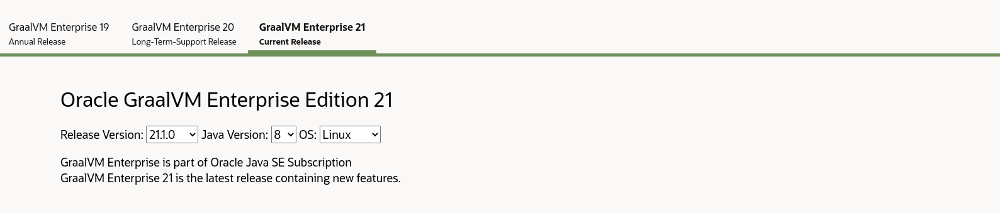
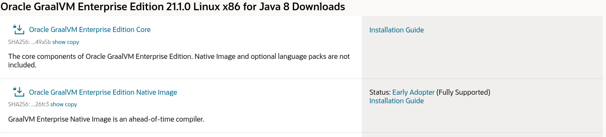

# GraalVM EE with Holy Lambda user guide

## Preface
HL supports `GraalVM EE native-image` via custom `Dockerfile` recipe. Image out of the `Dockerfile` has to be manually built and tagged by the user. This requirement is a result of `GraalVM EE` licensing and I cannot/will not distribute `Docker` image, that includes any of the `GraalVM EE` component. 

## HL compatible docker image build
  1. Create a folder which will be a docker build context.
     ```sh
     mkdir -p graalvm-ee-hl && cd graalvm-ee-hl
     ```
  2. Download latest `Dockerfile.ee` from [here](https://raw.githubusercontent.com/FieryCod/holy-lambda/master/docker/Dockerfile.ee)
     ```sh
     wget https://raw.githubusercontent.com/FieryCod/holy-lambda/master/docker/Dockerfile.ee -O Dockerfile.ee && \
     wget https://raw.githubusercontent.com/FieryCod/holy-lambda/master/docker/download_pods -O download_pods && \
     wget https://raw.githubusercontent.com/FieryCod/holy-lambda/master/docker/download_pods.clj -O download_pods.clj && \
     chmod +x download_pods
     ```
  3. Navigate to https://www.oracle.com/downloads/graalvm-downloads.html and choose GraalVM Enterprise 21 as shown on the screenshot.
     
     
  4. Download two components and move them to `graalvm-ee-hl` directory
     - Oracle GraalVM Enterprise Edition Core (SHA256: 1761e2a865a2ab090273d8e1dfec852f457c88a3809c1455ba1a4260e9049a5b)
     - Oracle GraalVM Enterprise Edition Native Image (SHA256: 848bf60df3d0d83e97c45ea4ac83d285131e8c462d5caeb924a4fc9163726fc3)
     
    
    
  5. Up to this step you should have following files in `graalm-ee-hl` directory
     ```sh
      ~/graalvm-ee-hl
      ❯ ls -la
      total 397332
      drwxrwxr-x  2 fierycod fierycod      4096 Jun 16 08:26 .
      drwxr-xr-x 70 fierycod fierycod      4096 Jun 16 08:27 ..
      -rw-rw-r--  1 fierycod fierycod      2755 Jun 16 08:26 Dockerfile.ee
      -rwxrwxr-x  1 fierycod fierycod        56 Jun 16 08:26 download_pods
      -rw-rw-r--  1 fierycod fierycod       300 Jun 16 08:26 download_pods.clj
      -rw-rw-r--  1 fierycod fierycod 394055674 Jun 16 08:15 graalvm-ee-java8-linux-amd64-21.1.0.tar.gz
      -rw-rw-r--  1 fierycod fierycod  12787016 Jun 16 08:13 native-image-installable-svm-svmee-java8-linux-amd64-21.1.0.jar
     ```
     
   6. As a last step you have to build docker image and reference it in `bb.edn` of your project.
   
      ```sh
      docker build -f Dockerfile.ee . -t graalvm-ee-local
      ```

