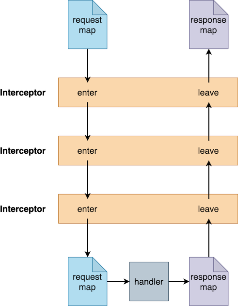

## Interceptors

> :warning: this feature is currently in alpha status

An interceptor is a pair of unary functions representing inbound requests and/or outbound responses, allowing code to
inspect or amend requests/responses between AWS and your Lambda handler function. Interceptors are expressed as:

```clojure
(i/definterceptor Interceptor1 {:enter (fn [request] request)
                                :leave (fn [response] response)})
```

`holy-lambda` calls the `:enter` function on the way "in" to handling a request. It calls the `:leave` function on the way back "out".

The request or response might be returned from the interceptor as a:
- `map`,
- `future`/`thread`, or
- Clojure `promise`

The `:enter` function is called with the **request** map and must return one of the types described above (`map`, `future`, `thread` or `promise`) in terms of the `request`

Similarly, the `:leave` function is called with the **response** map and must return a response (as any of the supported types described above) in terms of the `response`

Either the `:enter` or `:leave` function may be omitted without harm.

Logically speaking, interceptors form a _stack_. All the `:enter` functions are called in order. Each one receives the **request** map and returns a (possibly modified) request map. Once all the interceptors have been called, the **handler** is invoked and will process the request and emit a response. The resulting **response** map gets passed through the interceptors' `:leave` functions, but in reverse order, as shown here:



Interceptors may be chained together:
```clojure
(h/deflambda ExampleLambda
             "I have interceptors"
             < {:interceptors [Interceptor1 Interceptor2]}
             [{:keys [event ctx] :as request}]
             response)
```

Interceptor chains may also be composed using a mixin approach:

```clojure
(def mixin1 {:interceptors [interceptor1]})
(def mixin2 {:interceptors [interceptor2]})

(def mixin3 (h/merge-mixins mixin1 mixin2)) ;; => {:interceptors [interceptor1 interceptor2]}
```

For example, in the above chain, the interceptors are called in the following inbound sequence:

```
Interceptor1 :enter -> Interceptor2 :enter
```

The outbound sequence is:
```
Interceptor2 :leave -> Interceptor1 :leave
```
