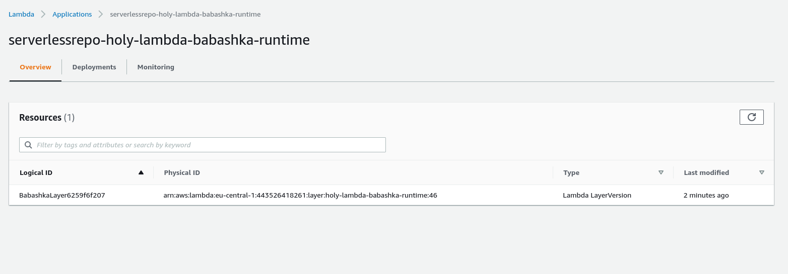
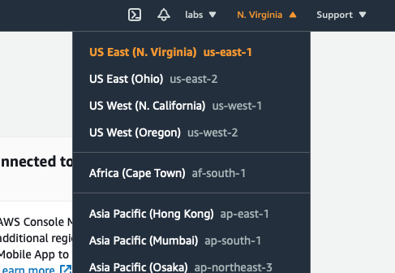
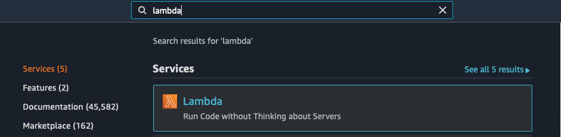
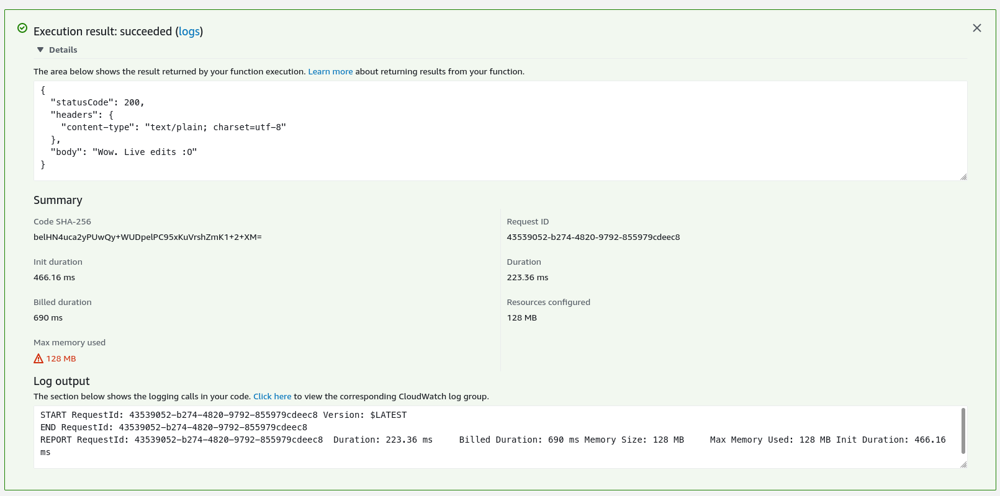

# Babashka backend
This section will take you through the basics of Babashka backend. 

**You will**
- Generate a scaffold project for your code
- Target the `babashka` interactive runtime so that we can edit Clojure code in AWS
- Locally test the code in Docker 
- Deploy the project to AWS

> :information_source: Full project source can be find [here](https://github.com/FieryCod/holy-lambda/tree/master/docs/examples/getting-started/babashka-backend/holy-lambda-example)

1. We'll generate our first project using the `holy-lambda` project template. This will create a project tree with all the necessary resources to get us started.

  ```bash
  clojure -X:new :template holy-lambda :name com.company/example-lambda :output holy-lambda-example
  ```
2. Go into the the project directory

    ```bash
    cd holy-lambda-example
    ```

    You should see following project structure:

    ```bash
    $$ tree .
    .
    ├── bb.edn
    ├── deps.edn
    ├── Dockerfile
    ├── README.md
    ├── resources
    │   └── native-agents-payloads
    │       └── 1.edn
    ├── src
    │   └── com
    │       └── company
    │           └── example_lambda
    │               └── core.cljc
    └── template.yml

    6 directories, 7 files
    ```
3. Visit the following [link](https://serverlessrepo.aws.amazon.com/applications/eu-central-1/443526418261/holy-lambda-babashka-runtime) and click deploy. Now you should be redirected to `AWS Lambda Function` dashboard. Scroll down and click deploy! Wait few seconds. Now you should be redirected to `AWS Lambda Applications dashboard`. Wait few more seconds, so that `Cloudformation` can finish the deployment. 

    > :warning: Guide supports Babashka backend version >= 0.5.1

    **You should see the following image**
    

4. Copy the `Phisical ID` and put it in `template.yml`. Make sure to include `CodeUri` in the function properties and remove the global `CodeUri` set in `Parameters`.

    ```yml 
    Parameters:
      Runtime:
        Type: String
        Default: provided
      Timeout:
        Type: Number
        Default: 40
      MemorySize:
        Type: Number
        Default: 128
      Entrypoint:
        Type: String
        Default: com.company.example-lambda.core

    Globals:
      Function:
        Runtime: !Ref Runtime
        Timeout: !Ref Timeout
        MemorySize: !Ref MemorySize
        Environment:
          Variables:
          Entrypoint: !Ref Entrypoint

    Resources:
      ExampleLambdaFunction:
        Type: AWS::Serverless::Function
        Properties:
          FunctionName: ExampleLambdaFunction
          CodeUri: src
          Events:
            HelloEvent:
              Type: HttpApi
              Properties:
                ApiId: !Ref ServerlessHttpApi
                Path: /
                Method: GET
          Layers:
            - <HERE_PUT_PHISICAL_ID>
    ...
    ```
  5. Try to invoke the function using `AWS SAM CLI`

    ```bash
    sam local invoke ExampleLambdaFunction
    ```

    > :information_source: The first invocation is rather slow locally since AWS SAM has to download runtime image for babashka. Subsequent invocations are much faster.
    
    **After some time you should see the following output**
    ```bash
    Skip pulling image and use local one: samcli/lambda:provided-91cd3f3acab2b3d207d6211b4.

    Mounting <PATH> as /var/task:ro,delegated inside runtime container
    START RequestId: 5dc1e421-69c9-462c-9f90-f0e840426ad8 Version: $LATEST

    {"statusCode":200,"headers":{"content-type":"text/plain; charset=utf-8"},"body":"Hello world. Babashka is a sweet friend of mine! Babashka version: 0.6.0"}

    END RequestId: 5dc1e421-69c9-462c-9f90-f0e840426ad8
    REPORT RequestId: 5dc1e421-69c9-462c-9f90-f0e840426ad8
    Init Duration: 0.22 ms Duration: 75.82 ms Billed Duration: 100 ms Memory Size: 128 MB Max Memory Used: 128 MB
    ```
    
    > :information_source: Highly recommend to check the official AWS SAM docs and play with other commands e.g. `sam local start-api`

#### Deployment
Having successfully run the Lambda locally, we can now deploy to AWS.

**Run the following command:**
```
sam deploy --guided
```

**Default settings should be sufficient. Press enter for parameters and answer the questions as provided below**

```bash
Configuring SAM deploy
======================

        Looking for config file [samconfig.toml] :  Not found

        Setting default arguments for 'sam deploy'
        =========================================
        Stack Name [sam-app]: 
        AWS Region [eu-central-1]: 
        Parameter Runtime [provided]: 
        Parameter Timeout [40]: 
        Parameter MemorySize [128]: 
        Parameter Entrypoint [com.company.example-lambda.core]: 
        #Shows you resources changes to be deployed and require a 'Y' to initiate deploy
        Confirm changes before deploy [y/N]: y
        #SAM needs permission to be able to create roles to connect to the resources in your template
        Allow SAM CLI IAM role creation [Y/n]: y
        ExampleLambdaFunction may not have authorization defined, Is this okay? [y/N]: y
        Save arguments to configuration file [Y/n]: y
        SAM configuration file [samconfig.toml]: 
        SAM configuration environment [default]: 

        Looking for resources needed for deployment:
        Creating the required resources...
        Successfully created!
        Managed S3 bucket: <DEPLOYMENT_BUCKET>
        A different default S3 bucket can be set in samconfig.toml

        Saved arguments to config file
        Running 'sam deploy' for future deployments will use the parameters saved above.
        The above parameters can be changed by modifying samconfig.toml
        Learn more about samconfig.toml syntax at 
        https://docs.aws.amazon.com/serverless-application-model/latest/developerguide/serverless-sam-cli-config.html

        Uploading to sam-app/6e50bf307281c6662526db069ce8daec  713 / 713  (100.00%)

        Deploying with following values
        ===============================
        Stack name                   : sam-app
        Region                       : eu-central-1
        Confirm changeset            : True
        Deployment s3 bucket         : <DEPLOYMENT_BUCKET>
        Capabilities                 : ["CAPABILITY_IAM"]
        Parameter overrides          : {"Runtime": "provided", "Timeout": "40", "MemorySize": "128", "Entrypoint": "com.company.example-lambda.core"}
        Signing Profiles             : {}

Initiating deployment
=====================
Uploading to sam-app/<TEMPLATE_HASH>.template  1480 / 1480  (100.00%)

Waiting for changeset to be created..

CloudFormation stack changeset
---------------------------------------------------------------------------------------------------------------------------------------------------------
Operation                              LogicalResourceId                      ResourceType                           Replacement                          
---------------------------------------------------------------------------------------------------------------------------------------------------------
+ Add                                  ExampleLambdaFunctionHelloEventPermi   AWS::Lambda::Permission                N/A                                  
                                       ssion                                                                                                              
+ Add                                  ExampleLambdaFunctionRole              AWS::IAM::Role                         N/A                                  
+ Add                                  ExampleLambdaFunction                  AWS::Lambda::Function                  N/A                                  
+ Add                                  ServerlessHttpApiApiGatewayDefaultSt   AWS::ApiGatewayV2::Stage               N/A                                  
                                       age                                                                                                                
+ Add                                  ServerlessHttpApi                      AWS::ApiGatewayV2::Api                 N/A                                  
---------------------------------------------------------------------------------------------------------------------------------------------------------

Changeset created successfully. <CHANGESET_ARN>

Previewing CloudFormation changeset before deployment
======================================================
Deploy this changeset? [y/N]: y
```

Now `AWS SAM` will deploy the application and link the provided layers with `AWS Lambda` function. 
```bash
2021-09-13 12:14:30 - Waiting for stack create/update to complete

CloudFormation events from changeset
---------------------------------------------------------------------------------------------------------------------------------------------------------
ResourceStatus                         ResourceType                           LogicalResourceId                      ResourceStatusReason                 
---------------------------------------------------------------------------------------------------------------------------------------------------------
CREATE_IN_PROGRESS                     AWS::IAM::Role                         ExampleLambdaFunctionRole              -                                    
CREATE_IN_PROGRESS                     AWS::IAM::Role                         ExampleLambdaFunctionRole              Resource creation Initiated          
CREATE_COMPLETE                        AWS::IAM::Role                         ExampleLambdaFunctionRole              -                                    
CREATE_IN_PROGRESS                     AWS::Lambda::Function                  ExampleLambdaFunction                  -                                    
CREATE_IN_PROGRESS                     AWS::Lambda::Function                  ExampleLambdaFunction                  Resource creation Initiated          
CREATE_COMPLETE                        AWS::Lambda::Function                  ExampleLambdaFunction                  -                                    
CREATE_IN_PROGRESS                     AWS::ApiGatewayV2::Api                 ServerlessHttpApi                      -                                    
CREATE_COMPLETE                        AWS::ApiGatewayV2::Api                 ServerlessHttpApi                      -                                    
CREATE_IN_PROGRESS                     AWS::ApiGatewayV2::Api                 ServerlessHttpApi                      Resource creation Initiated          
CREATE_IN_PROGRESS                     AWS::Lambda::Permission                ExampleLambdaFunctionHelloEventPermi   Resource creation Initiated          
                                                                              ssion                                                                       
CREATE_IN_PROGRESS                     AWS::ApiGatewayV2::Stage               ServerlessHttpApiApiGatewayDefaultSt   -                                    
                                                                              age                                                                         
CREATE_IN_PROGRESS                     AWS::Lambda::Permission                ExampleLambdaFunctionHelloEventPermi   -                                    
                                                                              ssion                                                                       
CREATE_COMPLETE                        AWS::ApiGatewayV2::Stage               ServerlessHttpApiApiGatewayDefaultSt   -                                    
                                                                              age                                                                         
CREATE_IN_PROGRESS                     AWS::ApiGatewayV2::Stage               ServerlessHttpApiApiGatewayDefaultSt   Resource creation Initiated          
                                                                              age                                                                         
CREATE_COMPLETE                        AWS::Lambda::Permission                ExampleLambdaFunctionHelloEventPermi   -                                    
                                                                              ssion                                                                       
CREATE_COMPLETE                        AWS::CloudFormation::Stack             sam-app                                -                                    
---------------------------------------------------------------------------------------------------------------------------------------------------------

CloudFormation outputs from deployed stack
----------------------------------------------------------------------------------------------------------------------------------------------------------
Outputs                                                                                                                                                  
----------------------------------------------------------------------------------------------------------------------------------------------------------
Key                 ExampleLambdaEndpoint                                                                                                                
Description         Endpoint for ExampleLambdaFunction                                                                                                   
Value               https://<ENDPOINT>                                                                            
----------------------------------------------------------------------------------------------------------------------------------------------------------

Successfully created/updated stack - sam-app in eu-central-1
```

Congratulations. You can now check your API running by clicking on `Serverless HttpApi URL`, that is the output of `sam deploy --guided`.

#### Edit code in AWS Lambda (Babashka)

1. Sign in to the [AWS Console](https://console.aws.amazon.com)
2. Select the region where your lambda has been deployed.

   
3. Go to `Lambda` console and select our deployed function.

   
   
4. You can now edit the source code, deploy the function and interactively develop your application on the cloud.

Let's try out interactive Clojure editing from the AWS Lambda code editor. We're going to change the welcome string.

Select `code.cljc` and replace the existing `say-hello` and `ExampleLambda` functions with the following:

```clojure
(defn say-hello
  []
  #?(:bb  (str "Wow. Live edits :O"))
     :clj "Hello world"))
```

When you make edits, you need to deploy the changes:


Select the `Deploy` button.


Now when you run the `ExampleTestEvent` test event, you'll see the new output response:



That's interactive code editing, in Clojure, in AWS Lambda!

> :warning: Any changes that are made directly in the editor will be overwritten with the new deployment. Remember to copy any necessary changes made back to the code base. 

> :information_source: Interactive editing is only available with the Babashka backend. 

#### Conclusion

In this guide, we've covered many of the basics with `holy-lambda`. We've covered quite a lot actually, so well done for getting this far!

We created a `holy-lambda` project based on the Babashka backend to allow interactive code editing in AWS. We demonstrated the power of interactive editing by enhancing our code with custom message.
 
We hope you enjoy using Clojure in AWS Lambdas using `holy-lambda`

#### Clean up

The resources created in this guide incur minimal AWS costs when they're not being executed.

If you prefer to completely remove the resources using the following command to tear down and delete the application stack:

```bash
sam delete
```

**Output**
```
Are you sure you want to delete the stack sam-app in the region eu-central-1 ? [y/N]: y
Are you sure you want to delete the folder sam-app in S3 which contains the artifacts? [y/N]: y
- Deleting S3 object with key sam-app/<OBJECT_KEY>
- Deleting S3 object with key sam-app/<OBJECT_KEY>.template
- Deleting Cloudformation stack sam-app
Deleted successfully
```

