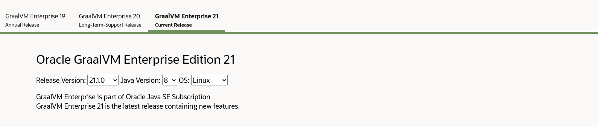
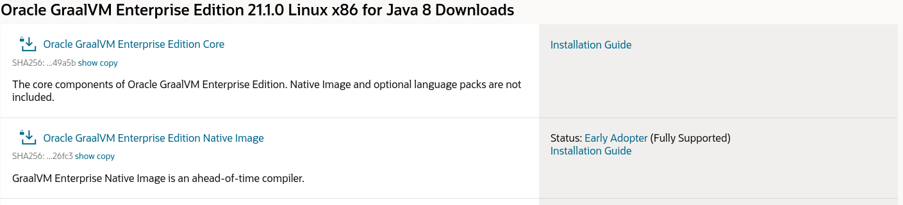

# CLI

A CLI of HL is distributed as a set of [babashka tasks](https://book.babashka.org/#tasks), that allows HL to run on different platforms, namely:
- Windows WSL
- Linux
- MacOS

CLI depends on the following programs:
- [Babashka](https://github.com/babashka/babashka) >= 0.3.7
- [Docker](https://www.docker.com/) >= 20.10.0

> :warning: Please install above mentioned dependencies before using CLI

> :information_source: Usage of official CLI is highly recommended, since CLI ensures the Amazon Linux compatibile deployable artifacts. 


## Commands
  Signature: 
  
  `bb <command-name> <args>`
  
  | Command name         | Description                                                                      |
  |----------------------|----------------------------------------------------------------------------------|
  | `hl:compile`         | Compiles a project to `uberjar` via provided `:compile-cmd` in bb.edn            |
  | `hl:doctor`          | Diagnoses common issues in the project.                                          |
  | `hl:clean`           | Removes HL dependencies. Cleans `.holy-lambda` directory.                        |
  | `hl:version`         | Prints the current version of the tasks.                                         |
  | `hl:docker:run`      | Runs a command specified as a string argument in the docker environment.         |
  | `hl:update-bb-tasks` | Automatically update the local version of tasks to latest stable remote version. |

#### Backend specific tasks
##### Native
  | Command name           | Description                                                                                                                        |
  |------------------------|------------------------------------------------------------------------------------------------------------------------------------|
  | `hl:native:conf`       | Provides native configurations for the application. Uses GraalVM `java -agentlib` and generates `resources/native-configurations.` |
  | `hl:native:executable` | Provides native executable of the application, by using `native-image` under the hood. Generates `.holy-lambda/build/latest.zip`                                             |

## Babashka
  | Command name       | Description                                                                                                                                                                                                                                                 |
  |--------------------|-------------------------------------------------------------------------------------------------------------------------------------------------------------------------------------------------------------------------------------------------------------|
  | `hl:babashka:sync` | Downloads pods & Clojure dependencies to `.holy-lambda` folder. Dependencies are taken from `bb.edn :deps`, and `bb:edn :holy-lambda/options:backend:pods`. Both `.holy-lambda/bb-clj-deps` and `.holy-lambda/pods` should be packed to the separate layers |

## Possible options in `bb.edn` tasks
  - `:docker {:volumes, :network, :image}` - Docker execution environment configuration.
    - `:volumes [{:docker <pathA> :host <pathB>}]` - Expose local directories/files in Docker context.
      - `:docker` - An alias for local path. Under this path the local directory/file will be available.
      - `:host` - Path to local directory/file relative to the root of the project.
  - `:build {:compile-cmd, :graalvm-home}` - Group for build related options.
    - `compile-cmd` - An alias from `deps.edn` that should be passed to HL commands.
    - `graalvm-home` - GraalVM home directory. Available only when `HL_NO_DOCKER` environment is set to `1|true`.
  - `:backend {:pods, :bootstrap-file, :native-image-args}` - runtime/backend related group of options.
    - `:pods {<pod-cord> <pod-version>}` - upon `bb hl:sync` downloads all the Amazon Linux compatible Babashka pods to `.holy-lambda/pods`.
    - `:native-image-args []` - vector of arguments that should be passed to GraalVM `native-image` tool. For more information click [here](https://www.graalvm.org/reference-manual/native-image/).

## CLI Paths
  - `.holy-lambda` 
  
     HL `artifacts/cache/pods` store
     
   - `.holy-lambda/pods`
   
      Directory of downloaded Babashka pods, that are downloaded upon `bb hl:sync` from the `bb.edn:holy-lambda/options:runtime:pods` entry. 
   
      > :information_source: Babashka pods should be packed as a separate layer.
  - `.holy-lambda/bb-clj-deps`
      
      Directory of downloaded Babashka Clojure deps.
      
      > :information_source: Babashka deps should be packed as a separate layer.
      
   - `holy-lambda/build` - Base output path for the built artifacts for the backends
      - `holy-lambda/build/output.jar` - Deployable artifact of Clojure backend that should be packed in Dockerfile
      - `holy-lambda/build/latest.zip` - Deployable artifact of Native backend built from `holy-lambda/build/output.jar`
     
## Environment Variables
  | Name                | Possible values       | Description                                                                                 |
  |---------------------|-----------------------|---------------------------------------------------------------------------------------------|
  | **HL_DEBUG**        | `(1/0)\|(true/false)` | Run tasks in debug mode                                                                     |
  | **HL_NO_DOCKER**    | `(1/0)\|(true/false)` | Should run HL commands in Docker? *(1)*                                                     |
  | **HL_DOCKER_IMAGE** | `string`              | Alternative image name that takes precedence over `bb.edn:holy-lambda/options:docker:image` |
  | **HL_PROFILE**      | `string`              | AWS Profile used in `hl:native:conf` takes precedence over **AWS_PROFILE**                  |
  | **AWS_PROFILE**     | `string`              | AWS Profile used in `hl:native:conf` takes precedence over **AWS_DEFAULT_PROFILE**          |
  | **HL_NO_PROFILE**   | `string`              | Disable checking for `HL_AWS_PROFILE\|AWS_PROFILE\|DEFAULT_AWS_PROFILE` *(2)*               |
  | **GRAALVM_HOME**    | `string`              | Home of the GraalVM. Used only when `HL_NO_DOCKER` is set to either `true` or `1`. *(4)*         |

  1) `HL_NO_DOCKER` - Useful for using the HL CLI on CI/CD, where the builder is an image based on `fierycod/graalvm-native-image`. 
  
      If you're using a custom builder and setup GraalVM CE on your own make sure to set `GRAALVM_HOME` environment variable.
  2) `HL_NO_PROFILE` - HL CLI most commonly use the profile declared via the official [AWS CLI](https://aws.amazon.com/cli/). Some of the tools like [AWS Vault](https://github.com/99designs/aws-vault) expose only certain AWS variables. 

    With `HL_NO_PROFILE` you can explicitly tell CLI to use exported:
      - `AWS_ACCESS_KEY_ID`
      - `AWS_SECRET_ACCESS_KEY`
  3) Takes precedence over `:holy-lambda/options:build:clj-alias`. Especially useful in CI environment, where builder is based on official HL docker image.
  4) Takes precedence over `bb.edn:holy-lambda/options:build:graalvm-home`

## GraalVM EE Docker Image for CLI

### Preface
  HL supports `GraalVM EE` via custom `Dockerfile` [recipe](https://raw.githubusercontent.com/FieryCod/holy-lambda/master/docker/Dockerfile.ee). Image out of the `Dockerfile` has to be manually built and tagged by the user. 

  > :warning: License of `GraalVM EE` prohibits distributing `Docker` images that contain `GraalVM EE` components directly!

### Building the GraalVM EE Docker Image
  1. Create a folder which will be a docker build context.
     ```sh
     mkdir -p graalvm-ee-hl && cd graalvm-ee-hl
     ```
  2. Download latest `Dockerfile.ee` from [here](https://raw.githubusercontent.com/FieryCod/holy-lambda/master/docker/Dockerfile.ee)
     ```sh
     wget https://raw.githubusercontent.com/FieryCod/holy-lambda/master/docker/Dockerfile.ee -O Dockerfile.ee && \
     wget https://raw.githubusercontent.com/FieryCod/holy-lambda/master/docker/download_pods -O download_pods && \
     wget https://raw.githubusercontent.com/FieryCod/holy-lambda/master/docker/download_pods.clj -O download_pods.clj && \
     chmod +x download_pods
     ```
  3. Navigate to the following [link](https://www.oracle.com/downloads/graalvm-downloads.html) and choose GraalVM Enterprise 21 as shown on the screenshot.
     
     
  4. Download two components and move them to `graalvm-ee-hl` directory
     - Oracle GraalVM Enterprise Edition Core 
       - (SHA256: 1761e2a865a2ab090273d8e1dfec852f457c88a3809c1455ba1a4260e9049a5b)
     - Oracle GraalVM Enterprise Edition Native Image 
       - (SHA256: 848bf60df3d0d83e97c45ea4ac83d285131e8c462d5caeb924a4fc9163726fc3)
     
     
    
  5. Up to this step you should have following files in `graalm-ee-hl` directory
     ```sh
      ~/graalvm-ee-hl
      ❯ ls -la
      total 397332
      drwxrwxr-x  2 fierycod fierycod      4096 Jun 16 08:26 .
      drwxr-xr-x 70 fierycod fierycod      4096 Jun 16 08:27 ..
      -rw-rw-r--  1 fierycod fierycod      2755 Jun 16 08:26 Dockerfile.ee
      -rwxrwxr-x  1 fierycod fierycod        56 Jun 16 08:26 download_pods
      -rw-rw-r--  1 fierycod fierycod       300 Jun 16 08:26 download_pods.clj
      -rw-rw-r--  1 fierycod fierycod 394055674 Jun 16 08:15 graalvm-ee-java8-linux-amd64-21.1.0.tar.gz
      -rw-rw-r--  1 fierycod fierycod  12787016 Jun 16 08:13 native-image-installable-svm-svmee-java8-linux-amd64-21.1.0.jar
     ```
     
   6. As a last step you have to build docker image and reference it in `bb.edn` of your project.
   
      ```sh
      docker build -f Dockerfile.ee . -t graalvm-ee-local
      ```
