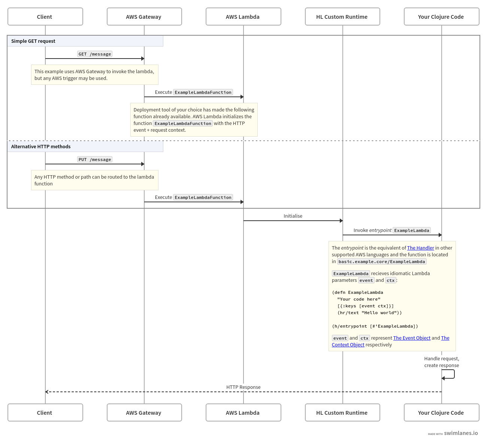

# Overview Diagram
  Since HL supports multiple backends each section covers the minimal set of steps that are required to deploy working HL `hello world` API on AWS Lambda.
  
  For the simplicity of the guide `AWS SAM` tool is used. However you can always opt out from using this tool. Check alternative [deployment options](/deployment-tools).
  
  <!-- Here's an overview of what we'll create ([version with working links](https://swimlanes.io/#tVRNb9pAEL3vrxilh4Ia47sPkSJKQ6VIjRKqqkIoXtYD3mS96+6uAUfqf+/s2jRAkl6qSPiAPR9v3nszU6Pa5JpXy4IzxuQqgztZ1QrhajIDi78adJ4BjJVE7SG5gMsfd3DFPW55m0EeotIKneNrzBnTxmPGZqV0gDse6zQO3WESeANSb8wjgi8RVGx9DsvGA9dtjPRWrtdooaLoZaxQjBiBOKzSI+mQZzDZoWg8Qj7p2nbvvzRaeGl0Tsn0i+jgM9bKtFUYxxujwKygNY0FURopEEruqHHRoVsZpcxW6jWs+lLAlUVetMA3XCq+VDg6AEKTSS+5kk80dCywT3sDGGylL2PkdDa7AdwEWJ/2xIMw2uPOx+kZKkfwL5VHq7mXmz6nQl+awv1DpJvvr4h0SWQf5IOxUHPCIrgOpFtDdBZBrGeV/k7zf1qgLshq7IA1KjC9hnHjvKngttFeVjTp155Lh4y9+BxyfgbZxso8NBZhbIqYE511TzzYtjZS+/sTHHsCYFaexMlOMqJebrgKTJI15iFsynWh0C4Gpfe1y9K0MMKN+Jaeij8ZPRKmSrel9FjzGq1LFTHjfOrQbtAqYj7hVoTvwhNWl3R8ptQuKbvao9JXakj+AUNvLbimro0NEgSeFNfrhtRztCPFsbEItTKCh0hKzpfcSTHql49wWUxPxz/hg8wmJBnPgSykqchZYq9LzS0ne9BEkEdr5rF/Lvwuz6hQnoPo6GeDAlcajiqTS86iRIKkARoKz+jVfI5OEEuJwpVPREP0tMnScvGIfpE9Yutg3q0BdVn8XlDKoLRpWAM4myLtI2yNVcXZcBiWYlCmzxrC/MPHIwiLYQBJSE/R09A1CRHaRIUnseO35QMp9C4yRwCJiQ16rQOY2Hzcbfl7tu8PyTEAiqnpH10S1TL2YpveWLFuGfYn6hwE3UOPsZjRDoG9Wiq5uOjvU9adnds+/g8=)): -->

  
