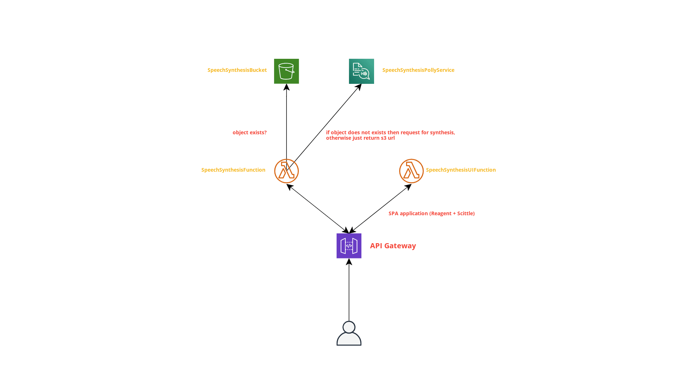

# Talk with Babashka

In this example we will explore the [AWS Polly](https://aws.amazon.com/polly/) service for generating natural speech audio from the text input.

# Prerequisites
  1. Babashka v0.4.4 
  2. Clojure command
  3. AWS cli installed and configures via `aws configure`
  4. AWS SAM cli installed
  
## Demo video
<p align="center">
 <a href="https://www.youtube.com/watch?v=XJc6xma7v0A">
   
 </a>
</p>

## Architecture
  Obligatory AWS resources and their permissions are defined in `template.yml`. HL uses AWS SAM under the hood, therefore the same `template.yml` might be used with another language to create the same application.
  
  **Let's dive into the resources configuration**
  
  If we look at the `Resources` property of `template.yml` we can see that our application will use only 5 resources:
  
  - `ServerlessHttpApi` - API Gateway instance which proxies the payloads to corresponding lambdas. The API does not have to be explicitly defined for simple cases, since AWS SAM automatically creates the API Gateway for us even if we don't declare it. For this specific case we want to have explicit declaration, so that we can get endpoint URL (see the `Outputs`) without having to check the URL on AWS Management Console.
  
  - `SpeechSynthesisBucket` - Upon deployment the new bucket will be created to which we gonna upload `mp3` files with the synthesis. If the user will ask for the same text synthesis twice we will just reply with the URL to the resource (no synthesis, since the audio is already on S3).
  
  - `SharedBabashkaDepsLayer` - HL via some simple hacks let's you pack the babashka pods and deploy them all together with your application. Shipping pods is great since those dependencies will not have to be downloaded on run (meaning lower execution times). 
  
  - `SpeechSynthesisUIFunction` - Declaration of babashka lambda handler which upon the request responds with SPA scittle + reagent application
  
  - `SpeechSynthesisFunction` - Declaration of babashka lambda handler which upon the request first calculates the sha of the text and checks if such object already exists on s3. If so then simply the URL to resource is returned, otherwise launch the Polly synthesis request. Polly responds with `BufferedStream` which we then proxy to S3 `:PutObject` request.

  

# Deployment steps
  1. Make sure you have all the tools listed in prerequisites installed and configured.
  2. Change the bucket and stack name in `bb.edn`.
  3. Run `bb stack:sync` in the root of the project. This will deploy babashka layer and return it's ARN.
  4. Replace the predefined Layer ARN for both lambdas in `template.yml`.
  5. Run `bb stack:pack && bb stack:deploy`
  
# Development 
## Getting the logs of processing function

``` sh
  bb stack:logs
```

## Running the Api

``` sh
  bb stack:api
```

## Running REPL

``` sh
  bb -cp "$(clojure -A:nrepl-deps -Spath)" --nrepl-server 
```


  


