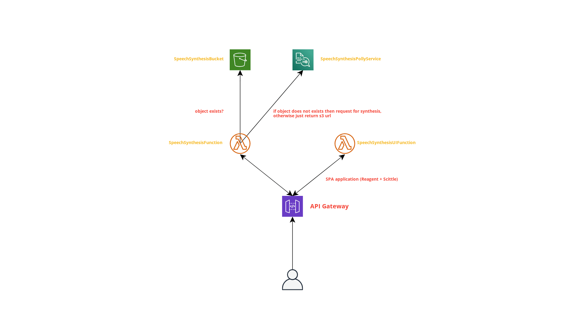

# Talk with Babashka

In this example we will explore the [AWS Polly](https://aws.amazon.com/polly/) service for generating natural speech audio from the text input.

# Prerequisites
  1. Babashka v0.4.4 
  2. Clojure command
  3. AWS cli installed and configures via `aws configure`
  4. AWS SAM cli installed

## Demo
[](https://www.youtube.com/watch?v=XJc6xma7v0A "Holy Lambda + Babashka + Scittle + AWS Polly Demo")


## Architecture



# Development 
## Running REPL

``` sh
  bb -cp "$(clojure -A:nrepl-deps -Spath)" --nrepl-server 
```


  


